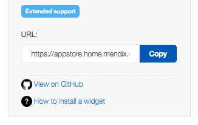

## 1 Introduction

A Mendix custom widget is a part of the user interface in your Mendix app that enables functionality and interaction with the users of the app. A custom widget can alter the interface, data, and images of the app as well as the way the app works. These custom widgets bridge the gap between using standard Mendix components (for example, buttons and list-views) and creating very specific components yourself.

Custom widget development can be difficult at the beginning. The resources below will help you start your widget development.

## 2 Prerequisites

In order to create widgets, you need a good understanding of how JavaScript works. These texts can help you get started:

 * [You Don't Know JS](https://github.com/getify/You-Dont-Know-JS)
 * [Learning JavaScript Design Patterns](https://addyosmani.com/resources/essentialjsdesignpatterns/book/)

## 3 Specific Widget Topics

The sections below describe the Mendix resources that can help you understand how widgets are built.

### 3.1 Introduction Videos

* [Expert Series: Kickstart Your Widget Development](https://www.youtube.com/watch?v=MZ0Ihu2QGYY)

### 3.2 Dojo

Custom widgets are Dojo widgets. In order to understand how widgets are structured and what their life cycle is, you need to know how Dojo widgets are built. You can consult this quick introduction:

 * [Dojo Documentation Tutorials](http://dojotoolkit.org/documentation/#tutorials)

For details on the widget life cycle, reference this documentation:

 * [JavaScript: The Good Parts](http://www.easycomputing.com/download/0e9fa6d09a001991e41aeae63152b12882e27116)
 * [Writing Your Own Widget](http://dojotoolkit.org/reference-guide/1.10/quickstart/writingWidgets.html)
 * [dijit.\_WidgetBase](https://dojotoolkit.org/reference-guide/1.10/dijit/_WidgetBase.html)
 * [Tutorial: Widget Life Cycle](https://apidocs.mendix.com/6/client/tutorial-widget-lifecycle.html)

### 3.3 Widget Scaffolding

In the past we created widgets using Brackets and a plugin. With the new JavaScript/Node.JS tools that have recently come out, we deprecated this way of creating widgets. The new way of creating widgets is done using Yeoman and a generator.

For a quick tutorial on using the widget generator, see [How to Scaffold a Widget with the Yeoman Widget Generator](scaffold-a-widget-with-the-yeoman-widget-generator).

This information is also covered in [Expert Series: Kickstart Your Widget Development](https://www.youtube.com/watch?v=MZ0Ihu2QGYY).

### 3.4 Interacting with Mendix Runtime

Widgets have the ability to get data from the Runtime, manipulate objects, show validations, and set references. This is done through the Client API. For the latest version of the this API, see [Client API](https://apidocs.mendix.com/7/client).

### 3.5 Configuring the Widget in Mendix

Mendix has a specific way of configuring your widget through the use of an XML file. For more information and an example, see [WidgetName](https://github.com/mendix/AppStoreWidgetBoilerplate/blob/master/src/WidgetName/WidgetName.xml) in the AppStoreWidgetBoilerplate repository.

For the full reference on writing a widget XML, see the [XML Reference Guide](/refguide7/xml-reference-guide).

### 3.6 Boilerplate

The Yeoman widget generator ships two versions of a boilerplate created by Mendix. The source code for this boilerplate is available in the [AppStoreWidgetBoilerplate repository](https://github.com/mendix/AppStoreWidgetBoilerplate).

## 4 Further Reading

This category of how-to's presents in-depth information on how to build your own widgets. A few more tips are below.

### 4.1 Learn by Example

Most of the widgets in the [Mendix App Store](https://appstore.home.mendix.com/index3.html) are open-source and available on GitHub. You can find the **View on GitHub** link on the right side of the App Store screen:

### 4.2 Learn by Doing

Using the widget generator, you get a test project. With the test project (or your own project), you can quickly start creating widgets.

By debugging your widgets, you will quickly learn where you make mistakes and how the widget life cycle works.

### 4.3 Ask the Community

Within the Mendix Community of developers, there are plenty of widget developers. The [Mendix Forum](https://forum.mendixcloud.com/index3.html) is the place to go to when you have questions.
