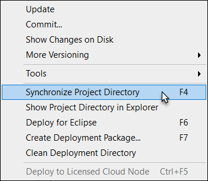

## 1 Introduction

This how-to will teach you how to use the widget generator, which is a [Yeoman](http://yeoman.io/) generator that lets you quickly scaffold a new widget. The generator integrates Grunt, which is a task runner, to speed up your widget development.

**This how-to will teach you how to do the following:**

* Set up a widget development environment with Node.JS, Yeoman, and Grunt
* Test a custom widget at runtime

## 2 Prerequisites

Before starting this how-to, make sure you have completed the prerequisites described below.

### 2.1 Install Node.JS

Yeoman and Grunt both run on Node.JS, so you need to install this by following these steps:

1. Go to [https://nodejs.org](https://nodejs.org).
2. Download the latest stable release (LTS) and install it.
3. Open the command line and press **Windows**+**R**.
4. Type "cmd" and press **Enter**:

    

5. Check if Node.JS is properly installed by entering `node -v` and clicking **OK**. If Node.JS is properly installed, it will show you the version that is installed.

### 2.2 Install Yeoman, Widget Generator, and Grunt

In the same window, install these dependencies by typing `npm install yo grunt-cli generator-mendix -g`:

This will usually take a minute or two. Warnings can be ignored. Node Package Manager (NPM) will tell you if it is having problems installing them by marking errors in red. If you have problems, see [Troubleshooting](#Troubleshooting).

Now the dependecies are installed globally, which means you can use them from any folder in your command-line window.

## 3 Run the Generator

In your terminal, move to the folder where you want your widget to be created. In this how-to, we will move to the folder `C:\Projects` and create a **MyNewWidget** folder, where we will use the generator:

Now you can run the generator by entering `yo mendix`. The system will ask you for a few things, like the name of the widget. The default values will be shown (just press enter to use the default value):

After you have entered the options, the system will install all the dependencies, copy the AppStoreWidgetBoilerPlate, and edit the files according to the options you have set. Your folder should contain the following items:

## 4 Use Grunt

Grunt is a powerfull task-runner that will speed up your widget development. In the previous steps you installed the Grunt client (`grunt-cli`), and now you are going to use it.

### 4.1 Start the Modeler (Test Project)

You can start the Modeler from Grunt with `grunt start-mendix` or `grunt start-modeler`:

This will open your test project with the Mendix version selector.

### 4.2 Watch

You can watch for any changes in your *src* folder by using the default watch task in Grunt. Run `grunt` or `grunt watch`:

Now, everytime you make changes in your *src* folder, it will automatically build a new .mpk file and put this in your */test/widgets/* folder. It will also copy the changes to the */test/deployment/web/widgets/* folder.

#### 4.2.1 Why and How to Use Grunt Watch

The watch task has the advantage that you do not have to restart your test project everytime you make changes to any JavaScript file. There are two exceptions:

* Changes to CSS are not automatically picked up
    * These are built when you run the project
* Changes to XML are not automatically picked up
    * Everytime you make changes to your *Widget.xml* inside your *src/Widget/* folder, you need to update the widget in the Modeler

To update the widget, press **F4** in the Modeler or select **Project** > **Synchronize Project Directory**:

### 4.3 Build

The `grunt build` will clean your */dist/* and */test/widgets/* folders and will only destroy your custom widget. It will place a new one, built from the */src/* folder.

## 5 Troubleshooting

### 5.1 Installing Dependencies Results in Errors

This will likely be a problem with Node.JS and NPM. Make sure you have the latest stable LTS version installed. Also, make sure NPM is up-to-date by entering `npm install npm -g`.

### 5.2 Cannot Start Modeler

The Grunt task will try to find the Mendix version selector and run the test project. Obviously, this can only be done in Windows.

If it has trouble finding the version selector, you can provide a path to the program in *Gruntfile.js*. Change the **MODELER_PATH**:

from **null** to `<path to VersionSelector.exe>` – make sure you use double backslashes when providing the path, as in this example:

