## 1 Introduction

This how-to explains how you can improve performance by de-normalizing data in Mendix.

**This how-to will teach you how to do the following:**

* Denormalize data
* Keep denormalized data in sync

## 2 Prerequisites

Before starting this how-to, make sure you have completed the following prerequisites:

* Create a basic data layer (for details, see [How to Create a Basic Data Layer](create-a-basic-data-layer))

## 3 Denormalization

Let's assume that the domain model contains two related entities called Customer and Order. The customer overview page needs to show the name of the customer and the total order amount next to each other. Showing the customer name is easy, but the total order amount needs to be calculated.

To show the total order amount, there are two options:

* First option: create a calculated attribute in the Customer entity to compute the total order amount (the downside of this option is that the calculated attributes bring down the performance of overview pages)
* Second option: create a persistent attribute in the Customer entity that stores the total order amount in the database – this is called denormalization (the downside of this option is that the redundant data needs to be kept in sync, but this is easy with Mendix event handlers)

To enable denormalization, follow these steps:

1. Create a domain model that looks like this:

    
2. Double-click the **Customer** entity to open the properties editor:

    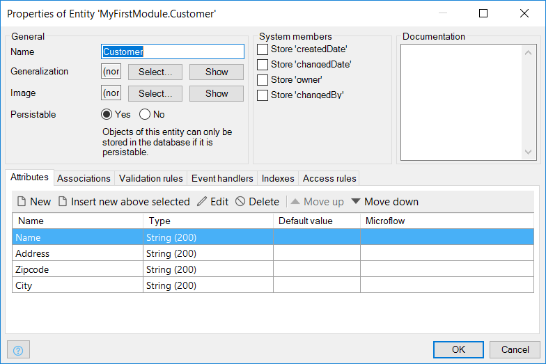
3. Add a currency attribute **TotalOrderAmount**.
4. Create an overview and detail page for the *Customer* entity.
5. Make sure the customer overview page shows the **TotalOrderAmount** value.
6. Make sure the order detail page has a mandatory reference selector to select the customer.

Now the application is ready to store redundant data, but you still need to keep the data in sync.

## 4 Keep Denormalized Data in Sync with an After Commit Event

1. Open the domain model and double-click the Order entity to open its properties editor.
2. On the **Event handlers** tab, click **New** to add a new event handler:

    
3. On the **New Event Handler** pop-up window, do the following:
    * Select **After** as the **Moment**
    * Select **Commit** as the **Event**
    * Select **Yes** for **Pass the event object**
    * Click **Select...** to open the microflow selector
 
    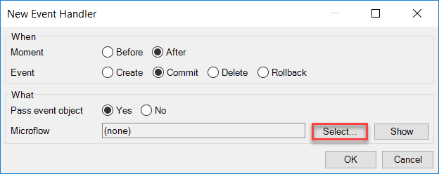
4. On the microflow selector, click **New** and enter a name for the new microflow (for example, *Order_AfterCommit*).
5. Click **OK** to create the new microflow, and then click **OK** again to save the event handler.
6. Open the new microflow, which should look like this:

    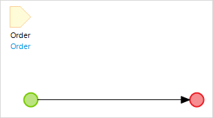
    Let's take a moment to think about what the new microflow should do. We want to calculate the total order amount and store this value in the customer object. As you can see, the current microflow only has an order object as an input parameter. So, first we need to retrieve the corresponding customer. Then we need to get all the orders of this customer and calculate the total order amount. As soon as we have the total order amount, we need to store it in the customer object. Once you're done, the microflow should look like this:
    
7. Open the **Toolbox**, which should be docked in the bottom-right corner of the Modeler. If you can't find the **Toolbox** there, you can open it from the **View** menu:

    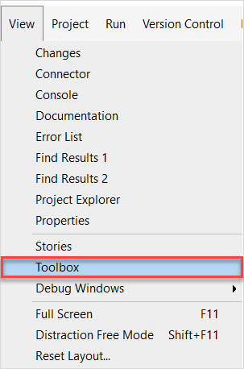
8. Drag a **Retrieve** activity from the toolbox to the line between the start and end event on the microflow, which will insert a new retrieve activity:

    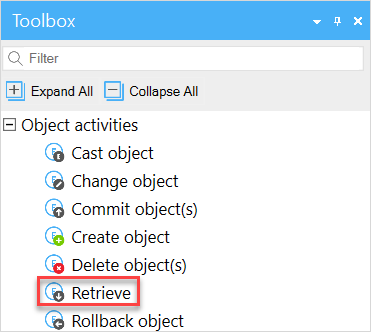
9. Double-click the new activity to open its properties on the **Retrieve Objects** dialog box and do the following:
    * Select **By association** as **Source**
    * Click **Select...** to open the **Association** selector

    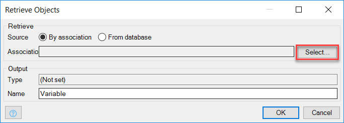
10. On the **Select association** pop-up window, select **Order_Customer** from the **Variables** node in the tree view, and then click **Select**:

    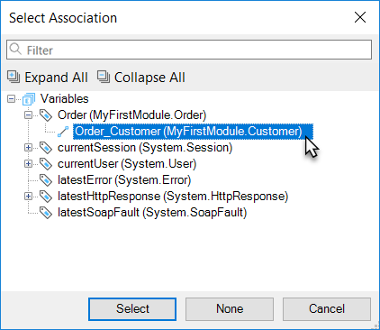
    As you can see below, the **Output** section of the **Retrieve Objects** dialog box is configured automatically:
    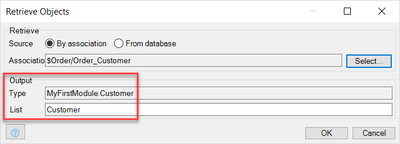
11. Click **OK** to save the activity. Your microflow should now look like this:

    
12. Insert another retrieve activity (as you did in step #8), double-click it to open its properties on the **Retrieve Objects** dialog box, and do the following:
    * Select **From Database** as **Source**
    * Click **Select...** to open the entity selector

    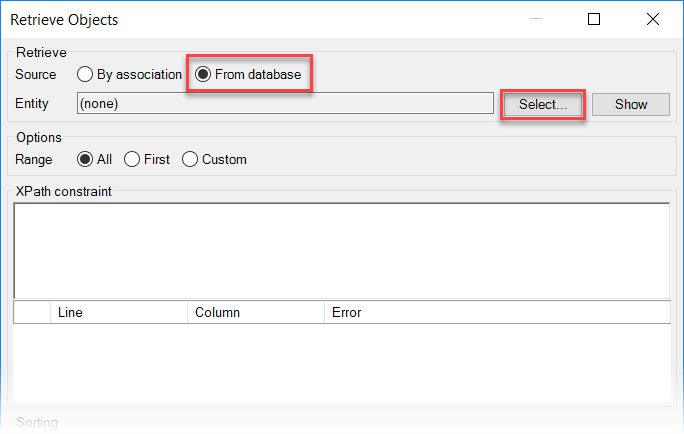
13. On the **Select entity** pop-up window, select **Order** via from the **Variables** node in the tree view, and then click **Select**:

    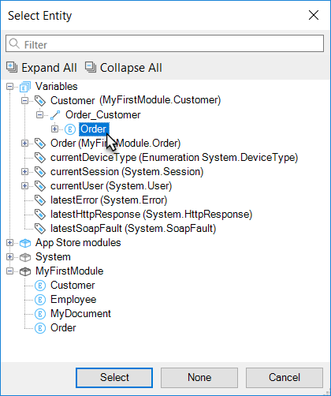

    As you can see below, the **XPath constraint** and **Output** sections of the **Retrieve Objects** dialog box are configured automatically:
    
    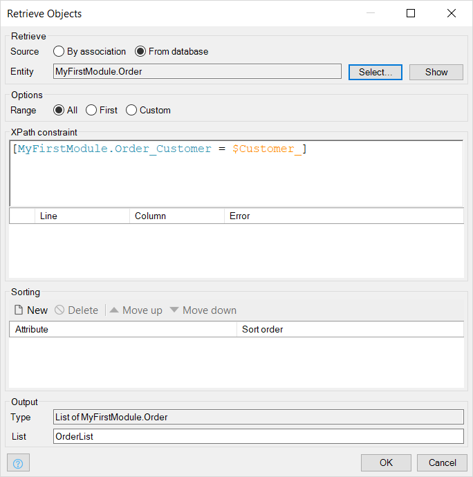
14. Click **OK** to save the activity. Your microflow should now look like this:

    
15. Insert an aggregate list activity, double-click it to open its properties on the **Aggregate List** dialog box, and do the following:
    * Select **OrderList** as the **Input Variable**
    * Select **Sum** as the **Function**
    * Select **TotalPrice** as the **Attribute**
    * Enter *SumTotalPrice* as the **Output Variable** name

    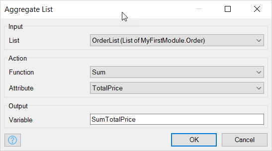
16. Click **OK** to save the activity. Your microflow should now look like this:
    
17. Insert a change activity, double-click it to open its properties on the **Change Object** dialog box, and do the following:
    * Select **Customer** as the **Input Variable**
    * Select **Yes** as the **Commit** action
    * Select **Yes** to refresh in the client (the object changes are made on the server side, and with this option, the server triggers the client to refresh the object)
    * Click **New** to create a new change item
18. In the **Edit Change Item** dialog box, do the following:
    * Select **TotalOrderAmount** as the **Member**
    * Fill in **$SumTotalPrice** as the **Value**
    * Click **OK** to save the change item

    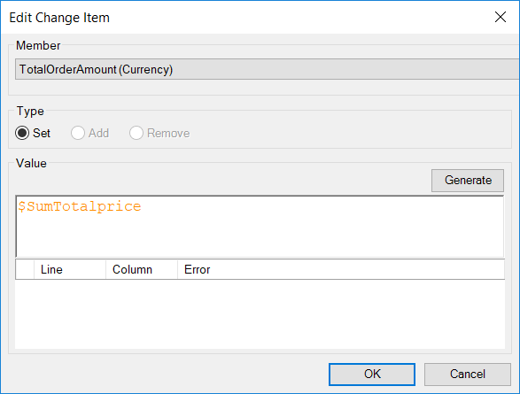

19. Click **OK** again to save the activity. Your microflow should now look like this:

    

20. Run the application and create some customers and orders. You should now see an up-to-date value for the TotalOrderAmount.

## 5 Related Content

* [How to Work with Images and Files](working-with-images-and-files)
* [How to Create a Basic Data Layer](create-a-basic-data-layer)
* [How to Set Up Data Validation](setting-up-data-validation)
* [How to Work with Object Events](working-with-object-events)
* [How to Find the Root Cause of Runtime Errors](../monitoring-troubleshooting/finding-the-root-cause-of-runtime-errors)
* [How to Manage Sprints and Stories](/developerportal/howto/managing-your-application-requirements-with-mendix)
* [How to Define Access Rules Using XPath](../logic-business-rules/define-access-rules-using-xpath)
* [How to Configure the Scout and Windows 10 Workaround](../guis/scout-and-windows-10-workaround)
* [How to Generate a Personal SSH2 Key Pair](../security/generating-a-personal-ssh2-key-pair)
* [Attributes](/refguide7/attributes)
* [Event Handlers](/refguide7/event-handlers)

