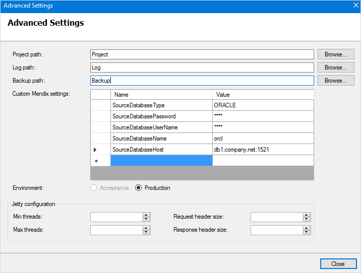
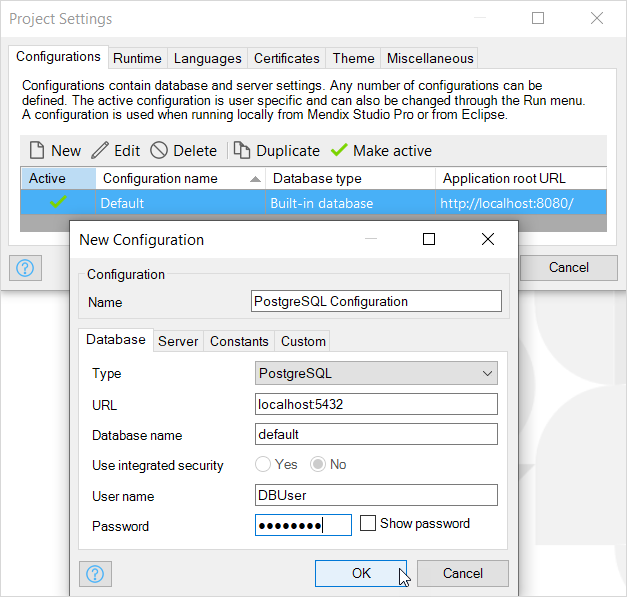

## 1 Introduction

This document explains how to migrate the data in an existing Mendix database to another Mendix database. This can be useful if you want to migrate from one type of database to another, for example MS SQL Server to PostgreSQL.

**After completing this how-to you will know how to do the following:**

* Migrate a non-PostgreSQL database to a PostgreSQL database
* Export a PostgreSQL database
* Upload an exported PostgreSQL database to the Mendix cloud
* Export a Mendix cloud database
* Import into an on-premise PostgreSQL database
* Migrate a PostgreSQL database to a non-PostgreSQL database

## 2 Overview

You can copy all the data from any Mendix-supported database management system to any other Mendix-supported database management system. For example you can copy demo, test, and production databases from built-in to PostgreSQL, and from PostgreSQL to built-in. You can also migrate production data from SQL Server or Oracle (on-premises) to PostgreSQL in our cloud.

To do this, start your app on the database you would like to copy the data to. This database should already exist and should be totally empty. To let Mendix know from which database all data should be copied, you have to set some custom configuration settings. These custom settings define the type of the source database, the host name, the user name and password, etc.

The most commonly used custom settings for database migration are:

*   SourceDatabaseType (HSQLDB, MYSQL, ORACLE, POSTGRESQL, SQLSERVER)
*   SourceDatabaseHost
*   SourceDatabaseName
*   SourceDatabaseUserName
*   SourceDatabasePassword

For more information on the full list of available settings, see [Runtime Customization](/refguide/custom-settings).

These settings can be configured as follows:

*  Studio Pro – in **Project Explorer**, expand **Project**, double-click **Settings**, edit a configuration, and go to the **Custom** tab:

	 

*  Service Console – click an app in the left pane, click **Configuration**, click **Advanced**, then see **Custom Mendix settings**:

	 

* m2ee-tools – add the custom settings to the mxruntime section (for more information, see [Full Documented m2ee](https://github.com/mendix/m2ee-tools/blob/develop/examples/full-documented-m2ee.yaml))

You can migrate databases using either Studio Pro, the Service Console, or m2ee-tools. The Service Console gives you the advantage of seeing a progress bar during the copy process, which is handy if you copy a lot of data which takes a long time to execute.

{}
Database migration is handled by Mendix as a normal database synchronization phase during the start-up process of an app. As a consequence, it is possible that during the start-up process you will get to see messages like ‘The database has to be synchronized’ or you will see an empty message. In the future, tools like the Service Console and m2ee-tools will recognize this phase better and give more appropriate messages. However, these tools already correctly handle the database migration.
{}

{}
Before the data copying process starts, the main database structure will be generated based on the source database structure. This is necessary to make sure all the data is copied without any problems, especially in cases where the source database has a larger element value than what the current domain model specifies.

As of version [8.1](/releasenotes/studio-pro/8.1), the source database structure and data do not change as part of the migration.
{}

## 3 Using your PostgreSQL Database in Studio Pro

You can configure Studio Pro to use a PostgreSQL database instead of the inbuilt (HSQLDB) database.

To do this, perform the following steps:

1. Open your **Project '…'** > **Settings**.

2. Click **New** to add a new configuration from the **Configurations** tab.

3. Give your configuration a new **Name**.

4. On the **Database** tab, set the following values:
	* **Type** – **PostgreSQL**
	* **Database name** – *default*
	* **URL** – the URL for your local PostgreSQL server
	* **User name** – the user name of a database administrator in your local PostgreSQL
	* **Password** – the password for the user specified above

	

	Your new configuration will be set as the active configuration.
5. Ensure that PostgreSQL is running locally on the correct port.
6. Run your app locally. Provided your PostgreSQL database is empty, your app will configure the database to support the domain model of your app.

{}
If you already have the database, for example a test database in the cloud, you can also restore this to a local PostgreSQL database. Instructions for doing this can be found in [Restore a Backup Locally](/developerportal/operate/restore-backup-locally).
{}

## 4 Migrating a Non-PostgreSQL Database to a PostgreSQL Database

The Mendix cloud environment only uses PostgreSQL as a database server. The recommended way is to migrate your existing on-premises non-PostgreSQL source database to a new on-premises PostgreSQL target database. 

The source database is the database with the data that you would like to migrate to the cloud. The target PostgreSQL database should be completely empty, as in, it should not contain any tables. In the Mendix project the active configuration in Settings should point to the target database, and you should add the Custom configuration settings for the source database as explained above in the overview.

Having configured the Mendix project, just run the application locally and it will automatically migrate the database schema and all the data from the source database to the target database. Before exporting the target database, you should always validate it first by viewing the application in a browser. 

### 4.1 Exporting a PostgreSQL Database

To export a PostgreSQL database, refer to either the [pg_dump](https://www.postgresql.org/docs/9.5/static/backup-dump.html) command line tool or the [PG Admin](https://www.pgadmin.org/docs/) visual tool documentation to understand how to create a backup of your new PostgreSQL database.

### 4.2 Uploading an Exported PostgreSQL Database to the Mendix Cloud Database

Use Developer Portal to upload the migrated, exported database backup to the Mendix cloud. This can be accessed using the Nodes page in the Developer Portal: select your app and environment, click **Details**, click the **Backup** tab and use the **Upload Data** button to upload your Database using the file chooser to select the exported database file from your local file system. This will stop and clear your existing environment.

## 5 Exporting a Mendix Cloud Database

The same procedure can be used to export an existing Mendix cloud database, import it into an on-premises PostgreSQL source database and migrate that to an on-premises non-PostgreSQL target database.

Export the Mendix cloud database via the Developer Portal. This can be accessed using the Nodes page in the Developer Portal: select your app and environment, click **Details**, click the **Backup** tab, select an existing Backup from the list, and click the **Download Backup** button to download the database to your local file system using the Database URL shown in the dialogue. A fresh backup with recent data could also be created first using the **Create Backup** button.

### 5.1 Importing into an On-premises PostgreSQL Database

To import a PostgreSQL database using the downloaded database file, refer to either the [pg_dump](https://www.postgresql.org/docs/9.5/static/backup-dump.html) command line tool or the [PG Admin](https://www.pgadmin.org/docs/) visual tool documentation to understand how to restore your downloaded database file.

### 5.2 Migrating a PostgreSQL Database To a Non-PostgreSQL Database

The source database is a PostgreSQL database with the downloaded database from the Mendix cloud. The target non-PostgreSQL database should be completely empty, as in, it should not contain any tables. In the Mendix project the active configuration in Settings should point to the target database, and you should add the Custom configuration settings for the source PostgreSQL database as explained above in the overview.

Having configured the Mendix project, just run the application locally and it will automatically migrate the database schema and all the data from the source database to the target database. You should always validate it first by viewing the application in a browser.
