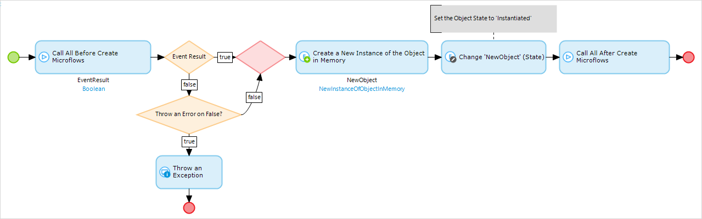
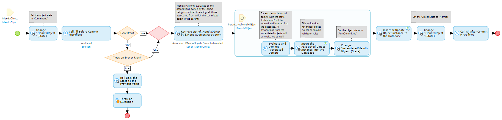
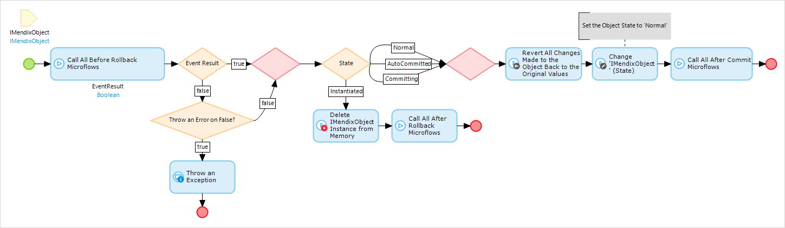
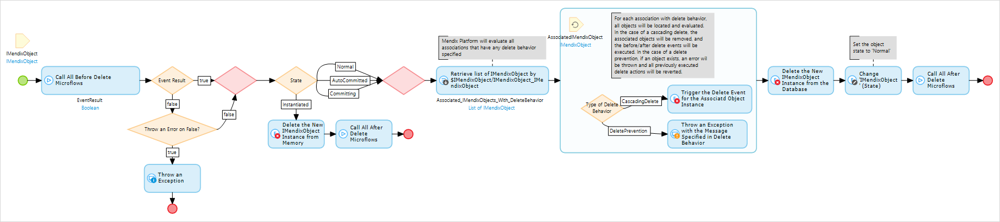

When working with the Mendix Platform, objects are created, removed, or reverted back to the original. Based on the state of the object and the object events that are specified in the domain model, different actions are taken by the platform to guarantee data consistency. 

## 1 Create

Wherever an object is initialized, all the events are always executed. The default **Create** button, a create activity in a microflow, and web services will always follow the steps described in the image below.

* Events: all before and after events are executed, and if any before-create event returns false, an exception can be thrown
    * If an exception occurs during an event, all the changes are reverted with the default error handling behavior
* Database: there is no database communication happening during this event unless it is specified in a before- or after-create event
* Result: a new object is available after these triggers
    * The object will have the **Instantiated** state
    * This influences the behavior in the other object actions

## 2 Commit

When an object is committed through a default Save button, a commit activity, or web services, it will always trigger the commit events. The platform will also evaluate all associated objects. To guarantee data consistency, the platform will also autocommit associated objects.

An autocommit is an automatic commit from the platform, which is done to keep the domain model in sync. If your application ends up having autocommitted objects, then you will have a modeling error. Since an association is also a member of an object, the association will be stored in the database as well. This means that if you create an order line inside an order and the order line is the parent of the association, when you commit the order line, the order will be autocommitted.

If you end up with autocommited objects, it is always because of a modeling error. At some point in time, an association was set to a new object, the associated object was committed, and all of its associations were committed as well to keep all the data consistent.

* Events: all before and after events are executed, and if any before-rollback event returns false, an exception can be thrown
    * If an exception occurs during an event, all the applied changes are reverted with the default error handling behavior
    * Changes made prior to the commit will be kept
* Database: there is an insert or update query executed
    * Depending on the object state, the platform will do an insert for objects with the state **Instantiated** and an update for all other states
* Result: an object with the state Instantiated will be inserted into the database, and an object with any other state will be updated

## 3 Rollback

Pressing a Cancel button or triggering a rollback activity will initiate the rollback events. These actions are not triggered in the case of a rollback because of an error.

* Events: all before and after events are executed, and if any before-rollback event returns false, an exception can be thrown
    * If an exception occurs during an event, all the applied changes are reverted with the default error handling behavior
    * Changes made prior to the rollback will be kept
* Database: there is no database communication happening during this event unless it is specified in a before- or after-create event
* Result: an object with the state **Instantiated** will be removed, and an object with any other state will be reverted back to the values it had during the last commit

## 4 Delete

Clicking a Delete button or triggering a delete activity will initiate the delete events. In addition, when an object is removed through the configured delete behavior, it will execute all before and after events.

* Events: all before and after events are executed, and if any before-delete event returns false, an exception can be thrown
    * If an exception occurs during an event, all the applied changes are reverted with the default error handling behavior
    * Changes made prior to the rollback will be kept 
* Database: if an object has the state **Instantiated**, there will be no database communication required
    * For any other status, a delete query is executed in the database
* Result: the object will be removed from memory and if applicable from the database
    * All delete behavior for the associations is validated, and any associated objects are removed as well

## 5 Related Content

* [How to Work with Images and Files](working-with-images-and-files)
* [How to Create a Basic Data Layer](create-a-basic-data-layer)
* [How to Denormalize Data to Improve Performance](denormalize-data-to-improve-performance)
* [How to Set Up Data Validation](setting-up-data-validation)
* [How to Find the Root Cause of Runtime Errors](../monitoring-troubleshooting/finding-the-root-cause-of-runtime-errors)
* [Stories](/developerportal/collaborate/stories)
* [How to Perform the Scout and Windows 10 Workaround](../ux/perform-scout-and-windows-10-workaround)
