## 1 Introduction

It is said that a picture is worth a thousand words, and this is especially true when it comes to digesting data in your Mendix applications.  Smart use of charts to help aid in business decisions can save time, improve user experience, and reduce mistakes.  The ChartsJS widget is a powerful package, and the Mendix widget utilizes these classes to add rich charts to your app.

**This how-to will teach you how to do the following:**

* Add the ChartsJS widget package to a project
* Structure and retrieve data to interact with ChartsJS graphs
* Configure chart display options
* Create  and view a multi-series line chart

## 2 Prerequisites

Before starting this how-to, make sure you have completed the following prerequisites:

*   Know how to download app store modules
*   Know how to configure a domain model
*   Know how to create microflows and pages
*   Know how to create non-persistant entities

## 3 Implementing ChartsJS in an Existing Project

In this section, you will learn how to install the ChartsJS widget.

### 3.1 Finding and Downloading the ChartsJS Widget from the App Store

1.  Using the in-modeler app store browser, find the ChartsJS widget:

    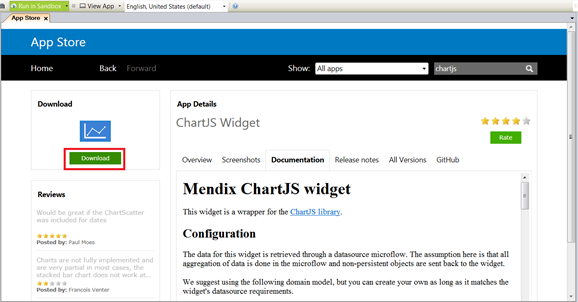
    
2.  Hit the download button to import the collection of widgets into your project.

### 3.2 Setting Up the Domain Model

In order to leverage the ChartJS classes in Mendix in a predictable way, the widget expects a specific data model structure.  This is defined by entities and attributes in the domain model.  To get the widget to work properly, the data structure must match the widget expectations exactly.   We also need to create a data entry entity to house our data for the purpose of this exercise.

{}

TIP: Download the Github test project

To see a working domain model already configured in an application, you can go to the GitHub repository [here](https://github.com/mendix/ChartJS), download the zip package.

{}

1.  Make a new module named **Charting**.
2.  Configure your domain model to contain a Chart, Datapoint, and Dataset entities:

    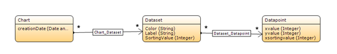
    
3.  Create the entity Values with attributes X, Y, and Series:

    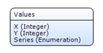
    
4.  For the attribute Series, create a new Enumeration 'Series' that contains the values Series 1 and Series 2.
5.  Create a non-persistant ChartWrapper entity with no attributes:

    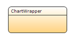

### 3.3 Creating the Data Entry Mechanism

To make this sample project actually generate charts, the first thing to do is rig up a simple data entry page.  Mendix applications receive their data in all sorts of ways, and every application will be slightly different.  The goal of this tutorial is to configure the chart, not capture the data, so the data capture will be simple and generic.  Use this example can be extended to accommodate whatever data structure you might use in your project.

1.  Create a page that will allow for creation of data. 
2.  Add this page to user navigation.
3.  Use the Generate page feature to automatically create the data entry page for a data point.

    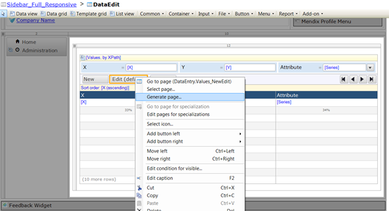

### 3.4 Adding a ChartsJS Widget to a New Page

1.  Create a page called ShowChart and add it to the user navigation.
2.  Add a data view to this page that contains a ChartWrapper entity:

    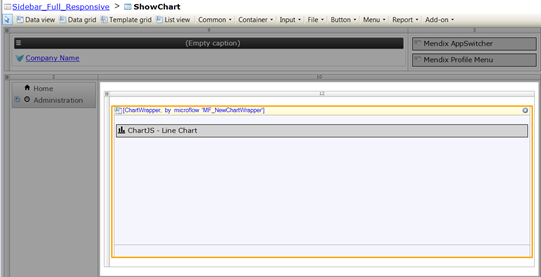
    
3.  Set the data source for this data view to be populated by a microflow.
4.  Create the new microflow to populate the data view.  In this microflow create a new ChartWrapper object and set that object as the return.

    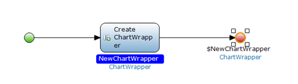
    
5.  On the ShowChart page, add the Line Chart widget using the widget add-on menu:

    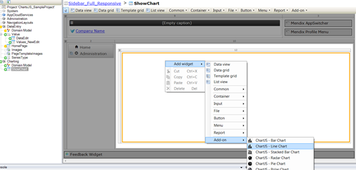
    
6.  The final page should look as shown:

    

### 3.5 Configuring the ChartsJS Widget

The ChartJS widgets are configured through the familiar modeler widget dialogue box.  We must configure the ChartJS module to reference our Charting domain model.

1.  Set the entity for the chart to be the created Chart entity:

    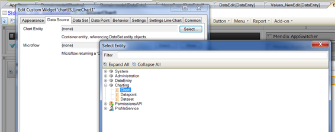
    
2.  Under the widget’s Data Set tab, select the data set entity:

    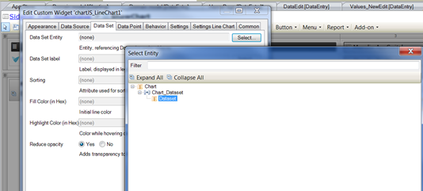
    
3.  Under the Data Set tab, configure the sorting, label, and fill color properties as shown below:

    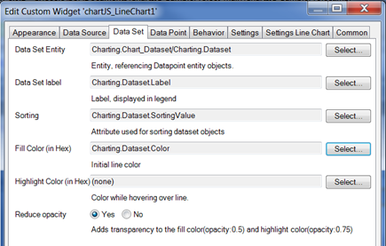

4.  Configure the Data Point tab entity, X value, Y value, and X sorting as shown below:

    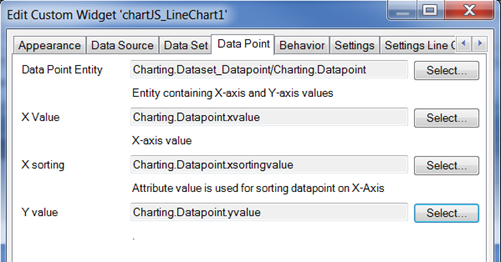

### 3.6 Creating the Data Source Microflow

Now that we have added our widget to the page, we need to feed it some data.  To do this, we will need to write the Data Source Microflow for our widget.  This microflow contains the logic to retrieve, count, and manipulate the data we want to display in our chart.  

1.  Create a new microflow called MF_RetrieveValuesForChart.
2.  Set it as the data source microflow for the Line Chart widget on the Data Source tab:

    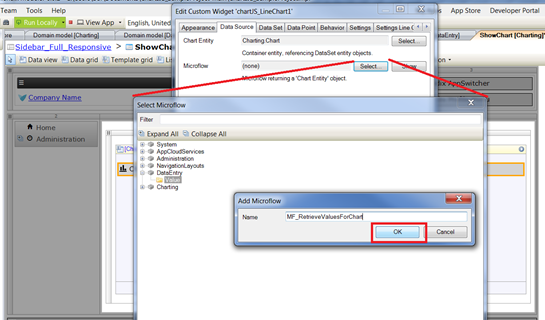
    
3.  In this Microflow, Create a new DataSet object.
4.  Populate values for Label and Color:

    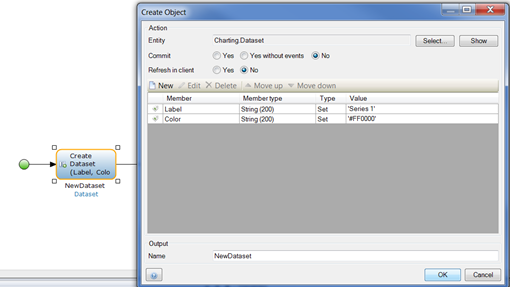
    
5.  Create a sub-microflow called SUB_CreateSeries.  This microflow will retrieve all the data associated with our new dataset.
6.  Create input parameters for SeriesType, Chart, and Dataset.
7.  Add a loop.
8.  We iterate through that list and create a new Datapoint, setting X, Y, and X sorting using the corresponding attributes for our Value entity:

    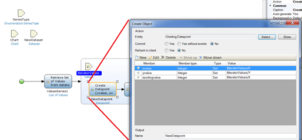
    
9.  Retrieve the dataPoints:

    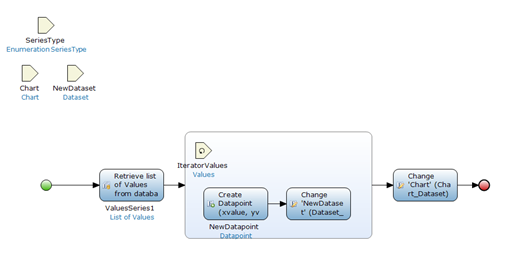
    
10. ‘Add’ the NewDatapoint to the association Dataset_Datapoint and to ‘Add’ the NewDataset to the Chart_Dataset association.  If ‘Set’ is used, only the last series or point will be associated.
    
    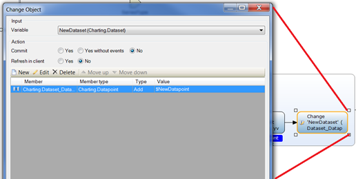

11. Due to the way the ChartJS module expects the data structure, after each point is created we must then associate it with the NewDataset object that we passed into the flow.  This newDataset must then be associated with the Chart object.  These two actions happen after the Datapoint creation.
    
    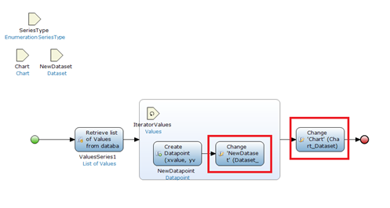

12. The final SUB_CreateSeries microflow should look as shown:

    
    
13. In the microflow RetrieveValuesForChart, create a second DataSet object with Label 'Series 2' and Color #0000FF. Note that SUB_CreateSeries is called once for each series of the chart.

    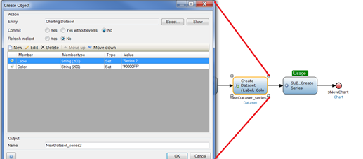

### 3.7 Creating Some Data

Now that the chart is configured, all we have left to do is create some sample data using the page we have created.  We will then be able to visualize our chart!

1.  In the application front end, navigate to the data entry page.
2.  Enter data values for X, Y, and Series to populate your app with data:

    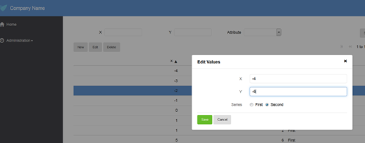
    
3.  Navigate to the showChart page to see your data visualized!

    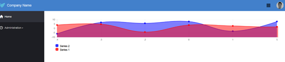
