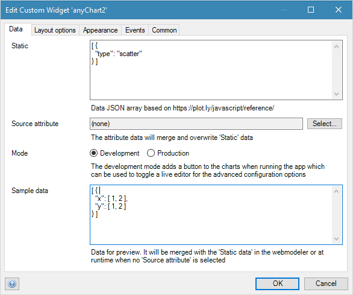

TODO follow format https://raw.githubusercontent.com/mendix/docs/development/templates/the-how-to-template.md

## 1 Any Chart
With the AnyChart it is possible to build all the chart types that are possible with Plotly.js and it allows you build highly dynamic charts. So if you want to build a 3D chart or have a dynamic set of series, the AnyChart is your friend.

### 1.1 Configuration
The Any Charts can be configured with a JSON `Data` array and `Layout` object. The configuration can be set statically, via the `Source attribute` or with the `Sample data`. The data of the attribute will be merged into the static settings and will overwrite any common properties. The `Sample data` is for demo purposes at run time when there is no `Source attribute` selected or when rendering sample data in the web modeler preview.

### 1.2 Use building blocks
[Building blocks](https://docs.mendix.com/refguide/building-block) can provide pre-configured widget. The modules contains various chart samples for a quick start.

1. Download the [Any Chart building blocks](https://appstore.home.mendix.com/link/app/106459/Mendix/Any-Chart-Building-blocks-Module) module from the app store into your project
1. Create a Chart entity
1. Create a page with a data view and use the Chart entity above as the data source entity
1. Add the required building block into the data view
1. Run the project to preview the chart

### 1.3 Start from scratch
1. Select one of the chart samples from the [Any Chart cheat sheet](../../refguide/charts-any-cheat-sheet.md). For example the line chart:  
`[ { "x": [ 1, 2 ], "y": [ 1, 2 ], "type": "scatter" } ]`
1. In the modeler, copy the data into the widget tab `Data`, field `Static`
1. Run the project to validate the chart renders correctly
1. Split the data into static and dynamic parts that are going to be generated from the domain model.  
Static : `[ { "type": "scatter" } ]` and Sample data `[ { "x": [ 1, 2 ], "y": [ 1, 2 ] } ]`
1. Run the project to preview the chart

### 1.4 Generating data and layout
1. Add a `Data` attribute to the Chart entity
1. In the widget set the `Source attribute` field in the `Data` tab
1. Create a `JSON Structure` and use the `Sample data` as the snippet
1. Create an `Export Mapping` with the `JSON Structure`
1. Create a microflow that retrieves the data and use the `Export Mapping` to generate a `String Variable`. Store the value in the object attribute that is select as `Source attribute`

If need be, the layout can also be generated in the same way as the data. In most cases a `Static` layout will suffice.

### 1.5 Runtime preview editor
Editing the JSON configuration in the modeler could be cumbersome. With the live preview editor, developers can directly see the output of their changes. 

The editor is only a playground and no settings are stored. All changes you make in the runtime preview that you wish to persist have to be applied to your data model too.

1. In the `Data` tab, set the `Mode` option to `Development`
1. Run the project, and open the chart page
1. Click the 'Toggle Editor' button on the top right of the chart and fine tune your settings
1. In the editor, select either `Data` or `Layout` from the dropdown menu
1. Edit Static or Data settings
1. Copy the new settings and apply them in the modeler
1. Re-run the project to confirm the change are applied

The [cheat sheet](../../refguide/charts-advanced-cheat-sheet.md) provides a quick help for the most common settings.

The full reference is found here: [https://plot.ly/javascript/reference/](https://plot.ly/javascript/reference/).