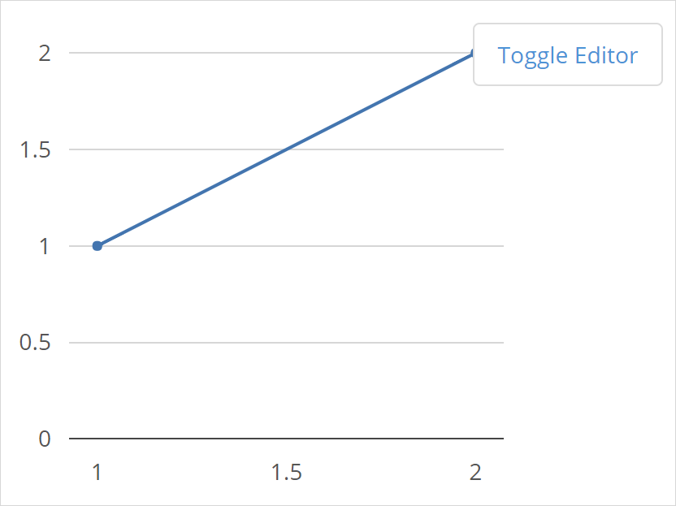
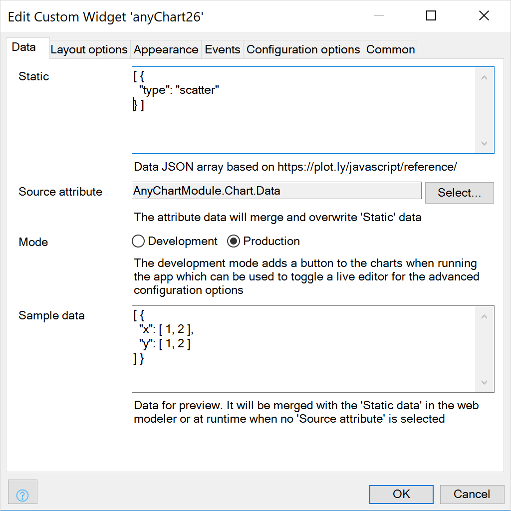
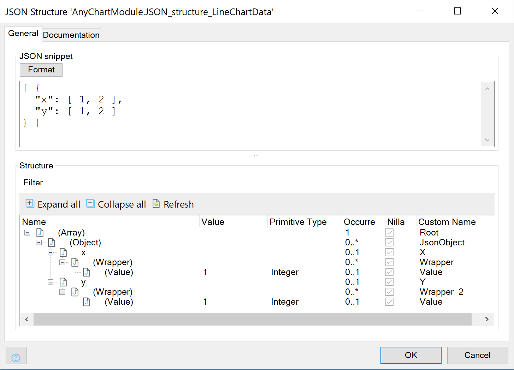
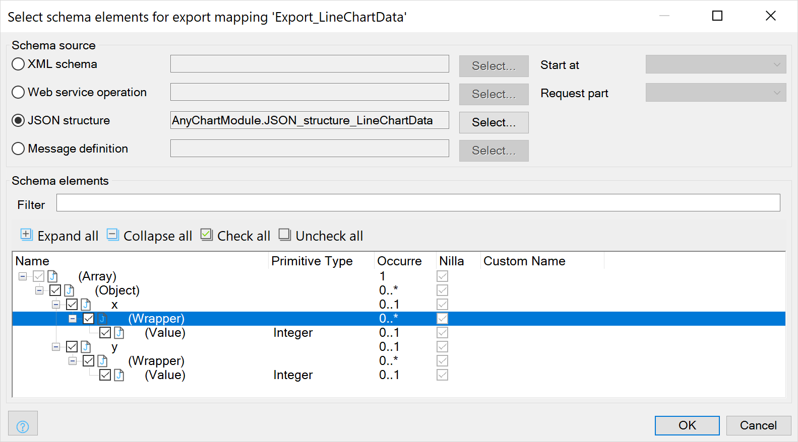
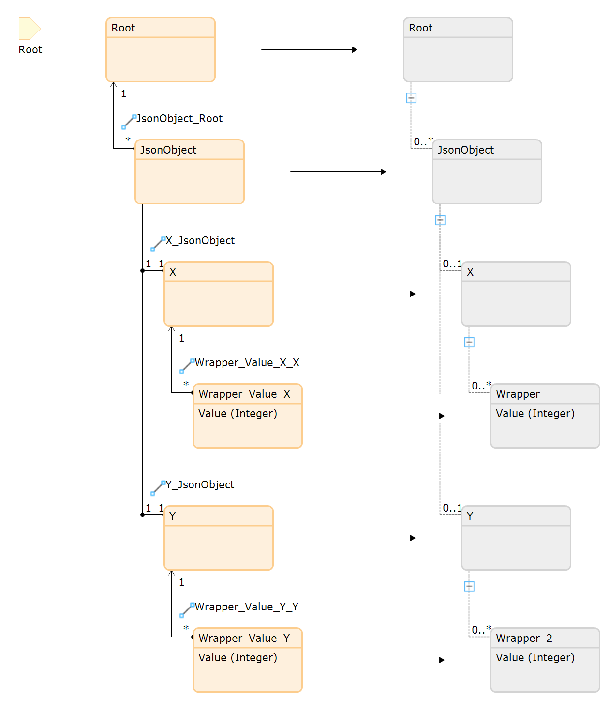
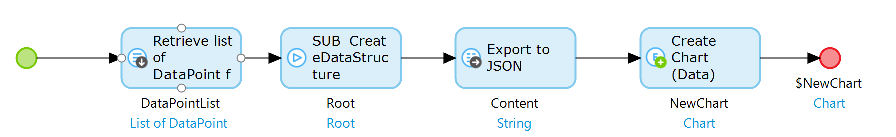
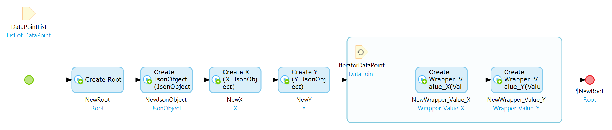

## 1 Introduction

The basic chart widgets provide the set of easy to configure charts; line, bar, column, pie, heatmap. Charts are fine tuned  with the advanced options. When the advanced options are not enough, the **Any Chart** could be used.

With the Any Chart, you can build all the chart types that are possible with Plotly.js as well as highly dynamic charts. So, if you want to build a 3D chart or have a dynamic set of series, the Any Chart is your friend.

**This how-to will teach you how to do the following:**

* Create line chart with sample data
* Export data for a chart
* Fine tune the chart with the run time playground

## 2 Prerequisites

Before starting this how-to, make sure you have the following prerequisites:

* Latest Mendix modeler
* Latest Any Chart widget module from the Mendix App Store
* Understanding of JSON data structures

## 3 Chart structure

The Any Chart can be configured with a JSON **Data** array and **Layout** object. The configuration can be set statically, via the **Source attribute** or with the **Sample data**. The data of the attribute will be merged into the static settings and will overwrite any common properties. The Sample data is for demo purposes at run time when there is no Source attribute selected or when rendering sample data in the web modeler preview.

## 4 Create a chart

To create a line chart with the Any Chart widget, follow these steps:

1. Create a page with a data view (Chart context)
1. Add the Any Chart widget in the data view
1. Select one of the chart samples from the [Any Chart cheat sheet](../../refguide/charts-any-cheat-sheet.md####-line-chart). For example the line chart:  

```json
[ { "x": [ 1, 2 ], "y": [ 1, 2 ], "type": "scatter" } ]
```

4. In the modeler, copy the data into the Any Chart widget property tab **Data**, field **Static**
1. Run the project to confirm the chart renders correctly
1. Split the data into static and dynamic parts that are going to be generated from the domain model.  
Static :  

```json
[ { "type": "scatter" } ]
```

Sample data :  

```json
[ { "x": [ 1, 2 ], "y": [ 1, 2 ] } ]
```


6. Run the project to preview the chart


## 5 Export data

To generate JSON data for the chart widget, follow these steps:

1. Add a **Data** string (unlimited length) attribute to the Chart (context) entity
1. In the widget, set the **Source attribute** field in the **Data** tab

1. Create a **JSON Structure** and use the **Sample data** as the snippet

1. Create an **Export Mapping** with the **JSON Structure**


1. Create a microflow that retrieves the data and use the **Export Mapping** to generate a **String Variable**. Store the value in the object attribute that is select as **Source attribute**



If need be, the layout can also be generated in the same way as the data. In most cases, a **Static** layout will suffice.

## 6 Fine tuning

Editing the JSON configuration in the modeler could be cumbersome. With the live preview editor, developers can directly see the output of their changes. 

The editor is only a playground and no settings are stored. All changes you make in the runtime preview that you wish to persist have to be applied to your data model too.

To fine tuning chart widget configuration, follow these steps:

1. In the **Data** tab, set the **Mode** option to **Development**
1. Run the project, and open the chart page
1. Click the **Toggle Editor** button on the top right of the chart and fine tune your settings
1. In the editor, select either **Data** or **Layout** from the dropdown menu
1. Edit Static or Data settings
1. Copy the new settings and apply them in the modeler
1. Re-run the project to confirm the change are applied


## 7 References

- The properties [Any Chart reference guide](../../refguide/charts-any-configuration).  
- Most common chart type [Any Chart cheat sheet](../../refguide/charts-any-cheat-sheet).  
- The [configuration cheat sheet](../../refguide/charts-advanced-cheat-sheet) provides a quick help for the most common settings.  
- The full JSON reference is found here: [https://plot.ly/javascript/reference/](https://plot.ly/javascript/reference/).
- Mendix modeler documentation  
https://docs.mendix.com/refguide/json-structures  
https://docs.mendix.com/refguide/export-mappings  

## 8 Related Content
