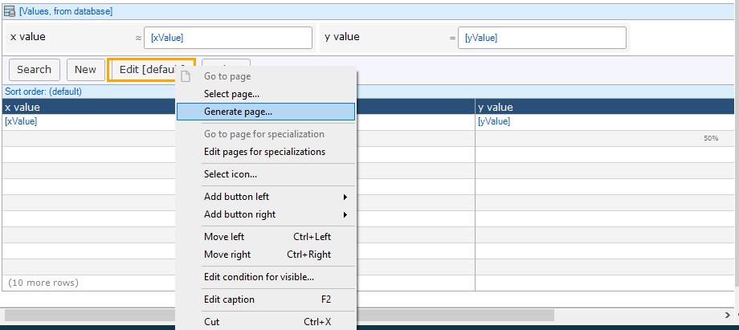
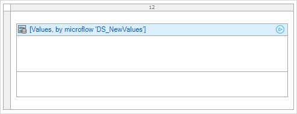
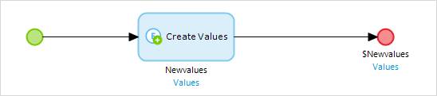
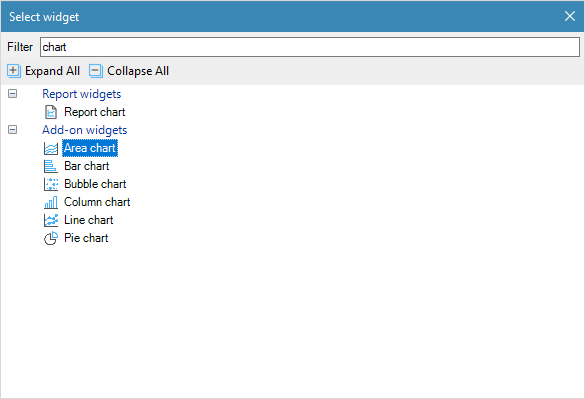
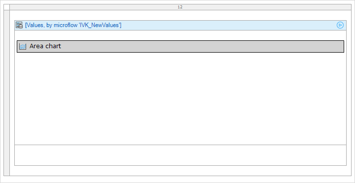
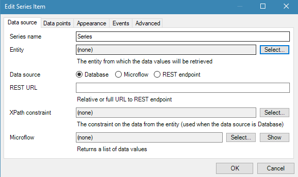
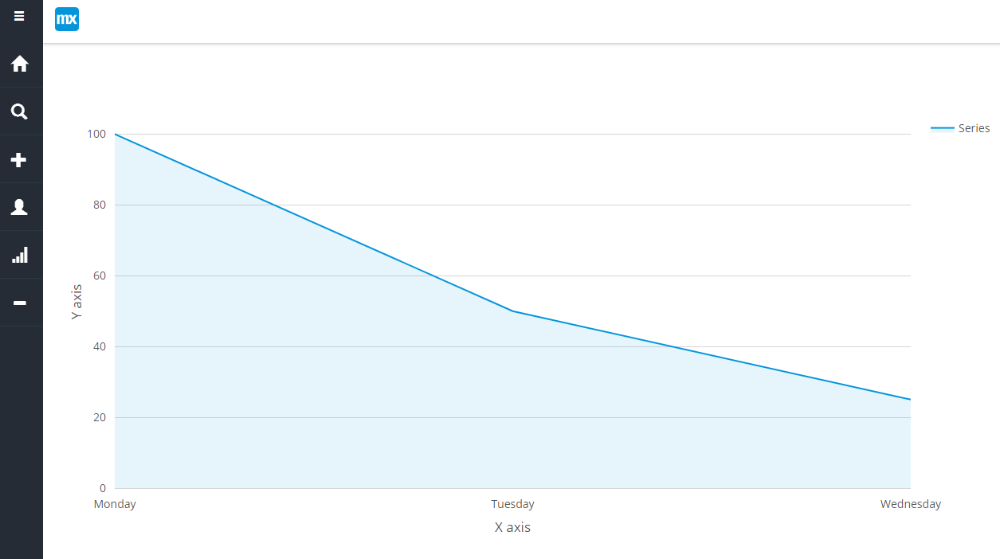

## 1 Introduction

The charts widget provides the basic implementation of charts: area, line, bar, column, pie, heatmap in a mendix application.

**This how-to will teach you how to do the following:**

* Create a chart with basic sample data
* Configure chart display options

## 2 Prerequisites

Before starting this how-to, make sure you have completed the following prerequisites:

* Install latest mendix modeler
* Download latest [Charts Widget](https://appstore.home.mendix.com/link/app/105695/) from the Mendix App Store

## 3 Implement the Charts widget in an existing project

In this section, you will create a chart with basic sample data.

## 3.1 Set up the Domain model

In order to use the Charts widget, a specific data structure is set up. This is defined by entities and attributes in the domain model.

1. Create a new module called charts
2. Configure your domain model to contain an entity **Values** with attributes **xValue**, **yValue**

## 3.2 Create a data entry page

To create a basic data entry page from which the Charts widget will fetch data, follow these steps:

1. Create a page that will allow for creation of data
1. Add this page to user navigation
1. Use the **Generate page** feature to automatically create the data entry page for a data point

## 3.3 Add the Charts widget to a new page

1. Create a page named *ShowChart*
1. Add it to the **User Navigation**
1. Add a data view to this page that contains the Values entity and has a microflow as a data source
1. Create a new microflow named **IVK_NewValues** to fill the data view  

1. Right click on the data view and select **Go to microflow**
1. In the new **IVK_NewValues** microflow, create a new Values object and set that object as the return  

1. On the ShowChart page, add the chart - Area Chart using the Add widget menu

1. The final page should look like this  

## 3.4 Configure the Charts Widget

To configure a Charts widget, follow these steps:

1. Open the page with the Charts widget
1. Right click, select **properties**
1. In the tab **Chart properties**, add a new **series** property  

2. In the tab **Data source**, select **Entity**  

3. Set the **Data source** as **Database**  
4. In the tab **Data points**, select the **X-axis data attribute** and the **Y-axis data attribute**  

## 3.5 View chart

To view the chart, follow these steps:

1. Run the project
1. In your browser, open the data entry page
1. Enter data values for x value and y value  
  
1. Click on the **Save** button
3. Open the  Show chart page to view the chart created

## 4 Related Content

* [How to use chart data source REST](charts-basic-rest)
* [How to use Any Chart](charts-any-usage)
* [How to use theme charts](charts-theme)
