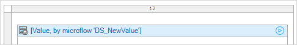
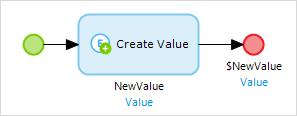
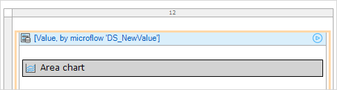
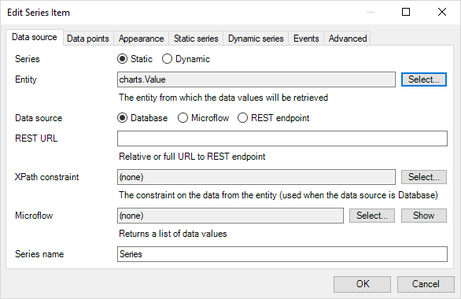
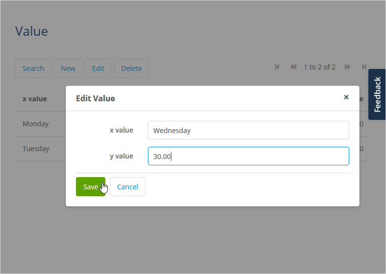
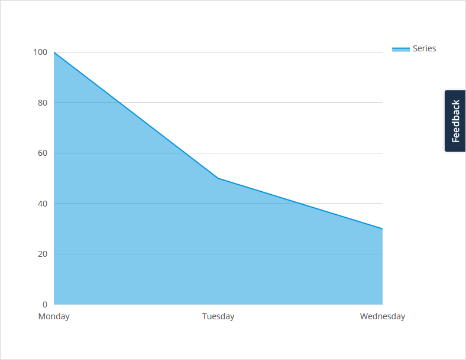

## 1 Introduction

The charts widget provides a basic implementation of different types of chart (for example: area, line, bar, column, and pie) in a Mendix application.

**This how-to will teach you how to do the following:**

* Create a chart with basic sample data

* Configure the chart display options

## 2 Prerequisites

Before starting this how-to, make sure you have completed the following prerequisites:

* Install the latest Mendix desktop modeler

* Download the latest [Charts Widget](https://appstore.home.mendix.com/link/app/105695/) from the Mendix App Store

## 3 Implementing the Charts Widget in an Existing Project

In this section, you will create a chart with basic sample data.

## 3.1 Setting up the Domain Model

To use the Charts widget, a specific data structure is set up. This is defined by entities and attributes in the domain model.

1. Create a new module called **charts**.

2. Configure your domain model to contain an entity **Value** with a string attribute **xValue** and a decimal attribute **yValue**.

    

## 3.2 Creating a Data Entry Page

To create a basic data entry page from which the Charts widget will fetch data, follow these steps:

1. Right Click on value entity.

2. Select **Generate overview pages**.

    

3. Add the **Value_NewEdit** page to user navigation.

## 3.3 Adding the Charts Widget to a New Page

1. Create a page named *ShowChart*.

2. Add it to the user navigation.

3. Add a **Data view** to this page that contains the **Value** entity and has a microflow as a data source.

4. Create a new microflow named **DS_NewValue** to fill the data view.

    

5. Right-click on the data view and select **Go to microflow**.

6. In the new **DS_NewValue** microflow, create a new *Value* object and set that object as the return.

    

7. On the ShowChart page, add the widget **Area chart**.

    

8. The final page should look like this.

    

## 3.4 Configuring the Charts Widget

To configure a Charts widget, follow these steps:

1. Open the page with the Charts widget.

2. Right-click the **Area chart** and select **Properties**.

3. In the tab **Chart properties**, add a new **Series** property.

    

4. In the tab **Data source**, select *Value* as the **Entity**.

5. Set the **Data source** as **Database**.

    

6. In the tab **Data points**, select *xValue* as the **X-axis data attribute** and *yValue* as the **Y-axis data attribute**.

    

## 3.5 Viewing the Chart

To view the chart, follow these steps:

1. Run the project.

2. In your browser, open the data entry page.

3. Enter data values for **x value** and **y value**.

    

4. Click the **Save** button.

5. Open the **ShowChart** page to view the chart created.

    

## 4 Related Content

* [How to Use a Chart With a REST Data Source](charts-basic-rest)
* [How to Use Any Chart](charts-any-usage)
* [How to Use Charts Themes](charts-theme)
