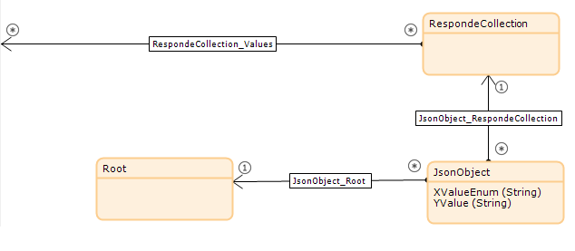
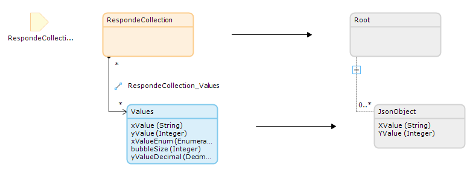
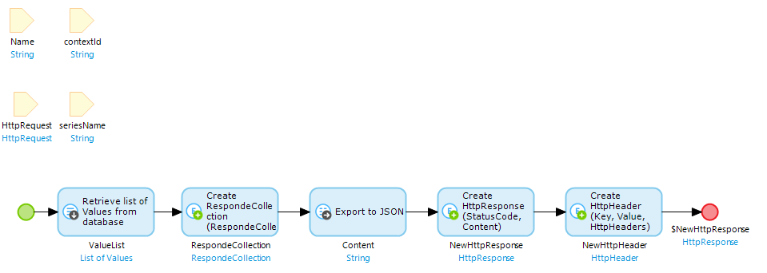
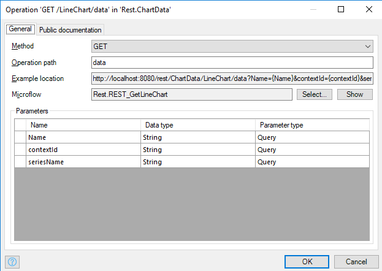

## 1 Introduction

With the Charts widget, you can use data from a REST Service to plot graphs.

**This how-to will teach you how to do the following:**

* Use a REST end point as a data source for the Charts widget
* Publish a REST API

## 2 Prerequisites

Before starting this how-to, make sure you have completed the following prerequisites:

* Install the Latest mendix modeler
* Download latest [Charts Widget](https://appstore.home.mendix.com/link/app/105695/) from the Mendix App Store

## 3 Data source

To create a REST Data source end point, follow these steps:

1. Open a project with a Charts widget
2. Open the page with the Charts widget
3. Double click on the Charts widget
4. In the tab **Chart properties**, add new Chart **Series** property  

5. Add **Series name** and **Entity**  
  
6. Select **Data source** REST endpoint  
7. Add the **REST URL**  

8. In the tab **Data points**, select the **X-axis data attribute** and the **Y-axis data attribute**  

## 4 Related Content

TODO Format content into template
# REST endpoint setup

* When retrieving data from a REST endpoint, a Data Point entity (non persistent entity) and the attribute(s) are required.

* Create an export mapping which specifies how the entity relates to the JSON.

* Create a rest API which returns the Http response.

* Then publish the API.

For more information on publishing a rest API refer to Mendix [REST documentation](https://docs.mendix.com/refguide/published-rest-operation?utm_source=businessmodeler&utm_medium=software&utm_campaign=modeler)
