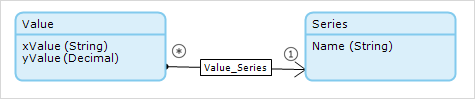
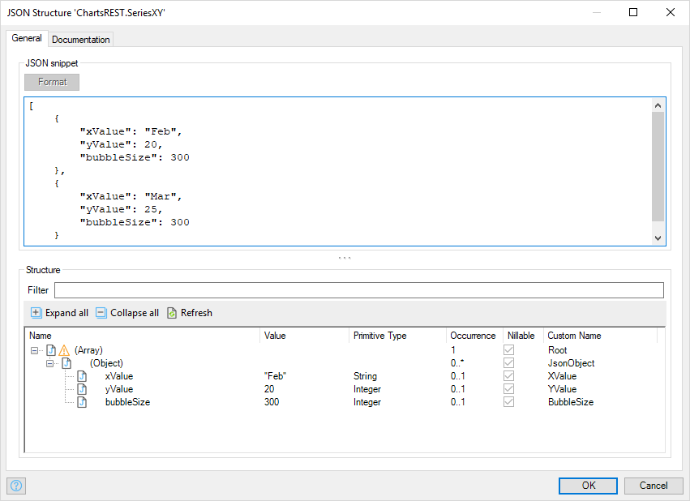
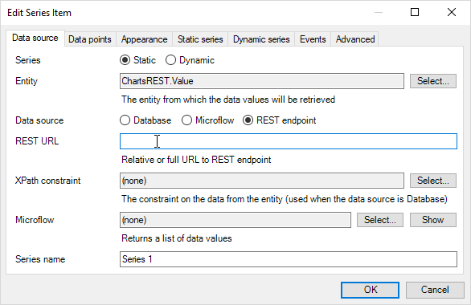

## 1 Introduction

With the Charts widget, you can use data from a REST Service to plot graphs.

**This how-to will teach you how to do the following:**

* Publish a REST API
* Use a REST end point as a data source for the Charts widget

## 2 Prerequisites

Before starting this how-to, make sure you have completed the following prerequisites:

* Install the Latest mendix modeler
* Download latest [Charts Widget](https://appstore.home.mendix.com/link/app/105695/) from the Mendix App Store

## 3 REST endpoint setup

Mendix allows you to publish REST Web services natively in the modeler, and using these capabilities we can publish a REST service and use it in our Charts widget to plot graphs. To create an Area Chart with data from a REST service, follow these steps:

{}

For more information on publishing a rest API refer to Mendix [REST documentation](https://docs.mendix.com/refguide/published-rest-operation?utm_source=businessmodeler&utm_medium=software&utm_campaign=modeler)

{}

1. Create a new Module in the charts project
1. Rename the module to *ChartsREST*
1. Open the Domain model
1. Create entities with an association between **Values** and **Series**   
  
1. Right Click on **Value** and select **generate overview pages**

1. Add the **Value_NewEdit** page generated to your navigation.
1. Run the project  
1. In your browser, open the NewEdit page  
1. Add values and series by entering data in the appropriate fields

## 4 Publishing the Service

To use data from a model in the REST service, you need to create a JSON structure.

### 4.1 Creating the Structure

Create a **JSON Structure**  

### 4.2 Configure the REST Service

To configure the REST service, folllow these steps:

1. Add **Published REST service**  

1. Add REST Service **Microflow**  

1. Add **Export mapping**  

## 5 Data source

To create a REST Data source end point, follow these steps:

1. Open the page with the Charts widget
1. Double click on the Charts widget
1. In the tab **Chart properties**, add new Chart **Series** property  

1. Add **Series name** and **Entity**  
  
1. Select **Data source** REST endpoint  
1. Add the **REST URL**  

1. In the tab **Data points**, select the **X-axis data attribute** and the **Y-axis data attribute**  
  
1. Add Parameters to the REST Request. The **contextId**, **series name** are provided by default 
 
1. View Chart  

## 6 Related Content

* [How to use chart data source REST](charts-basic-create)
* [How to use Any Chart](charts-any-usage)
* [How to use theme charts](charts-theme)
