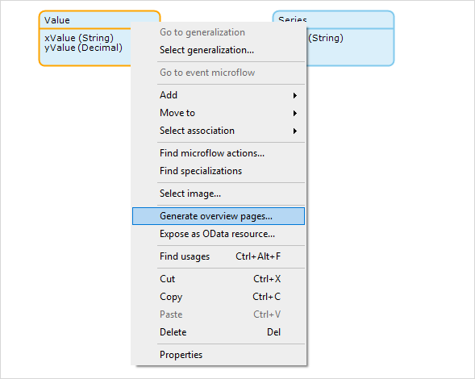
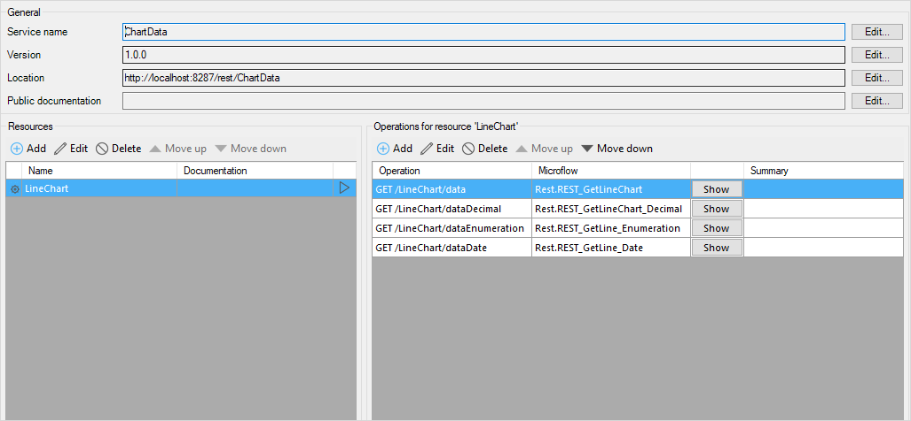
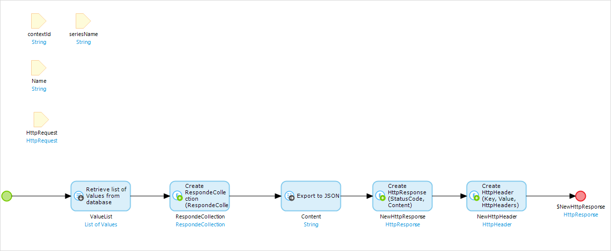
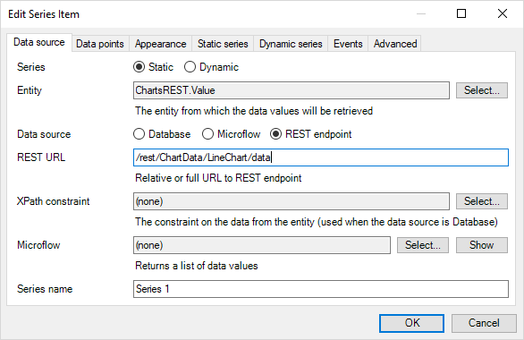
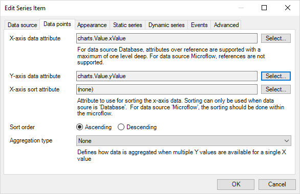
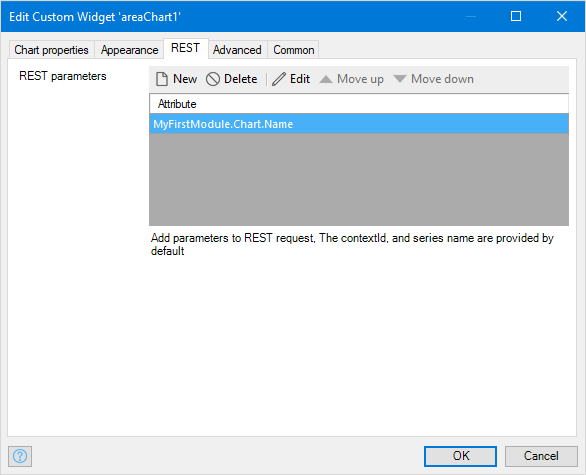
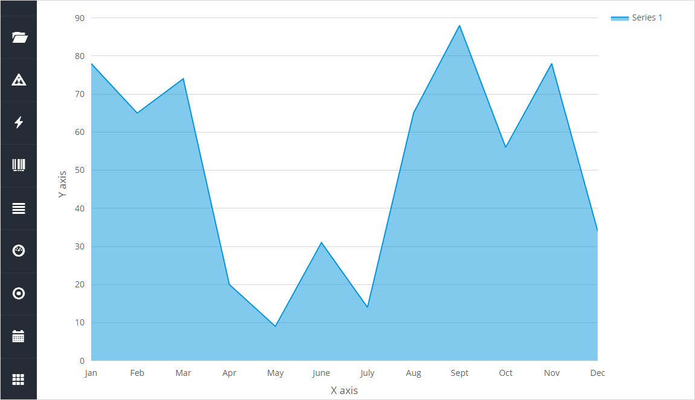

## 1 Introduction

With the Charts widgets, you can use data from a REST Service to plot graphs.

**This how-to will teach you how to do the following:**

* Publish a REST API
* Use a REST end point as a data source for the Charts widget

## 2 Prerequisites

Before starting this how-to, make sure you have completed the following prerequisites:

* Install the latest Mendix desktop modeler
* Create a project
* Import the latest [Charts Widgets](https://appstore.home.mendix.com/link/app/105695/) from the Mendix App Store

## 3 Setting up Data to be Exposed by a REST Endpoint

Mendix allows you to publish REST Web services natively from the modeler. Using these capabilities you can publish a REST service and use it in our Charts widget to plot graphs.

To create an Area Chart with data from a REST service, follow these steps:

{}

For more information on publishing a REST API refer to this Mendix document: [Published REST Operation](/refguide/published-rest-operation)

{}

1. Create a new Module in your project.
1. Rename the module to *ChartsREST*.
1. Open the Domain model.
1. Create **Value** and **Series** entities with the attributes and association shown in the picture below.
      
1. Right-click **Value** and select **Generate overview pages...**.
    
1. Add the **Value_NewEdit** page generated to your navigation.
1. Run the project.
1. In your browser, open the NewEdit page.
1. Add values and series by entering data in the appropriate fields.

## 4 Publishing the Service

To use data from a model in the REST service, you need to create a JSON structure.

### 4.1 Creating the Structure

1. Create a **JSON Structure**  
    

### 4.2 Configuring the REST Service

To configure the REST service, follow these steps:

1. Add **Published REST service**.
    

1. Add REST Service **Microflow**.
    

1. Add **Export mapping**.
    

## 5 Using REST as a Data Source

To use the REST Data source end point in your chart, follow these steps:

1. Create a page in your project containing an **Area chart** widget.
1. Double click on the **Area chart** widget.
1. In the tab **Chart properties**, add a new chart **Series** property.
1. Add **Series name** and **Entity**.

    
1. Select **Data source** REST endpoint  
1. Add the **REST URL**  
    
1. In the tab **Data points**, select the **X-axis data attribute** and the **Y-axis data attribute**  
      
1. Add Parameters to the REST Request. The **contextId**, **series name** are provided by default 
     
1. Run your app and view the chart.
    

## 6 Related Content

* [How to use chart data source REST](charts-basic-create)
* [How to use Any Chart](charts-any-usage)
* [How to use theme charts](charts-theme)
