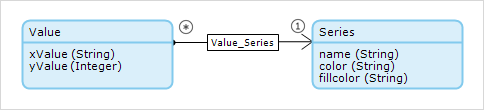
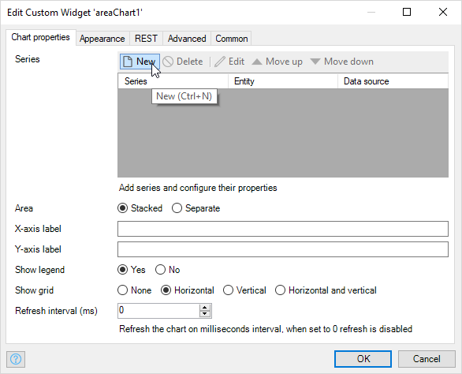

## 1 Introduction

The charts widget provides a basic implementation of dynamic series. This allows you to vary the number of data series (for example lines on a line chart) in your chart at runtime, based on the data in your app.

**This how-to will teach you how to do the following:**

* Create a chart with dynamic series

## 2 Prerequisites

Before starting this how-to, make sure you have completed the following prerequisites:

* Install the latest Mendix Desktop Modeler
* Download the latest [Charts Widget](https://appstore.home.mendix.com/link/app/105695/) from the Mendix App Store

## 3 Setting up Chart Data

### 3.1 Setting up the Domain Model

In order to create the Charts widget with dynamic series, a specific data structure is set up.

1. Configure your domain model to contain an entity **Value** with attributes **xValue** and **yValue**.
1. Add another entity, **Series**, with attributes **name**, **color**, and **fillColor**.
1. Add an association **Value_Series** between the two entities.
    

### 3.2 Entering Data for the Chart

Now you need to enter data for the chart.

1. Right-click the **Series** entity.

2. Choose **Generate overview pages...**.

3. Select both **Series** and **Value** as the entities for which to generate pages.

    

4. Connect the **Series_Overview** page to the navigation.

5. **Run** the app (locally).

6. Enter some sample data.

    

## 4 Configuring the Charts Widget

### 4.1 Adding a Chart Page

Now you need to create a page containing the chart.

1. Create a new page.

2. Add a data view which uses a microflow to make a context which is the first object of the **Value**.

3. Add an **Area chart** widget inside the data view.

### 4.2 Configuring the Area Chart with Dynamic Series

To configure a Charts widget with a dynamic series, follow these steps:

1. Right-click the area chart widget and select **Properties**.

1. In the tab **Chart properties**, add a new **Series** property.

    

1. In the tab **Data source**, select **Dynamic**.
    
1. Set the **Data entity** to *Value*. This is the entity from which the data values will be retrieved.

1. Set the **Data source** as **Database** (note that REST endpoints are not supported for dynamic series).

    

1. In the tab **Data Points**, set:

    * **X-axis data attribute** to *Value/xValue*

    * **Y-axis data attribute** to *Value/yValue*

    

1. In the tab **Dynamic series**, set: 

    * **Series entity** to *Series*

    * **Series name attribute** to *Series/name*
    
    * **Line color attribute** to *Series/color*

    * **Area color attribute** to *Series/fillcolor*

    

1. Add the charts page to user navigation.

## 5 Viewing the Chart

To view the chart, follow these steps:

1. Run the project (locally).

1. Open the page containing the dynamic series chart.

    

## 6 Related Content

* [How to create a basic chart](charts-basic-create)
* [How to fine tune a chart, with advance settings](charts-advanced-tuning)
* [How to use Any Chart](charts-any-usage)
