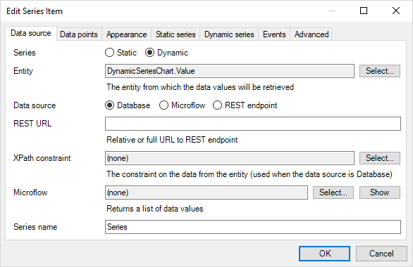
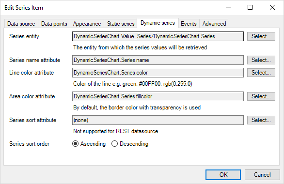

## 1 Introduction

The charts widget provides a basic implementation of dynamic series. This allows you to vary the number of data series (for example lines on a line chart) in your chart at runtime, based on the data in your app.

**This how-to will teach you how to do the following:**

* Create a chart with dynamic series

## 2 Prerequisites

Before starting this how-to, make sure you have completed the following prerequisites:

* Install the latest Mendix Desktop Modeler
* Download the latest [Charts Widget](https://appstore.home.mendix.com/link/app/105695/) from the Mendix App Store

## 3 Configuring the Charts Widget

## 3.1 Setting up the Domain Model

In order to create the Charts widget with dynamic series, a specific data structure is set up.

1. Configure your domain model to contain an entity **Value** with attributes **xValue** and **yValue**.
1. Add another entity, **Series**, with attributes **name**, **color**, and **fillColor**.
1. Add an association **Value_Series** between the two entities.
    

## 3.2 Adding Chart Configuration

To configure a Charts widget with a dynamic series, follow these steps:

1. Open the page containing the Charts widget.
1. Right click, select **Properties**.
1. In the tab **Chart properties**, add a new **Series** property.
    
1. In the tab **Data source**, select **Dynamic**.
    
1. Set the **Data entity** to *Value*. This is the entity from which the data values will be retrieved.
1. Set the **Data source** as **Database** or **Microflow**.
1. In the tab **Dynamic series**, set the **Series entity** to *Series*.
1. Set the **Series name attribute** to *Series/name* and **Line color attribute** to *Series/color*.
    
1. Add the charts page to user navigation.

## 3.3 Viewing the Chart

To view the chart, follow these steps:

1. Run the project.
1. Open the page containing the dynamic series chart.

    

## 4 Related Content

* [How to create a basic chart](charts-basic-create)
* [How to fine tune a chart, with advance settings](charts-advanced-tuning)
* [How to use Any Chart](charts-any-usage)
