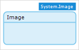
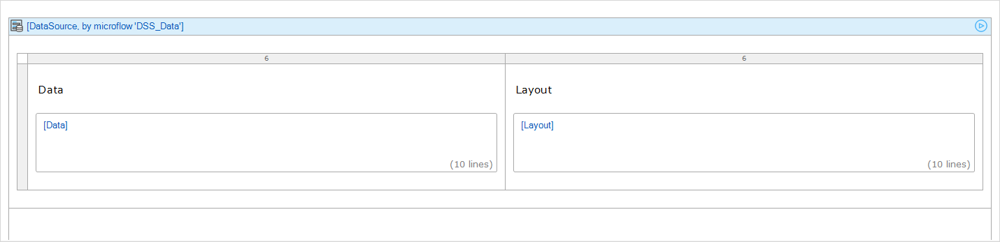
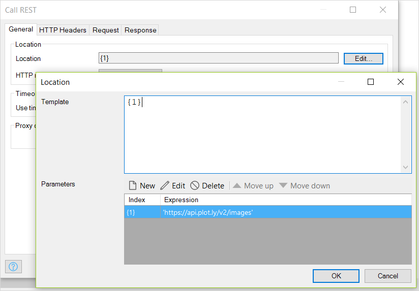
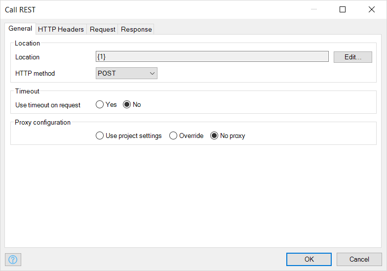
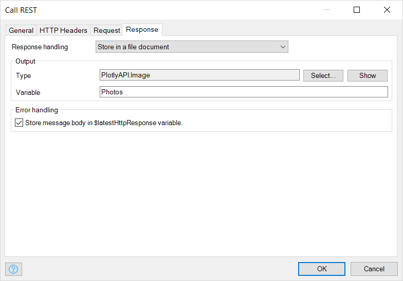
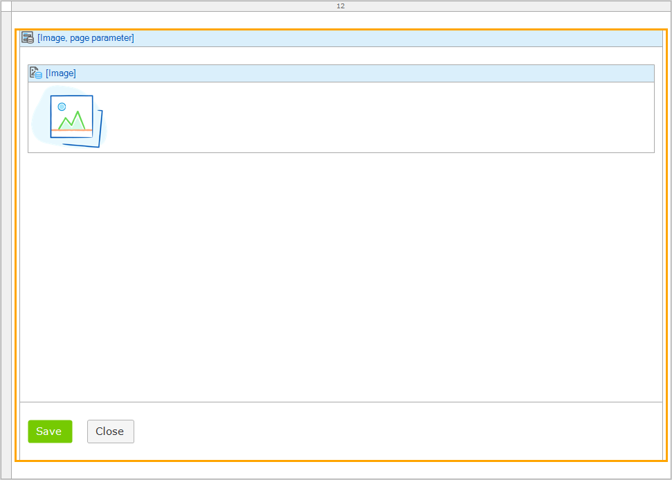

## 1 Introduction

The [Plotly API images endpoint](https://api.plot.ly/v2/images) turns a plot into an image of the desired format. A set of body parameters and headers are passed to the endpoint, which returns an image when a request is made.

**This how-to will teach you how to do the following:**

* Call *Plotly API Images*' REST end point

* Save images returned from generated by the end point

## 2 Prerequisites

Before starting this how-to, make sure you have completed the following prerequisites:

* Install the latest Mendix desktop modeler

* Create an account on **plot.ly**: you can sign up to plot.ly here: https://plot.ly/accounts/login/?action=signup#/

* Retrieve the plotly API key which goes with your account; your API key can be found on the settings page when you are logged in to the site

* Create a Mendix app to work with, see [How to Create a Mendix App](../tutorials/start-with-a-blank-app-1-create-the-app)

## 3 Setting up the Domain Model

To set up the domain model for use with the plotly REST service end point, follow these steps:

1. Create two entities: **Image** and **DataSource**.

1. **Image** should be a specialization of the **System.Image** entity, so set **Generalization** to *System.Image*.

    
1. **DataSource** should be non-persistent with **Data** and **Layout** string attributes.

    

## 4 Calling the 'Plotly API Images' REST End Point

To make a call to *Plotly API images* REST end point, follow these steps:

1. Add a blank page to the existing module.

1. Add a **Data view** with data source as a microflow that returns a new **DataSource** object.

1. In the **Data view**, place input widgets with source attribute as **Data** and **Layout**.

    

1. In the footer of the *Data view*, add a **Call microflow button**.

1. Link the button to a new microflow: *ACT_Call_REST*.

1. Rename the button *Call Plotly REST Service*.

    

1. Right click on the button, select to **Go to on click microflow...**.

1. Build the microflow as shown below.

    

1. The **Call REST service** activity is configured as follows:

    * In the tab **General**, the **Location** should be set to *https://api.plot.ly/v2/images*

          
    * Select the **HTTP Method** as *POST*

        

    * In the tab **HTTP Headers**, Enter your plotly user name and API key (more information on plotly authentication can be found here: https://api.plot.ly/v2/#authentication)

        

        {}Custom HTTP headers 'Content-Type' and 'Plotly-Client-Platform' must be provided{}

    * In the tab **Request**, select *Custom request template*; the request is a 'JSON' object with the structure

        ``` JSON
        {
            "figure": {
                "data": [{"y": [10, 10, 2, 20]}],
                "layout": {"width": 700}
            },
            "format": "png",
            "encoded": false
        }
        ```

        

        For more request parameter details, see the documentation here: [Plotly REST API, v2](https://api.plot.ly/v2/images#fields).

        {}When `encoded` is set to `true`, a base64 image url is returned.<br /><br />In the field **Template**, escape the opening brace, `{`, by using a double opening brace, `{{`.{}

    * In the tab **Response**, set **Response handling** to *Store in a file document*

        

    * Set **Output > Type** to the **Image** entity

## 5 Saving the Image

To save images generated by the REST service, follow these steps:

1. Add a **Show page** activity to the *ACT_Call_REST* microflow.

1. Select a new page.

1. Set the generated image object as the **Object to pass** to the page.

1. Set the layout of the page as a popup.

1. Place a **Data view** in the page and populate it as shown below:

    

1. Run the project.

1. In the browser, open the page with the **Call Plotly REST Service** button.

1. Fill in the **Data** and **Layout** fields. An example is shown in the image below.

    

1. Click the **Call Plotly REST Service** button.

    
    
1. Click the **Save** button to save the image which is displayed.

## 6 Related Content

* [Plotly images endpoint](https://api.plot.ly/v2/images)
* [Call a REST Service Action](/refguide/call-rest-action)
