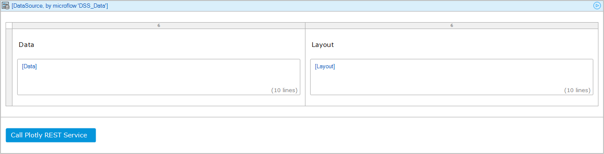
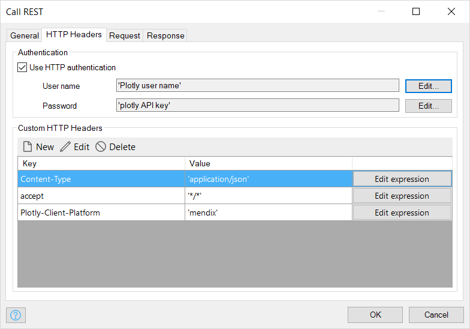
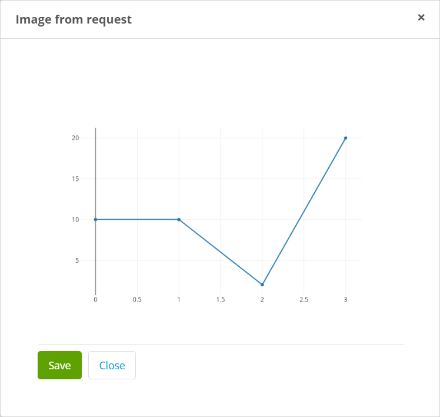

## 1 Introduction

The [Plotly API images endpoint](https://api.plot.ly/v2/images) turns a plot into an image of the desired format. A set of body paramters and headers are passed to the endpoint, which returns a image when a request is made.

**This how-to will teach you how to do the following:**

* Call 'plotly api images' REST end point
* Save images returned from generated by the end point

## 2 Prerequisites

Before starting this how-to, make sure you have completed the following prerequisites:

* Install the Latest mendix modeler
* Create a plot account
* A plotly username and API key
* Setup a mendix app, see [How to create a mendix app](https://docs.mendix.com/howto/tutorials/start-with-a-blank-app-1-create-the-app)

## 3 Set up domain model

To set up the domain model for use with plotly REST service end point, follow these steps:

1. Create two entities: **Image** and **DataSource** 
1. **Image** should inherit from the **System.Image** entity  

1. **DataSource** should be non-persistent with **Data** and **Layout** attributes  


## 4 Call 'Plotly API images' REST end point

To make a call to `Plotly API images` REST end point, follow these steps:

1. Add a blank page to the existing module
1. Add a **Data view** with data source as a microflow that returns **DataSource** object.
1. In the **Data view**, place input widgets with source atttribute as **Data** and **Layout**
  
1. In the footer of the Data view, Add a **Call microflow button** 
1. Select **New**, name the microflow *ACT_Call_REST*
1. Rename the button to *Call Plotly REST Service*

1. Right click on the button, select to **Go to onclick microflow**
1. Configure the microflow as:  

1. Call REST Service activity is configured as follows:  
In the tab **General**, the Location shoud be set as *https://api.plot.ly/v2/images*  
  
Select the HTTP Method as *POST*  
  
In the tab **HTTP Headers**, Enter your plotly user name and API key  
  

{}

Custom HTTP headers 'Content-Type' and 'Plotly-Client-Platform' must be provided

{}

In the tab **Request**, Select *Custom request template*
The request is a 'JSON' object with the structure
``` JSON
{
    "figure": {
        "data": [{"y": [10, 10, 2, 20]}],
        "layout": {"width": 700}
    },
    "format": "png",
    "encoded": false
}
```
For more request parameter details, [see here](https://api.plot.ly/v2/images#fields)

)  

{}

When `encoded` is set to `true`, a base64 image url is returned.  
In the field **template**: To escape the opening brace ('{'), a double opening brace should be used ('{{')

{}

In the tab **Response**, response handling is set to *Store in a file document*  
  
**Output** -> **Type** is set to **Image** entity

## 5 Save image
To save images generated by the REST service, follow these steps:

1. Add a **Show page** activity to the *ACT_Call_REST* microflow
1. Select a new page
1. Pass the generated image as object to the page
1. Set the layout of the page as a popup
1. Place a **Data view** in the page and populate it  

1. Run the project
1. In the browser, open the page with **Call Plotly REST Service** button  

1. Fill in the **Data** and **Layout** fields
1. Click on the **Call Plotly REST Service** button  

1. An image is displayed, Click **Save** button

## 6 Related Content

* [Plotly images endpoint](https://api.plot.ly/v2/images)
* [Call a REST service Action](https://docs.mendix.com/refguide/call-rest-action)
