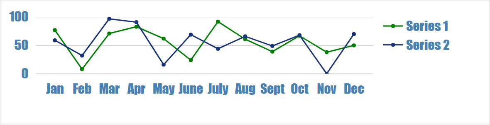

## 1 Introduction
The individual Charts widgets can be fine tuned with advanced settings. The theme allows developers to create **global settings that applies to all charts**. This way color, language, font and many more things could be set.

**This how-to will teach you how to do the following:**
* Change font style for all charts
* Add a theme configuration

## 2 Prerequisites
Before starting this how-to, make sure you have completed the following prerequisites:

* Latest Mendix modeler
* Download latest [Chart Widget](https://appstore.home.mendix.com/link/app/105695/) from the Mendix App Store
* Setup a chart, see [How to create a charts](chart-basic-create)

## 3 Create a chart theme
Before:


### 3.1 Create advanced custom configuration
To figure out the required custom configuration, follow these steps:

1. Open the project with the chart
1. Open the page with chart
1. Open the chart widget settings
1. Go to the tab `Advanced`
1. Set the `Mode` to `Developer`

1. Run the project
1. Open in the browser the page with the chart
1. Click on the button `Toggle Editor`
1. In the `Layout` section add the `Custom setting` 
```json
{
  "font": {
    "family": "Open Sans",
    "size": 14,
    "color": "#555"
  }
}
```
10. Change the font settings, till the chart shows required font  
*Please note that the editor changes will never persist. and need to stored in the advanced settings of the widget or stored in the theme.*
1. Change `Mode` to `Advanced` set modeler, to remove the `Toggle Editor` button.  
*Please note that the theme settings only apply too chart in mode Advanced and Developer*


### 3.1 Add theme configuration
To add a theme file, follow these steps:

1. From the desktop modeler, go to the menu `Project` > `Show Project Directory in Explorer`
1. Open the folder `theme`
1. Create a new file `com.mendix.charts.json` (Please not that the file name is case sensitive and the file extension is `json`)
1. Open the file in a plain text editor
1. Add json empty object 
``` json
{

}
```

### 3.3 Change the font globally
To change the font, follow these steps:

1. Edit the `[project folder]/theme/com.mendix.charts.json` file
1. Replace or update the content. In the section "layout" place the style changes that are created in the first section of this how to.
``` json
{
  "layout": {
    "font": {
      "family": "Impact",
      "size": 20,
      "color": "#4682B4"
    }
  }
}
```
3. Restart the Mendix modeler
1. Validate the expected results



## 4 Reference
* More information in the [Charts reference guide](../../refguide/charts-widgets.md###-4-chart-theming)
* [Layout samples](../../refguide/charts-advanced-cheat-sheet##-Layout-all-charts)
* [Configuration samples](../../refguide/charts-advanced-cheat-sheet###-configurations-options-all-charts) 


## 5 Related Content
