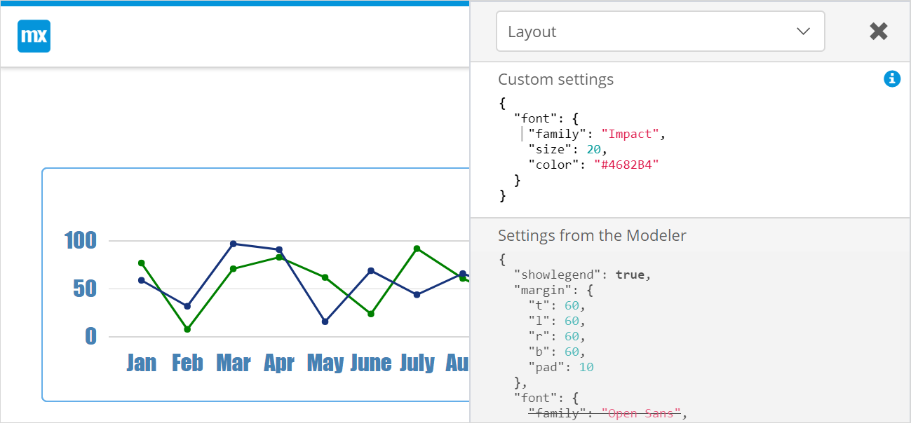

## 1 Introduction

The look of individual **Charts** widgets can be fine tuned with advanced settings. A theme allows developers to create global settings that apply to all charts. In this way color, language, font and many more things can be set for all the charts in an app.

**This how-to will teach you how to do the following:**

* Change the font style for all charts
* Add a theme configuration

## 2 Prerequisites

Before starting this how-to, make sure you have completed the following prerequisites:

* Download the latest Mendix desktop modeler
* Download the latest [Chart Widget](https://appstore.home.mendix.com/link/app/105695/) from the Mendix App Store
* Setup a chart: see [How to create a charts](charts-basic-create)

## 3 Creating a Chart Theme

This is how the original chart looks:


### 3.1 Creating an Advanced Custom Configuration

To create the required custom configuration easily, follow these steps:

1. Open the project with the chart(s).

1. Open a page with a chart.

1. Open the chart widget settings.

1. Go to the tab **Advanced**.

1. Set the **Mode** to **Developer**.

   

1. Run the project.

1. Open the page with the chart in the browser.

1. Click the **Toggle Editor** button.

1. In the **Layout** section add the **Custom settings**.

    ```json
    {
      "font": {
        "family": "Open Sans",
        "size": 14,
        "color": "#555"
      }
    }
    ```

1. Change the font settings, till the chart shows the required font.

    

    {}Please note that the editor changes will not persist. They need to be stored in the advanced settings of the widget or stored in the theme.{}

12. In the desktop modeler, set **Mode** in the chart widget to **Advanced**, to remove the Toggle Editor button.

    {}Please note that the theme settings only apply to charts in Advanced or Developer mode.{}

### 3.2 Adding a Theme Configuration

To add a theme file which will apply to all charts in the app, follow these steps:

1. From the desktop modeler, go to the menu **Project > Show Project Directory in Explorer**.

1. Open the **theme** folder.

1. Create a new file: *com.mendix.charts.json*

    {}Please note that
    * the file name is case sensitive
    * the file extension is `json`
    * the file must contain a *json* object, even if this is empty – the format of this is:
      ```json
      {
    
      }
      ```
    {}

### 3.3 Changing the Font Globally

To change the font in all charts in the app, follow these steps:

1. Edit the *[project folder]/theme/com.mendix.charts.json* file in a plain text editor.

1. Replace or update the content. In the **layout** section, place the style changes that were created in the first section of this how to.

    ```json
    {
      "layout": {
        "font": {
          "family": "Impact",
          "size": 20,
          "color": "#4682B4"
        }
      }
    }
    ```

1. Restart the Mendix app.

1. Validate the expected result.

    

## 4 Related Content

* [Charts reference guide](/refguide/chart-widgets)
* [Layout samples](/refguide/charts-advanced-cheat-sheet#layout-all)
* [Configuration samples](/refguide/charts-advanced-cheat-sheet#config-options)
