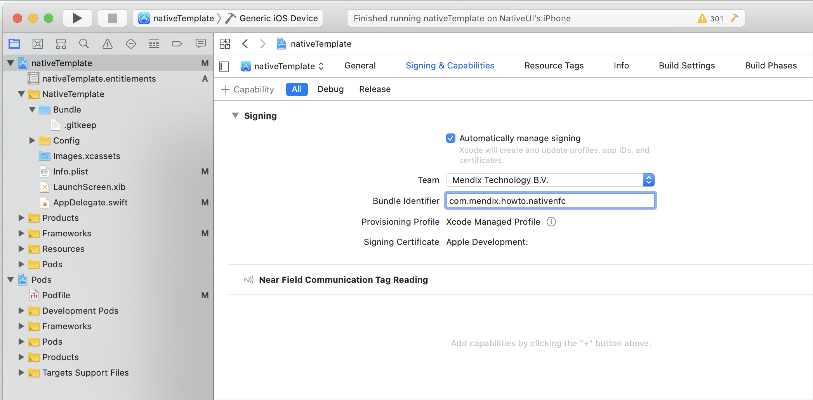
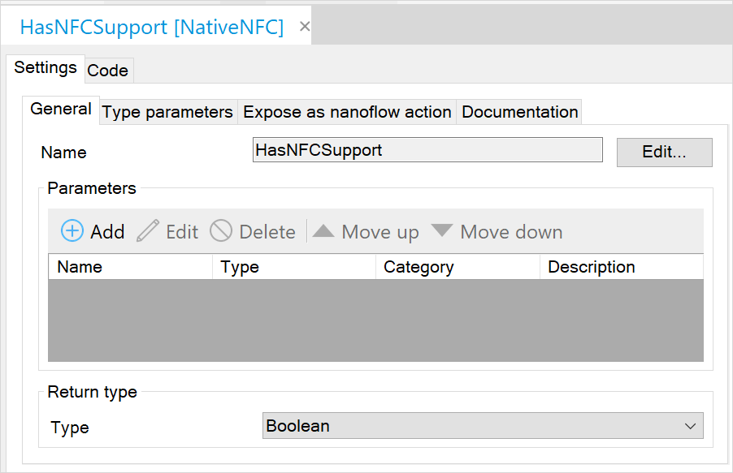
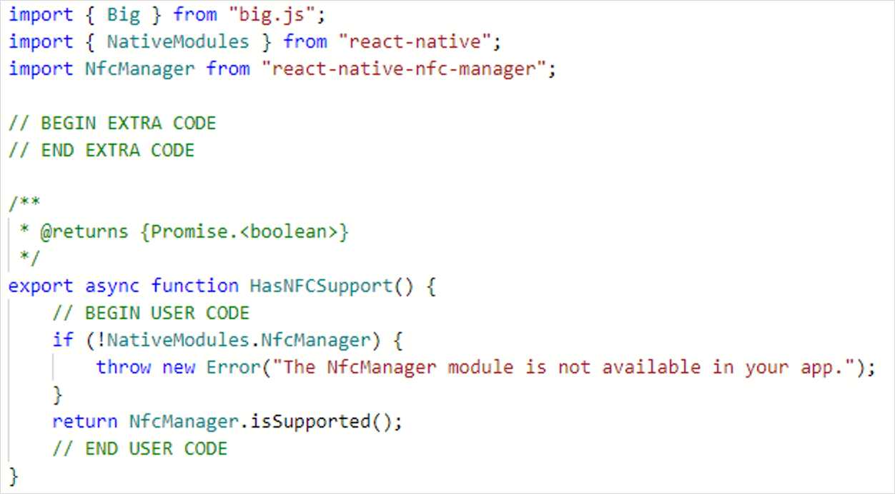

## 1 Introduction

The true strengths of a native application are faster performance and the ability to use device hardware features. With a Near Field Communication JavaScript actions, your Mendix application even more powerful when they can read NFC tags. This tutorial can also be used as an example, when you would like to use other third-party modules.

**This how-to will teach you how to do the following:**

* Build a JavaScript action for a native app.
* Add a dependency to the native JavaScript action.
* Implement a NFC scanner in a JavaScript action.

## 2 Prerequisites

Before starting this how-to, make sure you have completed the following prerequisites:

* Install Mendix 8.4.1 (Build 63369) see [App Store](https://appstore.home.mendix.com/link/modelers/)
* Install the [Git](https://git-scm.com/downloads) command line tool
* Install npm's [node js](https://nodejs.org) [todo: correct?]
* Have a fiscal [NFC NDEF](https://www.dummies.com/consumer-electronics/nfc-data-exchange-format-ndef/) tag for testing
* Have a device with NFC capabilities

## 3 Building NFC JavaScript Actions

To create NFC JavaScript actions, you will do this in the sections below:

1. Create a Mendix project.
2. Build a native app.
3. Add a native dependency.
4. Make two NFC JavaScript actions.
5. Implement the NFC Scanner in your app.

{}

For the commands we assume your software is installed in the following places:

* Git working folder is *C:\github\*
* Native Builder is installed in *C:\native-builder\*
* Studio Pro is installed in *C:\Program Files\Mendix\8.4.1.63369\*
* Mendix project is stored in *C:\MendixProjects\*

{}

### 3.1 Creating a Mendix Project

Follow the instructions below to set up your NFC project:

1. Open Mendix Studio Pro.
2. Select **File** > **New Project**.
3.  Select the **Native Mobile Quickstart** app (also available online [here](https://appstore.home.mendix.com/link/app/109511/)):

	

4.  Click **Use this starting point**:

	

5.  Name your app NativeNFC and click **Create App** to close the dialog box:

	

8. Rename the module **NativeMobile** to *NativeNFC*. In this module add our implementation [todo: what?].
7. Create a empty JavaScript action named *HasNFCSupport*. Right-click on the module and select **Add other** > **JavaScript action**. Name the new JavaScript action *HasNFCSupport*. You will create the implementation later in this tutorial.
8. Open the **Home_Native** page and add some welcome text for you test app.
9. Add an action button with caption *Scan NFC Tag* on your home page. <br />
	a. On the page you can right click to **Add widget**.<br />
	b. Select **Call nanoflow button**.<br />
	c. Click **new**.<br />
	d. Set the Name to *ACT_ReadNFCTag*.<br />
	e. Change the caption on the button to *Read NFC Tag*.<br />
	f. Save the page.<br />
	g. Open the nanoflow **ACT_ReadNFCTag**.<br />
	h. Drag and drop the JavaScript action into the nanoflow.<br />
	i. Save the nanoflow.
10. Click **Run** to deploy to the sandbox. 
11. After deployment is finished click **View** to see your app running in a browser:

	

	Your Mendix project should looks something like this:

	

### 3.2 Building a Native App [TODO: is this names shell app?]

todo: how much of this can I replace with "Go to Deploy doc and follow sections 1-6?"

Now you will build a native app and install it on your phone. If you do not have your GitHub and App Center keys, follow [How to Deploy Your First Mendix Native App](/howto/mobile/deploying-native-app) explaining how get your authentication codes. When you like to know more about the native builder commands and parameter you could check out the [Native builder reference guide](/refguide/native-builder) for further help.

1. Open a command line tool. [TODO discuss use of suggested command line tool, cmd.exe or power shell]
2. Prepare all build settings and execute the command with your substitute parameters with correct paths and URLs:

	``` shell
	$ native-builder.exe prepare --java-home "C:\Program Files\AdoptOpenJDK\jdk-11.0.3.7-hotspot" --mxbuild-path "C:\Program Files\Mendix\8.4.1.63369\modeler\mxbuild.exe" --project-path "Y:\MendixProjects\NativeNFC\NativeNFC.mpr" --github-access-token "a1f422..." --appcenter-api-token "a1b95a..." --project-name "Native NFC App" --app-name "Native NFC App" --app-identifier "com.mendix.howto.nativenfc" --runtime-url "https://nativenfc-sandbox.mxapps.io/"
	```

	As a result of the prepare command your app is created in [App Center](https://appcenter.ms/apps):

	

	A new repository is created in your GitHub account:

	

	The settings are stored in *C:\Users\mendix.tech.writer\.native_builder* and looks like this:

	```json
	{
	"Native NFC App": {
		"gitHubAccessToken": "a1f422...",
		"appCenterApiToken": "a1b95a...",
		"projectName": "Native NFC App",
		"appName": "Native NFC App",
		"appIdentifier": "com.mendix.howto.nativenfc",
		"javaHome": "C:\\Program Files\\AdoptOpenJDK\\jdk-11.0.3.7-hotspot",
		"projectPath": "C:\\MendixProjects\\NativeNFC\\NativeNFC.mpr",
		"mxbuildPath": "C:\\Program Files\\Mendix\\8.4.1.63369\\modeler\\mxbuild.exe",
		"runtimeUrl": "https://nativenfc-sandbox.mxapps.io/"
	}
}
	```

3. To build the app for the first time we can run this `build` command 
`$ native-builder.exe build --project-name "Native NFC App" --app-version "1.0.0" --build-number 1`. 
	The project names should match the project names from your `prepare` command. This build will make a `build/1` branch in your GitHub repository. Its output is now available in the *C:\native-builder\builds\* folder, where you will find *Native-NFC-App-Android-1.zip* for an Android app and *Native-NFC-App-iOS-1.zip* for an iOS app.

{}

1. The free version of the App Center will cancel/timeout the build if it exceeds 30 minutes.
2. By default, it builds both an iOS and Android app. If you like to build for one platform specific; you can add the parameter `--platform android` or `--platform ios` to the build command.

{}

4. Validate that your local build succeeded by checking the log files in *C:\MendixProjects\NativeNFC\deployment\log\*.
5. Install the app on your device. If you require some help at this step, please check the how to [Deploying native app, distribution section](/howto/mobile/deploying-native-app#6-distributing).
[TODO You might get some message blocked by Play Protect, where you have to select `INSTALL ANYWAY` this should be added to https://docs.mendix.com/howto/mobile/deploying-native-app#6-1-2-installing-on-a-device]


6. Open your app and you should see the homepage of the native app. 

The result in the running app could look like this:

	

When clicking on the button you will receive an error **JavaScript action was not implemented**. You will implement your action later.

{}

The Native Builder will locally run Mxbuild. The output is a *bundles.js* file which will be pack with your application. So any update on your Mendix model requires a new build. You are not building a development app that updates automatically.

{}

### 3.3 Installing a Dependency in the App

With the help of an external library, [react-native-nfc-manager](https://www.npmjs.com/package/react-native-nfc-manager), adding NFC capacities is made easier. At the current moment, the Mendix native client is based on *React Native version 0.59*, which will have an impact on the selected version of the library. All changes we will make to the `master` branch, for each build a new branch is creates `build/{number}` from `master` with the latest change.
The dependency is split into two parts: the native OS part, and the client JavaScript part. In this section we will add the dependency for the app.

1. Let's open the folder where our GitHub project could be stored. Open a command line tool and change directory: `$ cd C:/github/`
2. Use your repository URL to clone the files on your machine with the command `$ git clone https://github.com/user-name/native-nfc-app`
3. Open the folder where the code is cloned into: `$ cd native-nfc-app`
4. To install all its current dependencies use the command `$ npm install`
5. Now we will install the required library as a dependency. `$ npm install --save react-native-nfc-manager@1.2.2`. Please note the version after the @ sign. Version 2 and higher are not supported on Mendix 8.3.
6. To integrate the module into the template, some code changes need to be done, with the help op the `link` we can do most of it automatically. Install react native CLI via the command `npm install -g react-native-cli@2.0.1`
7. Now link the new module with the command `$ react-native link react-native-nfc-manager`. Sometimes linking will fail. To validate success you could go the [manual linking](# 3.3.1 Linking manual) steps. (Some times the `import` described in step 3 and 4 is not done automatically).
8. For Android we have set the *uses permission* in the `android/app/src/main/AndroidManifest.xml` file. Add the following section before the line with <application`
``` xml
<uses-permission android:name="android.permission.NFC" />
<uses-feature android:name="android.hardware.nfc" android:required="false" />
```
10. For iOS we have to add NFC capabilities for signing signing process. Open in xCode the project 
	1. In the `Signing & Capabilities`, click the **+ Capability** and select `Near Field Communication Tag Reading`
 
	2. We have to add a *usage description* to get permission to use the NFC reader. Add in the `ios/nativeTemplate/Info.plist`, Right click **Add Row** and set they key with `NFCReaderUsageDescription` with a helpful description, for example `We like to help you read NFC tags, please accept`
10. Now we have to stage the changes before we can commit them, us the command `$ git add .` You can check the stage files with the command. `$ git status`.
11. Let's commit the files with the command `$ git commit -m "Add NFC Manager dependency"`.
12. Now the files are committed but they are only stored locally on your machine. Let us push them to your repository with the command `$ git push`. This will make the changes available for the Native Builder to create a new app with NFC support.

#### 3.3.1 Manual linking
In the section below we user `react-native link` this command is used for React Native version <0.60. And will be replace in >=0.60 with auto linking. Auto linking does not require any linking or code changes. However, both processes are not without flaws and not every module does support it.

{}

For demonstration purposes we will document how to link manual. It is replacing step 6 and 7 and could be used for validating if the `react-native link` command succeeded.

{}

For Android:
1. To expose the library to the template we have to link it via gradle. Open the file `C:\github\native-nfc-app\android\settings.gradle` and add the include and project at the end on the file before the `include` `**':app'**``,` `**':mendixnative-release'**`.
``` gradle
include ':react-native-nfc-manager'
project(':react-native-nfc-manager').projectDir = new File(rootProject.projectDir, '../node_modules/react-native-nfc-manager/android')
```
2. To use the new gradle module in the `C:\github\native-nfc-app\android\app\build.gradle` file, in the list of dependencies add:
``` gradle
implementation project(":react-native-nfc-manager")
```
3. Now the main application need to initialize NFC manager, in the `C:\github\native-nfc-app\android\app\src\main\java\com\mendix\nativetemplate\MainApplication.java` file add an item to the `Arrays.<ReactPackage>asList`, add a comma after the other dependency and add the `new NfcManagerPackage()`
``` java
new NfcManagerPackage()
```
4. When you add this in Android studio the import is automatically added. If you use a plain text editor, add an extra to add into the import section the line `import community.revteltech.nfc.NfcManagerPackage;`.

For iOS:
1. Open the file `C:\github\native-nfc-app\ios\Podfile`
2. Add before `end` a new line with `pod 'react-native-nfc-manager', :path => '../node_modules/react-native-nfc-manager'`

More information about linking:
* [React Linking](https://facebook.github.io/react-native/docs/linking)
* [What is react native link](https://stackoverflow.com/questions/49874385/what-is-react-native-link)
* [Demystifying React native modules linking](https://engineering.brigad.co/demystifying-react-native-modules-linking-964399ec731b)
* [Auto linking](https://github.com/react-native-community/cli/blob/master/docs/autolinking.md)

### 3.4 Install dependency in Project

The dependency is split into two parts: the native device part, and the client JavaScript part. In this section we will add the dependency JavaScript for the client bundle. For the bundling we need add the dependency builder can add the `react-native-nfc-manager` JavaScript code.

1. Open in the command line tool the folder of the module containing your javascript action. `$ cd C:\MendixProjects\NativeNFC\javascriptsource\nativenfc\actions`
2. In this folder you will find the file *HasNFCSupport.js* that contains the code of the javascript action.
4. Install the dependency with the command `$ npm install react-native-nfc-manager@1.2.2`.

{}

This will create a **node_module** folder inside your **actions** folder. It is a known issue, when you try to commit the node_modules folder via SVN could give some trouble when it contains an excessive number of files. If necessary, you could remove superfluous files.

{}

### 3.5 Create NFC JavaScript actions

JavaScript actions for the web and native platform are similar. With the difference that they have their own set of dependencies they can build on.

1. Let's first built an action to check if the device has support for NFC.
	1. Open a JavaScript action `HasNFCSupport` action, created in step chapter 3.1.
	2. Change the **Return type** to `Boolean`.
	3. Add the import above the EXTRA CODE block.
	``` javascript
	import NfcManager from "react-native-nfc-manager";
	```
	4. Add the following code to the USER CODE block.
	``` javascript
	return NfcManager.isSupported();
	```
	The NfcManager is imported from our newly added module. The `isSupported` functions checks if NFC is supported by the hardware. It returns a *Promise* that will resolved to a boolean value to indicate whether NFC is supported.

	5. Optional **Expose as nanoflow action** and a nice icon if you like.



2. Now we can make an action to read the NFC tag information.
	1. Create an action named `ReadNFCTag`
	2. Select the **Return type** `String`.
	3. Add the import above the EXTRA CODE block.
	``` javascript
	import NfcManager, { Ndef } from "react-native-nfc-manager";
	```
	4. Add the following code to the USER CODE block.
	``` javascript
	return new Promise(resolve => {
		NfcManager.registerTagEvent(tag => {
			NfcManager.unregisterTagEvent();
			const text = Ndef.text.decodePayload(tag.ndefMessage[0].payload);
			resolve(text);
		});
	});
	```
	We return a promise, that will resolve a string value. In this way the nanoflow will wait till we call the resolve function. With the registration we start listening for tag that are picked up by the reader. The callback function is executed when a tag is found, we un-register to stop listening for other tags. The payload is decoded from a byte array into text. When the resolve function is called with the text parameter that nanoflow will receive this value as the return parameter.
	
	5. Optional, **Expose as nanoflow action** add a nice icon if you would like.


### 3.6 Use NFC JavaScript actions

Let us make a Nanoflow to use the actions that we just created.


1. Open the Nanoflow `ATC_ScanTag` which was create in test project (#3.1)
3. Add the **Has NFC Support** action. [TODO is this named action or activity?]
4. On the action, right click and select `Set error handling...` and set the type to `Custom without rollback`.
5. Create a `Show message` action and set the template: `Error occur while checking NFC support: {1}` Use `$lastError` as the parameter.
6. Connect the **Has NFC Support** activity with the `Show message`, and right click on it, selecting `Set as error handler`.
7. Add a **Decision** action. In the Expression check for the return variable **$HasNFCSupport** of the HasNFCSupport action.
8. If not supported show a message of type warning with the text. Create a `Show message` action with template `Sorry, your device does not support NFC`.
9. If supported add the **Read NFC Tag** action and store the response in the variable `TagValue`.
10. On the **Read NFC Tag** action, right click and select `Set error handling...` and set the type to `Custom without rollback`.
11. Create a `Show message` action and set the template: `Error occur while reading a NFC tag: {1}` use `$lastError` as parameter.
12. Connect the **Read NFC Tag** activity with the `Show message`, and right click on it, selecting `Set as error handler`.
13. Use the read value in the information message. `Your NFC tags says: {1}` and use `TagValue` as parameter.
14. Optional you can `Show progress` during scanning the NFC tag. This action can be found in the `Nanoflow Commons` module.
15. Deploy the app to the sandbox.

### 3.7 Write NFC tag

Now we have a way of reading NFC NDEF tags. Let us first write some text to our tag. Of course, we can create JavaScript action for this or take the easy way, using an other tool. We recommend [NFC Tools Android](https://play.google.com/store/apps/details?id=com.wakdev.wdnfc) or [NFC Tools iOS](https://apps.apple.com/us/app/nfc-tools/id1252962749).
1. Instal the *NFC Tools* app on your device.
2. Open the *NFC Tools* app.
3. Scan your tag.
4. In the section *Technology available* it should state it supports `Ndef`. And in the section *Writeable* should say `Yes`.
5. Click **WRITE**,  **Add a record** and select **Text**.
6. Enter your text `Hello Mendix Developer!`, and press **Ok**.
7. Click **Write / 30 Bytes**
8. Scan you tag. Will receive a `Write complete` dialog.


### 3.8 Rebuilding Your Native App

Now we added the new NFC capability to the app's source code we have to rebuild the native app and reinstall it on your device before we can use the new JavaScript actions.

{}

Making software is a iterative process that never goes "first time right". If you integrate your own module or build your own actions, it is highly recommended to setup a system that can iterate faster. Deploying to the sandbox and building the app is a relatively slow process, perfect for release but harder to debug. So please also have a look at how to setup a development environment with your local modeler described in the [Native builder reference guide](/refguide/native-builder#5-advanced-usage). This will require an Apple Mac with [XCode](https://developer.apple.com/xcode/) for iOS and [Android Studio](https://developer.android.com/studio) for Android devices.

{}

1. Open a command line.
2. Run the following command to rebuild, with incremented build number 2: `$ native-builder.exe build --project-name "Native NFC App" --app-version "1.0.0" --build-number 2` This builder will use the configuration set in the section *3.3 Install dependency in the app*.
3. After the build has successfully finished the build file will be available in the `C:\native-builder\builds` folder.
4. Uninstall previous version of the app on your device.
5. Install the app on your device. If you require some help at this step, please check the how to [Deploying native app, distribution section](/howto/mobile/deploying-native-app#6-distributing).
7. Open the app, click your button `Scan tag` and scan your NFC tag. You should see an information dialog with the text contained by the tag.


8. Congratulations for completing this guide, but there is more... 

### 3.9 Hardening the Code

Now we have a working NFC scanner, however we have to make it work in various situations, and both on Android and iOS. We have to taking account that the NFC can be switched of in the Android OS and scanning should be canceled on the back button is clicked. On iOS the scanning can be canceled in the `Ready to Scan` dialog. Please update the *ReadNFCTag* JavaScript action with the following code, and repeat the step of 3.6 to build and install on your device.
``` js
// This file was generated by Mendix Studio Pro.
//
// WARNING: Only the following code will be retained when actions are regenerated:
// - the import list
// - the code between BEGIN USER CODE and END USER CODE
// - the code between BEGIN EXTRA CODE and END EXTRA CODE
// Other code you write will be lost the next time you deploy the project.
import { Big } from "big.js";
import { Platform, BackHandler } from "react-native";
import NfcManager, { Ndef } from "react-native-nfc-manager";

// BEGIN EXTRA CODE
// END EXTRA CODE

/**
 * @returns {Promise.<string>}
 */
export async function ReadNFCTag() {
	// BEGIN USER CODE
	if (Platform.OS === "android") {
		const enabled = await NfcManager.isEnabled();
		if (!enabled) {
			throw(new Error("NFC is not enabled"));
		}
	}

	return new Promise(async(resolve, reject) => {
		let success = false;
		await NfcManager.start({
			onSessionClosedIOS: () => {
				if (!success) {
					reject(new Error("NFC session closed"));
				}
			}
		});
		if (Platform.OS === "android") {
			BackHandler.addEventListener("hardwareBackPress", async () => {
				await NfcManager.unregisterTagEvent();
				await NfcManager.stop();
				return reject(new Error("NFC was canceled by the user"));
			});
			NfcManager.onStateChanged(
				async event => {
					if (event.state === "off" || event.state === "turning_off") {
						await NfcManager.unregisterTagEvent();
						await NfcManager.stop();
						return reject(new Error("NFC was disabled by the user"));
					}
				}
			)
		}
		NfcManager.registerTagEvent(async tag => {
			success = true;
			await NfcManager.unregisterTagEvent();
			await NfcManager.stop();
			const text = Ndef.text.decodePayload(tag.ndefMessage[0].payload);
			resolve(text);
		}, "Read NFC");
	});
	// END USER CODE
}
```

At the begin of the action, we will check for the Android platform if the NFC tag reader is switched off, and will throw an error if so. We create a Promise with a `resolve` and `reject` parameter. Please note the `async` keyword before the function. This allows us to use `await` with asynchronous function and let them execute in a synchronous fashion, respecting their order in the code. The `start` will initialize the module, and register a callback for iOS, which will be called when the *NFC NDEF reader session* becomes invalid, either by the OS or by the user pressing cancel button.  

For Android we add a lister for the *hardware back button*, when pressed we will stop listening for tags, and cancel the execution by calling the `reject` function. This way the nanoflow will receive an error that is caught by the error handler. 

During the period that we are listing for a tag, the user can switch off the NFC function in Android, this will cause a *state change* that we will catch and we will rejection to promise.  

The second parameter of the `registerTagEvent` function it the instruction text show in the iOS `Ready to Scan` dialog. After the tag is found by the reader have to `stop` the NFC manager, this way we stop listing for state changes on Android and for the session closing in iOS.

That will conclude this tutorial, from here you could take you own creativity to extend the NFC functionality or implement other modules.

If you have questions or suggestion for improvement, please share your feedback with use. Or help us via the edit button on top of this page to suggest improvement via GitHub. Thank you.

## 4 Read More

* [Getting started with native mobile](/howto/mobile/getting-started-with-native-mobile)
* [Native Builder tutorial](/howto/mobile/native-builder)
* [Reference guide JavaScript actions](/refguide/javascript-actions)
* [How-to build JavaScript actions](/howto/extensibility/build-javascript-actions)
* [Read and write NFC Tags NFC Tools](https://play.google.com/store/apps/details?id=com.wakdev.wdnfc)
* [NFC React Native library](https://github.com/whitedogg13/react-native-nfc-manager)
