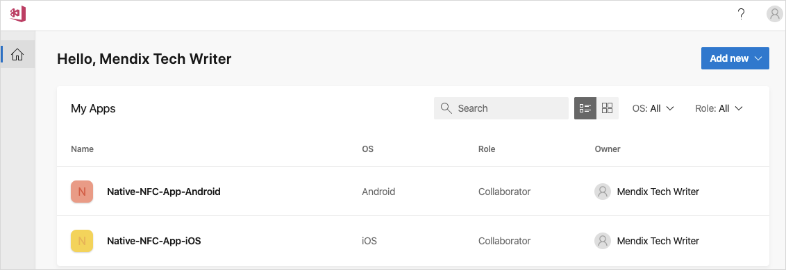

# Create JavaScript actions for native mobile

## 1 Introduction

The true power of a native app is the performance and the ability to use hardware features of the devices. With a Near Field Communication JavaScript actions your Mendix application even more powerful when they can read NFC tags.

**This how-to will teach you how to do the following:**

- Build a Java Script action for a native application.
- Add a dependency to the native JavaScript action.
- Implement a NFC scanner in a JavaScript action.

## 2 Prerequisites

Before starting this how-to, make sure you have completed the following prerequisites:

- Mendix 8.3 installed [App Store](https://appstore.home.mendix.com/link/modelers/)
- Installed Native builder see [See Native Builder tutorial](https://docs.mendix.com/howto/mobile/native-builder)
- Installed Git command line tool https://git-scm.com/downloads
- Installed node.js for npm https://nodejs.org
- Have fiscal NFC tag for testing

## 3 Building NFC JavaScript actions

To create the NFC JavaScript actions, follow these steps:

1. Create a Mendix project
2. Build a native app
3. Add a native dependency
4. Make two NFC JavaScript actions
5. Implement the NFC Scanner in your app.

{}

In this tutorial we will work with an Android device. At a later stage we might update this how-to with the iOS instructions. [TODO validate on iOS]
For the commands we assumes your Git working folder is `c:\github\`, the native builder is available in `C:\native-builder\` and the modeler is installed in `C:\Program Files\Mendix\8.3.0.61600\` and Mendix project are stored folder `C:\MendixProjects\`. Please substitute them when you are using difference paths on your machine.

{}

### 3.1 Create a Mendix Project

Follow the instructions below to set up your NFC project:

1. Open Mendix Studio Pro.
2. Select **File** > **New Project**.
3. Select the **Native Mobile Quickstart** app (also available online [here](https://appstore.home.mendix.com/link/app/109511/)):


4. Click **Use this starting point**:


5. Name your app NativeNFC and click **Create App** to close the dialog box:


6. Open the `Home_Native` page and add a welcome text for you test app.
7. Click the **Run** button to deploy to the sandbox, after deployment is finished click on the **View** button to check on web if it is running.


### 3.2 Create a native app

Next we have the build a native app and install it on your phone.
If you do not have your GitHub and App Center keys, please follow the tutorial for [Native Builder](https://docs.mendix.com/howto/mobile/native-builder) explaining how get your authentication codes. When you like to know more about the the native builder commands and parameter you could check out the Native builder docs(link) for further help.

1. Open a command line tool
2. Prepare all build settings. Execute the command with your substitutes parameter.
``` shell
$ native-builder.exe prepare --java-home "C:\Program Files\AdoptOpenJDK\jdk-11.0.3.7-hotspot" --mxbuild-path "C:\Program Files\Mendix\8.3.0.61600\modeler\mxbuild.exe" --project-path "Y:\MendixProjects\NativeNFC\NativeNFC.mpr" --github-access-token "a1f422..." --appcenter-api-token "a1b95a..." --project-name "Native NFC App" --app-name "Native NFC App" --app-identifier "com.mendix.howto.nativenfc" --runtime-url "https://nativenfc-sandbox.mxapps.io/"
```

As a result of the prepare command your app is created in [App Center](https://appcenter.ms/apps):


A new repository is created in your GitHub account:


For you information your settings are stored in a file `C:\Users\mendix.tech.writer\.native_builder` and looks like:
``` json
{
	"Native NFC App": {
	"gitHubAccessToken": "a1f422...",
	"appCenterApiToken": "a1b95a...",
	"projectName": "Native NFC App",
	"appName": "Native NFC App",
	"appIdentifier": "com.mendix.howto.nativenfc",
	"javaHome": "C:\\Program Files\\AdoptOpenJDK\\jdk-11.0.3.7-hotspot",
	"projectPath": "C:\\MendixProjects\\NativeNFC\\NativeNFC.mpr",
	"mxbuildPath": "C:\\Program Files\\Mendix\\8.3.0.61600\\modeler\\mxbuild.exe",
	"runtimeUrl": "https://nativenfc-sandbox.mxapps.io/"
	}
}
```
3. To build the app for the first time we can run the following command: `$ native-builder.exe build --project-name "Native NFC App" --app-version "1.0.0" --build-number 1` The project names should match the project names from the prepare command of step 1. The build might take a while and progress is given via the console. As a result a `build/1` branches is created in the GitHub repository. And the output is a mpk file which is now available in the `C:\native-builder\builds\Native-NFC-App-Android-1.zip`.
{}

The free version of the App Center, is will cancel/timeout the build if it exceeds 30 minutes.

{}
4. Install the app on your device. Unzip the build artefact, in the unzipped file your will find the `build\app-debug.apk`. Transfer the apk onto your device and install it. You might get some message Blocked by Play Protect, where you have to select `INSTALL ANYWAY`
5. Open your app and you should see the homepage of the native app. Well done!

{}

The native builder will locally run mxbuild. When failing, the output of the native bundler van be found `C:\MendixProjects\NativeNFC\deployment\log\native_packager_bundle_android_log.txt`

{}

### 3.3 Install dependency in the app

With the help of an external library, [react-native-nfc-manager](https://www.npmjs.com/package/react-native-nfc-manager), adding NFC capacities is made easier. At the current moment, the Mendix native client is based on *React Native version 0.59*, which will have an impact on the selected version of the library. All changes we will make to the `master` branch, for each build a new branch is creates `build/{number}` from `master` with the latest change.
The dependency is split into two parts: the native OS part, and the client JavaScript part. In this section we will add the dependency for the app.

1. Let's open the folder where our GitHub project could be stored. Open a command line tool and change directory: `$ cd c:/github/`
2. Use your repository URL to clone the files on your machine with the command `$ git clone https://github.com/user-name/native-nfc-app`
3. Open the folder where the code is cloned into: `$ cd native-nfc-app`
4. To install all its current dependencies use the command `$ npm install`
5. Now we will install the required library as a dependency. `$ npm install --save react-native-nfc-manager@1.2.2`. Please note the version after the @ sign. Version 2 and higher are not supported on Mendix 8.3.
6. To integrate the module in tho the template, some code change changes needs to be done, with the help op the `link` we can do most of it automatically. Install react native CLI via the command `npm install -g react-native-cli@2.0.1`
7. Now link the new module with the command `$ react-native link react-native-nfc-manager`. Some modules needs to manual linking, see note below. linkNow we will install the required library as a dependency.
8. When you add this in in Android studio the import is automatically added. If you use a plain text editor, add an extra import `import community.revteltech.nfc.NfcManagerPackage;` in the import section.
9. Now we have to stage the changes before we can commit them, us the command `$ git add .` You can check the stage files with the command. `$ git status`.
10. Let's commit the files with the command `$ git commit -m "Add NFC Manager dependency"` .
11. Now the files are committed but they are only stored locally on your machine. Let us push them to your repository with the command `$ git push`. This will make the changes available for the Native Builder to create a new app with NFC support.

#### 3.3.1 Linking
In the section below we user `react-native link` this command is used vor React Native version <0.60. And is will be replace in >=0.60 with auto linking. Auto linking does not require any linking or code changes. However both process are not without flaws and not every module does support it. For demonstration purposes we will document how to linking manual. (replacing step 6 and 7)

For Android:
1. To expose the the library to the template we have to link it via gradle. Open the file `C:\github\native-nfc-app\android\settings.gradle` and add the include and project at the end on the file before the the `include` `**':app'**``,` `**':mendixnative-release'**`.
``` gradle
include ':react-native-nfc-manager'
project(':react-native-nfc-manager').projectDir = new File(rootProject.projectDir, '../node_modules/react-native-nfc-manager/android')
```
2. To use the new gradle module in the `C:\github\native-nfc-app\android\app\build.gradle` file, in the list of dependencies add:
``` gradle
implementation project(":react-native-nfc-manager")
```
3. Now the main application need to initialize NFC manager, in the `C:\github\native-nfc-app\android\app\src\main\java\com\mendix\nativetemplate\MainApplication.java` file add an item to the `Arrays.<ReactPackage>asList`, add a comma after the other dependency and add the `new NfcManagerPackage()`
``` java
new NfcManagerPackage()
```

For iOS:
1. Open the file `C:\github\native-nfc-app\ios\Podfile`
2. Add before `end` a new line with `pod 'react-native-nfc-manager', :path => '../node_modules/react-native-nfc-manager'`

More information about linking:
* [React Linking](https://facebook.github.io/react-native/docs/linking)
* [What is react native link](https://stackoverflow.com/questions/49874385/what-is-react-native-link)
* [Demystifying React native modules linking](https://engineering.brigad.co/demystifying-react-native-modules-linking-964399ec731b)
* [Auto linking](https://github.com/react-native-community/cli/blob/master/docs/autolinking.md)

### 3.4 Install dependency in Project

The dependency is split into two parts: the native device part, and the client JavaScript part. In this section we will add the dependency JavaScript for the client bundle. For the bundling we need add the dependency builder can add the `react-native-nfc-manager` JavaScript code.

1. Open in the command line the folder of the module containing your javascript action. `$ cd C:\MendixProjects\NativeNFC\javascriptsource\nativenfc\actions`.
2. Install the dependency with the command`$ npm install react-native-nfc-manager@1.2.2`. 

{}

This will create a **node_module** folder inside your **actions** folder. It is a know issue, when you try to commit the node_modules folder via SVN could give some trouble when it contains an excessive amount of files. If necessary you could remove superfluous files.

{}

### 3.5 Create NFC JavaScript actions

JavaScript actions for the web and native platform are similar. With the difference that they have their own set of dependencies they can build on.

1. Let's first built an action to check if the device has support for NFC.
	1. Create a JavaScript action named HasNFCSupport.
	2. Select the **Return type** `Boolean`.
	3. Add the import above the EXTRA CODE block.
	``` javascript
	import NfcManager from "react-native-nfc-manager";
	```
	4. Add the the following code to the USER CODE block.
	``` javascript
	return NfcManager.isSupported();
	```
	5. Optional **Expose as nanoflow action** and a nice icon if you like.


2. Now we can make an action to read the NFC tag information.
	1. Create an action named `ReadNFCTag`
	2. Select the **Return type** `String`.
	3. Add the import above the EXTRA CODE block.
	``` javascript
	import NfcManager from "react-native-nfc-manager";
	```
	4. Add the the following code to the USER CODE block.
	``` javascript
	return new Promise(success => {
		NfcManager.registerTagEvent(tag => {
			NfcManager.unregisterTagEvent();
			const text = Ndef.text.decodePayload(tag.ndefMessage[0].payload);
			success(text);
		});
	});
	```
	5. Optional, **Expose as nanoflow action** add a nice icon if you would like. (Show result image and code)


3. Let us make a Nanoflow to use the actions that we just created. [TODO update screenshot with icons]


	1. Create a Nanoflow and name is `ATC_ScanTag`
	2. Add the **Has NFC Support** action.
	3. Set an error handler with error message. `Error occur while checking NFC support: {1}` Use `$lastError` as the parameter.
	4. Add a **Decision** action. In the Expression check for the return variable **$HasNFCSupport** of the HasNFCSupport action.
	5. If not supported show a message of type warning with the text. `Sorry, your device does not support NFC`.
	6. If supported add the **Read NFC Tag** action and store the response in the variable `TagValue`.
	7. Add an error handler. With an error message `Error occur while reading a NFC tag: {1}` use `$lastError` as parameter.
	8. use the read value in the information message. `Your NFC tags says: {1}` and use `TagValue` as parameter.
4. Add a Nanoflow button to home page of your app. You can right click to **Add widget** and select **Call nanoflow button** and select `ATC_ScanTag` nanoflow. Or drag the `ATC_ScanTag` nanoflow onto the page. Set the caption of the button `Scan NFC tag`.
5. Deploy the app to the sandbox.

### 3.5 Rebuild native app

Now we added the new NFC capability to the app's source code we have to rebuild the native app and reinstall it on your device before we can use the new JavaScript actions.

1. Open a command line.
2. Run the following command to rebuild, with incremented build number 2: `$ native-builder.exe build --project-name "Native NFC App" --app-version "1.0.0" --build-number 2` This builder will use the configuration set in the section *3.3 Install dependency in the app*
3. After the build has successfully finished the build file will be available in the folder. Unzip the folder to find the `debug.apk` file.
4. Uninstall previous version of the app on your device.
5. Move the apk file to your device
6. Open the apk file and install.
7. Open the app, click your button `Scan tag` and scan your NFC tag. You should see an information dialog with the text contained by the tag.
8. Congratulations for completing this guide.

If you have questions or suggestion for improvement, please share your feedback with use. Or help us via the edit button on top of this page to suggest improvement via GitHub Thank you.

## 4 Read More

- [Getting started with native mobile](https://docs.mendix.com/howto/mobile/getting-started-with-native-mobile)
- [Native Builder tutorial](https://docs.mendix.com/howto/mobile/native-builder)
- [Reference guide JavaScript actions](https://docs.mendix.com/refguide/javascript-actions)
- [How-to build JavaScript actions](https://docs.mendix.com/howto/extensibility/build-javascript-actions)
- [Read and write NFC Tags NFC Tools](https://play.google.com/store/apps/details?id=com.wakdev.wdnfc)
- [NFC React Native library](https://github.com/whitedogg13/react-native-nfc-manager)
