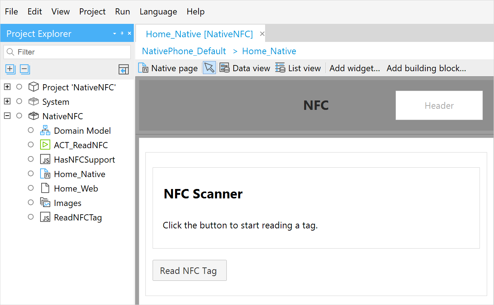
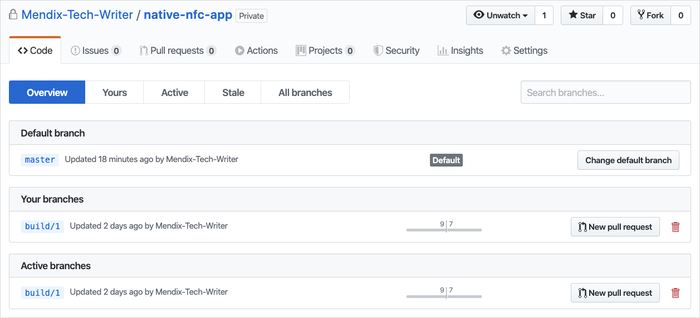
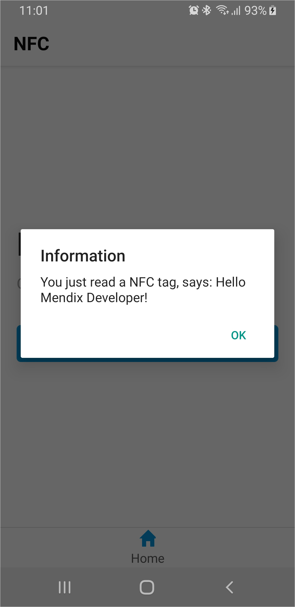

## 1 Introduction

Native applications have faster performance and give you the ability to use device hardware features. This tutorial will teach you to build your own JavaScript actions, specifically ones that harness your native mobile device's hardware to read Near Field Communication (NFC) tags. If you would like to use third-party modules other than an NFC scanner, refer to this tutorial as a general overview.

**This how-to will teach you how to do the following:**

* Build a JavaScript action for a native app
* Add a dependency to the native JavaScript action
* Implement an NFC scanner in a JavaScript action

## 2 Prerequisites

Before starting this how-to, make sure you have completed the following prerequisites:

* Install Mendix 8.6.0 (Build 715) from the [App Store](https://appstore.home.mendix.com/link/modelers/)
* Install the [Git](https://git-scm.com/downloads) command line tool
* Install npm's [node js](https://nodejs.org)
* Install [Native Builder v3.1.0](https://www.dropbox.com/sh/hpw7sshut9bco68/AABackrr75rPSgW7u5LBMkMra?dl=0) (this tutorial can only be completed using Native Builder v3.1.0 or higher)
* Have a fiscal [NFC NDEF](https://www.dummies.com/consumer-electronics/nfc-data-exchange-format-ndef/) tag for testing
* Own a mobile device with NFC capabilities

## 3 Building NFC JavaScript Actions

To build NFC JavaScript actions, you will do the following:

1. Create a Mendix project.
1. Build a native app.
1. Add a native dependency.
1. Make two NFC JavaScript actions.
1. Implement the NFC Scanner in your app.

{}
This tutorial's commands assume your software is installed in the following places:

* GitHub working folder: **C:\github\**
* Native Builder: **C:\native-builder\**
* Studio Pro: **C:\Program Files\Mendix\8.6.0.715\**
* Mendix project: **C:\MendixProjects\**
{}

### 3.1 Creating a Mendix Project {#test-project}

Follow these instructions to set up your NFC project:

1. Open Mendix Studio Pro.
1. Select **File** > **New Project**.
1. Select the **Native Mobile Quickstart** app (also available online [here](https://appstore.home.mendix.com/link/app/109511/)).
1. Click **Use this starting point**.
1. Name your app NativeNFC and click **Create App** to close the dialog box.
1. Rename module **NativeMobile** to *NativeNFC*. You will add your implementation In this module.
1. Right-click on the module and select **Add other** > **JavaScript action**. Name the new JavaScript action *HasNFCSupport*. You will create the implementation later.
1. Open the **Home_Native** page and add some welcome text for you test app.
1. Add an action button with caption *Scan NFC Tag* on your home page. <br />
	a. Right-click your home page and click **Add widget**.<br />
	b. Select **Call nanoflow button**.<br />
	c. Click **new**.<br />
	d. Set the **Name** to *ACT_ReadNFCTag*.<br />
	e. Change the button's caption to *Read NFC Tag*.<br />
	f. Save the page.<br />
	g. Open **ACT_ReadNFCTag**.<br />
	h. Drag and drop the **HasNFCSupport** JavaScript action onto this nanoflow.<br />
	i. Save your nanoflow.
1. Click **Run** to deploy to the sandbox. 

Your Mendix project should looks something like this:



### 3.2 Building a Native Custom Developer App {#custom-developer-app}

When developing a native app, you can use the [Make it Native](/refguide/getting-the-make-it-native-app) app to quickly get started. However, this app is bundled with a limited number of functionalities. This tutorial's app requires an NFC module in order to access the native NFC capabilities. This can only be achieved by using the [Native Builder](/refguide/native-builder). The Native Builder can create a custom developer app which you use to see and test your app. 

In this section, you will create a normal custom developer app to learn the process. In the subsequent section [Installing a Dependency in Your Custom Developer App](#installing-dependency-app) you will create a tailored custom developer app suited for NFC tasks.

Now you will build a native custom developer app and install it on your phone:

1. If you do not have your GitHub and App Center keys, follow the [Getting Your Tokens](/howto/mobile/deploying-native-app#3-getting-your-tokens) section of *How to Deploy Your First Mendix Native App* to get your authentication codes.
1. Complete [Preparing Your Project](/howto/mobile/deploying-native-app#4-preparing-your-project) section of *How to Deploy Your First Mendix Native App* using these parameters:

	``` shell
	native-builder.exe prepare --java-home "C:\Program Files\AdoptOpenJDK\jdk-11.0.3.7-hotspot" --mxbuild-path "C:\Program Files\Mendix\8.6.0.715\modeler\mxbuild.exe" --project-path "Y:\MendixProjects\NativeNFC\NativeNFC.mpr" --github-access-token "a1f422..." --appcenter-api-token "a1b95a..." --project-name "Native NFC App" --app-name "Native NFC App" --app-identifier "com.mendix.howto.nativenfc" --runtime-url "https://nativenfc-sandbox.mxapps.io/"
	```

	As a result of the `prepare` command your app is created in [App Center](https://appcenter.ms/apps):

	

	A new repository is created in your GitHub account:

	

1. To build the app for the first time, complete the [Build Your Developer App](/howto/mobile/how-to-devapps#3-build-your-developer-app) section of *Create a Custom Developer App* using this build command:

	``` shell
	native-builder.exe build dev-app --project-name "Native NFC App"
	```
	
	The project name should match the project names from your `prepare` command. 
	

Your apps are now available in the *C:\native-builder\builds\* folder, where you will find *Native-NFC-App-Android-1.zip* for an Android app and *Native-NFC-App-iOS-1.zip* for an iOS app.

{}

1. During a build, the free version of the App Center will time out if the build exceeds 30 minutes.
1. By default, Native Builder builds both an iOS and Android apps. To build faster, for one platform specifically, add the parameter `--platform android` or `--platform ios` to the `build` command.

{}

1. Install the app on your device. For more information on app installation, see the [Distributing](/howto/mobile/deploying-native-app#6-distributing) section of *How to Deploy Your First Mendix Native App*.
1. Open your app on your testing device.
1. Tap your NFC button. You will incur this error: **JavaScript action was not implemented**. You will implement your action later.

### 3.3 Installing a Dependency in Your Custom Developer App {#installing-dependency-app}

In this section you will install the external library [react-native-nfc-manager](https://www.npmjs.com/package/react-native-nfc-manager) which makes adding NFC functionality easier. Mendix Studio Pro 8.6 is based on *React Native version 0.59*, which will influence the selected version of the library. You will make all changes to the **master** branch, because with each build a new branch is created (`build/{number}`) from **master** with your latest changes.

The dependency is split into two parts: the native operating system part and the client JavaScript part. To add the dependency for the app, do the following:

1. Open a command line interface (CLI) and change directory to your GitHub project folder: `cd C:/github/`.
1. Use your repository URL to clone the files on your machine with the command `git clone https://github.com/user-name/native-nfc-app`.
1. Open the folder containing your cloned code: `cd native-nfc-app`.
1. To install all its current dependencies, use the command `npm install`.
1. Install the required library as a dependency with the command `npm install --save react-native-nfc-manager@1.2.2`.
	Note the version after the `@` sign. Versions 2 and higher are not supported on Mendix Studio Pro 8.6.

Next you will use the `react-native link` command to link your module. This command works for React Native versions below 0.60. It is replaced in versions 0.60 and higher with auto-linking. Auto-linking does not require any linking or code changes. However, both processes have downsides and not every module supports them.

To integrate the module into the template, you will need to make a few code changes. Using `link` you can do most changes automatically with the React Native CLI. If you wish to link automatically, follow the [Setting Up Automatic Linking](#auto-linking) section below. If you wish to link manually, see the [Setting Up Manual Linking](#manual-linking) section below.

Regardless of which linking method you choose, complete the following steps first:

1. Install the React Native CLI using the command `npm install -g react-native-cli@2.0.1` (note that the versions should match the React Native version of your Mendix version).
1. Link the new module with the command `react-native link react-native-nfc-manager`. 

#### 3.3.1 Setting Up Automatic Linking {#auto-linking}

You should see successes from the previous linking commands. Even when your linking shows successes in your CLI, linking problems may have occurred with your linked apps. To truly validate success, complete the following steps:

1. Open *C:\github\native-nfc-app\android\app\src\main\java\com\mendix\nativetemplate\MainApplication.java*.
1. Make sure the following is included in the list of imports: `import community.revteltech.nfc.NfcManagerPackage;`.

You can skip the Manual Linking section and move on to the [Using the Modules](#using-modules) section now.

#### 3.3.2 Setting Up Manual Linking {#manual-linking}

This section shows how to link manually. This method replaces the linking steps in the *Installing a Dependency in Your App* section above and could be used for validating if the `react-native link` command succeeded.

To link for Android devices, do the following:

1. To expose the library to the template, you must link it using Gradle. Open **C:\github\native-nfc-app\android\settings.gradle**, then add the include and project at the end of the file before `include`, `**':app'**`, `**':mendixnative-release'**`:

	``` gradle
	include ':react-native-nfc-manager'
	project(':react-native-nfc-manager').projectDir = new File(rootProject.projectDir, '../node_modules/react-native-nfc-manager/android')
	```

1. To use the new gradle module in **C:\github\native-nfc-app\android\app\build.gradle**, add this to your list of dependencies:

	``` gradle
	implementation project(":react-native-nfc-manager")
	```

1. Now the main application needs to initialize the NFC manager. In *C:\github\native-nfc-app\android\app\src\main\java\com\mendix\nativetemplate\MainApplication.java* add an item to the `Arrays.<ReactPackage>asList`, add a comma after the other dependency, and add the `new NfcManagerPackage()`:

	``` java
	new NfcManagerPackage()
	```
	
1. When you add this file in Android Studio, the import is automatically added. If you use a plain text editor, add this import to your other imports: `import community.revteltech.nfc.NfcManagerPackage;`.

To link for iOS devices, do the following:

1. Open **C:\github\native-nfc-app\ios\Podfile**.
1. In the `abstract_target` section; before `end`, add a new line with `pod 'react-native-nfc-manager', :path => '../node_modules/react-native-nfc-manager'`.

For more information about linking, see the following resources:

* Facebook's React Native [Linking Documentation](https://facebook.github.io/react-native/docs/linking)
* The Medium post [Demystifying React Native Modules Linking](https://engineering.brigad.co/demystifying-react-native-modules-linking-964399ec731b)
* The GitHub React Native community post [Autolinking](https://github.com/react-native-community/cli/blob/master/docs/autolinking.md)

#### 3.3.3 Using the Modules {#using-modules}

For Android devices, you must add code which checks if a user permits the module. Do this by adding `uses permission` in the `android/app/src/main/AndroidManifest.xml` file (specifically in the section above the `<application` line):

``` xml
<uses-permission android:name="android.permission.NFC" />
<uses-feature android:name="android.hardware.nfc" android:required="false" />
```

For iOS you have to add permission to use NFC capabilities:

1. Open your project in xCode.
1. Select your project in the left menu.
1. In **Signing & Capabilities**, click **Capability** and select **Near Field Communication Tag Reading**
	
	
	
1. Add a usage description so the user can give their permission to use the NFC reader.<br />
	a. In **ios/nativeTemplate/Info.plist** right-click.<br />
	b. Select **Add Row**.<br />
	c. Title the key `NFCReaderUsageDescription` with the description: *To be able to read NFC tags, please accept.*

#### 3.3.4 Committing to the Template {#commit-template}

For both platforms, you need to store your changes in the template. Push your changes to GitHub (where the Native Builder can use them later):

1. To stage the changes, use the command `git add .` while in **C:\github\native-nfc-app**. You can check the staged files with the command `git status`.
1. Commit the files with the command `git commit -m "Add NFC Manager dependency"`.
1. Now the files are committed, but they are only stored locally on your machine. Push them to your repository with the command `git push`. This will make the changes available so that the Native Builder can create a new app with NFC support.

### 3.4 Installing a Dependency in Your Project {#install-dependency-project}

The dependency is split into two parts: the native device part, and the client JavaScript part. In this section we will add the dependency JavaScript for the client bundle. For the bundling we need add the dependency builder can add the `react-native-nfc-manager` JavaScript code.

1. In your CLI, open the module folder which contains your JavaScript action:

	```
	cd C:\MendixProjects\NativeNFC\javascriptsource\nativenfc\actions
	```

1. Make sure *HasNFCSupport.js* is in this folder so you know you are in the right place.
1. Install the dependency with the command `npm install react-native-nfc-manager@1.2.2`.

{}

This will create a **node_module** folder inside your **actions** folder. There is a known issue that when you try to commit the *node_modules* folder using Apache Subversion, there could be problems if your commit contains a large number of files. To solve this, try removing unnecessary files before committing.

{}

### 3.5 Creating NFC JavaScript Actions {#nfc-ja-action}

JavaScript actions for web and native platforms are similar. However, they have their own set of dependencies which they can build on.

Build an action to check if a device supports NFC:

1. Open the **HasNFCSupport** JavaScript action.
1. Change the **Return type** to **Boolean**.
1. Add this import above the `EXTRA CODE` block:
	
	``` javascript
	import { Big } from "big.js";
	import { NativeModules } from "react-native";
	import NfcManager from "react-native-nfc-manager";
	```
	
1. Replace the content of the `USER CODE` block with the following:
	
	``` javascript
	if (!NativeModules.NfcManager) {
		throw new Error("The NfcManager module is not available in your app.");
	}
	return NfcManager.isSupported();
	```
	Explaining the code:
	
	* The `NativeModules` contains all loaded modules. This allows you to check if the app has the module installed. This will throw an error when the action is used in the **Make it Native** app.
	* The NfcManager is imported from your newly added module. The `isSupported` functions check if NFC is supported by the hardware. They return a Promise that will resolved to a Boolean value to indicate if NFC is supported.

	When finished, your code will look like this:
	
	

1. Optionally, click the **Expose as nanoflow action** tab, select **Expose as nanoflow action**, and **Select** an icon for your JavaScript action.	

Now make an JavaScript action to read the NFC tag information:

1. Create a JavaScript action named *ReadNFCTag*.
1. Select **Return type** > **String**.
1. Click the **Code** tab, and add the import above the `EXTRA CODE` block:

	``` javascript
	import NfcManager, { Ndef } from "react-native-nfc-manager";
	```
	
4. Add the following code to the USER CODE block:

	``` javascript
	return new Promise(resolve => {
		NfcManager.registerTagEvent(tag => {
			NfcManager.unregisterTagEvent();
			const text = Ndef.text.decodePayload(tag.ndefMessage[0].payload);
			resolve(text);
		});
	});
	```

	Explaining the code:

	Here you return a promise that resolves a string value. The nanoflow will wait until the resolve function is called. The registration listens for tags that are picked up by the reader. When the callback function is executed as a tag is found, un-register the listener to stop listening for other tags. The payload is decoded from a byte array into text. When the resolve function is called with the text parameter, that nanoflow will receive this value as the return parameter.
	
	When finished, your code will look like this:
	
	
	
1. Optionally, click the **Expose as nanoflow action** tab, select **Expose as nanoflow action**, and **Select** an icon for your JavaScript action.

### 3.6 Using NFC JavaScript Actions {#use-nfc-action}

Make a nanoflow to use your new actions:


To make the nanoflow shown above, do the following:

1. Open **ATC_ReadNFCTag**.
1. Double-click the **Has NFC Support** action, set the **Variable name** as *HasNFCSupport*, and click **OK**.
1. Right-click the **Has NFC Support** action, select **Set error handling**, and set the type to **Custom without rollback**.
1. Create a **Show message** action, set the type as **Error**, and set the template as: *Error occurred while checking NFC support: {1}*. Add a parameter containing *$latestError*.
1. Connect the **Has NFC Support** activity to the **Show message** activity. Right-click the connection and select **Set as error handler**.
1. Add an end event under your error message, then connect the message to the end event. 
1. Add a **Decision** action. In its **Expression** check for the return variable with the expression *$HasNFCSupport*, write *Has NFC support?* in **Caption**, then click **OK**. Add an end event under this show message activity.
1. If a device is not supported, show a message of type warning. Create a **Show message** action with template text *Sorry, your device does not support NFC.* and then connect this error message to the decision.
1. If a device is supported, add the **Read NFC Tag** action and store the response in the variable `TagValue`.
1. Set the sequence flows from the decision to **True** (going left) and **False** (going down).
1. Right-click the **Read NFC Tag** action and select **Set error handling**. Set the type to **Custom without rollback**.
1. Create a **Show message** action, set the type as error, and set the template text to *Error occurred while reading an NFC tag: {1}*. Use *$lastError* as the single parameter.
1. Connect the **Read NFC Tag** activity with a **Show message** activity. Right-click it, and select **Set as error handler**.
1. Connect this **Show message** action to an end point.
1. Create a **Show message** action, set the type as information, and set the template as *Your NFC tags says: {1}*. Use *$TagValue* as a parameter.
1. Optionally you can add **Show progress** and **Hide progress** activities to give your user more information while using the NFC reader. This action can be found in the **Nanoflow Commons** module.
1. Deploy your app to the sandbox.

### 3.7 Writing an NFC Tag {#write-nfc-tag}

Now you have a way to read NFC *NDEF* tags. Next you will write some text for your tag. You can create a JavaScript action for this yourself or use an existing tool. If you use an existing tool, we recommend [NFC Tools Android](https://play.google.com/store/apps/details?id=com.wakdev.wdnfc) or [NFC Tools iOS](https://apps.apple.com/us/app/nfc-tools/id1252962749).

To write your own NFC tag, do the following:

1. Install the NFC Tools app on your device.
1. Open the NFC Tools app.
1. Scan your tag. The **Technologies available** section should state it supports *Ndef*. The **Writeable** section should show **Yes**.
1. Tap **WRITE**, tap **Add a record**, and tap **Text**.
1. Enter the text *Hello Mendix Developer!* and tap **OK**.
1. Tap **Write / 30 Bytes**.
1. Scan your tag. You will see a **Write complete** dialog box:

	

{}

This dialog box is your phone's operating system recognizing the NFC tag. On Android devices, you will see a success message anytime you touch an NFC tag to your device. What you truly need to test is your app's NFC scanning after tapping its button. You will be able to do this on all platforms: on iOS things work as expected, and on Android an app scanning NFC takes priority over the operating systems' scanning.

{}

### 3.8 Rebuilding Your Native App {#rebuilding-app}

Now that you added NFC capability to your app's source code, you must rebuild your native app and reinstall it on your device to use the new JavaScript actions.

{}

Making software is an iterative process. If you integrate your own module or build your own actions, it is highly recommended to set up a system which allows you to iterate quickly. For more information on setting up a local development environment, see the [Advanced Usage](/refguide/native-builder#advanced-usage) section of the *Native Builder Reference Guide*. This will require an Apple Mac with [XCode](https://developer.apple.com/xcode/) for iOS and [Android Studio](https://developer.android.com/studio) for Android devices.

{}

1. Open your CLI.
1. Run the following command to rebuild your NFC app: 

	``` shell
	native-builder.exe build dev-app --project-name "Native NFC App"
	```

	This builder will use the configuration you set during the [Install a Dependency in Your Project](#install-dependency-project) section above.
1. After the build has successfully finished, the build file will be available in *C:\native-builder\builds*.
1. Uninstall the previous version of the app on your device.
1. Install the app on your device. For more information on installing an app on your device, see the [Distributing](/howto/mobile/deploying-native-app#distributing) section of *Deploy Your First Mendix Native App*.
1. Open the app, tap **Scan tag**, and scan your NFC tag. You should see a dialog box with the text you assigned to your tag:

	

Congratulations for completing this NFC tutorial! To go beyond the lessons you have learned, see the sections below. 

### 3.9 Hardening the Code {#hardening-nfc-action-code}

Now you have a working NFC scanner. However, you can  improve it for both Android and iOS.

**On Android** — NFC scanning can be switched off. Also, scanning should be canceled if the back button is clicked.

**On iOS** — Scanning can be canceled when the **Ready to Scan** dialog box is up. 

To implement these capabilities, replace all the **USER CODE** in the **ReadNFCTag** JavaScript action with the following code, then repeat the steps in the [Rebuilding Your App](#rebuilding-app) section above to build and install the updated app on your device:

``` js
// This file was generated by Mendix Studio Pro.
//
// WARNING: Only the following code will be retained when actions are regenerated:
// - the import list
// - the code between BEGIN USER CODE and END USER CODE
// - the code between BEGIN EXTRA CODE and END EXTRA CODE
// Other code you write will be lost the next time you deploy the project.
import { Big } from "big.js";
import { BackHandler, NativeModules, Platform } from "react-native";
import NfcManager, { Ndef } from "react-native-nfc-manager";

// BEGIN EXTRA CODE
// END EXTRA CODE

/**
 * @returns {Promise.<string>}
 */
export async function ReadNFCTag() {
	// BEGIN USER CODE
	if (!NativeModules.NfcManager) {
		throw new Error("The NfcManager module is not available in your app.");
	}
	if (Platform.OS === "android") {
		const enabled = await NfcManager.isEnabled();
		if (!enabled) {
			throw new Error("NFC is not enabled");
		}
	}

	return new Promise(async(resolve, reject) => {
		let success = false;
		await NfcManager.start({
			onSessionClosedIOS: () => {
				if (!success) {
					reject(new Error("NFC session closed"));
				}
			}
		});
		if (Platform.OS === "android") {
			BackHandler.addEventListener("hardwareBackPress", async () => {
				await NfcManager.unregisterTagEvent();
				await NfcManager.stop();
				return reject(new Error("NFC was canceled by the user"));
			});
			NfcManager.onStateChanged(
				async event => {
					if (event.state === "off" || event.state === "turning_off") {
						await NfcManager.unregisterTagEvent();
						await NfcManager.stop();
						return reject(new Error("NFC was disabled by the user"));
					}
				}
			)
		}
		NfcManager.registerTagEvent(async tag => {
			success = true;
			await NfcManager.unregisterTagEvent();
			await NfcManager.stop();
			const text = Ndef.text.decodePayload(tag.ndefMessage[0].payload);
			resolve(text);
		}, "Read NFC");
	});
	// END USER CODE
}
```

Explaining the code:

At the beginning of the action on Android, the code checks if the NFC tag reader is switched off and throws an error if so. It creates a Promise with `resolve` and `reject` parameters. Note the `async` keyword before the function. This allows `await` to be used with an asynchronous function and lets them execute together while respecting their order in the code. The `start` will initialize the module and register a callback for iOS. This callback will be called when the **NFC NDEF reader session** becomes invalid, either because of the OS or because the **Cancel** button was tapped.  

For Android, a listener for the **hardware back** button is included. When you tap it, you will stop listening for tags, and cancel the execution by calling the `reject` function. This way the nanoflow will receive an error that is caught by the error handler. 

When the app is listening for a tag, you can switch off the NFC function in Android. This causes a *state change* that you will catch, and causes a rejection to the promise.

The second parameter of the `registerTagEvent` function is the instruction text which appears in the iOS **Ready to Scan** dialog box. After the tag is found by the reader, you have to `stop` the NFC manager. This way you stop listening for state changes on Android, and you stop listening for the session to close in iOS.

Congratulations on making your own native JavaScript action! Please use your own creativity to extend the NFC functionality or implement other modules with the lessons you have learned.

## 4 Building for Release

Until this section, you have used a custom developer app to validate your application. When you want to distribute your app in the Google Play Store or Apple App Store, you have to make a build that includes the bundled Mendix app.

For the full explanation on how to build, sign, and distribute your app to an app store see the [Making Your First Build](/howto/mobile/deploying-native-app#first-build) section of *How to Deploy Your First Mendix Native App* as well as the tutorial's subsequent sections.

{}

The Native Builder will locally run MxBuild. The output is a *bundles.js* file which will be packaged with your application. Therefore, any update on your Mendix model requires a new build. You are not building a development app that updates automatically.

{}

## 5 Read More

* [How to Deploy Your First Mendix Native App](/howto/mobile/deploying-native-app)
* [JavaScript Actions Reference Guide](/refguide/javascript-actions)
* [How To Build JavaScript actions](/howto/extensibility/build-javascript-actions)
* Google's [Read and write NFC Tags NFC Tools](https://play.google.com/store/apps/details?id=com.wakdev.wdnfc)
* GitHub's [NFC React Native Library](https://github.com/whitedogg13/react-native-nfc-manager)