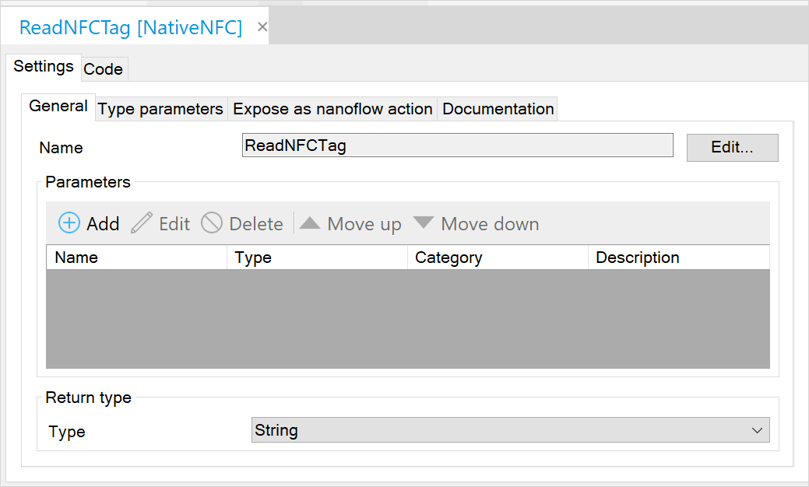
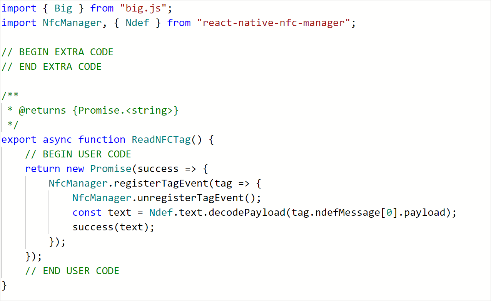

## 1 Introduction

The true strengths of a native application are faster performance and the ability to use device hardware features. With a Near Field Communication JavaScript actions, your Mendix application even more powerful when they can read NFC tags. This tutorial can also be used as an example, when you would like to use other third-party modules.

**This how-to will teach you how to do the following:**

* Build a JavaScript action for a native app.
* Add a dependency to the native JavaScript action.
* Implement a NFC scanner in a JavaScript action.

## 2 Prerequisites

Before starting this how-to, make sure you have completed the following prerequisites:

* Install Mendix 8.4.1 (Build 63369) see [App Store](https://appstore.home.mendix.com/link/modelers/)
* Install the [Git](https://git-scm.com/downloads) command line tool
* Install npm's [node js](https://nodejs.org) [todo: correct?]
* Have a fiscal [NFC NDEF](https://www.dummies.com/consumer-electronics/nfc-data-exchange-format-ndef/) tag for testing
* Have a device with NFC capabilities

## 3 Building NFC JavaScript Actions

To create NFC JavaScript actions, you will do this in the sections below:

1. Create a Mendix project.
2. Build a native app.
3. Add a native dependency.
4. Make two NFC JavaScript actions.
5. Implement the NFC Scanner in your app.

{}

For the commands we assume your software is installed in the following places:

* Git working folder is *C:\github\*
* Native Builder is installed in *C:\native-builder\*
* Studio Pro is installed in *C:\Program Files\Mendix\8.4.1.63369\*
* Mendix project is stored in *C:\MendixProjects\*

{}

### 3.1 Creating a Mendix Project

Follow the instructions below to set up your NFC project:

1. Open Mendix Studio Pro.
2. Select **File** > **New Project**.
3.  Select the **Native Mobile Quickstart** app (also available online [here](https://appstore.home.mendix.com/link/app/109511/)):

	

4.  Click **Use this starting point**:

	

5.  Name your app NativeNFC and click **Create App** to close the dialog box:

	

8. Rename the module **NativeMobile** to *NativeNFC*. In this module add our implementation [todo: what?].
7. Create a empty JavaScript action named *HasNFCSupport*. Right-click on the module and select **Add other** > **JavaScript action**. Name the new JavaScript action *HasNFCSupport*. You will create the implementation later in this tutorial.
8. Open the **Home_Native** page and add some welcome text for you test app.
9. Add an action button with caption *Scan NFC Tag* on your home page. <br />
	a. On the page you can right click to **Add widget**.<br />
	b. Select **Call nanoflow button**.<br />
	c. Click **new**.<br />
	d. Set the Name to *ACT_ReadNFCTag*.<br />
	e. Change the caption on the button to *Read NFC Tag*.<br />
	f. Save the page.<br />
	g. Open the nanoflow **ACT_ReadNFCTag**.<br />
	h. Drag and drop the JavaScript action into the nanoflow.<br />
	i. Save the nanoflow.
10. Click **Run** to deploy to the sandbox. 
11. After deployment is finished click **View** to see your app running in a browser:

	

	Your Mendix project should looks something like this:

	

### 3.2 Building a Native App [TODO: is this names shell app?]

todo: how much of this can I replace with "Go to Deploy doc and follow sections 1-6?"

Now you will build a native app and install it on your phone. If you do not have your GitHub and App Center keys, follow [How to Deploy Your First Mendix Native App](/howto/mobile/deploying-native-app) explaining how get your authentication codes. When you like to know more about the native builder commands and parameter you could check out the [Native builder reference guide](/refguide/native-builder) for further help.

1. Open a command line tool. [TODO discuss use of suggested command line tool, cmd.exe or power shell]
2. Prepare all build settings and execute the command with your substitute parameters with correct paths and URLs:

	``` shell
	$ native-builder.exe prepare --java-home "C:\Program Files\AdoptOpenJDK\jdk-11.0.3.7-hotspot" --mxbuild-path "C:\Program Files\Mendix\8.4.1.63369\modeler\mxbuild.exe" --project-path "Y:\MendixProjects\NativeNFC\NativeNFC.mpr" --github-access-token "a1f422..." --appcenter-api-token "a1b95a..." --project-name "Native NFC App" --app-name "Native NFC App" --app-identifier "com.mendix.howto.nativenfc" --runtime-url "https://nativenfc-sandbox.mxapps.io/"
	```

	As a result of the prepare command your app is created in [App Center](https://appcenter.ms/apps):

	

	A new repository is created in your GitHub account:

	

	The settings are stored in *C:\Users\mendix.tech.writer\.native_builder* and looks like this:

	```json
	{
	"Native NFC App": {
		"gitHubAccessToken": "a1f422...",
		"appCenterApiToken": "a1b95a...",
		"projectName": "Native NFC App",
		"appName": "Native NFC App",
		"appIdentifier": "com.mendix.howto.nativenfc",
		"javaHome": "C:\\Program Files\\AdoptOpenJDK\\jdk-11.0.3.7-hotspot",
		"projectPath": "C:\\MendixProjects\\NativeNFC\\NativeNFC.mpr",
		"mxbuildPath": "C:\\Program Files\\Mendix\\8.4.1.63369\\modeler\\mxbuild.exe",
		"runtimeUrl": "https://nativenfc-sandbox.mxapps.io/"
	}
}
	```

3. To build the app for the first time we can run this `build` command 
`$ native-builder.exe build --project-name "Native NFC App" --app-version "1.0.0" --build-number 1`. 
	The project names should match the project names from your `prepare` command. This build will make a `build/1` branch in your GitHub repository. Its output is now available in the *C:\native-builder\builds\* folder, where you will find *Native-NFC-App-Android-1.zip* for an Android app and *Native-NFC-App-iOS-1.zip* for an iOS app.

{}

1. During a build, the free version of the App Center will time out if the build exceeds 30 minutes.
2. By default, App Center builds both an iOS and Android app. To build for one platform specifically, add the parameter `--platform android` or `--platform ios` to the `build` command.

{}

4. Validate that your local build succeeded by checking the log files in *C:\MendixProjects\NativeNFC\deployment\log\*.
5. Install the app on your device. For more information on installing, please check the [Distributing](/howto/mobile/deploying-native-app#distributing) section of *How to Deploy Your First Mendix Native App*.
	On Android, you might see a dialog box warning you against installing. Tap **INSTALL ANYWAY**.
	
	

6. Open your app, which could look like this:

	

7. Tap your NFC button. You will incur this error: **JavaScript action was not implemented**. You will implement your action later.

{}

The Native Builder will locally run Mxbuild. The output is a *bundles.js* file which will be pack with your application. So any update on your Mendix model requires a new build. You are not building a development app that updates automatically.

{}

### 3.3 Installing a Dependency in Your App

Using an external library, specifically [react-native-nfc-manager](https://www.npmjs.com/package/react-native-nfc-manager), makes adding NFC capacities easier. At the current moment, the Mendix native client is based on *React Native version 0.59*, which will have an impact on the selected version of the library [todo: can we delete this sentence? it is a dependency]. You will make all changes to the **master** branch, because with each build a new branch is created (`build/{number}`) from **master** with your latest changes.

The dependency is split into two parts: the native OS part, and the client JavaScript part. In this section you will add the dependency for the app.

1. Open a command line interface (CLI) and change directory to the folder your GitHub project will be stored in: `$ cd C:/github/`.
2. Use your repository URL to clone the files on your machine with the command `$ git clone https://github.com/user-name/native-nfc-app`.
3. Open the folder where the code is cloned into: `$ cd native-nfc-app`.
4. To install all its current dependencies, use the command `$ npm install`.
5. Now install the required library as a dependency: `$ npm install --save react-native-nfc-manager@1.2.2`. 
	Note the version after the `@` sign. Version 2 and higher are not supported on Mendix Studio Pro 8.3.
6. To integrate the module into the template, some code changes need to be done. Using `link` you can do most changes automatically. Install react native CLI via the command `npm install -g react-native-cli@2.0.1`.
7. Now link the new module with the command `$ react-native link react-native-nfc-manager`. 
	Sometimes linking will fail. To validate success, consult the [Manual Linking](#manual-linking) section below. Errors can occur when the `import` is not done automatically.
8. For Android you must add the `uses permission` in the `android/app/src/main/AndroidManifest.xml` file. Add the following section before the line with <application`

	``` xml
	<uses-permission android:name="android.permission.NFC" />
<uses-feature android:name="android.hardware.nfc" android:required="false" />
	```
	

For iOS we have to add NFC capabilities for signing signing process. 

10. Open your project in xCode [todo: switch to "app"?]:<br />
	a. In **Signing & Capabilities**, click **+ Capability** and select **Near Field Communication Tag Reading**.<br />
	
	
    
	b. You must add a *usage description* to get permission to use the NFC reader. In *ios/nativeTemplate/Info.plist* right-click, select **Add Row**, and set they key `NFCReaderUsageDescription` with the helpful description: *We like to help you read NFC tags, please accept*.
10. To stage the changes before we can commit them, use the command `$ git add .` You can check the staged files with the command `$ git status`.
11. Commit the files with the command `$ git commit -m "Add NFC Manager dependency"`.
12. Now the files are committed, but they are only stored locally on your machine. Push them to your repository with the command `$ git push`. This will make the changes available for the Native Builder to create a new app with NFC support.

#### 3.3.1 Manual linking {#manual-linking}

In the section below you will use the `react-native link` command to link your module. This command works for React Native versions below 0.60. It is replaced in versions 0.60 and higher with auto-linking. Auto-linking does not require any linking or code changes. However, both processes have downsides and not every module supports them.

{}

This tutorial shows how to link manually. This method replaces the linking steps in the *Installing a Dependency in Your App* section above and could be used for validating if the `react-native link` command succeeded.

{}

For Android:

1. To expose the library to the template you have to link it via gradle. Open *C:\github\native-nfc-app\android\settings.gradle* and add the include and project at the end of the file before `include`, `**':app'**`, `**':mendixnative-release'**`:

	``` gradle
	include ':react-native-nfc-manager'
project(':react-native-nfc-manager').projectDir = new File(rootProject.projectDir, '../node_modules/react-native-nfc-manager/android')
	```
	
2. To use the new gradle module in *C:\github\native-nfc-app\android\app\build.gradle*, add this in the list of dependencies:

	``` gradle
	implementation project(":react-native-nfc-manager")
	```

3. Now the main application needs to initialize the NFC manager. In *C:\github\native-nfc-app\android\app\src\main\java\com\mendix\nativetemplate\MainApplication.java* add an item to the `Arrays.<ReactPackage>asList`, add a comma after the other dependency, and add the `new NfcManagerPackage()`:

	``` java
	new NfcManagerPackage()
	```
	
4. When you add this in Android Studio, the import is automatically added. If you use a plain text editor, add an extra import section on the line `import community.revteltech.nfc.NfcManagerPackage;`.

For iOS:

1. Open *C:\github\native-nfc-app\ios\Podfile*.
2. Before `end`, add a new line with `pod 'react-native-nfc-manager', :path => '../node_modules/react-native-nfc-manager'`

For information about linking, see the following resources:

* [React Linking](https://facebook.github.io/react-native/docs/linking)
* [What is react native link](https://stackoverflow.com/questions/49874385/what-is-react-native-link)
* [Demystifying React native modules linking](https://engineering.brigad.co/demystifying-react-native-modules-linking-964399ec731b)
* [Auto linking](https://github.com/react-native-community/cli/blob/master/docs/autolinking.md)

### 3.4 Install a Dependency in Your Project

The dependency is split into two parts: the native device part, and the client JavaScript part. In this section we will add the dependency JavaScript for the client bundle. For the bundling we need add the dependency builder can add the `react-native-nfc-manager` JavaScript code.

1. In your CLI, open the module folder which contains your JavaScript action:

	```
	$ cd C:\MendixProjects\NativeNFC\javascriptsource\nativenfc\actions
	```

2. In this folder, locate *HasNFCSupport.js* which the JavaScript action's code.
4. Install the dependency with the command `$ npm install react-native-nfc-manager@1.2.2`.

{}

This will create a **node_module** folder inside your **actions** folder. There is a known issue that when you try to commit the *node_modules* folder using Apache Subversion there coule be issues if your commit contains an excessive number of files. To solve this, try removing unnecessary files.

{}

### 3.5 Create NFC JavaScript Actions

JavaScript actions for the web and native platforms are similar. However, they have their own set of dependencies which they can build on.

Build an action to check if a device supports NFC:

1. Open the **HasNFCSupport** JavaScript action.
2. Change the **Return type** to **Boolean**.
3. Add the import above the `EXTRA CODE` block:
	
	``` javascript
	import NfcManager from "react-native-nfc-manager";
	```
	
4. Add the following code to the `USER CODE` block:
	
	``` javascript
	return NfcManager.isSupported();
	```

	The NfcManager is imported from our newly added module. The `isSupported` functions check if NFC is supported by the hardware. They return a **Promise** that will resolved to a boolean value to indicate whether NFC is supported.

5. Optionally, you can **Expose as nanoflow action** and add a nice icon:
	
	

	

Now make an action to read the NFC tag information:
	
1. Create an action named *ReadNFCTag*.
2. Select **Return type** > **String**.
3. Add the import above the `EXTRA CODE` block:

	``` javascript
	import NfcManager, { Ndef } from "react-native-nfc-manager";
	```
	
4. Add the following code to the USER CODE block:

	``` javascript
	return new Promise(resolve => {
		NfcManager.registerTagEvent(tag => {
			NfcManager.unregisterTagEvent();
			const text = Ndef.text.decodePayload(tag.ndefMessage[0].payload);
			resolve(text);
		});
	});
	```

	Here you return a promise that will resolve a string value. The nanoflow will wait until you call the resolve function. With the registration you start listening for tags that are picked up by the reader. When the callback function is executed as a tag is found, you un-register to stop listening for other tags. The payload is decoded from a byte array into text. When the resolve function is called with the text parameter, that nanoflow will receive this value as the return parameter.
	
5. Optionally, **Expose as nanoflow action** and add a nice icon if you would like.

	

	

### 3.6 Use NFC JavaScript Actions

Make a Nanoflow to use your new actions:

	

1. Open the **ATC_ScanTag** nanoflow which was created in test project 3.1. [todo: was it? not named elsewhere in doc]
3. Add the **Has NFC Support** action. [TODO is this named action or activity?]
4. On the action, right-click and select **Set error handling** and set the type to **Custom without rollback**.
5. Create a **Show message** action and set the template as: *Error occur while checking NFC support: {1}*. Use *$lastError* as the parameter.
6. Connect the **Has NFC Support** activity with the **Show message** activity. Right-click it, and select **Set as error handler**.
7. Add a **Decision** action. In the expression check for the return variable **$HasNFCSupport** of the HasNFCSupport action.
8. If a device is not supported, show a message of type warning with the text. Create a **Show message** action with template text *Sorry, your device does not support NFC*.
9. If a device is supported, add the **Read NFC Tag** action and store the response in the variable `TagValue`.
10. On the **Read NFC Tag** action, right-click and select **Set error handling**. Set the type to **Custom without rollback**.
11. Create a **Show message** action and set the template text to *Error occur while reading a NFC tag: {1}*. Use *$lastError* as parameter.
12. Connect the **Read NFC Tag** activity with a **Show message** activity. Right-click it, and select **Set as error handler**.
13. Use the read value in the information message: *Your NFC tags says: {1}*. Use *TagValue* as parameter.
14. Optionally you can **Show progress** while scanning the NFC tag. This action can be found in the **Nanoflow Commons** module.
15. Deploy the app to the sandbox.

### 3.7 Writing an NFC Tag

Now you have a way to read NFC NDEF tags. Next you will write some text to your tag. You can create a JavaScript action for this yourself or choose an easier alternative: use an existing tool. We recommend [NFC Tools Android](https://play.google.com/store/apps/details?id=com.wakdev.wdnfc) or [NFC Tools iOS](https://apps.apple.com/us/app/nfc-tools/id1252962749) for this approach.

To write your own NFC tag, do the following:

1. Install the NFC Tools app on your device.
2. Open the NFC Tools app.
3. Scan your tag.
4. In the **Technology available** section it should state it supports Ndef. The **Writeable** section should show **Yes**.
5. Click **WRITE**,  **Add a record**, and select **Text**.
6. Enter the text *Hello Mendix Developer!* and press **Ok**.
7. Click **Write / 30 Bytes**.
8. Scan your tag. You will receive a **Write complete** dialog box.

	


### 3.8 Rebuilding Your Native App {#rebuilding-app}

Now that you added NFC capability to your app's source code, you must rebuild your native app and reinstall it on your device to use the new JavaScript actions.

{}

Making software is an iterative process. If you integrate your own module or build your own actions, it is highly recommended to set up a system that can iterate quickly. To learn more about setting up a development environment with your local modeler, see the [Advanced Usage](/refguide/native-builder#advanced-usage) section of the *Native Builder Reference Guide*. This will require an Apple Mac with [XCode](https://developer.apple.com/xcode/) for iOS and [Android Studio](https://developer.android.com/studio) for Android devices.

{}

1. Open your CLI.
2. Run the following command to rebuild, with the incremented build number 2: 

	```
	$ native-builder.exe build --project-name "Native NFC App" --app-version "1.0.0" --build-number 2
	```

	This builder will use the configuration you set during the *Install a Dependency in Your Project* section above.
3. After the build has successfully finished, the build file will be available in *C:\native-builder\builds*.
4. Uninstall the previous version of the app on your device.
5. Install the app on your device. For more information on installing an app on your device, see the [Distributing](/howto/mobile/deploying-native-app#distributing) section of *Deploy Your First Mendix Native App*.
7. Open the app, tap **Scan tag**, and scan your NFC tag. You should see an information dialog box with the text contained by the tag:

	

	

Congratulations for completing this NFC tutorial! To go beyond the lessons you have learned, see the sections below. 

### 3.9 Hardening the Code

Now you have a working NFC scanner. However, you can make it work better in various situations, as well as on both on Android and iOS. To do this, you will have to take into account that NFC can be switched off in the Android OS, and that scanning should be canceled if the back button is clicked. On iOS the scanning can be canceled when the **Ready to Scan** dialog box is up. Please update the **ReadNFCTag** JavaScript action with the following code, and repeat the steps in the [Rebuilding Your App](#rebuilding-app) section above to build and install on your device.

``` js
// This file was generated by Mendix Studio Pro.
//
// WARNING: Only the following code will be retained when actions are regenerated:
// - the import list
// - the code between BEGIN USER CODE and END USER CODE
// - the code between BEGIN EXTRA CODE and END EXTRA CODE
// Other code you write will be lost the next time you deploy the project.
import { Big } from "big.js";
import { Platform, BackHandler } from "react-native";
import NfcManager, { Ndef } from "react-native-nfc-manager";

// BEGIN EXTRA CODE
// END EXTRA CODE

/**
 * @returns {Promise.<string>}
 */
export async function ReadNFCTag() {
	// BEGIN USER CODE
	if (Platform.OS === "android") {
		const enabled = await NfcManager.isEnabled();
		if (!enabled) {
			throw(new Error("NFC is not enabled"));
		}
	}

	return new Promise(async(resolve, reject) => {
		let success = false;
		await NfcManager.start({
			onSessionClosedIOS: () => {
				if (!success) {
					reject(new Error("NFC session closed"));
				}
			}
		});
		if (Platform.OS === "android") {
			BackHandler.addEventListener("hardwareBackPress", async () => {
				await NfcManager.unregisterTagEvent();
				await NfcManager.stop();
				return reject(new Error("NFC was canceled by the user"));
			});
			NfcManager.onStateChanged(
				async event => {
					if (event.state === "off" || event.state === "turning_off") {
						await NfcManager.unregisterTagEvent();
						await NfcManager.stop();
						return reject(new Error("NFC was disabled by the user"));
					}
				}
			)
		}
		NfcManager.registerTagEvent(async tag => {
			success = true;
			await NfcManager.unregisterTagEvent();
			await NfcManager.stop();
			const text = Ndef.text.decodePayload(tag.ndefMessage[0].payload);
			resolve(text);
		}, "Read NFC");
	});
	// END USER CODE
}
```

[todo: check "the user" text throughout, see if I can eliminate it]

At the begin of the action, you check on the Android platform if the NFC tag reader is switched off, and throw an error if so. You create a Promise with `resolve` and `reject` parameters. Note the `async` keyword before the function. This allows you to use `await` with an asynchronous function and lets them execute in a synchronous fashion, respecting their order in the code. The `start` will initialize the module and register a callback for iOS. This callback will be called when the *NFC NDEF reader session* becomes invalid, either because of the OS or because the user pressed the **Cancel** button.  

For Android you add a lister for the *hardware back button*. When pressed you will stop listening for tags, and cancel the execution by calling the `reject` function. This way the nanoflow will receive an error that is caught by the error handler. 

During the period that you are listening for a tag, the user can switch off the NFC function in Android. This will cause a *state change* that you will catch and cause a rejection to the promise.  [todo: check]

The second parameter of the `registerTagEvent` function is the instruction text shows in the iOS `Ready to Scan` dialog box. After the tag is found by the reader, you have to `stop` the NFC manager. This way you stop listening for state changes on Android, and you stop listening for the session to close in iOS.

While this tutorial is finished, please use your own creativity to extend the NFC functionality or implement other modules.

If you have questions or suggestions, please share your feedback with us. Specifically, help us by using the **Edit** button at the top of this page to suggest improvements via GitHub. Thank you.

## 4 Read More

* [Getting started with native mobile](/howto/mobile/getting-started-with-native-mobile)
* [Native Builder tutorial](/howto/mobile/native-builder)
* [Reference guide JavaScript actions](/refguide/javascript-actions)
* [How-to build JavaScript actions](/howto/extensibility/build-javascript-actions)
* [Read and write NFC Tags NFC Tools](https://play.google.com/store/apps/details?id=com.wakdev.wdnfc)
* [NFC React Native library](https://github.com/whitedogg13/react-native-nfc-manager)
