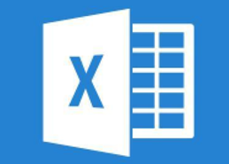
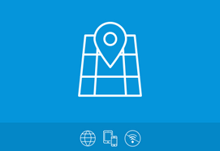

## 1 Introduction

One of the strengths of the Mendix Platform is that it is easy to connect your Mendix application with other systems. The [Mendix App Store](https://appstore.home.mendix.com/index3.html) is filled with all kinds of connectors and adapters. This document presents an overview of some of our connectors.

This document does not go into usage details for these specific connectors and adapters. Documentation for using this App Store content is available on the **Documentation** tab on the App Store pages for the items themselves. This App Store documentation includes details on typical usage scenarios, installation, dependencies, and configuration.

For documentation on using more specific connectors and adapters for Siemens, SAP, and IBM, see the [Strategic Partners Guide](/partners/index).

## 2 SAML

This module allows you to use SAML to authenticate your users in your cloud application. The module can communicate with any identity provider that supports SAML2.0 or Shibboleth.

[Click to download in the Mendix App Store.](https://appstore.home.mendix.com/link/app/1174/)

## 3 Excel Importer

With this module, you can import all the Excel files you want!

[Click to download in the Mendix App Store.](https://appstore.home.mendix.com/link/app/72/)

## 4 Excel Exporter

This module enables creating templates that export data from your Mendix application to Excel or the CSV format. This module creates an OQL query and directly prints the result to a FileDocument in your desired format. Add styling to your Excel to create the proper headers and styling formats for a complete report.

[Click to download in the Mendix App Store.](https://appstore.home.mendix.com/link/app/726/)

## 5 Google Maps

This widget enables bringing the world into your application via Google Maps!

[Click to download in the Mendix App Store.](https://appstore.home.mendix.com/link/app/48911/)

## 6 IMAP/POP3 Incoming Email

This module enables your project to retrieve emails from POP3, POP3S, IMAP, and IMAPS servers.

[Click to download in the Mendix App Store.](https://appstore.home.mendix.com/link/app/1042/)

## 7 Google Analytics

You can now add Google Analytics-tracking to your Mendix application! This widget lets you track events, pages, and transactions on your own Google Analytics account.

[Click to download in the Mendix App Store.](https://appstore.home.mendix.com/link/app/105/)

## 8 Amazon S3 Connector

This module provides access to Amazon S3 inside of Mendix.

[Click to download in the Mendix App Store.](https://appstore.home.mendix.com/link/app/2074/Mendix/Amazon-S3-Connector)