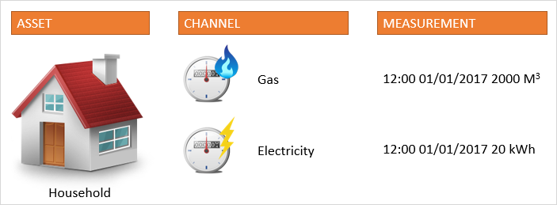
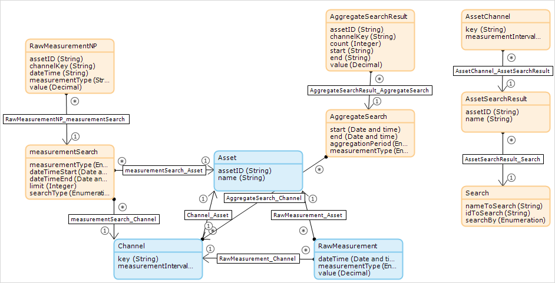
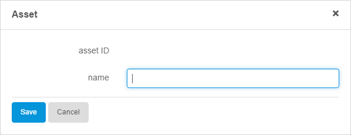
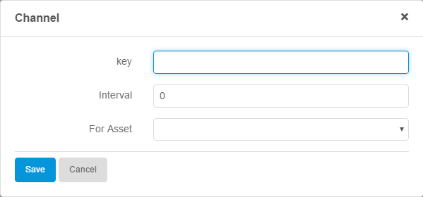
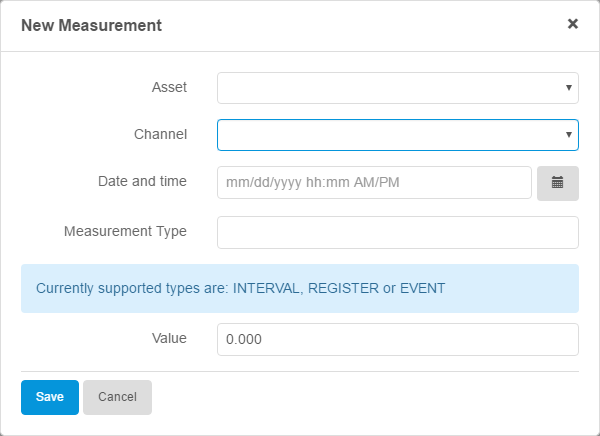
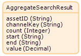
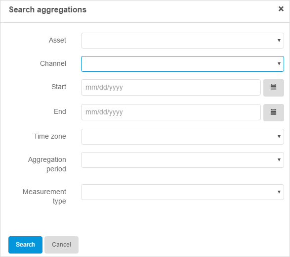

## 1 Introduction

This how-to is focussed on implementing and understanding the TimeSeries Connector and the TimeSeries Analytics platform. The TimeSeries Connector is especially useful when your application needs to handle large amounts of data. 

When looking at the IoT trend recently, one hundred sensors that send data each minute will send 144.000 objects to your database per day, one hundred and fifty will send 216.000 objects. See how these numbers start to add up once you add a few more sensors? Now imagine having your standard relational database handle this amount of data, let alone perform analysis on it. The TimeSeries Analytics platform is designed specifically to handle these amounts of data.

**This how-to will teach you how to do the following:**

* Sign up for the TimeSeries Connector
* Configure the module settings
* Create an asset
* Create a channel
* Store measurements
* Implement the actions

## 2 Prerequisites

Before starting this how-to, make sure you have completed the following prerequisites:

* Have the Mendix Desktop Modeler 6.6 or higher installed ([download](https://appstore.home.mendix.com/link/modeler/))
* Have the Community Commons Function Library in your project [download](https://appstore.home.mendix.com/link/app/170/Mendix/Community-Commons-Function-Library)

## 3 Sign Up for the TimeSeries Connector

Follow these steps to get access to the TimeSeries connector and receive an API key:

1. Sign up for the connector by going to our [Connector website](http://connector.timeseries.nl/ "Click here to go to the TimeSeries website") and register for free. You will receive your API key in an email after registering.

  {}
  It can take up to a few hours to generate the key and send it to you. This key is used to activate and access your TimeSeries Analytics instance.
  {}

2. After you receive the key, import the TimeSeries Connector module from the [Mendix App Store](https://appstore.home.mendix.com/link/app/31951/TimeSeries/TimeSeries-Connector "Click here for awesomeness") into your project.

## 4 Configure the Module Settings

After importing the module, there are a couple of settings you need to configure. Some of the settings are preconfigured.

### 4.1 Set the Constants

There are three constants that you can configure. Follow these steps to configure them:

1. Expand your project and go to **App Store modules > TimeSeriesConnector > Settings**.
2. Open the **TimeSeriesAccessKey** constant.
3. Paste your TimeSeries API key in the **Default value** field and click **OK**.

  {}
  
  There are two more constants that don't need to be configured unless otherwise instructed.
  
  * Dateformat: Is by default set to yyyy-MM-dd'T'HH:mm:ss.SSSZ and should remain like that
  * TimeSeriesBasePath: Is by default set to https://timeseries-connector.timeseries.nl:16000/ and should remain like that unless communicated otherwise

    {}

### 4.2 Available Enumerations

These are the available enumarations in the TimeSeriesConnector module:

* Enum_AggregationInterval: INTERVAL or REGISTER. These are determined by the TimeSeries platform and are the supported interval types for aggregation calls
* Enum_AggregationPeriod: Hourly, daily, weekly, monthly or yearly. These are the supported time periods
* Enum_MeasurementType: INTERVAL, REGISTER or EVENT. These are determined by the TimeSeries platforma and are the only supported measurement types. Note: measurements of type EVENT can not be aggregated
* Enum_SearchType: Purely for UI. These are used to determine which search to perform

## 5 Implementation Example

Let's take the concept of a house. In this scenario the house is an asset, of which you can have multiple. This house will use gas and electricity, which we call channels. Each channel can hold values over time; electricity usage is measured and saved every X seconds, minutes, hours, and so on. These measurements can later be used for analysis.

The module comes with a ready-to-use domain model, which we'll also use in this how-to. Of course, this isn't a necessity, and you can also use your own domain model. All referenced microflows in this how-to can also be found in the module.

  {}

  If you want to use your own domain model, make sure that your entities have the necessary attributes for every action that requires a Type Parameter.

  {}

The domain model looks like this:

### 5.1 Create an Asset

You start the implementation by creating an asset object in a page, or directly in a microflow.

1. Provide an **Asset name**, otherwise the connector will return an error. You are free to choose the name.

  In our example implementation, we have created a page with an *Asset* object on which the attributes can be set. The ID is grayed out because it will be returned by the connector later in this process.

  

After having set the **Asset name**, we trigger some validation, call the **Create asset** action, and save the **Asset ID** for later references.

<iframe width='100%' height='491px' frameborder='0' src='https://modelshare.mendix.com/models/12613211-22be-4c65-aac9-bb7d821ed99e/timeseries-connector-create-asset?embed=true'></iframe>

You can find this microflow in the *TimerSeriesConnector* module under **1. Assets > CreateAsset > IVK_CreateAsset**.

### 5.2 Create a Channel

The next step is creating a *Channel*. This *Channel* should belong to an *Asset*. Follow these steps to create a *Channel*:

1. Provide an **Asset ID** to make sure your channel belongs to an asset.
2. Provide a **Channel key**. 
3. Provide a **Measurement interval**. 

  {}
  
  You are free to choose the channel key name and the measurement interval. The interval is stored and can be used for analysis.
  
  {}
  

In our example implementation we have created a page with a *Channel* object, on which the attributes and the association with an asset can be set.

After having set the necessary attributes and associations, we trigger some validation and call the **Add channel** action. This action will return a boolean, specifying if the action was successful.

<iframe width='100%' height='491px' frameborder='0' src='https://modelshare.mendix.com/models/d0dc163e-9741-4efc-986e-00bcbbf86ce7/timeseries-connector-create-channel?embed=true'></iframe>

You can find this microflow in the *TimerSeriesConnector* module under **2. Channels > AddChannel > IVK_AddChannel**.

### 5.3 Store Measurement(s)

Now that you have created an asset with a channel, you can start storing measurements. Follow these steps to store your measurements:

1. Make sure your measurement belongs to a channel (and thus, an asset).
2. Provide the **Date and time** of the measurement.
3. Provide the **Measurement type**.
4. Provide the **Value**.

  {}

  The **Date and time** needs to be formatted in UTC to the following format: yyyy-MM-dd'T'HH:mm:ss.SSSZ. The **Measurement type** can be INTERVAL, REGISTER, or EVENT. The **Value** is a decimal.

  {}

In our example implementation we have created a page with a *measurement* object, on which the attributes and the associations with an *Asset* and *Channel* can be set.

After having set the necessary attributes and associations, we trigger some validation and call the **Store measurement** action. This action will return a boolean, which is not used. 

<iframe width='100%' height='491px' frameborder='0' src='https://modelshare.mendix.com/models/ab003bd9-159a-4b76-8fbe-42512951c28b/timeseries-connector-store-measurement?embed=true'></iframe>

You can find this microflow in the *TimerSeriesConnector* module under **3. Measuremenets > StoreMeasurements > IVK_StoreMeasurement**.

### 5.4 Aggregate Your Data

Once your channel has sufficient data, the TimeSeries Connector will really start to shine. Instead of having enormous amounts of data in your database, which takes a long time to aggregate for reporting, you can now simply ask the TimeSeries platform for an aggregation of your data. Follow these steps to set up your data aggregation:

1. Create an **AggregateSearchResult** object to use as the **Type parameter**. If you create a new entity, make sure it has all the necessary attributes as defined in this example:

  

2. Provide the empty **Type parameter** used to populate the results.
3. Provide the **Asset ID** and **Channel key** to aggregate in.
4. Provide a **Start date** and **End date** in epoch/unix time.
5. Provide an **Aggregation period**, such as hourly or daily, in the correct ISO format.
6. Provide the **Timezone** in which the results will be aggregated.
7. Provide the **Measurement type** in which the measurements have been stored.

In our example implementation we have created a page with an *AggregateSearch* object, on which the search values and the associations with an asset and channel can be set.

After having set the necessary attributes and associations, we trigger some validation, prepare the data, and call the **Aggregate between timestamps** action. This action will return a list of your type parameter, *AggregateSearchResult*. This list contains an aggregation of the channel data by the aggregation period specified. For example: From March 1st up to March 10th, you will receive a list of your total electricity usage per day. This means your list will hold 10 objects.

<iframe width='100%' height='491px' frameborder='0' src='https://modelshare.mendix.com/models/9d9055e4-4301-4ee4-8ef9-fdcbcd05079e/timeseries-connector-get-aggregations?embed=true'></iframe>
You can find this microflow in the *TimerSeriesConnector* module under **4. Aggregations > GetAggregations > IVK_GetAggregations**.

## 6 Final Remarks

This how-to provides an example on how to implement a basic subset of the available actions. Over time, more actions will be released.

This how-to was written by [Paul Ketelaars](https://developer.mendixcloud.com/link/profile/27632) and [Willem van Zantvoort](https://developer.mendixcloud.com/link/profile/27200). If you have any questions, please contact Paul Ketelaars at <paul.ketelaars@timeseries.nl> or Willem van Zantvoort at <willem.van.zantvoort@timeseries.nl>. 
