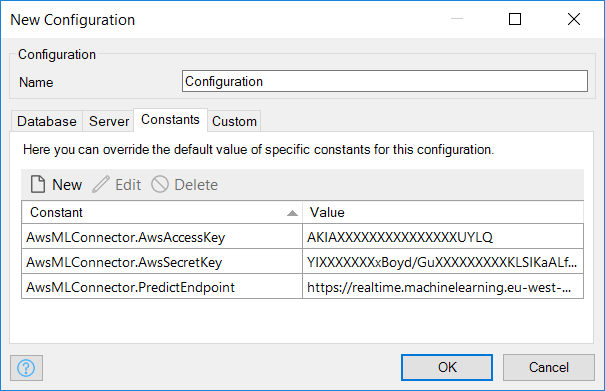
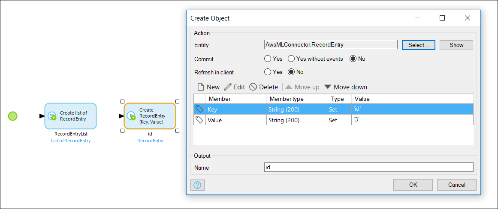
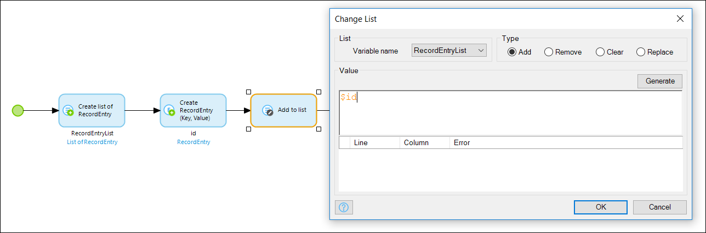
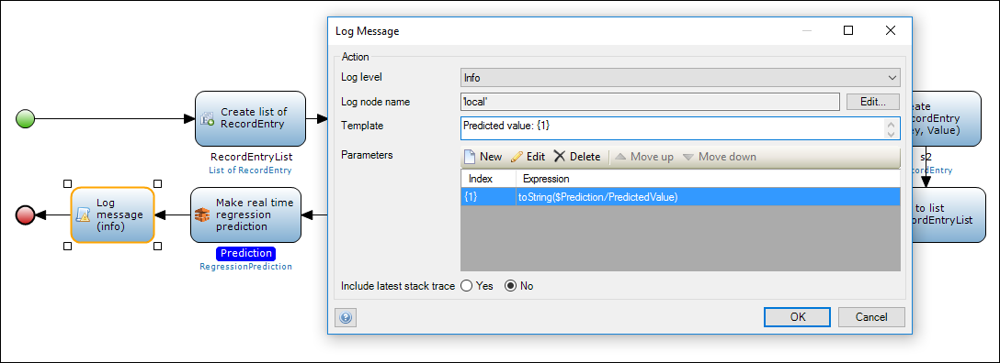

## 1 Introduction

We live in a world of digital innovations where many applications help us to make better decisions in our daily lives. Mendix applications are capable of storing data in addition to making accurate predictions using this data based on the best machine learning algorithms that are currently known. With the Aws Machine Learning Connector module, it is feasible to incorporate a Mendix application into the Amazon ML service, which opens up new opportunities to make your Mendix application smart.

For more information about regression models and machine learning in general, refer to the [Amazon ML tutorial](https://aws.amazon.com/machine-learning/).

This how-to explains how to integrate your Mendix application with AmazonML to make a prediction using a pre-trained regression model and the MakeRealTimeRegressionPrediction action.

**This how-to will teach you how to do the following:**

* Configure your Mendix application to be ready to make predictions
* Make a prediction with the MakeRealTimeRegressionPrediction action

## 2 Prerequisites

Before using the MakeRealTimeRegressionPrediction action, an appropriate regression model should be trained on the Amazon ML service. The model should be available on an enabled endpoint and configured with these access rules:

* **Amazon access key id** and **Amazon secret key** for authentication
* **Regression model id**, as **ml-1nlhUMRih2r** in this image:

    

* **Endpoint URL** for real-time predictions, as in this image:

    

With all the necessary preconditions fulfilled, the MakeRealTimeRegressionPrediction action can then be used to make predictions. However, before that can happen, you need to install the AwsMLConnector module and configure a Mendix project.

## 3 Installation

To make the MakeRealTimeRegressionPrediction action available in a Mendix project, the AwsMLConnector module needs to be imported.

## 4 Configuration

In order to make use of the MakeRealTimeRegressionPrediction action, you need to configure a Mendix project with these three constants:

* **AwsMLConnector.AwsAccessKey** – the Amazon access key for authentication
* **AwsMLConnector.AwsSecretKey** – the Amazon secret key for authentication
* **AwsMLConnector.PredictEndpoint** – the prediction endpoint URL



## 5 Using the MakeRealTimeRegressionPrediction Action in a Microflow

### 5.1 Schema of the Regression Model

With the regression model trained and the Mendix project configured, you are now ready to use the MakeRealTimeRegressionPrediction action for making predictions. 

Let's assume that for this particular example there is a regression model with the following schema of the regression model:

```java
{
  "version" : "1.0",
  "rowId" : "id",
  "rowWeight" : null,
  "targetAttributeName" : "rul",
  "dataFormat" : "CSV",
  "dataFileContainsHeader" : false,
  "attributes" : [ {
    "attributeName" : "id",
    "attributeType" : "CATEGORICAL"
  }, {
    "attributeName" : "cycle",
    "attributeType" : "NUMERIC"
  }, {
    "attributeName" : "s2",
    "attributeType" : "NUMERIC"
  }, {
    "attributeName" : "s3",
    "attributeType" : "NUMERIC"
  }, {
    "attributeName" : "s4",
    "attributeType" : "NUMERIC"
  }, {
    "attributeName" : "rul",
    "attributeType" : "NUMERIC"
  } ],
  "excludedAttributeNames" : [ ]
}
```

From the schema above, the model predicts a `rul` feature (see the value of `targetAttributeName`) based on the given vector of the `[id, cycle, s2, s3, s4]` features. In the scenario that you need to predict the value of the `rul` feature from the features' values of the given `[3, 126, 642.88, 1589.75, 1418.89]` vector while taking into account that the MakeRealTimeRegressionPrediction action accepts two arguments (the `mlModelId` and `List of AwsMLConnector.RecordEntry` objects), the only thing tha needs to be done is to convert the given vector into `List of AwsMLConnector.RecordEntry` objects.

For more information about the Amazon ML schema format, see the [Creating a Data Schema for Amazon ML](http://docs.aws.amazon.com/machine-learning/latest/dg/creating-a-data-schema-for-amazon-ml.html) tutorial.

### 5.2 Creating a Microflow

First, you need to create a microflow and add an instance of **AwsMLConnector.RecordEntry** that represents a feature with *id* set for the **Key** and *3* set for the **Value**, which is later inserted into the **List of AwsMLConnector.RecordEntry**:





You then need to repeat the same steps for the `[cycle = 126, s2 = 642.88, s3 = 1589.75, s4 = 1418.89]` values in the example in order to fill in the list with all the necessary objects required to make a prediction:


With the model ID and the list of features, you are now ready to make a prediction. Drag the **MakeRealTimeRegressionPrediction** action from the AwsMLConnector and configure it with an appropriate model ID along with the list of the objects that was just created (be aware that both the model ID and the model's schema that are used in this tutorial are only relevant to this particular example and will differ in your case):


A prediction made by the **MakeRealTimeRegressionPrediction** action is available as an instance of the **AwsMLConnector.RegressionPrediction** type. In the example above, the **Prediction** variable refers to the predicted value:



As the prediction is available through the **Prediction** variable, you can simply log the result in the console:


With just a few steps, it is now possible to make your Mendix application smart like never before. Enjoy!

## 6 Related Content
* [How to Explore the Connectors and Adapters](explore-the-connectors-and-adapters)
* [How to Access a Samba Share from the MxCloud](access-a-samba-share-from-the-mxcloud)
* [How to Install and Configure the SMTP Module](install-and-configure-the-smtp-module)
* [How to Visualize Data Using the ChartsJS Module](visualize-data-using-the-chartsjs-module)
