## 1 Introduction

The Mendix Modeler supports two query languages to retrieve data:

* Xpath as an easy to use query language to retrieve objects
* OQL is a SQL based language, more focused on powerful reporting facilities

You can use these query languages in the Mendix Modeler, but both languages are also available through a Java API. You can use these APIs to implement powerful reusable microflow actions through the Connector Kit. In addition to Xpath and OQL, the Mendix APIs also enable you to use standard SQL on your Mendix database.

This how to describes how you can build the following microflow actions:

* Retrieve advanced Xpath - returns a list of entities as specified by an Xpath expression
* Retrieve advanced OQL - returns a list of entities as specified by a OQL query
* Retrieve Dataset OQL - returns a list of entities as specified by a Dataset OQL query
* Retrieve advanced SQL - returns a list of entities as specified by a SQL query
* Create first Monday of month list - returns a list of dates of the first Monday of every month in a specified range
* Register global entity listeners - run custom Java code for every object change

    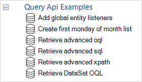

For more information on Java programming for Mendix, see [Java Programming](/refguide/java-programming).

For more information on calling Java actions from a microflow, see [Java Actions](/refguide/java-actions).

## 2 Retrieving Advanced Xpath

The goal is to create a microflow action where a user can specify an Xpath expression and which result entities are expected. The action will execute the XPath statement and return the resulting list of objects.

In practice, this is not a very useful microflow action as you can already do this with the standard Retrieve action in the Mendix modeler. The goal, however, is to illustrate how you can use the Xpath Java API.

The Java action needs the following parameters:

* A string where the user can specify the Xpath expression to be executed
* A result entity where the user specifies which entity is to be returned
* A return type which specifies that the action returns a list of the entities specified in the previous parameter.

    
 
A type parameter is required to define what object types should be returned in the list. This is specified using the ResultEntity parameter:
 
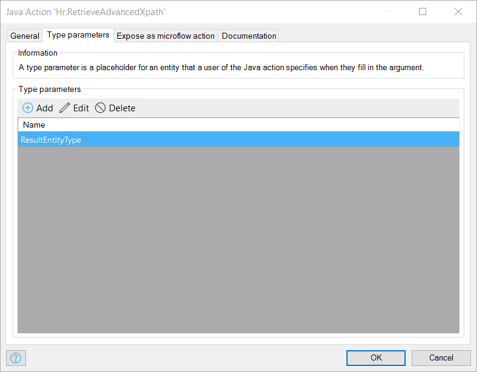
 
Finally, you should define how you want to display the microflow in the microflow toolbox. This consists of a caption, a category and an icon:


 
The implementation of this Java action is pretty straight forward; you can use the [Core.retrieveXPathQuery](https://apidocs.mendix.com/7/runtime/com/mendix/core/Core.html#retrieveXPathQuery-com.mendix.systemwideinterfaces.core.IContext-java.lang.String-) API to execute your Xpath expression and return a list of Mendix objects.
 
The implementation also validates that the list returned contains objects of the entity specified.

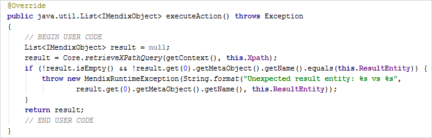
 
Now you have a new microflow action in the toolbox that you can use in your microflows.

Here’s an example domain model with two entities: Department and Employee.
 
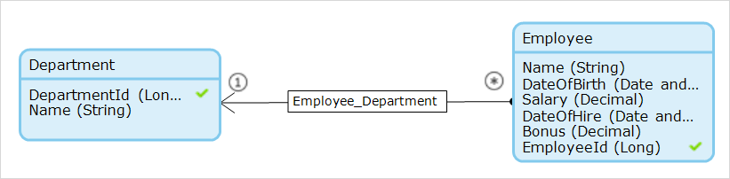
 
You can drag the Java action created above from the toolbox onto a microflow. In this example, you want to retrieve all Employee objects and return a list of these objects.
 
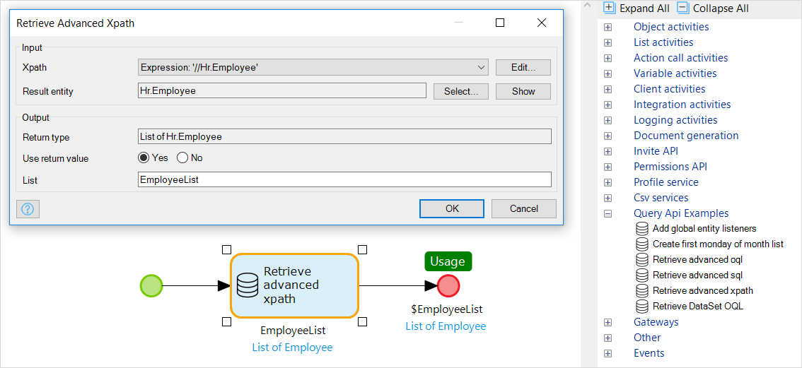

## 3 Retrieving Objects Using OQL

The following example illustrates how you can use the OQL APIs for reporting purposes. OQL is the general-purpose Mendix query language, very much resembling SQL. The biggest differences between OQL and SQL are:

*	OQL is expressed in entity and attribute names instead of table names and column names. This makes it easier to use, as you do not have to know the technical data model as stored in the database
*	OQL is database vendor independent, so you can run the same OQL statement on all databases supported by Mendix

The following non-persistent entity shows what data you are interested in for your report:

* For every department you want to know
    * its name,
    * the birthday of the oldest employee
    * the birthday of the youngest employee
    * the total salary bill
    * the average salary of the employees
    * the minimum salary paid to an employee
 
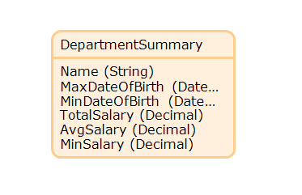
 
Using OQL, you can query this data as follows:


 
You can create a generic microflow action to execute OQL queries and return a list of objects. The Java action has the following parameters:

* OqlQuery – a string containing the OQL query
* ResultEntity – which entity will hold the retrieved data
* A list of the ResultEntity specified as a return type.

As in the Xpath example above, a **Type parameter** is defined to specify that the return list uses the type specified in ResultEntity.

Additionally, you need to expose the Java action as a microflow action, provide a caption and an icon.
 

 
The Java action illustrated below does the following:

* Retrieves all data using the Mendix API Core.retrieveOQLDataTable()
* Loops through all the rows, creates a new object of the type specified by ResultEntity. A Java action parameter of type Entity results in a Java string containing the name of the entity. This can be passed to Core.instantiate to create a new object
* Loops through all columns of a record and copies the column value to an attribute with the same name. If an attribute with a column name does not exist, a message is printed, and the loop continues
* The Mendix object created is added to the list to be returned

Note that in this case, as show in the domain model screenshot and the OQL screenshot above, the names of the attributes and columns match exactly.


 
The result is a generic OQL action that you can use in your microflows as follows:

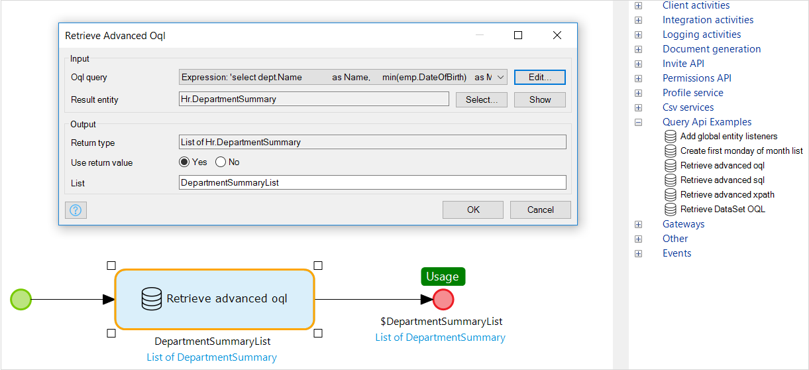

## 4 Retrieving Objects Using OQL Specified in a Dataset

Instead of coding the OQL statement in a string parameter, you can also use a Dataset. This has the benefit the that Mendix Modeler will validate your OQL query.


 
This time, you need to define a Java action that will take the name of the dataset. This action will get the OQL from the DataSet, execute it, and return a list of Mendix objects.

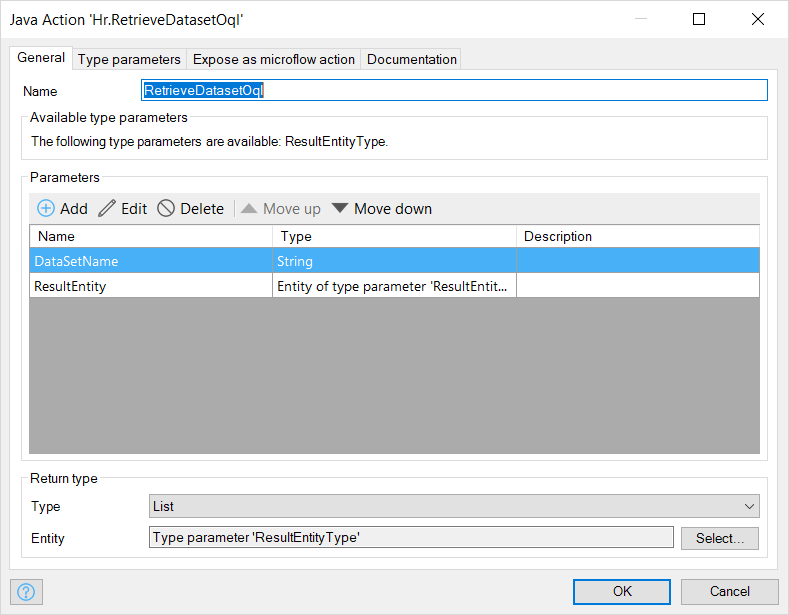

The microflow to execute the Java action is similar to the previous example, but instead of an OQL query, you specify the name of the Dataset.

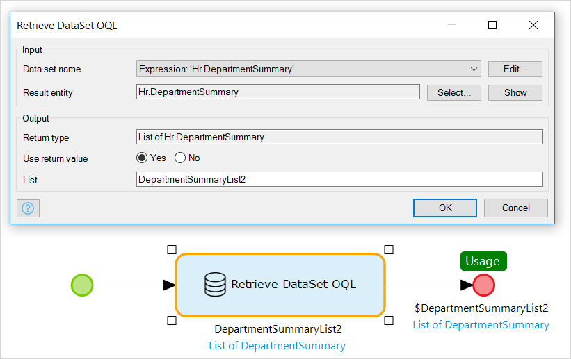

Below is the Java code to get the Dataset OQL, execute the OQL, and retrieve the Objects. You use the [Core.createOQLTextGetRequestFromDataSet](https://apidocs.mendix.com/7/runtime/com/mendix/core/Core.html#createOQLTextGetRequestFromDataSet-java.lang.String-) method to get the OQL query of the Dataset specified.


 
## 5 Retrieving Objects Using SQL (Beta - Mendix 7 and Above)

As of Mendix 7, a new API is available to allow you to execute SQL queries on the application database. (This feature is currently in beta). Using this API, you can create a microflow action to execute SQL: similar to the action for OQL in the previous sections.

The definition of the Java action resembles the OQL action, but instead of an OQL parameter you have an SQL parameter.

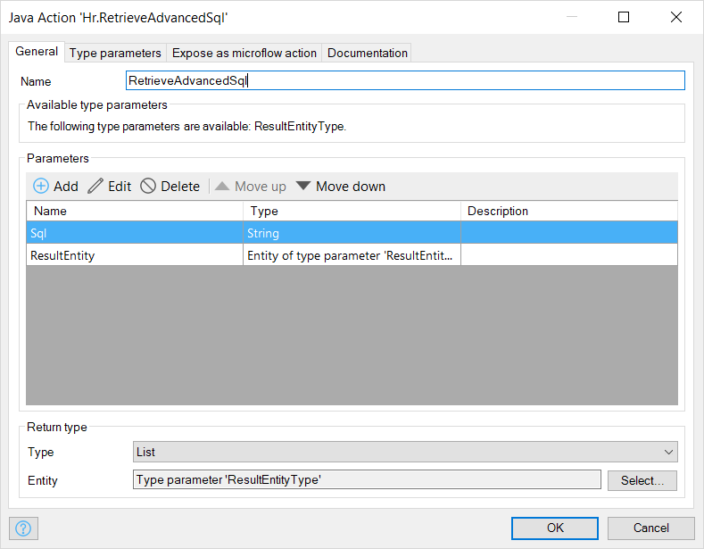

The Java implementation below implements the following steps:

*	Use *Core.dataStorage().executeWithConnection()* to execute some Java statements that receive a JDBC connection from the internal connection pool. This API is constructed to enable the Mendix platform to guarantee that connections are returned to the pool after usage.


 
*	With the JDBC connection you can now implement your Java as you would with a regular JDBC connection. 
*	A prepared statement is created, executed and the resulting records are made available through a ResultSet.
 

 
*	Next you loop through all the records in the ResultSet and create a Mendix object as specified by the user via ResultEntity.
 
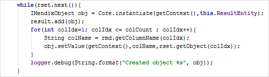
 
You can find the complete Java source code on GitHub: [LINK].

You now have a generic SQL action that can be used in microflows to retrieve data from your application database. The query in this example returns the same data as the OQL earlier, so you can reuse the non-persistent entity DepartmentSummary as defined previously.
 

 
{}
Note that in case of SQL statements you need to implement security constraints yourself.
{}

## 6 PostgreSQL-specific SQL

Using the JDBC connection you can benefit from vendor specific database extensions, like Oracle Pl/SQL or Postgres user-defined functions.

{}
If you use vendor specific database functionality you will not be able to deploy your application seamlessly on other platforms and databases. Therefore, we advise you to use SQL only if you have no alternative way of implementing your requirements. In most cases you should be able to use OQL to achieve the same result, whilst keeping your application database independent.
{}

The following example illustrates the use of PostgreSQL-specific functionality. It serves as an example of how you can do this, but in this specific case an alternative solution, either using microflows or Java actions, is better as it would keep your application database independent.

The requirement for this example is to generate a list of dates for all first Mondays of the month between a range specified by the user.

This example has a page where a user can enter a start and end date. The microflow triggered by the “Generate first Mondays of the month” button will print all the respective dates.
 

 
In Postgres you can query a list of the dates of all Mondays between these dates using the following Postgres specific query:

*	Using a common table expression (CTE), you create a set of all first dates of every month in the range
*	Using another CTE you determine the dates of the Mondays for these months
*	Finally, you select these dates if they still fall in range specified

For example:
 
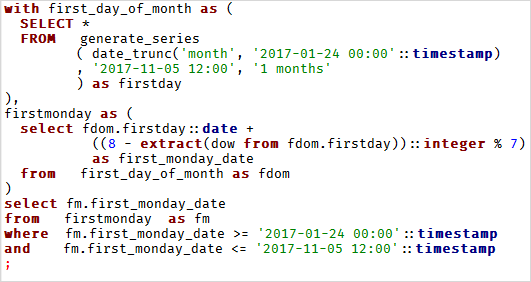
 
### 6.1 Creating the Java Action

You create a Java action with parameters for the start date and the end date. You have a specific entity to return a list of the dates: Hr.FirstMondayDate.
 
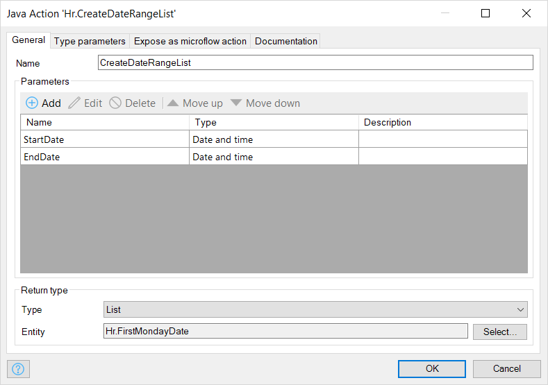

### 6.2 Creating the Java Code

1.	Specify the required SQL statement in the Java method. JDBC queries expect the parameters to be specified by question marks (?) in the SQL statement.
 
    
 
2.	Next, use the Mendix API to execute some statements using the JDBC connection. Here you create a prepared statement, define the JDBC parameter values, and execute the SQL query.
 
    
 
3.	Using the FirstMondayDate Java proxy, instantiate a new Mendix object and set the date attribute. 
4.	Finally, return the created list of dates.
 
    
 
When you use this in a microflow, you just need to specify the start and end dates, and the name of the variable that will hold the resulting list. This example iterates through all the data objects in the list and prints the date of that object.
 
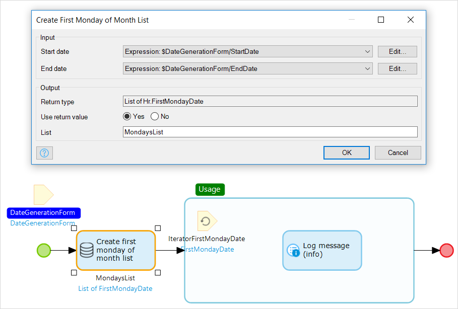
 
You will see the list of dates in the console.
 
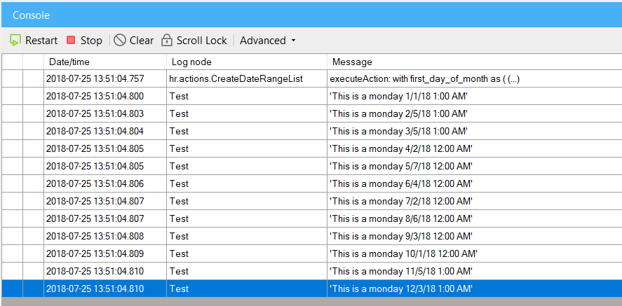
 
## 7 Global Custom Entity Event Listeners

Global entity event listeners enable you to define generic event handlers on all entities. This enables you to build generic validations or create a real-time data export to a central datastore. You can use a Java action to register any desired event handler, most likely in the *After App Startup Microflow*.

### 7.1 Example code to Register the Event Listener.

This code will log old and new attribute value for all changes to attributes before making changes in the database:

```java
public java.lang.Boolean executeAction() throws Exception {
    // BEGIN USER CODE
    Core.getListenersRegistry().registerBeforeCommitListener(objects -> {
        ILogNode logger = Core.getLogger("BeforeCommitListener");
        for (IMendixObject obj : objects) {
            logger.info("ObjectType: " + obj.getType());

            List<? extends IMendixObjectMember<?>> changedMembers = obj.getChangedMembers(getContext());

            logger.info(String.format("Has changed members: %b? Number of changed members: %d", obj.isChanged(), changedMembers.size()));
            for (IMendixObjectMember member : changedMembers) {
                logger.info(
                        String.format("Changed member %s : %s -> %s", member.getName(),
                                member.getOriginalValue(getContext()) != null ? member.getOriginalValue(getContext()).toString() : "",
                                member.getValue(getContext()) != null ? member.getValue(getContext()).toString() : ""
                        )
                );
            }
        }
    });
    return true;
    // END USER CODE
}
```

This example will trigger a listener for every object change before writing the changes to the database. To find out what attributes have been changed, you
