## 1 Introduction

Mendix applications rarely exist in isolation. Many developers find that the apps they build need to alert people in other parts of the business about important activities. The best solution for this is that ubiquitous notification framework: email. If your company has an SMTP exchange, Mendix can leverage that server to send emails directly from your application. The SMTP email module makes this easy by providing settings, error logs, and message queues with just a few short configuration steps.

**This how-to will teach you how to do the following:**

* Install the SMTP email module into your application
* Send an email from a Mendix app using your own SMTP relay
* Perform administrative email tasks at runtime
* Set up an email queue

## 2 Prerequisites

Before starting this how-to, make sure you have completed the following prerequisites:

* Configure a working SMTP relay for your email server
* Know how to install modules from the Mendix App Store
* Know how to create pages and microflows in the Modeler

## 3 Setting Up the Module

In this section, you will install the SMTP email module and integrate it into an existing Mendix application.

### 3.1 Installing the Module into Your Application

1.  Download the SMTP email module from the Mendix App Store:

    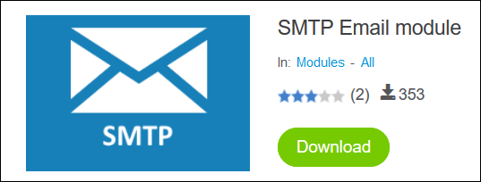

2.  Download and set up the [Encryption Module](https://appstore.home.mendix.com/link/app/1011/Mendix/Encryption), which will allow for protected passwords. 

    {}

    As with all App Store modules, it is important that you do NOT modify any contents within the module itself. If you do, you run the risk of having your changes overwritten upon the next update.

    {}
3.  Create a new module called **EmailCustomizations** to house the project-specific pages and flows:

    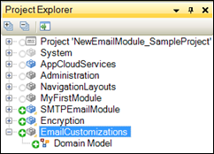

### 3.2 Exposing the Configuration Page

1. Create a new page called **EmailAdmin**.
2. Drop in the **SMTPEmailModule.Administration** snippit to give you access to those pages.
3. Add the **EmailAdmin** page to your app's **Navigation**:

    

### 3.3 Configuring the SMTP Settings

1.  Run your application and head to the SMTP settings page that has just been exposed. On the **Settings** tab, enter the SMTP credentials of the existing relay:

    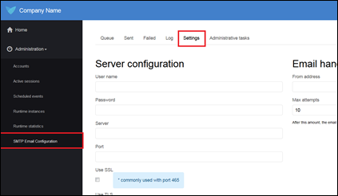

2. Click **Save** to commit the settings to the database.

3.  Send a test email. The module includes a **Test** button at the bottom of the settings page. This will allow you to enter a destination email address that should receive a test message to make sure things are working correctly.

## 4 Sending an Email in a Microflow

In this section, you will learn how to build a microflow in your application that can send an email using the credentials configured in  section [3 Setting Up the Module](#SettingUptheModule). The actual sending of an email in the SMTP module is accomplished through the **SMTPEmailModule.SendEmailMessage** microflow (accessible via **SMTPEmailModule** > **Private** > **Email**):

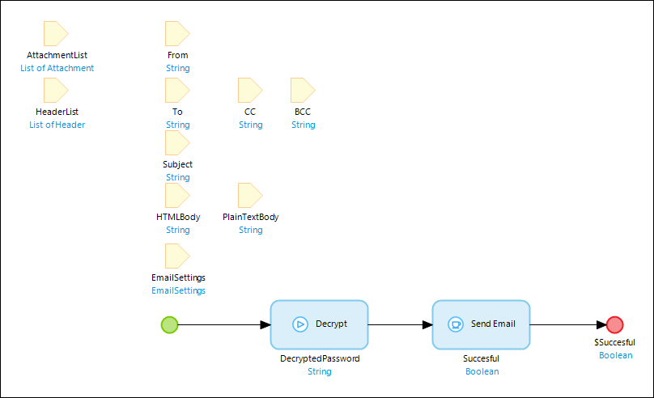

This flow takes in a number of parameters, including **To**, **From**, **Subject**, and the email settings. The **Send Email** Java Action is what actually bounces the email to the SMTP (as long as you define the key input information, you have a lot of flexibility about what emails you send).

To make the process a little simpler, the SMTPEmailModule includes an **Email** entity in the domain model. This entity brings all the important variables together in one place:

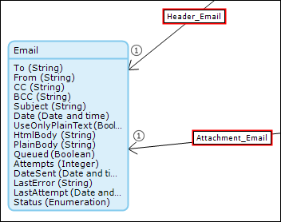

Making an email is as simple as generating an **Email** object, populating the values, and then passing it to the **SendEmail** microflow. This section demonstrates how to build a page where a user can enter an address, subject, and content, and then send that out from the Mendix application.

To send an email in a microflow, follow these steps:

1.  Create a page called **MakeANewEmail** using a vertical form:

    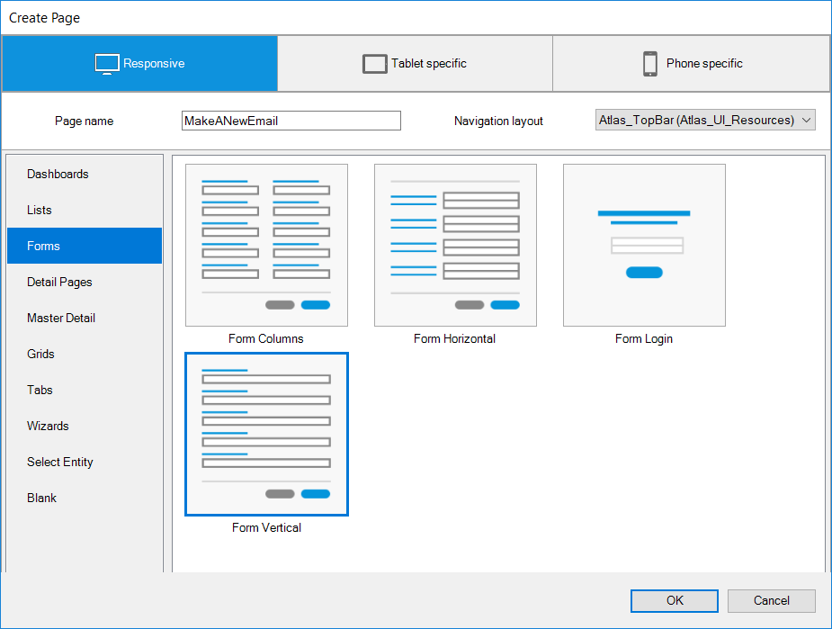

2.  On this page, allow users to edit the following values: **To**, **CC**, **BCC**, **Subject**, and **Plain Body**:

    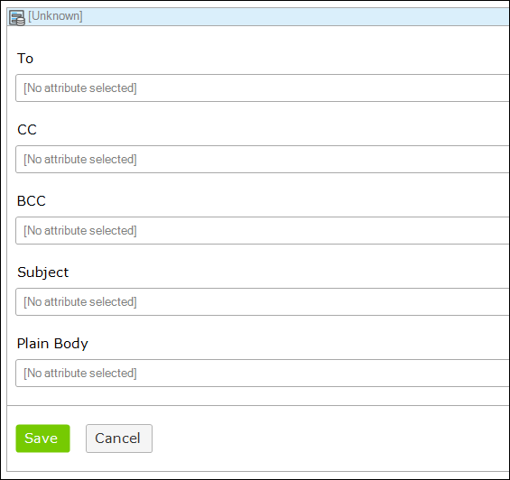

3.  Create a microflow called **IVK_CreateNewEmail** that generates a new email object and passes it to the page from step 2 above. Add this microflow to your navigation:

    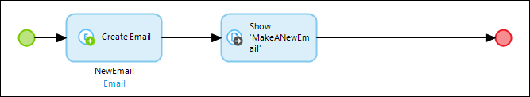

4. On the **MakeANewEmail** page, delete the **Save** button and add an action that calls a microflow. Call this microflow **IVK_UserManualEmailSend**:

    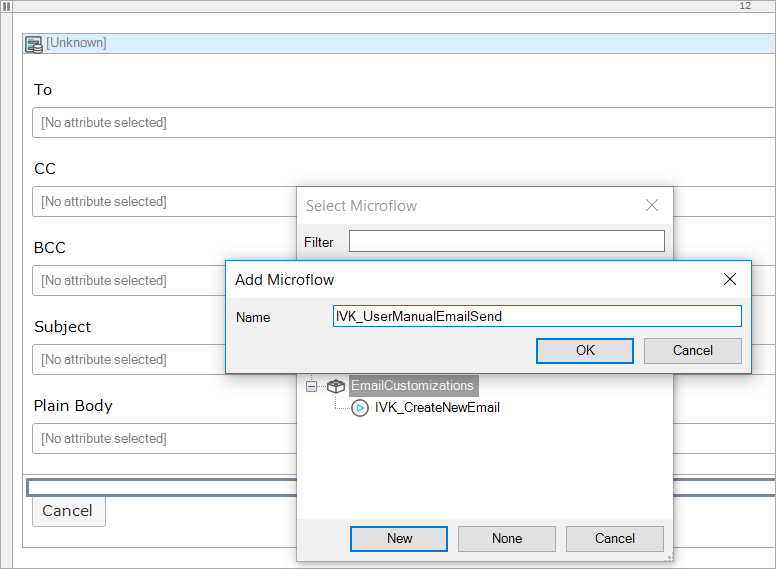

    {}

    Don’t forget to put a progress bar on the call for your action button. In the time it takes to send the email, you want users to know that the app is still working.

    {}

5. Change the button's caption to **Send**.

6. Go to the **IVK_UserManualEmailSend** microflow to edit it and add an **Email** parameter.

7. Add a call to the **IVK_SendEmail** sub-microflow in the SMTP module, and then add a **Close page** activity:

    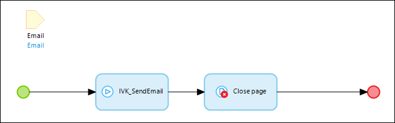

8. Add a Change object before the sub-microflow call. Set the **Variable** as **Email**.

9. Because users are only editing the plain text of the email on the previous page, change the email so that the **UseOnlyPlainText** Boolean is set to **true**:

    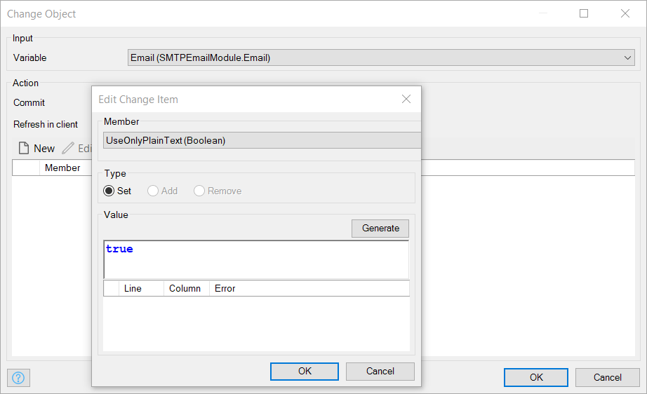

    Once a user logs into the application, they are presented with a page where they can write a custom email and send it to a desired address using SMTP within a Mendix application:

    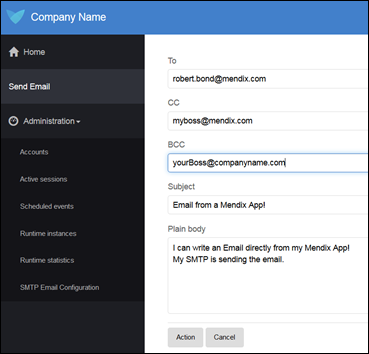

## 5 Setting Up the Email Queue

Beyond simply creating and sending emails, the SMTP module comes with a functioning email queue that is easy to set up. Having an email queue can be very useful for controlling the email load volume or sending nightly updates for users to read in the morning. 

To set up the email queue, follow these steps:

1. Create an email.
2. Instead of sending, add that email to the queue.
3. Run a scheduled event that sets off all the queued emails at once.

To add this to our sample application, do the following:

1.  Add a new action button to the **MakeANewEmail** page that calls a new microflow called **IVK_QueueEmail**:

    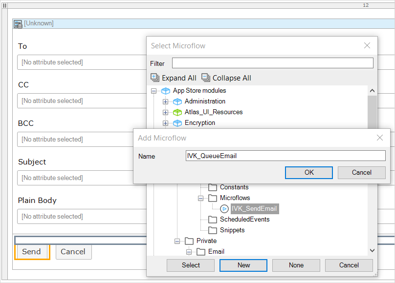

2. Change this button's caption to **Queue**.

3. Configure this microflow to change the email object so that the status is QUEUED and the queued Boolean is set to true:

    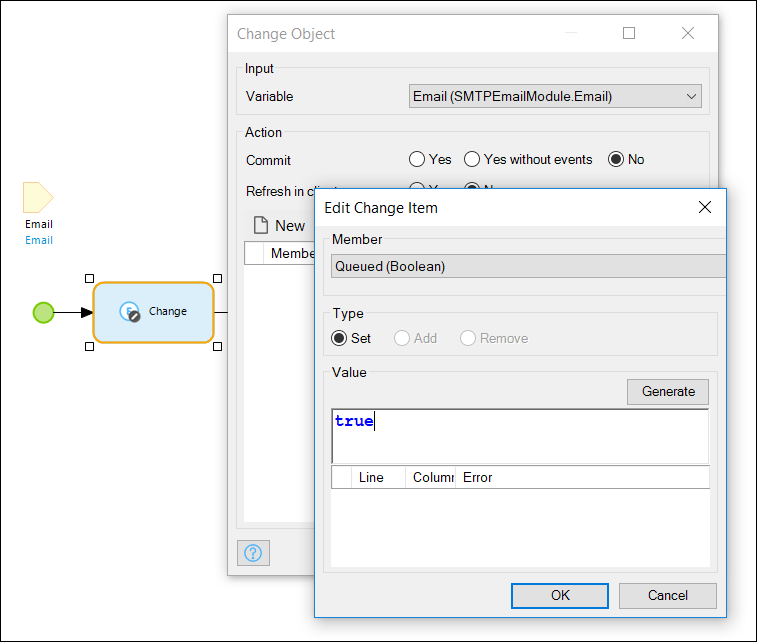

3.  The module already contains a scheduled event called **SE_SendQueuedEmails**, which retrieves the emails in the queue and sends them out. All that is left to do is to turn this scheduled event on, and your email queue is set to go!

    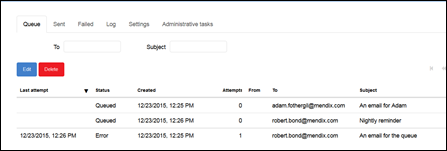

## 6 Additional Enhancements

The SMTP email module contains a number of other powerful tools. Some of the enhancements you can add to this include the following:

* Allow users to edit the HTML text of the email using a rich text editor
    * This will give users even more power to adjust the look and feel of the emails
    * Don’t forget to set the **UseOnlyPlainText** value to false before sending

* Add some validation to the form or microflow to make sure users don’t send email messages with no subject, body, or address

    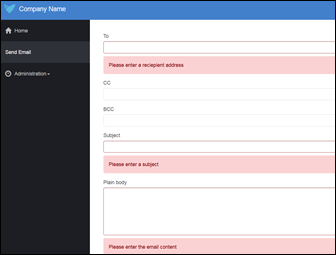

* Auto-generate emails in workflow steps to have the app send out emails from SMTP behind the scenes

## 7 Related Content

* [How to Use  Connectors and Adapters](use-connectors-and-adapters)
* [How to Access a Samba Share from the MxCloud](access-a-samba-share-from-the-mxcloud)
* [How to Install and Configure the SMTP Module](install-and-configure-the-smtp-module)
* [How to Visualize Data Using the ChartsJS Module](visualize-data-using-the-chartsjs-module)
