## 1 Introduction

One of the strengths of Mendix is that it’s easy to connect your Mendix application with other systems. Our App Store is filled with all kinds of connectors and adapters. This how-to presents an overview of some of our connectors.

**This how-to will teach you how to do the following:**

* Explore the connectors and adapters for useful options

## 2 Prerequisites

None.

## 3 KPN LoRa Connector

[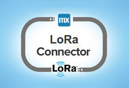](https://appstore.home.mendix.com/link/app/2747/First-Consulting/KPN-LoRa-Connector)

This module is a connector for the LoRa devices and enables receiving incoming messages through the LoRa network (as it is provided by KPN in the Netherlands).

[Click to download in the Mendix App Store.](https://appstore.home.mendix.com/link/app/2747/First-Consulting/KPN-LoRa-Connector)

## 4 Amazon S3 Connector

[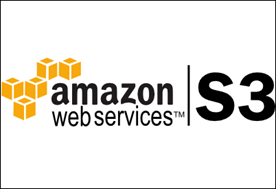](https://appstore.home.mendix.com/link/app/2074/Mendix/Amazon-S3-Connector)

This module provides access to Amazon S3 inside of Mendix.

[Click to download in the Mendix App Store.](https://appstore.home.mendix.com/link/app/2074/Mendix/Amazon-S3-Connector)

## 5 Salesforce.com Connector

[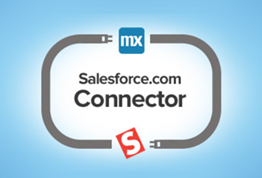](https://appstore.home.mendix.com/link/app/1424/Mendix/Salesforce.com-Connector)

This module enables building Mendix apps on top of your [Salesforce](http://Salesforce.com) environment in minutes. Get the rapid development and deployment power of Mendix on top of your entire existing Salesforce architecture. This connector quickly and easily allows you to communicate with standard or custom objects in your company's Salesforce instance.

[Click to download in the Mendix App Store.](https://appstore.home.mendix.com/link/app/1424/Mendix/Salesforce.com-Connector)

## 6 SAML

[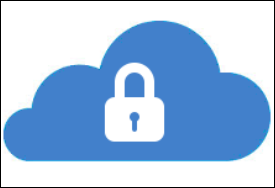](https://appstore.home.mendix.com/link/app/1174/Mendix/SAML)

This module allows you to use SAML to authenticate your users in your cloud application. The module can communicate with any identity provider that supports SAML2.0 or Shibboleth.

[Click to download in the Mendix App Store.](https://appstore.home.mendix.com/link/app/1174/Mendix/SAML)

## 7 Kerberos Single Sign-On

This module enables the Kerberos-based single sign-on feature in your application. This is useful in Windows Active Directory environments, since this protocol supports Integrated Windows Authentication. As a result, users logged on to the Windows domain do not have to enter their credentials to log in to your application.

[Click to download in the Mendix App Store.](https://appstore.home.mendix.com/link/app/25/Mendix/Kerberos-Single-Sign-On)

## 8 LDAP

[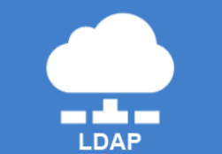](https://appstore.home.mendix.com/link/app/1218/Mendix/LDAP-Provisioning-Agent)

The LDAP provisioning agent is used to synchronize the users available in your directory server to the Mendix Platform using the LDAP protocol.

[Click to download in the Mendix App Store.](https://appstore.home.mendix.com/link/app/1218/Mendix/LDAP-Provisioning-Agent)

## 9 Excel Importer

[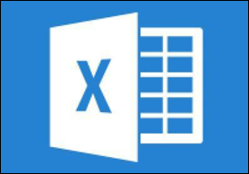](https://appstore.home.mendix.com/link/app/72/Mendix/Excel-importer)

With this module, you can import all the Excel files you want!

[Click to download in the Mendix App Store.](https://appstore.home.mendix.com/link/app/72/Mendix/Excel-importer)

## 10 Excel Exporter

[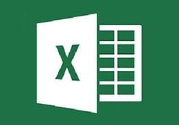](https://appstore.home.mendix.com/link/app/726/Mendix/Excel-exporter)

This module enables creating templates that export data from your Mendix application to Excel or the CSV format. This module creates an OQL query and directly prints the result to a FileDocument in your desired format. Add styling to your Excel to create the proper headers and styling formats for a complete report.

[Click to download in the Mendix App Store.](https://appstore.home.mendix.com/link/app/726/Mendix/Excel-exporter)

## 11 Skype Call Widget

Skype URIs enable developers to create innovative mobile, web, and desktop apps that initiate Skype calls and chats. This allows your users to reach their friends, family, and businesses in a convenient yet familiar way. For example, if your mobile app presents a contact list that contains Skype names or phone numbers, your app can use a Skype URI to launch the official Skype client and initiate a call to the selected contact.

[Click to download in the Mendix App Store.](https://appstore.home.mendix.com/link/app/757/Skype-Call-Widget)

## 12 Lync

[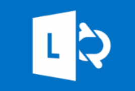](https://appstore.home.mendix.com/link/app/1313/Mendix/Lync)

This module enables launching a new (or existing) Lync conversation directly from your Mendix app. This is only compatible with Mendix version 5 and above.

[Click to download in the Mendix App Store.](https://appstore.home.mendix.com/link/app/1313/Mendix/Lync)

## 13 Google Maps

[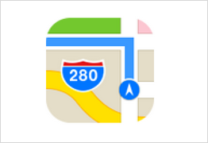](https://appstore.home.mendix.com/link/app/39/Mendix/Google-Maps-Widget)

This module enables bringing the world into your application with the Google Maps widget!

[Click to download in the Mendix App Store.](https://appstore.home.mendix.com/link/app/39/Mendix/Google-Maps-Widget)

## 14 IMAP/POP3 incoming email

This module enables your project to retrieve emails from POP3, POP3S, IMAP, and IMAPS servers.

[Click to download in the Mendix App Store.](https://appstore.home.mendix.com/link/app/1042/Mendix/IMAP/POP3-incoming-email)

## 15 MxSMTP Module

[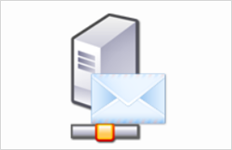](https://appstore.home.mendix.com/link/app/256/Mendix/MxSMTP-Module)

This module lets your application run a mail server. It will process any messages it receives and stores these in your application.

[Click to download in the Mendix App Store.](https://appstore.home.mendix.com/link/app/256/Mendix/MxSMTP-Module)

## 16 SFTP Connection

[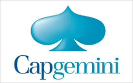](https://appstore.home.mendix.com/link/app/368/SFTP-Connection)

This component enables exchanging FileDocuments with an SFTP server. It allows for files to be sent to a location, for files to be retrieved from a location, and for the file listing of a location (for example, for batch retrieval). Please note that this component works with SFTP (SSH) and not with FTPS (SSL).

[Click to download in the Mendix App Store.](https://appstore.home.mendix.com/link/app/368/SFTP-Connection)

## 17 Simple CSV Exporter

This module is used for exporting to CSV from a microflow.

[Click to download in the Mendix App Store.](https://appstore.home.mendix.com/link/app/1573/Appronto/Simple-CSV-Exporter)

## 18 Uber Integration

This module provides integration with Uber's APIs for logging in, viewing profile data, and estimating trips and prices.

[Click to download in the Mendix App Store.](https://appstore.home.mendix.com/link/app/2590/Mendix/Uber-Integration)

## 19 Google Analytics

You can now add Google Analytics-tracking to your Mendix application! This widget lets you track events, pages, and transactions on your own Google Analytics account.

[Click to download in the Mendix App Store.](https://appstore.home.mendix.com/link/app/105/Mendix/Google-Analytics)

## 20 Related Content

* [How to Access a Samba Share from the MxCloud](access-a-samba-share-from-the-mxcloud)
