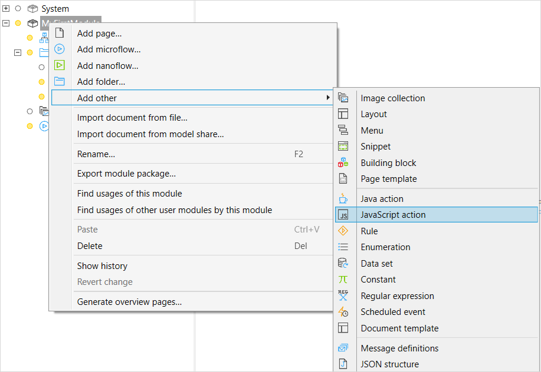
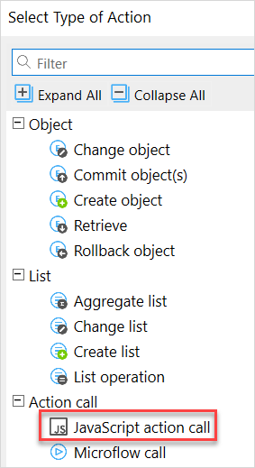
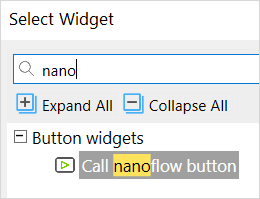

## 1 Introduction

Mendix has made nanoflows even more powerful with pluggable nanoflow actions – called JavaScript actions – in Mendix 8. With JavaScript actions, the standard set of actions can be extended with new functionality. A JavaScript action is a reusable action based on JavaScript that runs in the client just like the nanoflow, and can use capabilities such as HTML5 browser functions, Cordova PhoneGap plugins, and React Native modules. JavaScript actions are similar to [Java actions](/refguide/java-actions), but run on the client instead of the server. To share them inside your organization, JavaScript actions can be distributed and downloaded through the private [Mendix App Store](https://appstore.home.mendix.com/index3.html).

**This how-to will teach you how to do the following:**

* Create a JavaScript action
* Configure input and output parameters
* Implement web text to speech
* Make an asynchronous return
* Expose an action as a nanoflow action
* Use your actions in a demo

## 2 Create a JavaScript action: TextToSpeech

To create a JavaScript action that can synthesize text to speech, follow these steps:

1.  Create a new **JavaScript action** in your Mendix project:

	

2.  Give it a descriptive name:

	

	You can now start creating the API for the JavaScript action, which consists of parameters and a return type.

3.  Your **TextToSpeech** action only requires a single parameter. Create it by clicking the **Add** button in the top left corner. Give the parameter a name and add an extended description if desired:

	

	You can leave the **Return type** at the default Boolean value. That means that the action will return `false` if no text is provided, and return `true` after it has successfully spoken the provided text.
  
4.  Next, click the **Code** tab to begin editing the JavaScript action. Now you can start writing the actual action. Mendix Studio Pro already created a default template for you, using the parameters and return type we provided:

	

	You can only add code between `// BEGIN USER CODE` and `// END USER CODE`. Any code outside this block will be lost. The source code is stored in your project folder under **javascriptsource** > **(module name)** > **actions** > **(action name).js**. This JavaScript action will be asynchronous, so you will be using promises to return values (for details about using promises, see Mozilla's [Using promises](https://developer.mozilla.org/en-US/docs/Web/JavaScript/Guide/Using_promises) guide). 

5. Now add a check to verify if the required parameter has been set correctly. The action will return `false` if no text was provided:

	```javascript
	function TextToSpeech(text) {
		// BEGIN USER CODE
		if (!text) {
			return Promise.resolve(false);
		}
		return Promise.reject("JavaScript action was not implemented");
		// END USER CODE
	}
	```

6. To enable spoken text, you will need the [Web SpeechSynthesis API](https://developer.mozilla.org/en-US/docs/Web/API/SpeechSynthesis). However, not all browsers support this experimental API. Add a check to verify if the API is available, and include an error if it is not. For future reference, add a comment with references to documentation about our API and its compatibility.

	```javascript
	function TextToSpeech(text) {
		// BEGIN USER CODE
		// Documentation: https://developer.mozilla.org/en-US/docs/Web/API/SpeechSynthesis
		// Compatibility: https://developer.mozilla.org/en-US/docs/Web/API/SpeechSynthesis#Browser_compatibility
		if (!text) {
			return Promise.resolve(false);
		}
		if ("speechSynthesis" in window === false) {
			return Promise.reject("Browser does not support text to speech");   
	
		}
		return Promise.reject("JavaScript action was not implemented");
		// END USER CODE
	}
	```

7. Next up is the fun part: making the application speak. Create a new `SpeechSynthesisUtterance` object and call the `speak` function. You will write this new code by overwriting the last `Return` from the previous code.

	```javascript
	function TextToSpeech(text) {
		// BEGIN USER CODE
		if (!text) {
			return Promise.resolve(false);
		}
		if ("speechSynthesis" in window === false) {
			return Promise.reject("Browser does not support text to speech");
	
		}
		var utterance = new SpeechSynthesisUtterance(text);
		window.speechSynthesis.speak(utterance);
		return Promise.resolve(true);
		// END USER CODE
	}
	```

8. The function will already return even when the browser is not finished speaking. To prevent this we can attach `onend` and `onerror` handlers to it. The `onend` handler runs when the application finishes speaking the text, so the promise resolves with a value of `true`. In case an error occurs, the promise is rejected and a descriptive error message is shown. After attaching these handlers, it can start speaking:

	```javascript
	function TextToSpeech(text) {
		// BEGIN USER CODE
		if (!text) {
			return Promise.resolve(false);
		}
		if ("speechSynthesis" in window === false) {
			return Promise.reject("Browser does not support text to speech");
	
		}
		// var utterance = new SpeechSynthesisUtterance(text);
		// window.speechSynthesis.speak(utterance);
		// return Promise.resolve(true);
		return new Promise(function(resolve, reject) {
			var utterance = new SpeechSynthesisUtterance(text);
			utterance.onend = function() {
				resolve(true);
			};
			utterance.onerror = function(event) {
				reject("An error occured during playback: " + event.error);
			};
			window.speechSynthesis.speak(utterance);
		});
		// END USER CODE
	}
	```

9. You have just implemented your first JavaScript action! You can start using the action in your nanoflows by adding a **JavaScript action call** and selecting the newly created **SpeechToText** action: 

	
	
	
	
	Optionally, you can expose the JavaScript action as a nanoflow action. When you do, you can choose a **Caption**, **Category**, and **Icon**. Note that to choose an icon your image will need to be included in an existing [image collection](/refguide/image-collection). 
	
	
	
	It will then appear in the **Toolbox** window when editing a nanoflow: 
	
	

10. Now for a JavaScript action test run! First, make a nanoflow which features your new JavaScript action. Right-click your folder in the **Project Explorer** and click **Add nanoflow**. Then, add an action to your nanoflow, select **call a nanoflow action**, and select your JavaScript action. You will see a window which will let you edit the JavaScript action. Click the **Edit** button of the **Input Text** and type *‘Hello world'*. Then, set **Use return value** to *No* radio button.

	

11. Now you are going to put your new nanoflow to work. On a page of your app, make an action button by clicking **Add widget** in the top center toolbar. Then, under **Button Widgets**, select **Call nanoflow button**. Select your new nanoflow when prompted. 

	

12. Click a place on your page to drop your new button where you want it. With the button now on your page, you can test your work. Run your model, click your new button, and if your sound is on you should be greeted by the voice you programmed! 

## 3 Read More{#read-more}

* [Build JavaScript Actions: Part 2 (Advanced)](write-javascript-github)
* [Implement Best Practices for JavaScript Actions](best-practices-javascript-actions)
* [JavaScript Actions](/refguide/javascript-actions)
* [Mendix Client API](https://apidocs.mendix.com/8/client/) 
* JavaScript Resources:
	* [JavaScript basics](https://developer.mozilla.org/en-US/docs/Learn/Getting_started_with_the_web/JavaScript_basics)
	* [Promises](https://developer.mozilla.org/en-US/docs/Web/JavaScript/Reference/Global_Objects/Promise)