## 1 Introduction

Mendix has made nanoflows even more powerful with pluggable nanoflow actions – called JavaScript actions – in Mendix 8. [How to Build JavaScript Actions: Part 1 (Basic)](write-javascript-actions) shows you how to create a JavaScript TextToSpeech action, expose it as a nanoflow action, and then use it in a demo. In this advanced how-to you will learn to call a REST service, use a generic return type, and make an API to enhance the power of your JavaScript actions.

**This how-to will teach you how to do the following:**

* Create a JavaScript action
* Configure input and output parameters
* Call a REST service
* Make an asynchronous return
* Create Mendix objects
* Use generic return type
* Expose an action as a nanoflow action
* Use your actions in a demo

## 2 Prerequisites

In [Creating a "Search GitHub User" JavaScript Action](#create-a-search) below, you will make an API which allows you to search for GitHub users. Before continuing, you can do the following to practice your API skills: 

* Learn how the GitHub API works using the [GitHub developer documentation](https://developer.github.com/v3/search/#search-users)
* Use test tooling to see how the GitHub API in action – an HTTP GET request of the URL `https://api.github.com/search/users?q=test` will result in a JSON response which you should study

## 3 Downloading the Project Package

This how-to comes paired with an app project package prepared for you by Mendix. To download and import the package, follow the steps below:

1. In Mendix Studio Pro, click the App Store icon.
2. Search for "JavaScript Actions How-To Advanced".
3. Click the app, then click **Download** to receive an *.mpk* file. 
4.  Select **New Mendix Team Server**, name your app *JavaScriptActionsHowToAdvanced*, select a **Project Directory**, and click **OK**:

	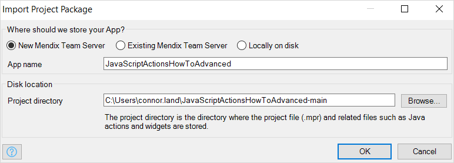

## 4 Creating a “Search GitHub User” JavaScript Action {#create-a-search}

To create a JavaScript action that can search for users on GitHub, follow the steps below:

1.  Add a new **JavaScript action** in your Mendix project:

	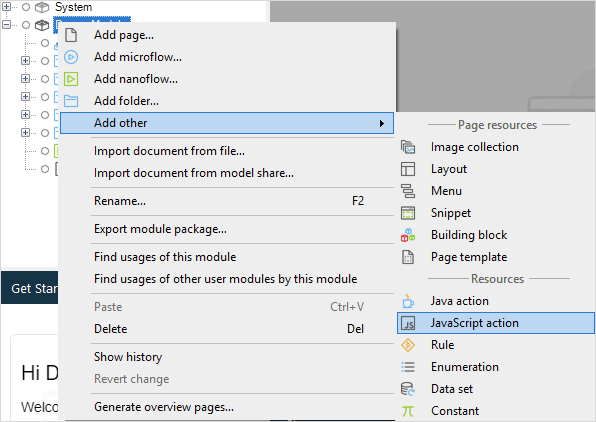

2.  Name it *SearchGitHubUsers*:

	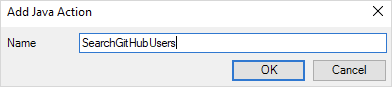

	You can now start creating the API for **SearchGitHubUsers**, an action which consists of parameters and a return type.

3.  Your **SearchGitHubUsers** JavaScript action only requires a single parameter. Create it by clicking **Parameters** > **Add**. Name the parameter *Query,* and add an extended **Description** if desired. 

	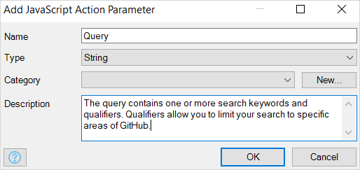

4.  Set the **Return type** to **List**, and set **Entity** as the **GithubUser** entity:

	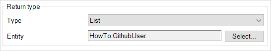

	With these parameter and return type settings, a successful search will return a list of **GithubUser** objects containing login names, avatars, URLs, and more.

5.  Click the **Code** tab to begin editing the JavaScript action. Mendix Studio Pro has created a default template using the parameters and return type you provided:

	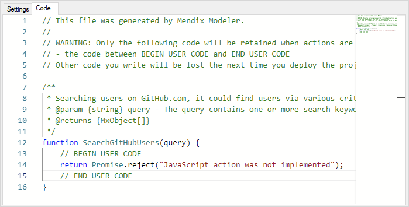

	You can only add code between `// BEGIN USER CODE` and `// END USER CODE`. Any code outside this block will be lost. Source code is stored in your project folder under **javascriptsource/(module name)/actions/(action name).js**. 

6. Now add a check to verify if the required parameter has been set correctly. The action will return an empty list if no `query` was provided:

	```javascript
	function SearchGitHubUser(query) {
		// BEGIN USER CODE
		if (!query) {
			return [];
		}
		return Promise.reject("JavaScript action was not implemented");
		// END USER CODE
	}
	```

7. To enable your action to search GitHub users, implement a REST request:

	```javascript
	function SearchGitHubUser(query) { 
		// BEGIN USER CODE
		if (!query) {
			return [];
		}
		var url = "https://api.github.com/search/users?q=" + query;
		return fetch(url) // Fetch returns a promise, gets the url and wait for result
			.then(function(response) { return response.json() }) // Transform to JSON
			.then(function(jsonData) { // Process JSON data
				// log to the console a successful result
				logger.debug("count results", jsonData.total_count);
				return []; // return an empty list for now...
			});
		// END USER CODE
	}
	```

	This code uses the Fetch API. Browser compatibility is irrelevant, as this API is provided by the Mendix Runtime when unavailable in the browser.

8. Next up is the fun part: making Mendix objects. Create a new function called `createGitHubUser` that returns a `new Promise`. The executor function of the promise should use the Mendix client API to create a new object and set the attributes.
9. Loop over all results and call your new function. The `githubUsers` variable will hold an array of promises.
10. Finally, set a `Promise.all` return to wait for all promises to be resolved before the nanoflow can continue:

	```javascript
	function SearchGitHubUser(query) {
		// BEGIN USER CODE
		if (!query) {
			return [];
		}
		var url = "https://api.github.com/search/users?q=" + query;
		return fetch(url)
			.then(function(response) { return response.json() })
			.then(function(jsonData) {
				logger.debug("count", jsonData.total_count);
				var gitHubUsers = jsonData.items.map(createGitHubUser);
				return Promise.all(gitHubUsers);
			});

		function createGitHubUser(user) {
			return new Promise(function (resolve, reject) {
				mx.data.create({
					entity: "HowTo.GitHubUser",
					callback: function(mxObject) {
						mxObject.set("login", user.login);
						mxObject.set("avatar_url", user.avatar_url);
						resolve(mxObject);
					},
					error: function(e) {
						reject("Could create object:" + error.message);
					}
				});
			});
		}
		// END USER CODE
	}
	```

	The entity name consists of **{(modulename)}.{(entityname)}**. The entity name, therefore, might have been different if the **GitHubUser** entity was created in another module. Because this JavaScript action has names explicitly written into it, when a module or entity is renamed, the JavaScript action will break. You will fix this hard-coded relation in [step 12](#step-twelve) below.

11. The function will only set the `login` and `avatar_url` properties. To make it more flexible, you will make the function discover the available attributes and set them. Extend the domain model with more attributes from the API like so:

	```javascript
	function SearchGitHubUsers(query, userEntity) {
		// BEGIN USER CODE
		if (!query) {
			return [];
		}
		var url = "https://api.github.com/search/users?q=" + query;
		return fetch(url)
			.then(function(response) { return response.json() })
			.then(function(jsonData) {
				logger.debug("count", jsonData.total_count);
				var gitHubUsers = jsonData.items.map(createGitHubUser);
				return Promise.all(gitHubUsers);
			});

		function createGitHubUser(user) {
			return new Promise(function (resolve, reject) {
				mx.data.create({
					entity: "HowTo.GitHubUser",
					callback: function(mxObject) {
						// Dynamically set attributes
						mxObject.getAttributes()
							.forEach(function(attributeName) {
								var attributeValue = user[attributeName];
								if (attributeValue) {
									mxObject.set(attributeName, attributeValue);
								}
							});
						resolve(mxObject);
					},
					error: function(error) {
						reject("Could create object:" + error.message);
					}
				});
			});
		}
		// END USER CODE
	}
	```

12. <a name="step-twelve"></a>Now the attributes are dynamic, but the names of the module and entity are not. To solve this, do the following: <br/>
	a. Open **Settings** > **Type parameters**. <br/>
	b. Click **Add**. <br/>
	c. Provide the name *UserEntity*. <br/>
	d. Click **OK**:

	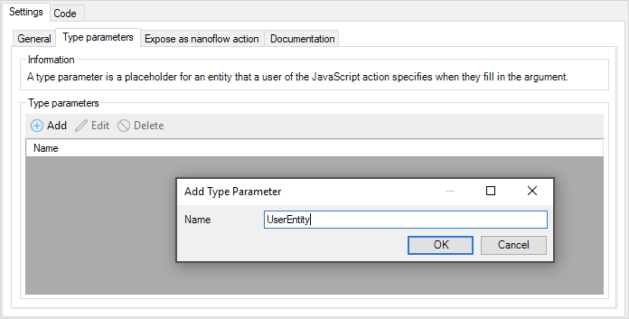

13. Open the **General** tab again and add a new parameter of the type **Entity**. Select **Fill in a type parameter**, then from the **Type parameter** drop-down menu select **Type parameter 'UserEntity'**. This will couple the input entity with the generic type parameter:

	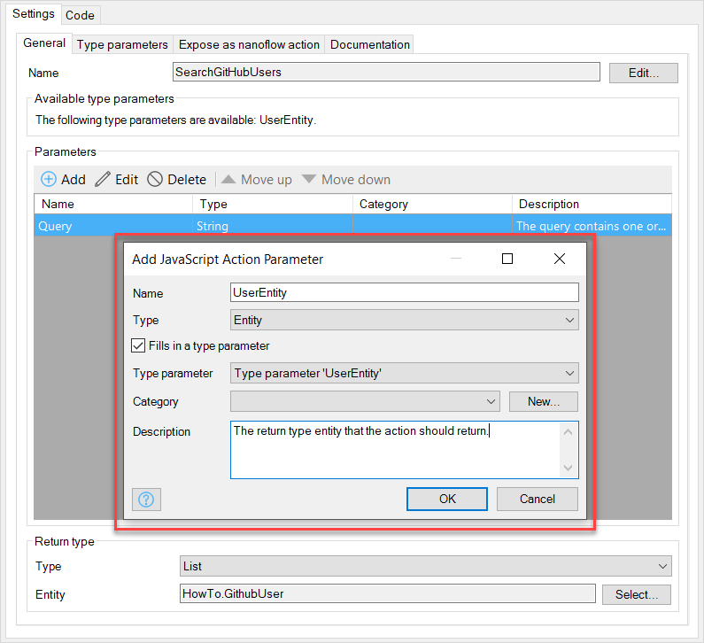

14. In **Return type** > **Entity** do the following: <br/>
	a. Click **Select**. <br/>
	b. Select **Type Parameters** > **UserEntity**. <br/>
	c. Click **OK**:

	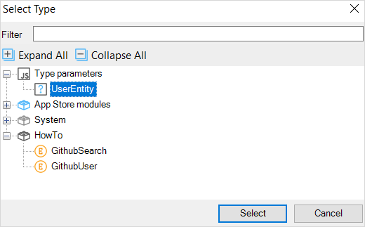

15. Your final step is updating the code. The new `userEntity` parameter has already been added. In the `mx.data.create` function, set `userEntity` as the `entity` to be created. Then, add some documentation for future reference:

	```javascript
	/**
	Searching users on GitHub.com, it could find users via various criteria. This action returns up to 100 results.
	@param {string} query - The query contains one or more search keywords and qualifiers. Qualifiers allow you to limit your search to specific areas of GitHub.
	@param {string} userEntity - The entity to match the Return type Entity
	@returns {MxObject[]}
	*/
	function SearchGitHubUsers(query, userEntity) {
		// BEGIN USER CODE
		// Documentation: https://developer.github.com/v3/search/#search-users
		// Will return JSON structure
		// {
		//   "total_count": 82531,
		//   "incomplete_results": false,
		//   "items": [
		//      {
		//        "login": "mojombo",
		//        "avatar_url: "http://..."
		//      }
		//    ]
		//  }
		if (!query) {
			return [];
		}
		var url = "https://api.github.com/search/users?q=" + query;
		return fetch(url) // Fetch returns a promise, gets the URL and wait for results
			.then(function(response) { return response.json() }) // Transform response to JSON
			.then(function(jsonData) { // Handle the JSON
				logger.debug("count", jsonData.total_count);
				var gitHubUsers = jsonData.items.map(createGitHubUser);
				return Promise.all(gitHubUsers);
			});

		function createGitHubUser(user) {
			// Wrap the Mendix Client API in a promise
			return new Promise(function (resolve, reject) {
				mx.data.create({
					entity: userEntity,
					callback: function(mxObject) {
						// Dynamically set attributes
						mxObject.getAttributes()
							.forEach(function(attributeName) {
								var attributeValue = user[attributeName];
								if (attributeValue) {
									mxObject.set(attributeName, attributeValue);
								}
							});
						resolve(mxObject);
					},
					error: function(error) {
						reject("Could create object:" + error.message);
					}
				});
			});
		}
		// END USER CODE
	}
	```

16. You have just implemented an advanced JavaScript action! Start using the action in your nanoflows by adding a **JavaScript action call**, and then selecting the newly created **SearchGitHubUsers** action:

	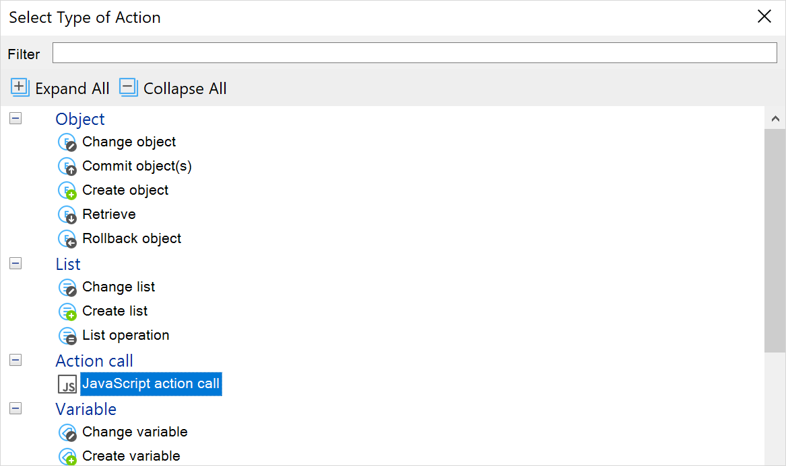

	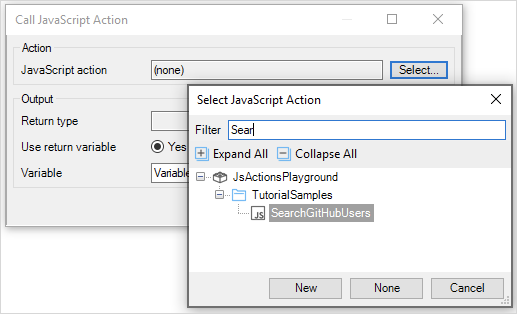

	Optionally, you can expose the JavaScript action as a nanoflow action. When you do, you can choose a **Caption**, **Category**, and **Icon**. Note that your icon image will need to be in an existing [image collection](/refguide/image-collection):

	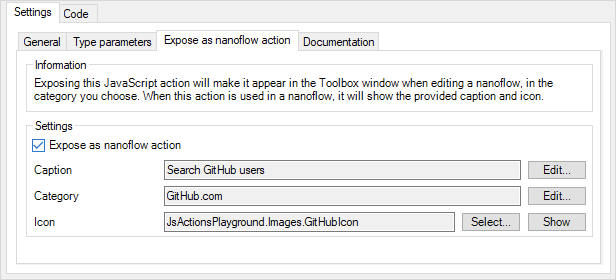

	It will then appear in the **Toolbox** window when editing a nanoflow:

	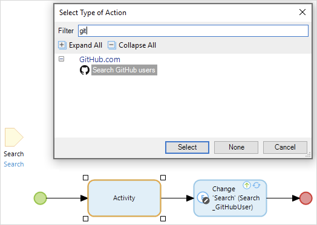

17. To test your JavaScript action, do the following: <br/>
	a. Add the **SearchGitHubUsers** action to the search nanoflow then double-click it. <br/>
	b. Click **User entity** > **Select**, then double-click the **GitHubUser** entity. <br/>
	c. Click **Query** > **Edit**, then type in *$GithubSearch/Query* and click **OK**. <br/>
	d. To display the results in the user interface, type *UserList* into the **List** field. <br/>
	e. Your finished **Call JavaScript Action** will look like this:

	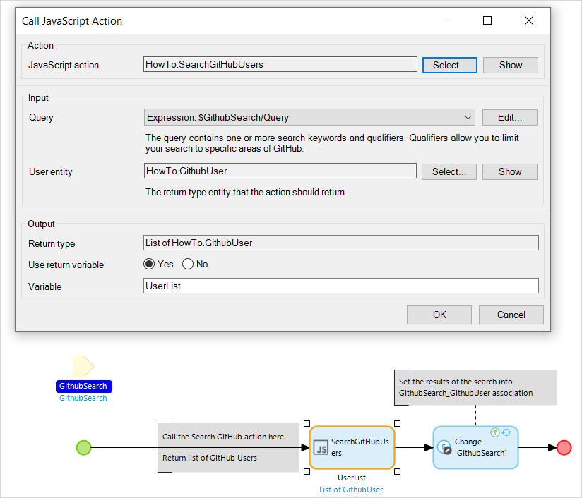

18. To edit your **Change Object** activity, do the following: <br/>
	a. Double-click your **Change Object** activity. <br/>
	b. Select **GithubSearch(HowTo.GithubSearch)** from the **Object** drop-down menu. <br/>
	c. Click **Action** > **New**. <br/>
	d. Select **HowTo.GithubSearch_GithubUser(ListofHowTo.GithubUser)** from the **Member** drop-down menu. <br/>
	e. Type *$UserList* into the **Value** field and click **OK**. <br/>

	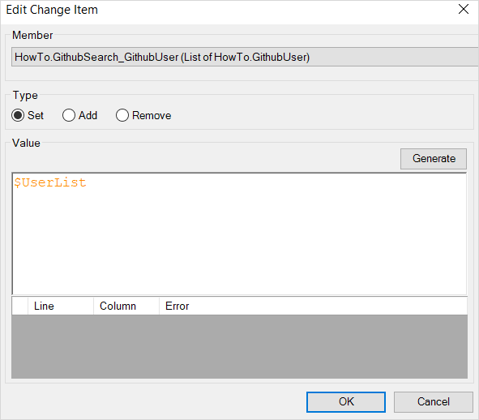
	
	f. Your finished **Change Object** action will look like this:
	
	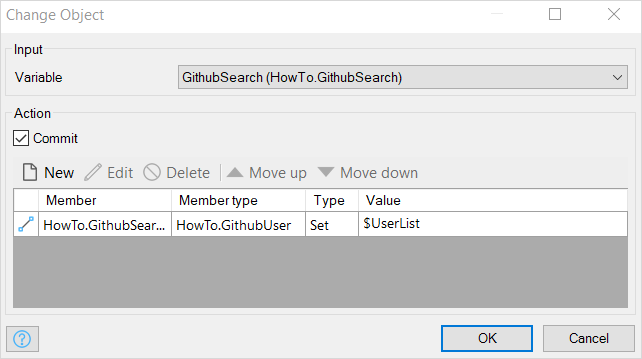

19. Run your project, then use your new search action to find a GitHub user:

	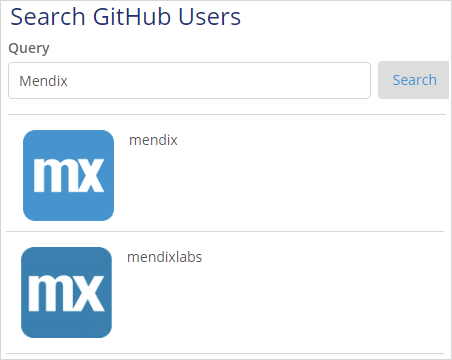

20. If your project did not function correctly, consult the **Solution** folder to see correct versions of the nanoflow and JavaScript action:

	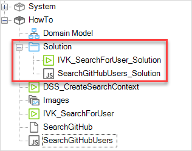

Congratulations! Using the power of JavaScript actions, your app can search for any GitHub user.

## 5 Read More

* [Build JavaScript Actions: Part 1 (Basic)](write-javascript-actions)
* [Mendix Client API](https://apidocs.mendix.com/8/client/)
* [JavaScript Actions](/refguide/javascript-actions)
* JavaScript Resources
	* [JavaScript Basics](https://developer.mozilla.org/en-US/docs/Learn/Getting_started_with_the_web/JavaScript_basics)
	* [Promises](https://developer.mozilla.org/en-US/docs/Web/JavaScript/Reference/Global_Objects/Promise)
	* [Fetch API](https://developer.mozilla.org/en-US/docs/Web/API/Fetch_API)