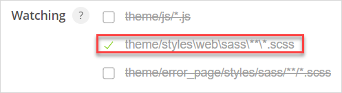

## 1 Introduction

Calypso is a tool which [**EDIT for specificity: automatically processes your styling code after saving**]allows you to customize your Mendix apps. Designers and front-enders, Mac users and Windows users — everyone can easily use this tool without installing any external dependencies. Everything is packaged inside Calypso. You simply need to install Calypso, choose your Mendix app, and start customizing. As you customize, Calypso eases your work by doing the following:

* Checks Sass files for errors
* Compiles Sass files to CSS
* Shows notifications on errors
* Moves watched (compiled) files to deployment folder (**todo which is it**?)
* Injects Sass files into browser for instant changes (**todo: for instant changes -> so you can see your changes instantly?**)

## 2 Prerequisites

* Download Calypso from its [GitHub repository](**LINK HERE PLZ**)

## 3 Setting Up Calypso

1. Install Calypso.
2. Open Calypso. 
3. In the **Hostname** drop-down menu, select the host name of your Mendix app's device (or put its IP address in manually by clicking **Other** and typing in the IP address). Most Windows users should select **localhost**. If you are running Windows through a virtual machine, use your virtual machine's IP address as the **Hostname**. Alternatively you can install Calypso on a virtual machine and choose **localhost**.
4. If this is your first time using Calypso, you may have to tell your Windows firewall to **Allow access** to use Calypso.
5. Configure your **Port**. A Mendix app normally runs on port 8080. However, if you are running multiple Mendix apps, or changed your port configuration, your port number may be different. Find your port information by navigating to **Project {YourProjectName}** > **Settings** **CANNOT FIND THIS PATHWAY**, then type that number into Calypso's **Port** field.
6. In **Apps Collection**, click the **Browse** button and then select the folder which contains all your Mendix apps. Configuring this enables you to switch easily between apps. 
7. Complete **App Folder** by selecting the folder of your Mendix app from the drop-down menu.
8. Complete **Watching** to specify which files you want to be processed by Calypso. Most users will only need to select the **Watching** > **theme/styles** path. However, when you are building custom error pages or are using JavaScript on your pages, you may wish to select the other two folders as well.

	

9. Should you prefer it, click the sun in the top-right corner to toggle between dark mode and regular mode.