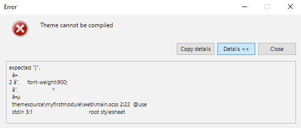
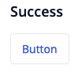
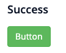

[!!! TODO:  review meta above]

[!!! TODO:  check how scss renders. in my local preview it is prefixed with "\"]

[!!! TODO:  there are todo items in this page; missing content, links]

## 1. Introduction

This page describes how developers can change the styling of apps and create re-usable styling. For (progressive) web apps SASS (SCSS) is used and for native mobile apps JavaScript is used. Note that even though the technologies differ, the approach for customizing styling is the same.

## 2. Changing the app look and feel

Developers have several options to change the look and feel of the apps. Depending on whether you are a Studio user or Studio Pro user, there are different options.

### 2.1. Changing the default theme settings

An often first and simple step is to change the theme setting to quickly adjust the theme to the company brand by changing the colors.

For Studio users there is the [Theme Customizer](https://docs.mendix.com/studio/theme-customizer) that can be used to change the basic look and feel of the app which will become visible immediately.

For Studio Pro users there are more options to change the default theme settings. In the theme folder there is a custom-variables file (for both web apps and native mobile apps) which can be used to simply change many of the theme settings for the app. Also see [Customize styling: File and folder structure](TODO)

Changes can be quickly previewed as discussed in [Customize styling: Previewing a change in Styling](TODO)

### 2.2. Adding custom styling

Developer can add custom styling for apps in the `theme/web` or `theme/native` folder.

For (progressive) web apps, custom styling should be placed in theme/web and linked from (or placed in) main.scss. For native mobile apps, custom styling should be placed in theme/native and linked from (or placed in) main.js.

While custom styling can be added directly in the main.scss or main.js it is a best practice to separate styling in files and include these files in main.scss or main.js. See also [Best practices](TODO)

Within custom styling the theme settings (colors, spacings etc), as configured in custom-variables.scss or custom-variables.js can be re-used. This is also recommended to provide a consistent user experience.

#### 2.2.1. Web environment example:

In the following example a custom style is added to change any matching element's font-size upon use.

Steps: 

1. In `theme/web/custom-variables.scss` add a SCSS variable by adding the following code to the file: 

```scss
$company-header-text-size: 30px;
```   

2. Create a new file `theme/web/company-header.scss`. In the new file create a class with a selector name (`.company-header`) and include a CSS property that references the variables created in step 1.

```scss
.company-header { font-size: $company-header-text-size; }
```

3. Import the new file in `theme/web/main.scss` by adding the following: 

```scss
@import “company-header”;
```

This ensures the SCSS is included in CSS compilation.

#### 2.2.2. Native environment example:

In this example we will be creating a custom style which will change the font size of text upon use.

Steps:

1. Add a JavaScript variable in `theme/native/custom-variables.js` with the following code: `export const companyHeaderTextSize = 30;`.

2. Create a new file `theme/native/company-header.js`. In the new file, the newly defined variable defined in step needs to be imported. Create a variable with an object value, containing property `fontSize` with the value referencing the newly defined custom-variable, then export the variable. The following code achieves this:

```javascript
import { companyHeaderTextSize } from “./custom-variables”;
export const companyHeader = { fontSize: companyHeaderTextSize };
```

3. Import the object defined in `company-header.js` and expose it in `theme/native/main.js` as follows:

```javascript
import {companyHeader} from “./company-header”;
module.exports = {companyHeader};
```

### 2.3. Importing CSS (web only)

The theme of an app is based on SASS (`.scss` files), but it can be needed to include additional CSS files from 3rd party libraries. This can be done by adding the 3rd party library file to the cssFiles property in `theme/web/settings.json`

See the following fragment as an example how additional css can be loaded.

Below a 3rd party file `water.css` is added and will be applied to the app. The 3rd party CSS file should be in `theme/web`.

```json
{
  "cssFiles": ["theme.compiled.css", "water.css"]
}
```

## 3. Create re-usable styling

The previous section describes how developers can customize the styling of an app. Next to that it is possible to place styling inside modules, which can then be re-used in other apps. This can be used to [create a theme module](TODO) or a [company design system](TODO).

Adding styling to a module is similar to adding styling to a project, except that styling resources are placed in the themesource folder as explained in [Customize styling: File and folder structure](TODO)

For classes that are generic or that should be easy discoverable a developers consider creating design properties for this. For more information see [Extend design properties](TODO)


## 4. Create a theme module

Styling which can be easily re-used through modules across projects. By default, the theme settings like color, font, spacing etc are in the theme folder, which is per app specific. However, often it is desired to-reuse these settings to create a consistent look and feel across apps.

This can be done by creating a theme module and making the custom-variables file in the theme folder point to the custom variables file in your theme module. For creating a full design system see or to [Create a company design system](TODO) See the instructions below for more details on creating a re-usable theme module.

### 4.1. Web

As an example, the following variables in `theme/web/custom-variables.scss` will be modularised into a re-usable theme module:

```scss
$gray-primary: #e7e7e9;

$brand-default: $gray-primary;
$brand-primary: #264ae5;
$brand-success: #3cb33d;
$brand-warning: #eca51c;
$brand-danger: #e33f4e;
```

Steps:

1. Create a new module in Studio Pro. Right-click “Project <name>” in the Project-Explorer, then click “Add new module…”. Give it a name, for this example the module’s name is “mytheme”.
2. In your Mendix project directory, create a new file `themesource/mytheme/web/custom-variables.scss`.

{}
To open your Mendix project directory from Studio Pro, click “Project” in the top menu-bar, then click “Show Project Directory in Explorer”.
{}

3. Cut the variables from `theme/web/custom-variables.scss` and paste them in `themesource/mytheme/web/custom-variables.scss`.
4. In `theme/web/custom-variables.scss` add `@import "../../themesource/mytheme/web/custom-variables.scss` to the top of the file, replacing “mytheme” with your module name.

The result of the two files for this example:

_theme/web/custom-variables.scss:_

```scss
@import "../../themesource/mytheme/web/custom-variables.scss";
```

_themesource/mytheme/web/custom-variables.scss:_

```scss
$gray-primary: #e7e7e9;

$brand-default: $gray-primary;
$brand-primary: #264ae5;
$brand-success: #3cb33d;
$brand-warning: #eca51c;
$brand-danger: #e33f4e;
```

You can now export the “mytheme” module from Studio Pro to re-use in your apps. Note, you need to add the “@import …” line to `theme/web/custom-variables.scss` for every app that imports the module. Therefore, it is often recommended to create a company starter app containing this change.

To test the theme for all the widgets, page templates, and building blocks, it can also be helpful to use the Atlas Design System app as discussed in [Create a company design system](TODO).

{}
Note: if this is done, the Theme customizer in Studio does not work anymore as that depends on the custom variables in the theme folder.
{}

### 4.2. Native mobile

As an example, the following variables in `theme/native/custom-variables.js` will be modularised into a re-usable theme module:

```javascript
export const brand = {
    primary: "#264AE5",
    success: "#3CB33D",
    warning: "#ECA51C",
    danger: "#E33F4E",
    info: "#0086D9",
    primaryLight: "#F3F5FF",
    successLight: "#F1FCF1",
    warningLight: "#FFF9E6",
    dangerLight: "#FFEEF0",
    infoLight: "#ECF9FF"
};
```

Steps:

1. Create a new module in Studio Pro. Right-click “Project <name>” in the Project-Explorer, then click “Add new module…”. Give it a name, for this example the module’s name is “mytheme”.
2. In your Mendix project directory, create a new file `themesource/mytheme/native/custom-variables.js`.

Note: To open your Mendix project directory from Studio Pro, click “Project” in the top menu-bar, then click “Show Project Directory in Explorer”.

3. Cut the export statement and variables from `theme/native/custom-variables.js` and paste in `themesource/mytheme/native/custom-variables.js`.
4. In `theme/native/custom-variables.js` add `export * from "../../themesource/mytheme/native/custom-variables";` to the top of the file, replacing “mytheme” with your module name.

The result of the two files for this example:

_theme/native/custom-variables.js:_

```javascript
export * from "../../themesource/mytheme/native/custom-variables";
```

_themesource/mytheme/native/custom-variables.js:_

```javascript
export const brand = {
    primary: "#264AE5",
    success: "#3CB33D",
    warning: "#ECA51C",
    danger: "#E33F4E",
    info: "#0086D9",
    primaryLight: "redbaby",
    successLight: "#F1FCF1",
    warningLight: "#FFF9E6",
    dangerLight: "#FFEEF0",
    infoLight: "#ECF9FF"
};
```

If you get errors, double check if the imports point to valid files.

{}
When this approach is used it is recommended to create a company starter app that out of the box contains the theme module and already contains this change in the theme folder to point to the module.
{}

## 5. Preview a styling change

Depending on the type of app you are building, the preview of a styling/theme change is different.

### 5.1. Web apps

Mendix monitors the file system in the theme and themesource folder for changes in the `.scss` files. When a change is detected, the `.scss` files are compiled to CSS and the app is automatically reloaded (if it is running), so no additional tooling is needed. For more information on how the scss is compiled see [Customize styling: Styling-output](TODO)


### 5.2. Native mobile apps

Mendix monitors the file system in the `theme` and `themesource` folder for changes in the `.js` files. When loading a native mobile app in the Make it Native app there is the “Enable developer mode” option. If this setting is not enabled, after making a styling change, you can reload the app with a three-finger tap.

[!!! TODO link to make it native app @Stefanos M Can you provide these?]

If the developer mode setting is enabled, and changes are made in the JavaScript styling files, the app automatically reloads with the new styling. 

## 6. File and folder structure

Mendix offers a modular and flexible approach for styling apps. Styling can be done on app level, for app specific styling, and styling can be put in modules for re-use.
To facilitate the app level and module level styling the following file and folder structure is used, where the theme folder is used for app specific styling and the themesource folder is used for re-usable module styling.

The table below describes the file structure for the theme folder and for modules.

| theme       |                       |                       |                        | This folder contains app specific styling resources.                                                                                                                                                                                                                                                                                                                                                                                                                |
|-------------|-----------------------|-----------------------|------------------------|---------------------------------------------------------------------------------------------------------------------------------------------------------------------------------------------------------------------------------------------------------------------------------------------------------------------------------------------------------------------------------------------------------------------------------------------------------------------|
|             | `web`                   |                       |                        | This folder contains app specific styling resources for (progressive)  web apps.                                                                                                                                                                                                                                                                                                                                                                                  |
|             |                       | `custom-variables.scss` |                        | This file contains the theme setting which can be configured to easily change colors, font, spacing etc.                                                                                                                                                                                                                                                                                                                                                            |
|             |                       | `main.scss`             |                        | This file is the starting point for adding custom styling.                                                                                                                                                                                                                                                                                                                                                                                                          |
|             |                       | `settings.json`         |                        | This file contains the (external) CSS files that should be loaded. This includes the CSS result of the SASS compilation.                                                                                                                                                                                                                                                                                                                                         |
|             | `native`                |                       |                        | This folder contains app specific styling resources for native mobile apps.                                                                                                                                                                                                                                                                                                                                                                                         |
|             |                       | `custom-variables.js`   |                        | This file contains the theme setting which can be configured to easily change colors, font, spacing etc.                                                                                                                                                                                                                                                                                                                                                            |
|             |                       | `main.js`               |                        | This file is the starting point for adding custom styling.                                                                                                                                                                                                                                                                                                                                                                                                          |
| `themesource` |                       |                       |                        | This folder contains module specific styling. Every module has a folder that can contain styling resources.                                                                                                                                                                                                                                                                                                                                                         |
|             | `Atlas_core` (required) |                       |                        | This folder from the Atlas core module which is the core for all Mendix apps. This module should always be part of a project as other modules depend on this and it contains all the styling for the Mendix widget. The content of this folder should not be changed as that will cause issues with migrating/updating to newer versions. For information about disabling default styling from this module see [Customize styling: Disabling-default-styling-from](TODO) |
|             |                       | `web`                   |                        | This folder (and  subfolders) contain the web resources for the standard Mendix supported widgets                                                                                                                                                                                                                                                                                                                                                                 |
|             |                       | `native`                |                        | This folder (and  subfolders) contain the native mobile resources for the standard Mendix supported widgets                                                                                                                                                                                                                                                                                                                                                       |
|             | MODULE_NAME           |                       |                        | Per module a folder is created which can contain styling resources for (progressive) web apps and native mobile apps                                                                                                                                                                                                                                                                                                                                             |
|             |                       | `web`                   |                        | This folder contains re-useable web resources                                                                                                                                                                                                                                                                                                                                                                                                                       |
|             |                       |                       | `main.scss`              | This file is the starting point for the module web based styling,                                                                                                                                                                                                                                                                                                                                                                                                   |
|             |                       |                       | `design-properties.json` | This file contains additional design properties that are based on the classes defined in this module.                                                                                                                                                                                                                                                                                                                                                               |
|             |                       | `native`                |                        | This folder contains re-useable native mobile resources                                                                                                                                                                                                                                                                                                                                                                                                             |
|             |                       |                       | `main.js`                | This file is the starting point for the module native mobile based styling,                                                                                                                                                                                                                                                                                                                                                                                         |
|             |                       |                       | `design-properties.json` | This file contains additional design properties that are based on the classes defined in this module.                                                                                                                                                                                                                                                                                                                                                               |


## 7. Styling output

With the modular structure of the styling of Mendix app, the styling files are placed in different folders. Studio (Pro) automatically combines the files to a single output (stylesheet for web and javascript for native) which is used by the app in the browser or on the device. The following sections describe in more detail how this is done.


### 7.1. Web apps

Studio (pro) combines the different `.scss` files in a certain order and compiles the SASS into CSS which is used in the browser. The compiled output and necessary resources are saved in a folder named `theme-cache`.
Note: The content of this folder is regenerated regularly (e.g. when opening the project or pressing F4) and therefore should not be changed manually. Also note, that the `theme-cache` folder is included when uploading your project to Teamserver. It is required to see the correct styling in Studio, which is why it's strongly recommended to commit any changes when the styling has changed.

The compilation of the .scss files is done in the following order:

1. All `main.css` files from the `themesource` folders of Market Place modules, in alphabetical order of the names of the modules
2. All `main.css` files from the `themesource` folders of user modules, ordered as in Studio Pro
3. Custom variables from theme folder (`theme/web/custom-variables.scss`)
4. `main.scss` from theme folder (`theme/web/main.scss`)

If there are errors during the SASS compilation, these will be shown in Studio pro in a popup. This error gives hints on what went wrong and should be fixed.

[!!! TODO This will no longer be an error but consistency warning... this will need to change at some point.]



### 7.2. Native Mobile apps

For native mobile apps the React Native framework is used to combine all the javascript file in one file, using a so called bundler that is responsible for creating the javascript bundle that is used to run the app. The bundler scans for all .js files in the following folders.

[!!! TODO list which folders are being scanned.]

[!!! TODOis there a specific order users need to care about?]

If there are errors during the bundling, these will be shown WHEN exactly? Both in studio pro and in make it native app?

[!!! TODO Explain the above]

For more details on styling native mobile apps see: [native mobile styling](TODO) 

## 8. Disabling default styling from Atlas Core

Mendix provides styling for the support widgets in the Atlas core module. In general, for every widget there is base styling to provide a default look and feel for the widget and helper styling, which can be seen as additional styling/variations that can be used to fit the widget into its context. Styling can be overridden, but in some cases it can be preferred to disable this default styling. This is possible by excluding styling using variables which can be set in the exclusion variables file.

### 8.1. Disable default web widget styling

To disable the default styling of a web widget, open the `exclusion-variables.scss` file located in the folder `<Mendix project>/theme/web`. This file contains supported exclusion variables. Note that these variables can be part of a custom theme module as well, just like the custom variables as described in [Customize styling: Create a theme module](TODO), by making the `exclusion-variables.scss` file in the app specific theme folder point to the exclusion variables file in your theme module.

Let’s pick the button widget as an example. The success button is by default styled as in **Figure 1**.


**Figure 1 - All styles enabled**

To exclude additional styles, like the success button styles, the button helper styles need to be disabled. This can be achieved by setting the variable `$exclude-button-helpers` to `true`:

```scss
$exclude-button-helpers: true;
```

The resulting success button is visible in **Figure 2**.



**Figure 2 - Helper styles disabled**

To remove the complete default look and feel, both base and helper styles need to be disabled. This can be achieved by setting the variable `$exclude-button` to `true` as well:

```scss
$exclude-button: true;
$exclude-button-helpers: true;
```

It isn’t necessary to set both variables to true to exclude all styles, since Atlas automatically excludes helper styles when the base styles are excluded. Additional styles are useless when base styles are missing. Therefore, the following configuration is equivalent to the previous one:

```scss
$exclude-button: true;
$exclude-button-helpers: false;
```

The resulting success button is visible in **Figure 3**. Note that the underlying Bootstrap styles, the styles that the Atlas UI Framework is build upon, have become visible now.



**Figure 3 - All styles disabled (visible Bootstrap styles)**

All supported exclusion variables for web are:

```text
- $exclude-background-helpers
- $exclude-badge
- $exclude-badge-button
- $exclude-badge-button-helpers
- $exclude-button
- $exclude-button-helpers
- $exclude-check-box
- $exclude-custom-dijit-widget
- $exclude-custom-switch
- $exclude-data-grid
- $exclude-data-grid-helpers
- $exclude-data-view
- $exclude-data-picker
- $exclude-glyphicon
- $exclude-grid
- $exclude-group-box
- $exclude-group-box-helpers
- $exclude-header
- $exclude-helper-classes
- $exclude-input
- $exclude-image-helpers
- $exclude-label
- $exclude-label-helpers
- $exclude-layout-grid
- $exclude-list-view
- $exclude-list-view-helpers
- $exclude-modal
- $exclude-navigation-bar
- $exclude-navigation-bar-helpers
- $exclude-navigation-list
- $exclude-navigation-tree
- $exclude-navigation-tree-helpers
- $exclude-pagination
- $exclude-pop-up-menu
- $exclude-progress
- $exclude-progress-bar
- $exclude-progress-bar-helpers
- $exclude-progress-circle
- $exclude-progress-circle-helpers
- $exclude-radio-button
- $exclude-range-slider
- $exclude-range-slider-helpers
- $exclude-rating
- $exclude-rating-helpers
- $exclude-simple-menu-bar
- $exclude-simple-menu-bar-helpers
- $exclude-slider
- $exclude-slider-helpers
- $exclude-table
- $exclude-table-helpers
- $exclude-tab-container
- $exclude-tab-container-helpers
- $exclude-template-grid
- $exclude-template-grid-helpers
- $exclude-timeline
- $exclude-typography
- $exclude-typography-helpers
```

### 8.2. Disable default native mobile widget styling

To disable the default styling of a native mobile widget, open the `exclusionVariables.js` file located in the folder `<Mendix project>/theme/native`. This file contains supported exclusion variables. Note that these variables can be part of a custom theme module as well, just like the custom variables as described in [Customize styling: Create a theme module](TODO), by making the `exclusionVariables.js` file in the app specific theme folder point to the exclusion variables file in your theme module.

Let’s pick the button widget as an example again. The success button is by default styled as in **Figure 4**.


**Figure 4 - All styles enabled**

To exclude additional styles, like the success button styles, the button helper styles need to be disabled. This can be achieved by setting the constant variable `excludeButtonsHelpers` to `true`:

```javascript
export const excludeButtonsHelpers = true;
```

The resulting success button is visible in **Figure 5**.


**Figure 5 - Helper styles disabled**

Also for native mobile widgets both base and helper styles need to be disabled, to remove the complete Atlas look and feel. This can be achieved by setting the variable `excludeButtons` to `true` as well:

```javascript
export const excludeButtons = true;
export const excludeButtonsHelpers = true;
```

It isn’t necessary to set both variables to `true` to exclude all styles, since Atlas automatically excludes helper styles when the base styles are excluded. Additional styles are useless when base styles are missing. Therefore, the following configuration is equivalent to the previous one:

```javascript
export const excludeButtons = true;
export const excludeButtonsHelpers = false;
```

The resulting success button is visible in **Figure 6**. Note that the button text is white and, thus, not visible.


**Figure 6 - All styles disabled (button text is white)**

All supported exclusion variables for native mobile are:

```text

- excludeActivityIndicator
- excludeActivityIndicatorHelpers
- excludeAnimation
- excludeBackgroundImage
- excludeBadge
- excludeBadgeHelpers
- excludeBottomSheet
- excludeButtons
- excludeButtonsHelpers
- excludeCarousel
- excludeCheckBox
- excludeColorPicker
- excludeContainer
- excludeDatePicker
- excludeDropDown
- excludeFeedback
- excludeFAB
- excludeFABHelpers
- excludeImage
- excludeImageHelpers
- excludeIntroScreen
- excludeIntroScreenHelpers
- excludeLayoutGrid
- excludeLineChart
- excludeLineChartHelpers
- excludeBarChart
- excludeBarChartHelpers
- excludeListView
- excludeListViewHelpers
- excludeListViewSwipe
- excludeListViewSwipeHelpers
- excludeMaps
- excludeMapsHelpers
- excludePageTitle
- excludeProgressBar
- excludeProgressBarHelpers
- excludeProgressCircle
- excludeProgressCircleHelpers
- excludePopUpMenu
- excludeQRCode
- excludeRangeSlider
- excludeRangeSliderHelpers
- excludeRating
- excludeReferenceSelector
- excludeSafeAreaView
- excludeSlider
- excludeSliderHelpers
- excludeTabContainer
- excludeTabContainerHelpers
- excludeTextArea
- excludeTextBox
- excludeTextBoxHelpers
- excludeToggleButtons
- excludeTypography
- excludeTypographyHelpers
- excludeVideoPlayer
- excludeWebView
- excludeHelpers
```

## 9. Customizing index.html (Web)

By default, Mendix generates the index.html (the page that is loaded to start the app), based on the app configuration. In some cases it may be needed to customize this HTML, which can be done by creating a file called `index.html` in the `theme/web` folder. To make sure that your file has the right structure, we advise you to copy `index-example.html` from the `deployment/web` folder to the `theme/web`, rename it to `index.html`, and then use it as a starting point. This file will be created after you have deployed your app locally at least once.


## 10. Customizing Unsupported Browser (Web)

When an end-user open a Mendix app in an unsupported browser, a page is shown that the current browser is not supported and explain which other browsers can/should be used. To customize this screen, you can create a custom html file called `unsupported-browser.html` in the `theme/web` folder. If desired, you can copy `unsupported-browser.html` from the `deployment/web` folder to the `theme/web` folder and use it as a starting point. This file will be created after you have deployed your app locally at least once.
