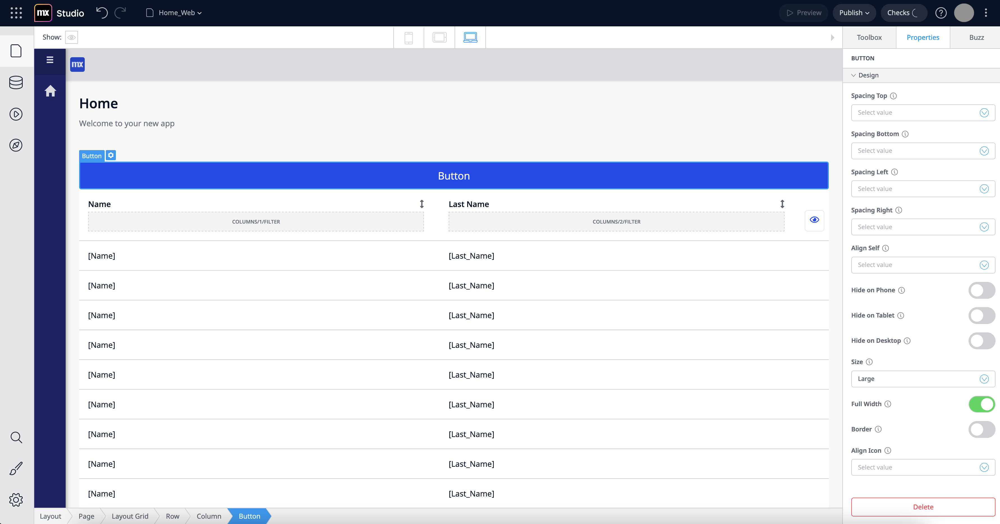
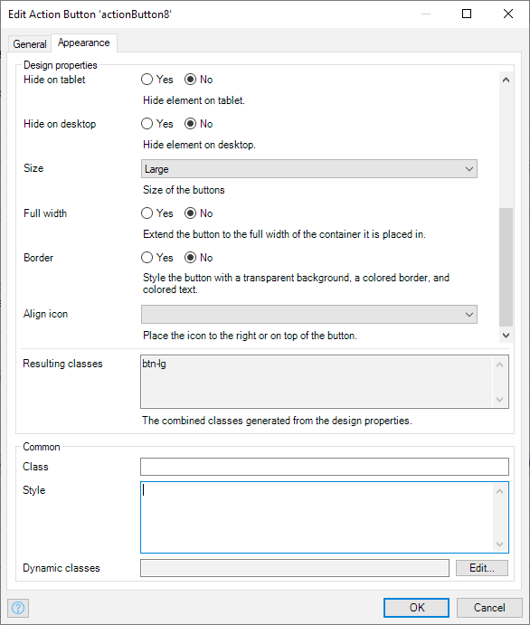

[!!! TODO: Verify menu_order and tags]

Design properties are a powerful concept to make it simple to change the appearance of widgets, which can include properties like colors, borders, and spacing. Out of the box, the atlas framework comes with a default set of design properties which can be extended.

Design properties are based on the classes in the styling for both web apps and native mobile apps. Basically a design property toggles a class.

In both Studio and Studio Pro, design properties are visible as part of the widget properties:

Developers can [add additional design properties as part of a module](customize-styling). Check out the [API documentation on design properties](../../apidocs-mxsdk/apidocs/design-properties.md) to learn how to add design properties.

[!!! TODO: make customize styling link more precise to point to File and folder structure section]
