## 1 Introduction

This document will cover the basics of how you work with Navigation Layouts. 

**This how-to will teach you how to do the following:**

* Select the right navigation layout
* Understanding the difference between top and left navigation
* Configure the sidebar toggle

## 2 Selecting the Correct Navigation Layout

When building an app with Mendix, the first thing you have to decide on is which navigation layout to choose. These layouts are the frame within which your dynamic pages are housed, and provide consistent structure through your app.  

Layouts specify what goes where. Each page is based on a layout. The layout contains widgets and structures that return on every page based on that layout. 

Mendix's Atlas UI provides two distinct web for you to choose from: Atlas Default and Atlas Topbar.

### 2.1 Atlas Default

The default layout of Atlas is a responsive layout which can be used across web, tablet, and mobile devices:

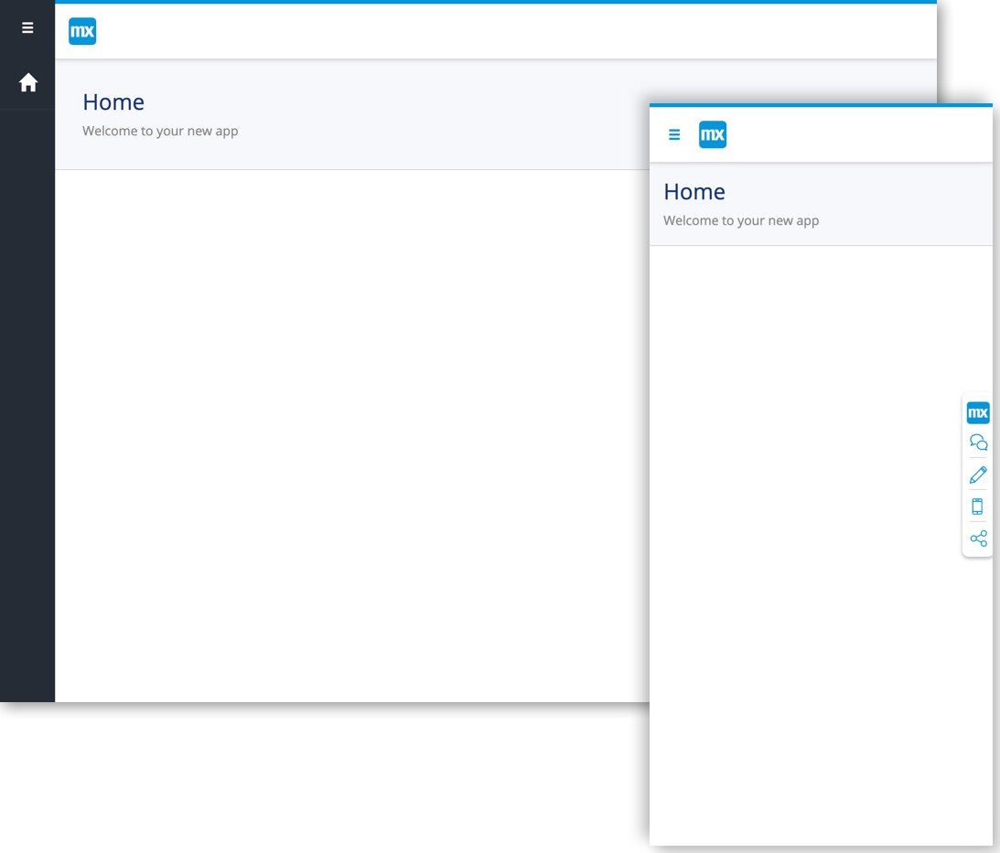

It has three regions: top, left, and center. The top region contains the brand logo of your application, the left region your navigation menu, and the center region your dynamic content:

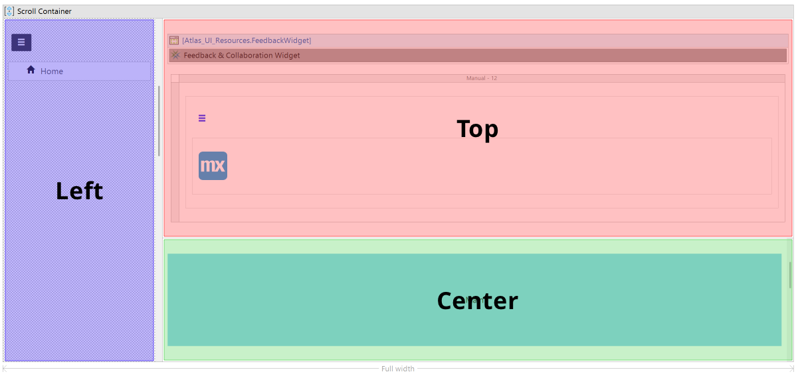

The navigation menu of Atlas Default is a toggled menu. Options for this toggled menu are to **shrink content (initially open)** or to **shrink content (initially closed)**:

*  **Shrink content (initially open)** — the navigation menu will initially start ope, at its maximum width displaying both the menu item's description and icon. When toggled it will move to its minimum width and display just the menu item's icon. The page's content (center region) also starts shrunk to make space for the open menu:

	

*  **Shrink content (initially closed)** — the navigation menu will initially start closed at its minimum width displaying just the menu item's icon. When toggled it will move to its maximum width and display both the menu item's icon and description. The page's content (center region) does not not start shrunk, but will shrink when sidebar is toggled:

	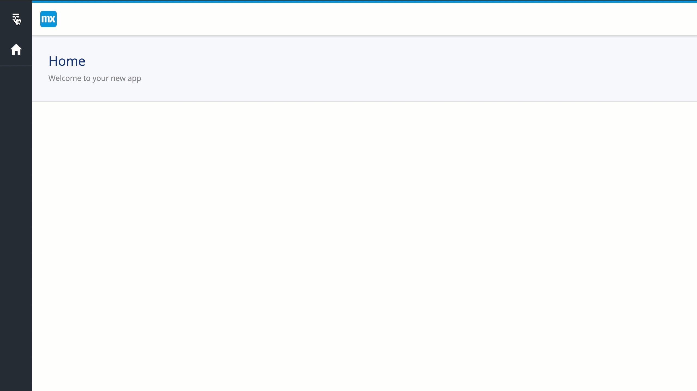

### 2.2 Atlas TopBar

The TopBar layout of Atlas a responsive layout which can be used 
across web, tablet and mobile devices:

It has three regions: top, left, and center. The top region though contains both the brand logo and the navigation menu. The left region does contain a navigation menu, but it is only visible at phone screen size. At that screen size the navigation menu in the top region will be hidden and replaced with a hamburger toggle which triggers the  opening and closing of the left region. The center region houses the dynamic content of your app:

The options for the sidebar (unlike the Atlas Default) are only applicable at phone screen size. You then have two options for how the sidebar is toggled: **slide over content** and **push content aside**: 

*  **Slide over content** — the sidebar will move to overlay ontop of the content, hiding a portion (depends on the width of the sidebar) of the content:

	

*  **Push content aside** — the sidebar will push the content off-screen: 

	

### 2.3 Choosing Between Layouts

Choosing between the two layouts (Atlas Default and Atlas Topbar) comes down to a decision of top navigation versus left navigation, The information below will help you determine which approach better suits your users. The sections below assume your app is designed for users who read left to right, but Mendix may release more design guidance and options for other language cultures in the future.

When it comes down to deisgning for your users, context is key. A navigation that works well in one context may not as well in another. To determine which navigation is best for your app, it is important to understand the different contexts where the top and left navigation work best:

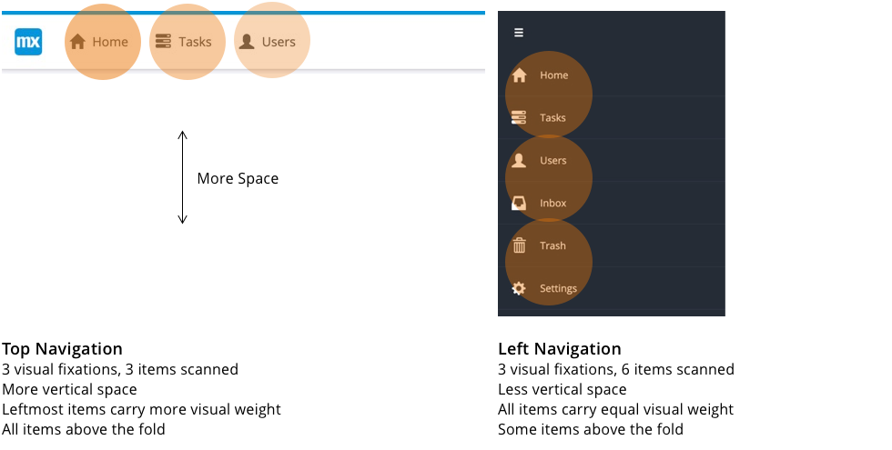

### 2.3.1 Scanning

A left navigation is faster and more efficient for users to scan. In just three visual fixations, users scan six items in the left navigation compared to the three items scanned in the top navigation. The left navigation also facilitates a vertical scanning direction that is natural for people, while the top navigation forces a horizontal scanning direction that people often use when they are reading.

### 2.3.2 Page Space

A top navigation conserves more vertical page space than a left navigation. With a left navigation, the navigation links occupy the left column of your page. This shrinks and narrows the content area of your page, which means you will have less space for your content. A top navigation, however, uses minimal vertical space which allows you to fill your page's content area with content only.

### 2.3.3 Item Priority

Items in a top navigation do not have equal weight. The leftmost items carry more visual weight than other items because of their placement in the primary optical area (top left). Items in the top-left area get more exposure and are often seen as more important than other items. The items in  left navigation, however, do have equal weight because they are all placed on the left with no other items in their opposing direction on the right. Because users read items from left to right, the priority direction for reading items is stronger horizontally than vertically.

### 2.3.4 Visibility

Top navigation items are more visible because they are always above the fold and are easier to find. Left navigation items are not always above the fold; sometimes if you have too many items a few of them can get pushed below the fold. Top navigations are also easier to find because they are usually accompanied by the header and logo, both of which are visually dominant objects on a web page.

## 3 Configuring the Sidebar

### 3.1 Set the Toggled Sidebar to Shrinking Content (Initially Open):

To configure the toggled sidebar to shrinking content (initially open), follow these steps:

1.  Open the page properties of the **Home_Web** page:

	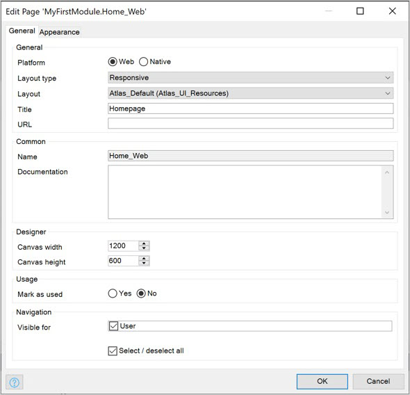

2.  In the tab General, select **Atlas_Default** as the layout:

	

3.  Then in the breadcrumb, navigate to the **Atlas_Default** navigation layout:

	

4.  Open the region properties of the left sidebar:

	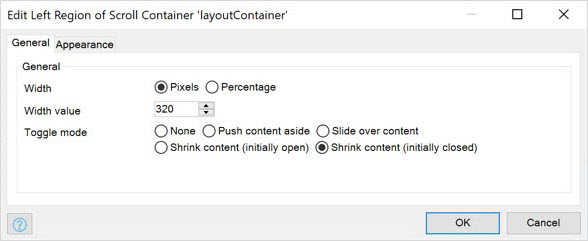

5.  In the **General** tab, select **Shrinking content (initially open)** as the toggle mode:

	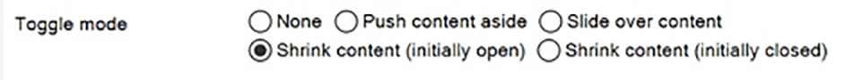 

### 3.2 Toggling the Sidebar for Shrinking Content (Initially Open)

To toggle the sidebar for **Shrinking content (initially open)**, follow these steps:

1.  Run the project:

	

2.  In your browser, click the toggle button:

	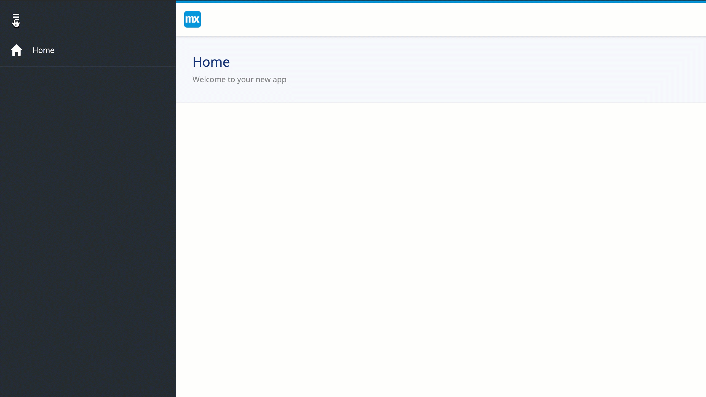

### 3.3 Set the Toggled Sidebar to Shrinking Content (Initially Closed)

To configure the toggled sidebar to **Shrinking content (initially closed)**, follow these steps:

1.  Open the page properties of the **Home_Web** page:

	

2.  In the tab General, select **Atlas_Default** as the layout:

	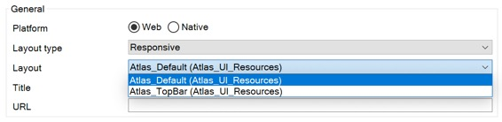

3.  Then in the breadcrumb, navigate to the **Atlas_Default** navigation layout:

	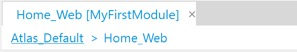

4.  Open the region properties of the left sidebar:

	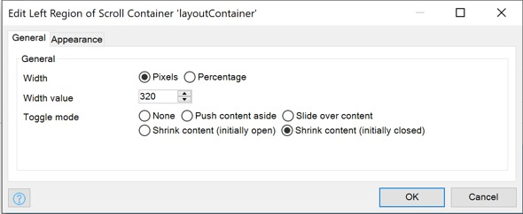

5.  In the tab General, select **Shrinking content (initially closed)** as the toggle mode:

	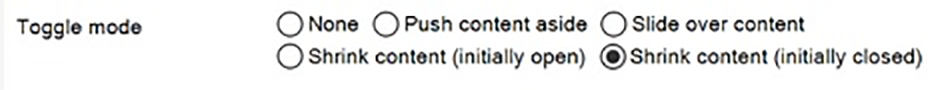 

### 3.4 Toggling the sidebar for Shrinking content (initially closed)

1.  Run the project:

	

2.  In your browser, click the toggle button:

	

### 3.5 Set the Toggled Sidebar to Pushing Content Aside

To configure the toggled sidebar to **Push content aside**, follow these steps:

1.  Open the page properties of the Home_Web page:

	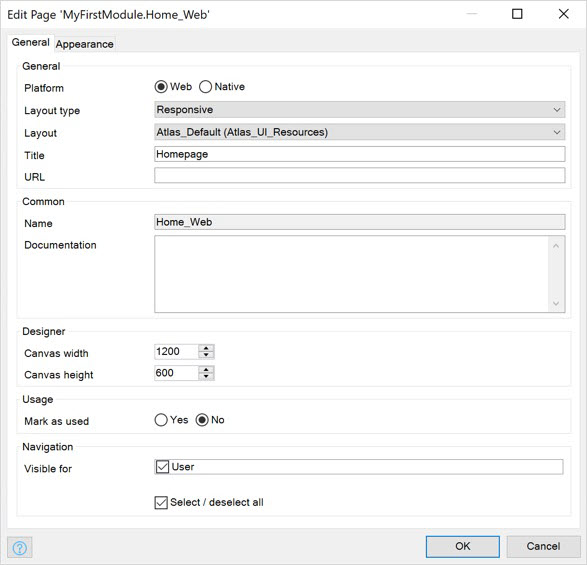

2.  In the **General** tab, select **Atlas_Topbar** as the layout:

	

3.  In the breadcrumb, navigate to the **Atlas_Topbar** navigation layout:

	

4.  Open the region properties of the left sidebar:

	

5.  In the **General** tab, select **Push content aside** as the toggle mode:

	 

6. Optionally, you can change the **Width to Percentage** and enter *80* as the **Width**value:

	 

### 3.6 Toggling the Sidebar for Pushing Content Aside

To toggle the sidebar for Pushing content aside, follow these steps:

1. Run the project. 

2. In your browser, Inspect your Web Page (Right-click). 

3. Click Toggle device toolbar. 
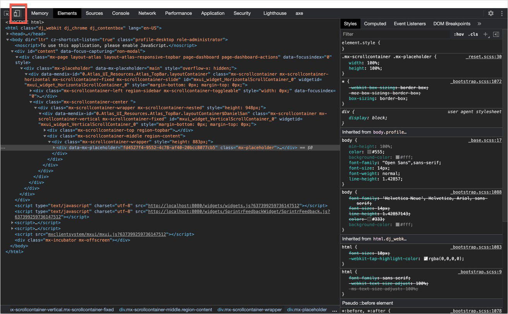

4. Change Emulated Device to iPhoneX or to an equivalent mobile device. 

5. In your Emulated Device's browser window, click the toggle button.
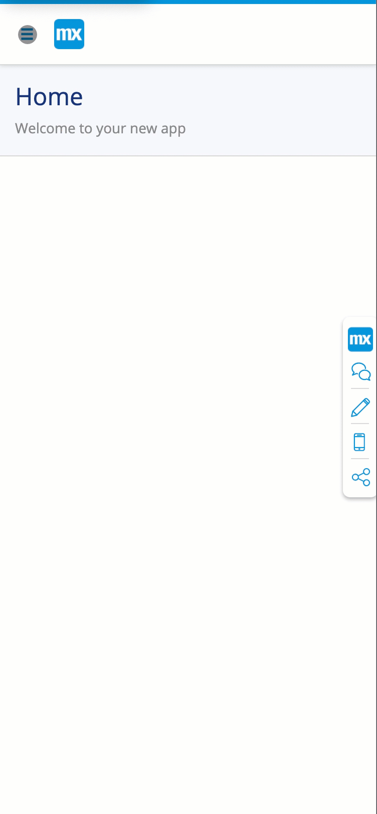

### 3.7 Set the toggled sidebar to Slide over content

To configure the toggled sidebar to Slide over content, follow these steps:

1. Open the page properties of the Home_Web page

2. In the tab General, select Atlas_Topbar as the layout. 
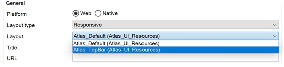

3. Then in the breadcrumb, navigate to the Atlas_Topbar navigation layout.

4. Open the region properties of the left sidebar

5. In the tab General, select Slide over content as the toggle mode. 
 

6. (Optional) Change the Width to Percentage and enter 80 as the Width value. 
 

### 3.8 Toggling the sidebar for Slide over content

To toggle the sidebar for Slide over content, follow these steps:

1. Run the project. 

2. In your browser, Inspect your Web Page. 

3. Click Toggle device toolbar. 

4. Change Emulated Device to iPhoneX or to an equivalent mobile device.

5. In your Emulated Device's browser window, click the toggle button.

## 4 Read More

* Atlas UI {https://atlas.mendix.com/} - For more information on the Atlas UI framework. 
* Use Layouts & Snippets {https://docs.mendix.com/howto/front-end/layouts-and-snippets#4-1-layout-examples} - For information on how to create your own navigation layouts. 