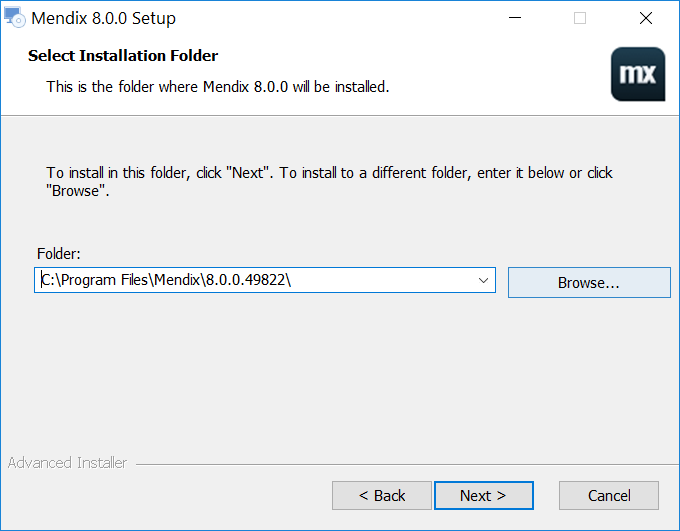
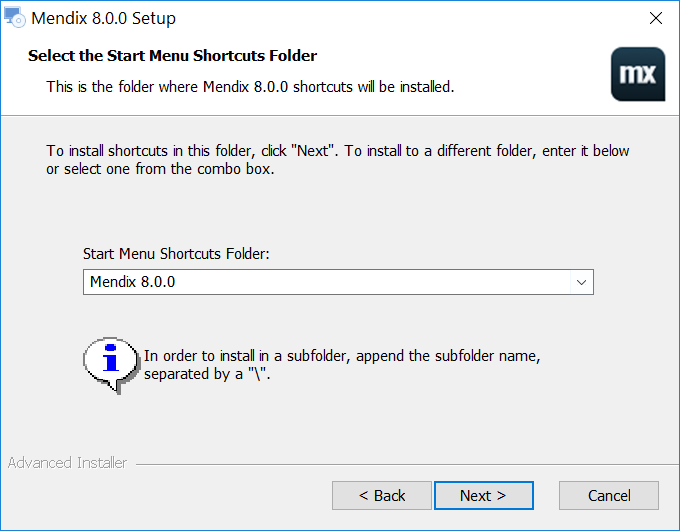
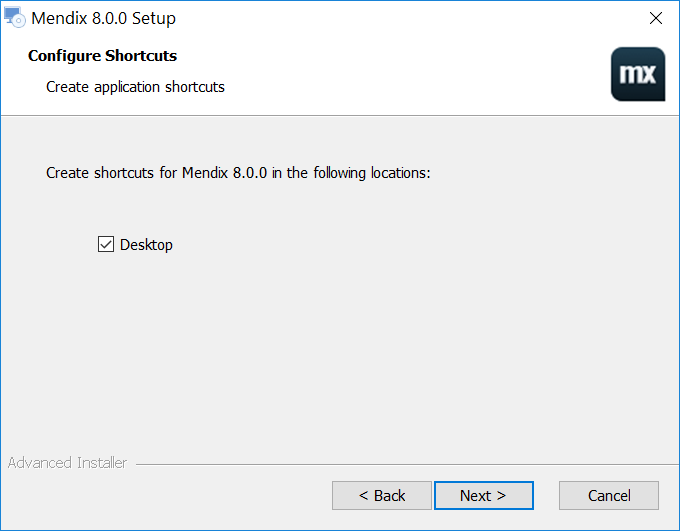

## 1 Introduction

Mendix Studio Pro enables you to build apps on the Mendix Platform. This how-to will guide you through the steps of installing Mendix Studio Pro.

**This how-to will teach you how to do the following:**

* Download Mendix Studio Pro
* Install Mendix Studio Pro

## 2 Prerequisites

Before starting this how-to, make sure you have completed the following prerequisites:

* You need a Windows environment to install Studio Pro (see [System Requirements](/refguide/system-requirements) for the full list of supported systems and required frameworks)

## 3 Download Mendix Studio Pro

Mendix Studio Pro can be installed on your machine with a Windows exectuable file. This executable can be downloaded from the Mendix App Store. Follow these steps to download Mendix Studio Pro:

1. Go to the Studio Pro download page in the [Mendix App Store](https://appstore.home.mendix.com/link/modeler/).
2.  Click **Download** to download the latest Mendix Studio Pro.

	

## 4 Install Mendix Studio Pro

Mendix Studio Pro needs to be installed on your computer before you can start building apps. Follow these steps to install Mendix Studio Pro:

1.  Open the downloaded Mendix Studio Pro executable. It is named like this: *Mendix-8.X.X-Setup*. Then click **Next**:

	

2.  Select **I accept the terms in the License Agreement** and click **Next**:

	

3.  Select the folder in which you want to install Studio Pro and click **Next**:

	

4.  Enter the start menu shortcuts folder you want to use and click **Next**:

	

5.  Check the **Desktop** option to create a shortcut to Studio Pro on your desktop and click **Next**:

	

6.  Click **Install** to install Studio Pro on your computer:

	

7.  Check **Launch Mendix 8.X.X** and click **Finish** to finish the installation and launch Studio Pro:

	

## 5 Troubleshooting

Some people run into problems when installing Studio Pro. A work-around can be to restart your system and install the prerequisites separately if you don't already have them installed. 

The prerequisites are:

* .NET Framework 4.7.2 (https://download.microsoft.com/download/6/E/4/6E48E8AB-DC00-419E-9704-06DD46E5F81D/NDP472-KB4054530-x86-x64-AllOS-ENU.exe)
* AdoptOpenJDK 11 (https://cdn.mendix.com/installer/AdoptOpenJDK/OpenJDK11U-jdk_x64_windows_hotspot_11.0.3_7.msi)
* Microsoft Visual C++ 2010 SP1 Redistributable Package (http://download.microsoft.com/download/A/8/0/A80747C3-41BD-45DF-B505-E9710D2744E0/vcredist_x64.exe)
* Microsoft Visual C++ 2013 Redistributable Package (http://download.microsoft.com/download/2/E/6/2E61CFA4-993B-4DD4-91DA-3737CD5CD6E3/vcredist_x64.exe)

Based on the error message you get from the installer you can decide to install a separate prerequisite, or you can try to manually install them all.

After that you can retry installing Studio Pro.

## 6 Read More

* [Studio Pro Overview](/refguide/studio-pro-overview)
* [App Modeling](/refguide/modeling)
