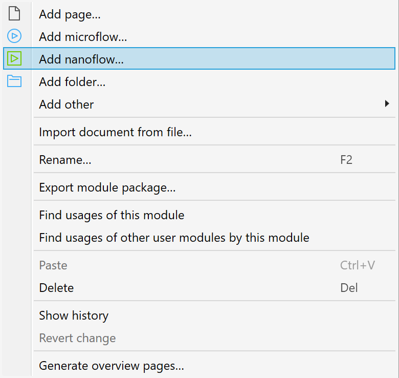
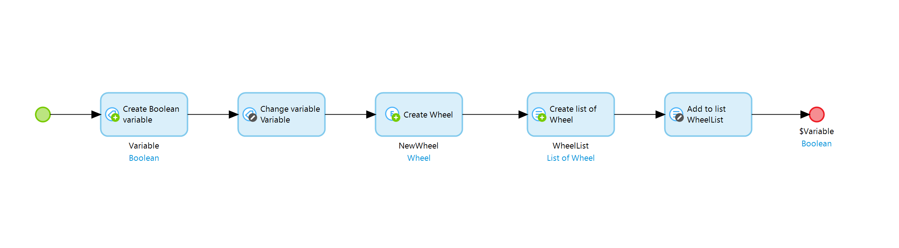
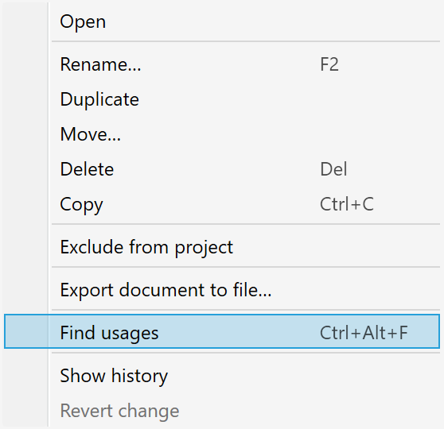
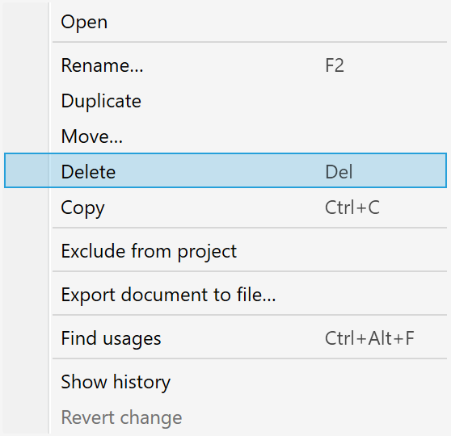

## Introduction

{}

This document collects Mendix application performance best practices in the form of performance issue description and suggests resolution steps.

{}

## Remove unused calculated attributes {#SA002}

For an object that has calculated attributes, each time that object is changed or retrieved from storage, it’s calculated attributes are computed by calling a microflow. If the logic behind calculated attributes retrieves other objects or executes Integration activities, it will cause an extra load (and delay) on the system when the outcome of the logic doesn't matter at that moment. Creating calculated attributes always affect performance, so decide if this is worth it for what you are using the calculated attribute for

It is safe to assume the logic behind a calculated attribute is always executed when the object is used. It is executed whenever there's no retrieval schema present for a retrieve activity (which is the case with data grids). The logic behind calculated attributes is executed at:

- Retrieve and change object activities in microflows
- Within UI widgets (e.g. data views, custom widgets)
- When an object is passed from UI as a parameter to a microflow (e.g. microflow button).

Because retrieve activities also trigger the logic of calculated attributes, it could lead to an execution chain of database actions and microflow calls (objects retrieving each other through calculated attributes).

Unused calculated attributes serve no meaningful purpose in the project and can safely be removed to avoid redundant microflow calls.

### Suggested resolution steps

1. Delete the unused calculated attribute.
2. OR Start using the calculated attribute.

### References

1. Calculated attributes : https://docs.mendix.com/refguide/attributes

## Avoid committing objects inside a loop {#SA004 and #SA005}

In a microflow, Mendix objects can be persisted to the database with three actions: Create Object Activity, Change Object Activity, and Commit Activity. For objects that are created or changed in a loop, it is not advisable to commit them immediately in the loop, as this comes with an unnecessary performance overhead. Instead, better performance can be achieved by performing a batch commit of several created/changed objects with Commit Activity outside of the loop to reduce database, application, and network overhead.

Committing lists of objects has these benefits compared to individual commits:

- The prepared statement of creating or modifying records in the database is explicitly reused by the JDBC driver and has the following benefits:
        - The execution plan is cached
        - The driver cares for a minimum of network overhead
- For each database action that changes data the following actions are taken and add overhead:
    - A savepoint is created before the action and released afterwards
    - Autocomitted objects are retrieved from the database
    - Autocomitted objects are stored to the database (if relevant)

### Suggested resolution steps

1. Within a loop, change Commit option of a Create/Change Object activity from No and make sure created/changed objects are available in a list
2. Commit the list after the loop when the iteration has finished or when number of objects in the list reaches 1000 to avoid excessive memory usage.

### References

1. Change Object Activity properties : https://docs.mendix.com/refguide/change-object
2. Commit Activity properties : https://docs.mendix.com/refguide/committing-objects

## Mendix Best Practice: Convert eligible Microflows to Nanoflows {#SA006}

Nanoflows are executed directly on the end user's device or browser. This makes them ideal for offline usage. In contrast, Microflows run in the runtime server and hence involve usage of network traffic. Converting an eligible Microflow to a Nanoflow can help avoid communication over networks and significantly boost app performance.

There are things to consider before one can convert a Microflow to a Nanoflow:

- Ensure that the Microflow falls into one or more of the following categories:
    - Microflow has logic meant for offline applications.
    - Microflow has logic for online applications but does not involve any database related actions like a committing Create Object, Commit, Retrieve and Rollback. This is the best practice for Nanoflows.
    - Microflow has at-most one database related action. (Not the best practice)
- Ensure that the Microflow contains Nanoflow compatible activities. Nanoflow supported activities are marked clearly in this reference document: https://docs.mendix.com/refguide/activities
- Ensure that the Microflow expressions do not contain the following variables : $latestSoapFault, $latestHttpResponse, $currentSession, $currentUser, $currentDeviceType. These are not supported by Nanoflows.
- As Nanoflows are executed in the context of the current user, ensure that the Microflow has only operations for which the current user is authorized. Otherwise the converted Nanoflow will fail.

### Suggested resolution steps

1. Create a new Nanoflow. Right click on the module and select **Add Nanoflow**.

2. Replicate the same logic from the Microflow. The new nanfolow must look almost identical to the old microflow. 

3. Check usages of the Microflow by right clicking on the micrfolow and select **Find usages**. Replace all uses with the newly created Nanoflow.

4. Delete the unused Microflow. Do this by selecting the microflow and pressing delete. Or right click and select **Delete** 

### References

- When to use Nanoflows https://docs.mendix.com/refguide/nanoflows#2-when-to-use-nanoflows
- Nanoflow and Microflow differences https://docs.mendix.com/refguide/nanoflows#3-differences-from-microflows
- Find Nanoflow supported activities here : https://docs.mendix.com/refguide/activities
