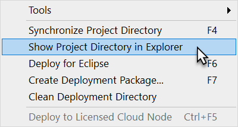

## 1 Introduction

Mendix applications are by default stored on the local hard drive of the computer on which it is being developed. Sometimes it is needed to go to this project directory to amend or add files. Therefore this How-to will teach you how to open the project directory.  

## 2 Opening the Project directory

The project directory can be opened from the Windows file explorer and in  the Mendix Modeler. The quickest way to open the project directory is in the Mendix Modeler and can be done via the menu bar:

1.  Go to Project and click on: "Show Project Directory in Explorer".
    
2.  The following window will appear with the project directory shown in it
    

By default the directory is located in the MyDocuments section.

## 3 Most Used Locations in the Project Directory

When developing an application the following directories in the project directory are useful to amend the style of the application, add custom widgets and java actions:

1.  ../theme - Here are the .css files stored which can be used to style the application.
2.  ../javasource - Here the JavaScript actions are stored.
3.  ../widgets - Here are the widgets are stored.

