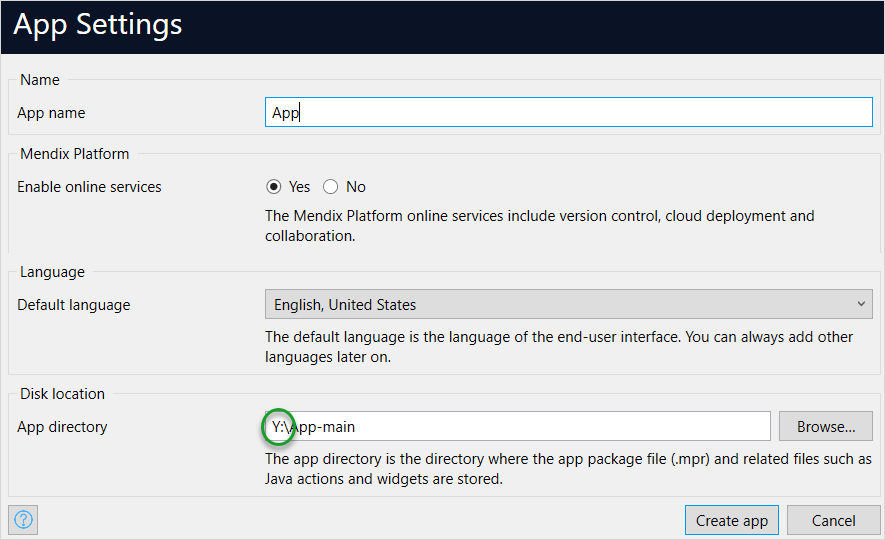
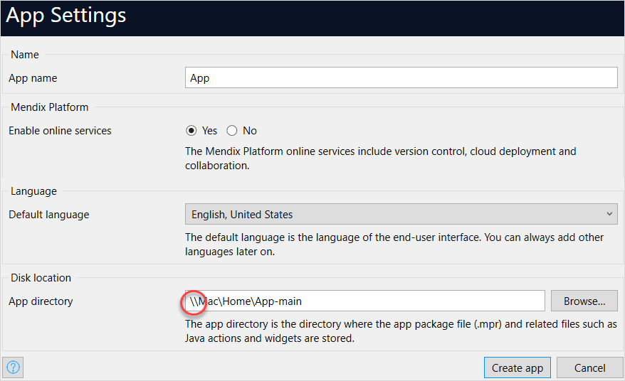

## 1 Introduction

Using Parallels, you can run Mendix Studio Pro on your Mac device using a Windows virtual machine.

{}
To run Studio Pro on Apple Silicon Macs, such as the M1(X), an MTS version starting from Mendix Studio Pro 9.6.5 or Mendix Studio Pro 9.9.1 is required. For more information, see [System Requirements](/refguide/system-requirements).
{}

To start making Mendix apps on your Mac, follow this how-to.

**This how-to will teach you how to do the following:**

* Configure your Windows virtual machine for Mendix Studio Pro
* Run a Mendix app on a test device using your Windows virtual machine
* Make changes to your app, then view those changes on your test device

For a deep-dive look into installing Studio Pro on a Mac, check out this video:

## 2 Prerequisites

Before starting this how-to, make sure you have completed the following prerequisites:

* Install [Parallels Desktop Pro Edition](https://www.parallels.com/products/desktop/pro/), install Windows when prompted by Parallels, and create a Windows virtual machine (Parallels Desktop Pro Edition is necessary for Mendix's network features to work)
* Install Mendix Studio Pro on your Windows virtual machine

## 3 Configuring Your Windows Virtual Machine for Mendix Studio Pro

To configure your Windows virtual machine to work with Mendix Studio Pro, follow these steps:

1.  Open your Parallels **Control Center**:

	{}{}

2. Click the **gear** symbol to open the **Configuration Panel**.
3.  Navigate to the **Hardware** tab, and select **Network** from the left panel:

	{}{}

4. Make sure **Source** is set to **Shared Network**.
5. Make sure that both the **Inbound** bandwidth and **Outbound** bandwidth show **unlimited**.

	If this is not the case, either enable **Network Conditioner** and set it to a profile that does not limit bandwidth, or click the **Options** tab then the **Optimization** pane and set **Resource usage** to **No limit**.
6.  In the Parallels drop-down menu, select **Preferences**:

	{}{}

7.  Navigate to the **Network** tab, and select **Shared** from the left panel:

	{}{}

8.  Click the **+** button and add two ports: one for 8080 and one for 8083, both forwarded to your Windows virtual machine (the 8083 port is only necessary for developing native mobile apps):

	{}{}

	After adding those two ports, your **Port forwarding rules** should look like this:

	{}{}

Congratulations! You have successfully configured port forwarding to enable testing Mendix apps with your Mac. 

## 4 Checking Network Drive

{}
Whenever you create or open a Mendix app in Mendix Studio Pro, be sure to do so from a mapped drive instead of a network drive.
{}

Read the tips below to check the network drive before viewing your app on your testing device:

* Correct mapped drives will always have a letter at the start of their file location:

	{}{}

* Incorrect network drives will always have **\\** at the start of their file location:

	{}{}

## 5 Viewing Your App on Your Testing Device

When running your app on your test device, you cannot use the QR code within Mendix Studio Pro's **View Mobile App** dialog box:

{}{}

Instead, you must enter your Mac's IP address into your Make It Native app. To run your app on your test device, follow the steps below:

1. Make sure your test device and Mac are on the same Wi-Fi network.

2. Place your cursor over your Wi-Fi symbol in your system tray, then and click while holding <kbd>Option</kbd> to see your Mac's advanced network information. You will see your **IP Address** in this drop-down menu.

3.  In your Make It Native app's **Host** field, type *{your IP address}:8080*:

	{}{}

4. Tap **Launch** to view your app.

Congratulations! You have successfully viewed your app on a test device.

{}
If you experience issues connecting with the Make It Native app, make sure your firewall is not preventing a connection. For information resolving Windows Defender and other firewall-related issues, see the [Error: Unable to Load Script](/howto/mobile/common-issues#unable-load-script) section of *Troubleshoot Common Native Mobile Issues*
{}

## 6 Viewing Changes to Your App on Your Testing Device

For information on how to change to your app and then see that change on your device, see the [Viewing Changes to Your App on Your Testing Device](/howto/mobile/getting-started-with-native-mobile#viewingchanges) section in *Get Started with Native Mobile*.

## 7 Improving Performance

To improve the performance, you can do the following: 

* Run Parallels in a window, instead of Coherence mode
* Store apps on disk C:\

### 7.1 Increasing Network Speed

Some users experience slow network speed. You try the following approach, which can increase the upload speed significantly:

1. In Windows 10/11, navigate to **Start** > **Control Panel**> **Device Manager** > **Network adapters** > **Parallels VirtIO Ethernet Adapter**. 

2. Right-click **Parallels VirtIO Ethernet Adapter** and select **Properties** in the drop-down list. 
3. On the **Advance** tab, find the **Large Send Offload** **(IPv4)** property and change its value to **Disabled**. 
4. Click **OK**.

Now the upload speed becomes faster! For more information, see [Parallels Forum](https://forum.parallels.com/threads/horribly-slow-upload-download-speeds.264819/).

## 8 Read More

* [Get Started with Native Mobile](/howto/mobile/getting-started-with-native-mobile)
* [Style Your Mendix Native Mobile App](/howto/mobile/how-to-use-native-styling)
