## 1 Introduction

This how-to explains how to consume a (third-party) web service with which you can integrate your Mendix application and reuse functionality and data from other applications. Web services are the preferred way of integrating a Mendix application with external systems. They can be used to retrieve data, send updates, and perform operations. In Mendix, calling a web service is something you do in a microflow using the Call Web Service action.

**This how-to will teach you how to do the following:**

* Import a web service using the wizard and directly
* Configure a web service call

## 2 Importing a Web Service Using the Wizard

This section will describe the powerful wizard that enables integrating—in just a few clicks—the creation of an imported web service, the related data entities, the XML-mapping, and a microflow to trigger the web service.

### 2.1 The Configuration

To import a web service using the wizard, follow these steps:

1. Open your domain model and click **Import web service/XML file** in the toolbar.

    

    This will open a straightforward wizard dialog that guides you through importing the result of a web service (or an XML file). As a result, it will generate the following items:
    * Domain model entities to store the results
    * An XML-to-domain mapping that maps the incoming XML to Mendix objects
    * An imported web service (or XML schema) document
    * A microflow that calls the web service (or imports an XML file) (optional)
2. On the **Import Web Service or XML Scheme** dialog box, select **Web service operation** and click **Next**:

    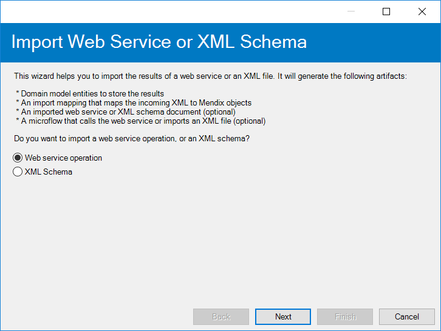

3. On the **Import Web Service** dialog box, select **Create new imported web service** and click **Next**:

    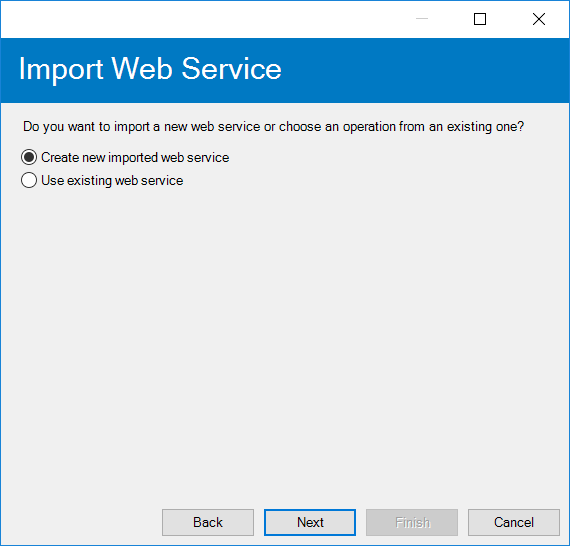

4. For **WSDL source** in the **Web service Description** section of the **New Web Service Operation** dialog box, select the WSDL to be used for this imported web service. You can either use a **URL** or load a **File** from your computer.

    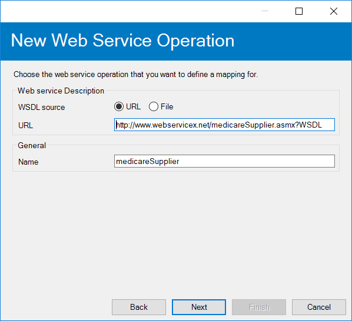

5. Click **Next** to fetch the services and operations in the WSDL.
6. On the **New Web Service Operation** dialog box, you can now review the services and operations available to the imported web service. Select a web service operation and click **Next**.

    

7. On the **Select Elements** dialog box, you can optionally select the elements to map as return values of the web service, and then click **Next**.

    

8. The final step in this wizard provides you with the option to create a microflow in which the imported web service is called and the option to add icons to the generated entities: 

    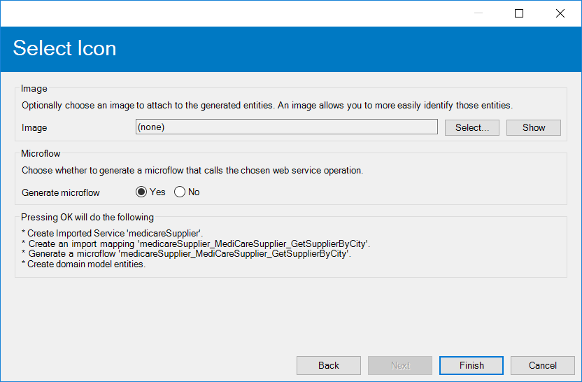

    Click **Finish** to create the web service.

### 2.1 The Outcome

When finished the wizard will add to your model based on the options selected:

* The imported service
* An XML to domain mapping
* A microflow in which the web service operation is called
* Domain model entities (by default, the Modeler creates non-persistent entities)

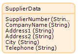

## 3 Importing a Web Service Directly

An alternative to using the wizard described above is to import a web service document directly into your project. For more information, see [Consumed Web Services](/refguide7/consumed-web-services) in the Mendix Reference Guide.

To import a web service directly, follow these steps:

1. Right-click a module and select **Add** > **Consumed services** > **Consumed web service**.
2.  In the **Consumed Web Service** wizard, on the **General** tab, enter the WSDL to be used for this imported web service. You can use a **URL** or load a **File** from your computer.

    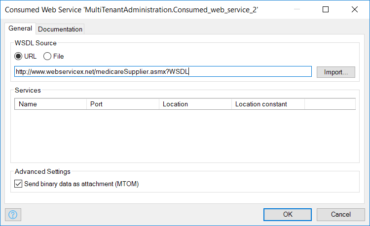

3. Click **Import** to fetch the services and operations in the WSDL.
4. Review the **Services** and **Operations** available to the imported web service:

    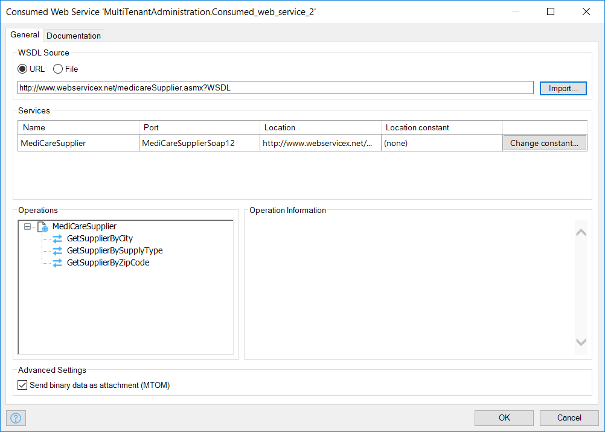

You can also describe the design purpose of the web service on the **Documentation** tab.

# 4 Configuring the Web Service Call

To configure the web service call, follow these steps:

1. If you have not used the web service wizard or have not used the option within this wizard to automatically create a microflow, you have to create a microflow that will call the imported web service:

    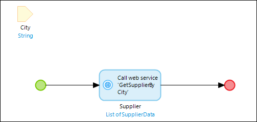

    {}

    Make sure the microflow either creates the variables required as arguments for the web service call or has those passed to it.

    {}

2. If you are creating your own microflow, add the Call Web Service activity to the microflow. For details on how to add activities to microflows, see [Activities](/refguide7/activities) in the Mendix Reference Guide.
3. Click **Select...** in the **Web service operation** section of the **Call Web Service** dialog box:

    

    This will bring up the **Select Web Service Operation** pop-up window, where you can choose the operation for this web service call:

    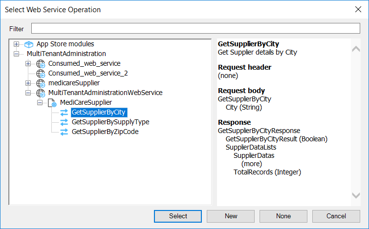

4. On the **SOAP Body** tab in the **Request** section of the **Call Web Service** dialog box (see above) you can configure the SOAP body, which contains the parameters needed to execute the web service request. The **Simple**, **Advanced**, and **Custom** option buttons enable choosing the type of SOAP body to use. Click **Edit value** to change the domain-to-XML mapping or the variables from the microflow used as input arguments.
    * Use the **Simple** option if the imported web service requires only primitive arguments:

        

    * Use the **Advanced** option if the web service call needs a list of objects or if the domain model entities need to be mapped to XML elements:

        

    * Use the **Custom** option for the definition of a custom XML body with parameters:

        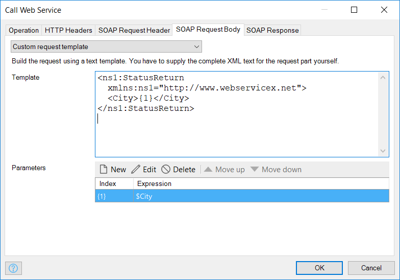

5. On the **SOAP Header** tab in the **Request** section of the **Call Web Service** dialog box, you can enter authentication information using the **Edit value** button if the imported web service requires authentication:

    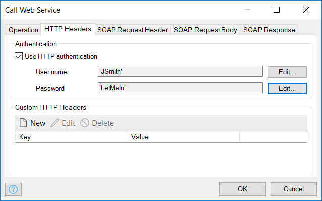

    There are three input options:
    * Use the **Simple** option if only static values or variables from the microflow need to be passed to the imported web service
    * Use the **Advanced** option if domain-to-XML mapping is needed for authentication
    * Use the **Custom** option to define a custom XML header and to specify parameters
6. On the **HTTP Authentication** tab in the **Request** section of the **Call Web Service** dialog box, enter the HTTP authentication information if the Mendix Business Server should use this before calling the web service:

    

7. In the **Output** section of the **Call Web Service** dialog box, you can configure the handling of the return from the web service call:
    * If the return is a complex XML structure, you can select the **Map to entities** option and use an XML-to-domain mapping to map the XML elements to the domain model entities:

        

    * If the return is a primitive, you can store it in a variable that you can name in the **Store in variable** field:

        

    * If you want to ignore the return, select the **Ignore** option
8.  Your imported web service is now ready to be used in your application.

## 5 Related Content

* [How to Consume a Simple Web Service](consume-a-simple-web-service)
* [How to Export XML Documents](export-xml-documents)
* [How to Import Excel Documents](importing-excel-documents)
* [How to Expose a Web Service](expose-a-web-service)
* [How to Use Selenium Support](selenium-support)
* [How to Synchronize User Accounts Using the LDAP Mmodule](synchronizing-user-accounts-using-the-ldap-module)
* [How to Import XML Documents](importing-xml-documents)
* [How to Consume a REST Service](consume-a-rest-service)
* [How to Expose Data to BI tools Using OData](exposing-data-to-bi-tools-using-odata)
