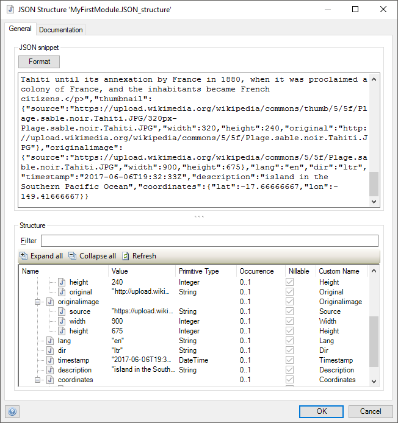
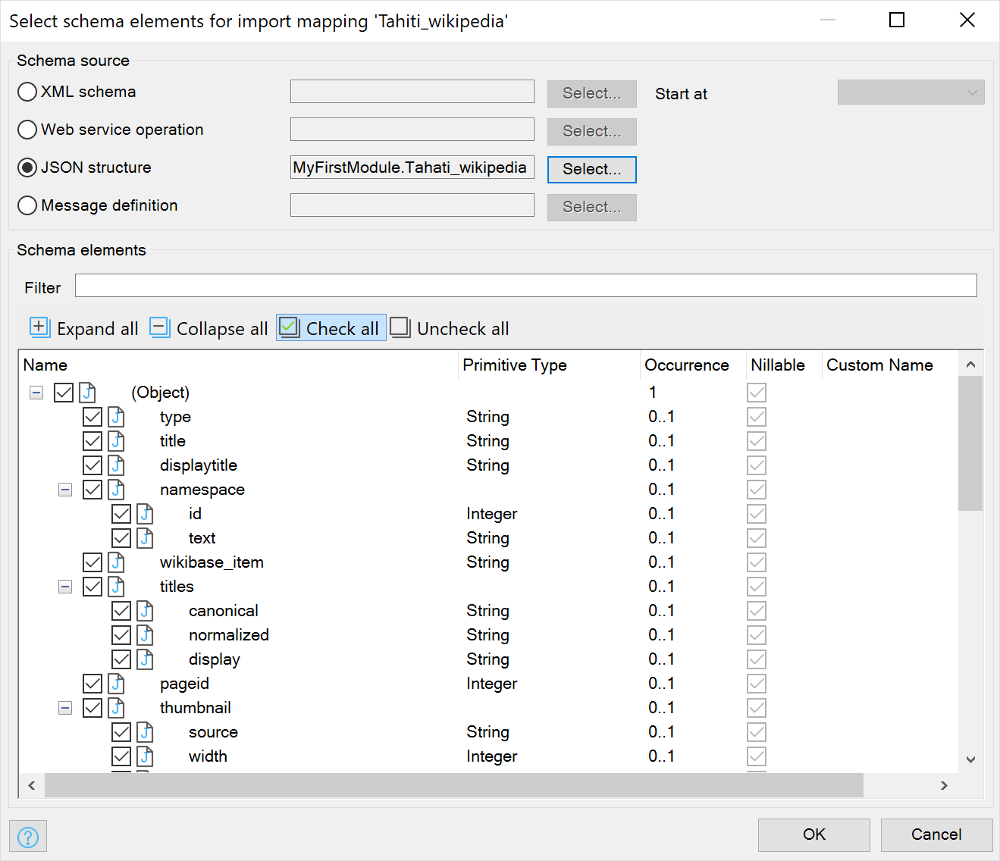
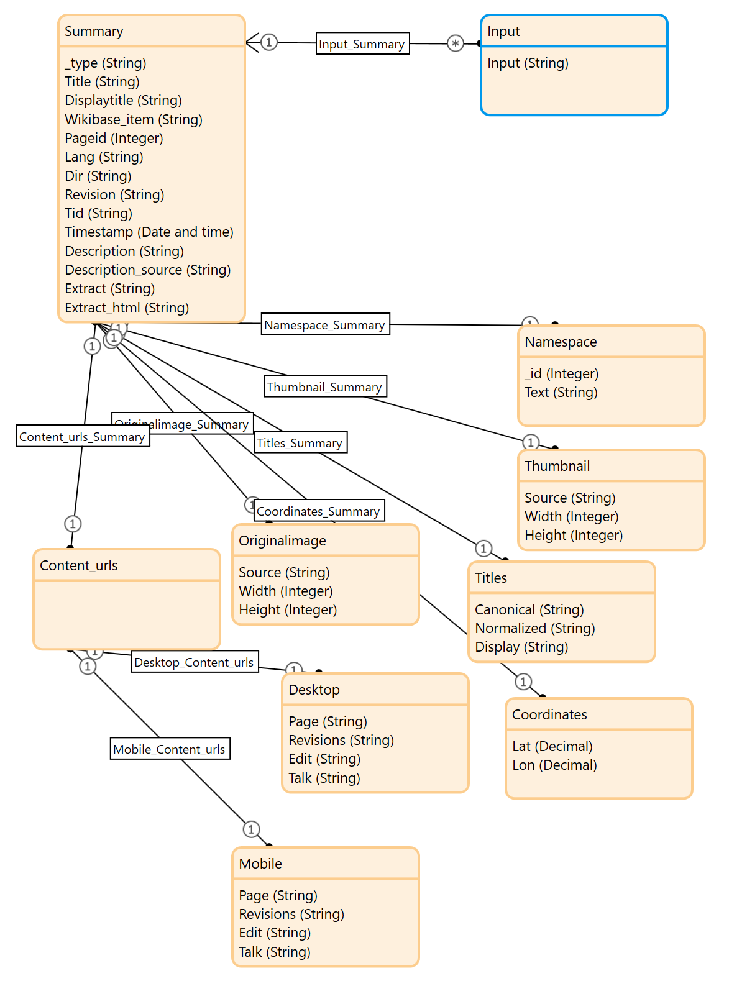
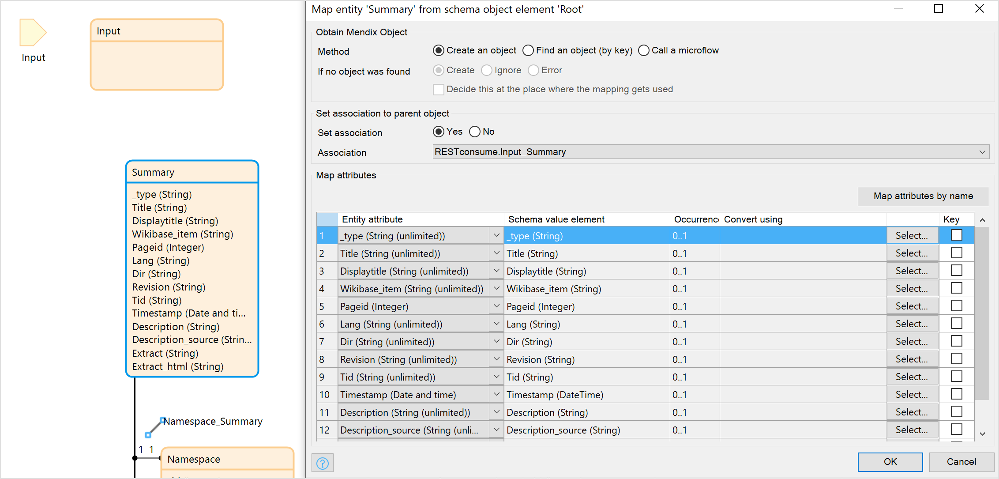
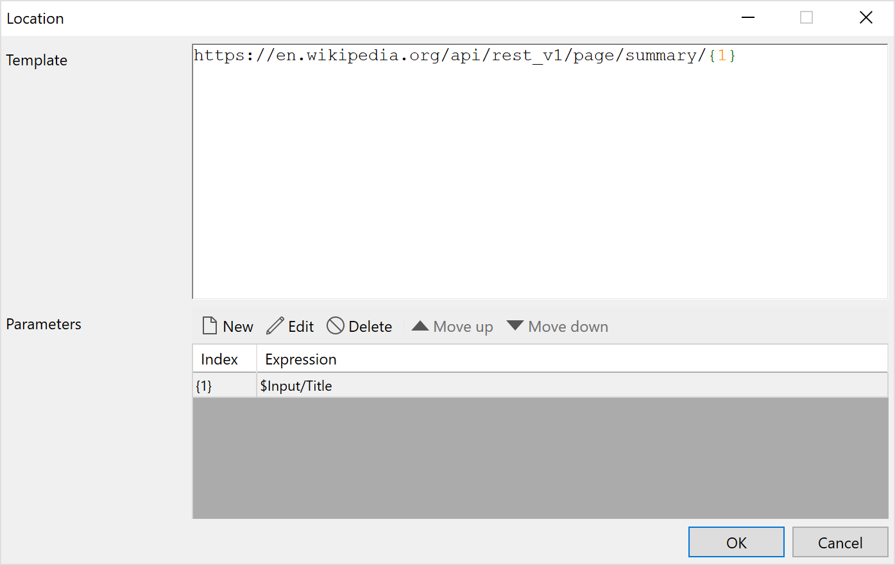
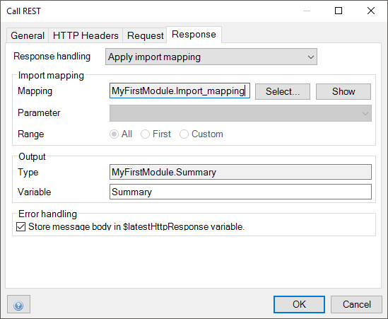
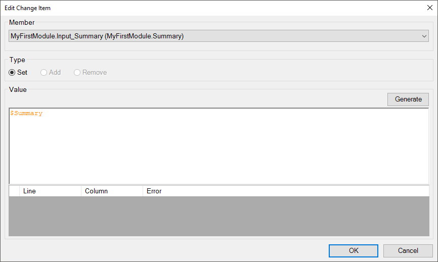
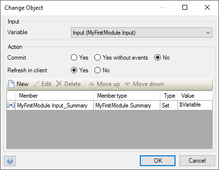
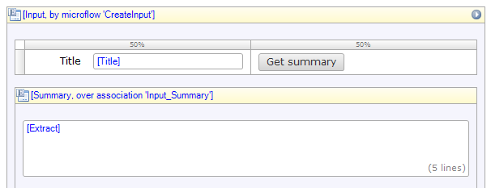

## 1 Introduction

In your Mendix app, you can use information from REST services. This how-to shows you how to do that through an example in which you create an app that retrieves Wikipedia pages from a REST service. The resulting app is [available for download](attachments/consume-a-rest-service/WikipediaApi.mpk).

**This how-to will teach you how to do the following:**

* Call the REST service in a microflow

## 2 Creating a JSON Structure

The Wikipedia REST service allows you to retrieve the summary of a page. This service can be reached at `https://en.wikipedia.org/api/rest_v1/page/summary/{title}`, where `{title}` is the title of a page.

We will start by providing Studio Pro as an example of what the REST service returns:

1. Open your browser and go to [https://en.wikipedia.org/api/rest_v1/page/summary/Tahiti](https://en.wikipedia.org/api/rest_v1/page/summary/Tahiti)
   * This calls the REST service with a GET request – the result is the summary of the [Tahiti page on Wikipedia](https://en.wikipedia.org/wiki/Tahiti) in the JSON format

    

2. Copy the whole JSON snippet. Make sure that you select the **Raw Data** tab to copy the whole code structure.

3.  Create a module and name it *RESTconsume*. To add a new [JSON structure](../../refguide/json-structures)  to your module with the sample JSON that you can use in the app right-click the module in the **Project Explorer** and select **Add other** > **JSON structure**.
    
4. Enter a **Name** for the structure: *JSON_structure* and click **OK**.

5. In the **JSON Structure** dialog box, paste the JSON snippet in the  **General** tab and click **Refresh**. This analyzes the structure of the JSON snippet that we can use later.

   

6. Click **OK**

## 3 Creating an Import Mapping

An [import mapping](../../refguide/import-mappings) specifies how the JSON relates to [entities](../../refguide/entities). You can map the the JSON to any entity you like.  The following steps describe how to generate the entities and create an import mapping roll:

1. Right-click the module in the **Project Explorer** and select **Add other** >  **Import Mapping**.

2. Enter a **Name** for the import mapping: *Import_mapping* and click **OK**.

3. In the **Select schema elements for import mapping** dialog box, click the radio button for **JSON structure** and then click **Select**.

4. Double-click **JSON_structure** in the **Select JSON Structure** dialog box.

5. Click **Expand all** and then click **Check all**.

    

6. Click **OK**. The **Import_mapping** document is displayed and the JSON structure is on the right.

7. Click **Map automatically** in the editor toolbar. 

8. A pop-up box is displayed informing you that can **See the details for the changes that have been applied**. You can click **Details** to see details of the mapping to the entities that are generated to match the JSON structure.

9. Click **Close** to see the entities corresponding to the JSON structure.

## 4 Adding an Input Entity to the Domain Model

The service takes the title of the page as an input. It returns the summary of the page. 

In this section, you will create an entity that represents this input and associate it with its summary.

To add an input entity to the domain model, follow these steps:

1. In the **Project Explorer**, double-click the **Domain Model**.
2. Rename **Root** to **Summary**.
3. From the **Toolbox**, drag an **Entity** onto the domain model.
4. Double-click the entity and enter *Input* for the **Name**.
5. For **Persistable**, select **No**.
6. On the **Attributes** tab, click **New** to add a string attribute and name it *Title*.
7. Click **OK**.
8. Drag an association from **Input** to **Summary**.
9.   

9. Go to the **Import_mapping** and from the **Connector** pane drag  **Input** as the input parameter for the input mapping.

10. Double-click **Summary**.

11. In the **Map entity 'Summary from the object element 'Summary** dialog box, **Set association** to **Yes** and select the **RESTconsume_input_Summary** for the **Association** to have the import mapping set the association:

    

12. Click **OK**. 

## 5 Calling the REST Service in a Microflow

You will now call the REST service in a [microflow](../../refguide/microflows) to build the integration with Wikipedia. The microflow takes **Input** as the input parameter and sets the associated **Summary**.

To call the REST service in a microflow, follow these steps:

1. Right-click the module and select **Add** > **Microflow** and accept the default **Name** *Microflow* for the name of the microflow and click **OK**.

2. From the tool bar, drag a **Parameter** object to the microflow document.

3. Click **Select** for the **Data type** and select the **Input** entity as the input parameter. Click **OK**. 

4. Right-click the mouse and select **Insert** > **Activity** to insert an activity to the microflow.  Double-click the activity and select the **Call REST service** to change the activity.

5. In the **Call REST** dialog box, click **Edit** for the **Location** and add the following to **Template**: `https://en.wikipedia.org/api/rest_v1/page/summary/{1}`, with the parameter being the Title attribute from the **Input** parameter `$Input/Title`. Click **OK**.

   

6. In the **Response** tab, the response has to be mapped using the import mapping. For **Response handling** select **Apply import mapping**.

7. For **Mapping**, click **Select** and double-click **Import_mapping**. For the **Parameter**, select **Input**. 

8. For **Output** select **Yes** for  **Store in variable** and specify  *Summary* for the **Variable name**.

   

9. Click **OK**.
10. Right-click after the **Call REST service** object and select **Insert** > **Activity** and double-click it and change it to a **Change object**.

15. For the **Input Object**, select **Input (RESTconsume.Input)**.

16. For **Refresh in client**, select **Yes**. This makes ensures that the summary is displayed on the screen.

17. Click **New**.

18. On the **Edit Change Item** dialog box, for **Member**, select **RESTconsume.Input_Summary (RESTconsume.Summary)**.

19. Under **Value**, enter `$Summary`.

      

20. Click **OK**

      

21. Click **OK**. You have created microflow that takes the title of an article as input and associates it with its summary.

      

You have successfully consumed a REST service and created a microflow to show the results. The rest of this how-to describes how to use this microflow in an app so that yoyu can see the REST call in action.

## 6 Creating a Page

To create a page for this app, follow these steps:

1. Open the **Homepage** and add a **Data view**.
2. Right-click the the **[Unknown]** bar and click, **Select entity**.  Select the **Input** entity.
3. For the **Data source – Type** select **Microflow**.
4. For the **Name**, enter *CreateInput*. Note that when this page loads, it needs a new **Input** object – you will fill the **CreateInput** microflow that creates this object below.
5. Click **OK**.
6. From **Container widgets**, add a new **Table** with one row and two columns.
7. Drag the **Title** field onto the left column.
8. From the **Project Explorer**, drag **Microflow** into the right column.
9. In the **Edit Action Button**  dialog box, enter *Get summary* for the caption of the button.
10. Add a **Data view** below the table (inside the other data view).
11. From the **Connector**, drag the **Summary** entity onto the **[Unknown]** bar.
12. Click **OK**.
13. From this data view, delete all the fields except **Extract**.
14. Double-click **Extract**.
15. For **Show label**, select **No**.
16. Click **OK**.
17. Delete the **Save** and **Cancel** buttons.

    

## 7 Filling In the Create Input Microflow

Now all that is left is to have the **CreateInput** microflow create a new **Input** object.

To fill in the CreateInput microflow, follow these steps:

1. In the **Project Explorer**, double-click **CreateInput**.
2. From the **Toolbox**, drag In a **Create object** activity.
3. Double-click the activity.
4. Click **Select** and double-click **Input**.
5. Click **OK**.
6. Double-click the red **End event**.
7. Under **Return value**, enter `$NewInput`.
8. Click **OK**

Congratulations! You can now start your app and get summaries from Wikipedia.

## 8 Example

**How to consume REST with Mendix Studio Pro 8**

{}

## 9 Read More

* [Consume a Complex Web Service](consume-a-complex-web-service)
* [Consume a Simple Web Service](consume-a-simple-web-service)
* [Export XML Documents](export-xml-documents)
* [Import XML Documents](importing-xml-documents)
* [Import Excel Documents](importing-excel-documents)
* [Expose a Web Service](expose-a-web-service)
* [Expose Data to BI Tools Using OData](exposing-data-to-bi-tools-using-odata)
