## 1 Introduction

Mendix is the app platform for the enterprise, and in enterprise software, it is not likely that you work in a [greenfield project](https://en.wikipedia.org/wiki/Greenfield_project). In almost every situation, you will need to integrate with existing systems. Mendix supports many ways of integrating, and this how-to focuses on how you can consume web services with Mendix.

For this how-to, you will be using an example web service of [W3Schools](http://www.w3schools.com/). Please note that this is a very simple web service that converts temperatures from Celsius to Fahrenheit and vice versa. The converted temperature will be returned as a string value that can be stored in a variable directly. If you want to invoke a web service that returns a complex XML message, you can use the XML-to-domain mappings explained in [How to Import XML Documents](importing-xml-documents).

**This how-to will teach you how to do the following:**

* Import a WSDL
* Create logic to call the web service

## 2 Importing a WSDL

A WSDL describes the operations of a web service and can be imported in the Modeler. After importing the WSDL, you can invoke the operations of the web service instantly within the microflow editor.

To import a WSDL, follow these steps:

1. Right-click your module in the **Project Explorer** and select **Add** > **Consumed services>** > **Consumed web service**:

    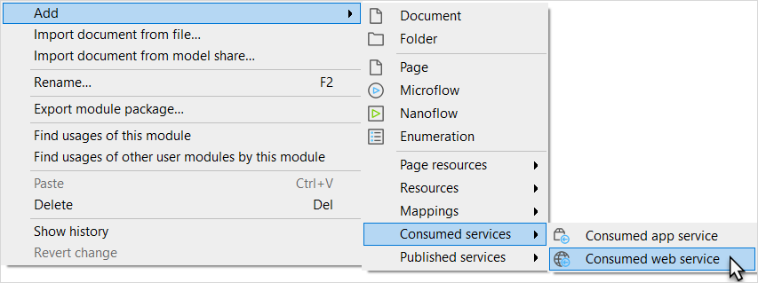

2. Enter a name for the new consumed web service (for example, *TemperatureConverter*):

    

3. Click **OK** again. You will now see the **Consumed Web Service** wizard. Enter `https://www.w3schools.com/xml/tempconvert.asmx?wsdl` as the **URL**, and then click **Import**.

    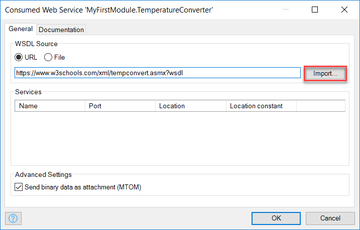

4.  This will bring up the **Select Ports** dialog box asking you to select a web service port:

    

5. Click **OK** to select the default. The Modeler should now import these operations: **CelsiusToFahrenheit** and **FahrenheitToCelsius**.

    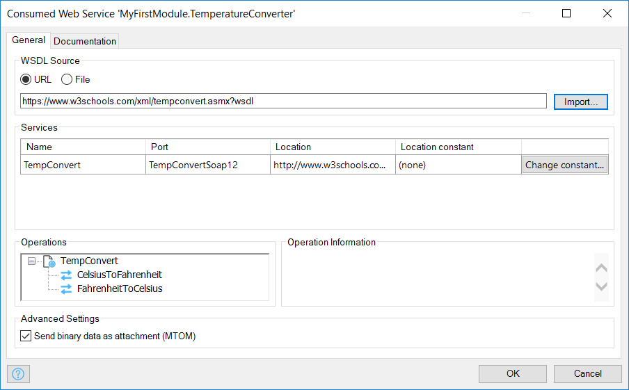

6. Click **OK** to save the consumed web service.

## 3 Creating Logic to Call the Web Service

To create logic to call the web service, follow these steps:

1.  Right-click your module in the **Project Explorer** and select **Add** > **Microflow** from the menu:

    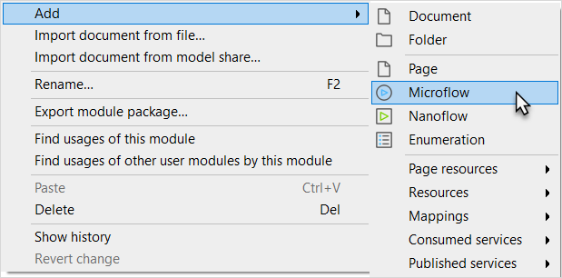

2.  Enter a name for the new microflow (for example, *ConvertCelsiusToFahrenheit*).

    

3.  Click **OK**. You will now see an empty microflow:

    

4.  Open the **Toolbox** (from the bottom-right corner of the Modeler) and drag a **Create variable** activity to the line between the start and end event.

    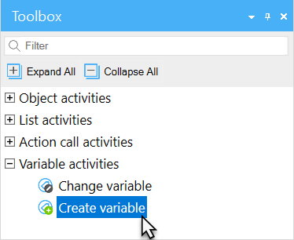

5. Double-click the new activity to open the **Create Variable** properties editor.
6. Select **Integer/Long** as the **Data Type**, enter *100* as the value, and enter *TemperatureInCelsius* as the **Output Variable Name**:

    

7.  Click **OK.** The microflow will look like this:

    

8. Drag a **Call web service** activity from the toolbox to the line between the start and end event. This inserts a new activity.
9.  In the **Call Web Service** properties editor, click **Select** and select the **CelsiusToFahrenheit** for the **Operation** of your consumed web service:

    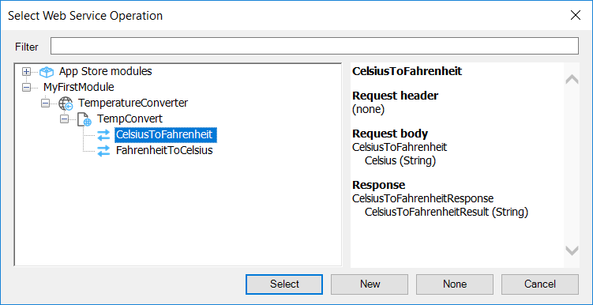

10. In the **Location** section for this operation , click the **Override location** box. You are doing this in order to use the secure location of the web service.
11. Click **Edit** to override the location and change `http` to `https` for the URL in the **Location** editor.
12. In the **SOAP Request Body** tab of the **Call Web Service** properties editor, double-click the **Celsius (optional)** input parameter and enter `toString($TemperatureInCelsius)` for the expression. The web service operation expects a string value, which is why you need to use the `toString` function. 

    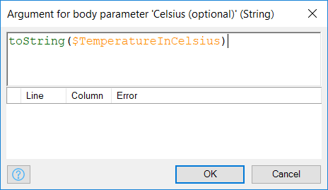

    Then click **OK**.
13. On the **SOAP Response** tab, select **Yes** for the **Store in variable** option, and enter *TemperatureInFahrenheit* for the **Name**:

    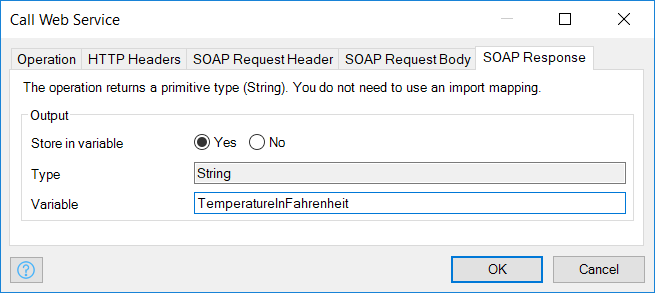

14. Click **OK**. The microflow will look like this:

    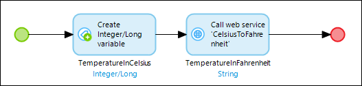

15. Drag a **Show message** activity from the **Toolbox** to the line before the end event.
16. Double-click the new activity to open the **Show Message** properties editor.
17. Select **Information** as the **Type**, and enter *The temperature in fahrenheit is: {1}* for the **Template**. The *{1}* functions as a placeholder for the parameters.

    

19. Create a new parameter and enter `$TemperatureInFahrenheit` for the expression (this is the return value of the web service operation), then click **OK**:

    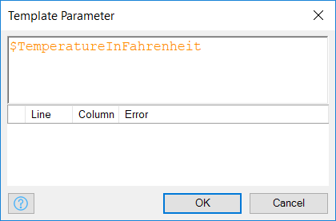

20. Click **OK** again to save the **Show message activity** properties. The microflow will look like this:

    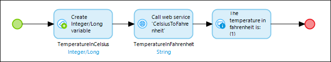

21. Create a menu item that triggers this microflow. For details on how to create a menu item, see [How to Set Up the Navigation Structure](../ux/setting-up-the-navigation-structure).
22. Deploy the application and trigger the microflow to call the web service operation. You should see a message with the converted temperature.

## 4 Related Content

* [How to Generate a Personal SSH2 Key Pair](../security/generating-a-personal-ssh2-key-pair)
* [How to Create a Secure App](../security/create-a-secure-app)
* [How to Consume a Complex Web Service](consume-a-complex-web-service)
* [How to Export XML Documents](export-xml-documents)
* [How to Import Excel Documents](importing-excel-documents)
* [How to Expose a Web Service](expose-a-web-service)
* [How to Use Selenium Support](selenium-support)
* [Security How-To's](../security/)
