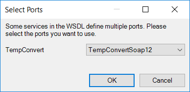
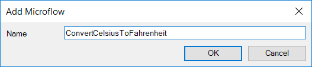
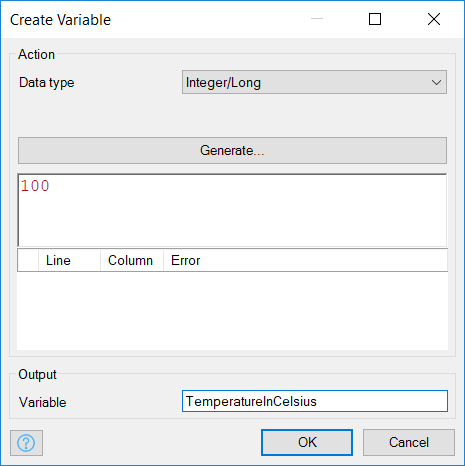
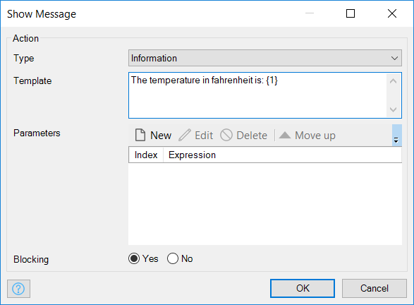

## 1 Introduction

Mendix is the app platform for the enterprise, and in enterprise software it is not likely that you work in a [greenfield project](https://en.wikipedia.org/wiki/Greenfield_project). In almost every situation, you will need to integrate with existing systems. Mendix supports many ways of integration, and this how-to focuses on how you can consume web services with Mendix.

In this how-to, you will be using an example web service of [W3Schools](http://www.w3schools.com/). This is a very simple web service that converts temperatures from Celsius to Fahrenheit and vice versa. The converted temperature will be returned as a string value that can be stored in a variable directly. If you want to invoke a web service that returns a complex XML message, you can use the XML-to-domain mappings described in [How to Import XML Documents](importing-xml-documents).

**This how-to will teach you how to do the following:**

* Import a WSDL
*  [importing-xml-documents.md](importing-xml-documents.md) Create logic to call the web service

## 2 Importing a WSDL

A WSDL describes the operations of a web service and can be imported in Studio Pro. After importing the WSDL, you can invoke the operations of the web service instantly within the microflow editor.

To import a WSDL, follow these steps:

1. Right-click your module in the **Project Explorer** and select **Add other** > **Consumed web service**:

2. Enter a name for the new consumed web service (for example, *TemperatureConverter*):

    

3. Click **OK**. You will now see the **Consumed Web Service** screen. Click **Edit**. Enter `https://www.w3schools.com/xml/tempconvert.asmx?wsdl` as the **URL** and click **Import**.

    

4.  The **Select Ports** dialog box is displayed for selecting a web service port:

    

5. Click **OK** to select the default, and click **OK** to close the **WSDL Source** dialog. The operations **CelsiusToFahrenheit** and **FahrenheitToCelsius** will now be imported into the project.

    

## 3 Creating Logic to Call the Web Service

To create logic to call the web service, follow these steps:

1.  Right-click your module in the **Project Explorer** and select **Add microflow** from the menu:

2.  Enter a name for the new microflow (for example, *ConvertCelsiusToFahrenheit*) and click **OK**.

    

3.  An empty microflow will be displayed:

    

4.  Open the **Toolbox** and drag a **Create variable** activity to the line between the start and end event.

    

5. Double-click the new activity to open the **Create Variable** properties editor.

6. For the **Data Type**, select **Integer/Long** and enter *100* as the value. For the **Output Variable Name** enter *TemperatureInCelsius*:

    

7.  Click **OK.** The microflow will look like this:

    

8. Drag a **Call web service** activity from the toolbox and add it to the microflow just before the end event.

9. Double-click this activity to open the **Call Web Service** properties editor. For the **Operation** of your consumed web service, click **Select**. Expand the **TemperatureConverter** web service and under **TempConvert** click **CelsiusToFahrenheit** and click **Select**:

    

10. In the **Location** section for this operation , check the **Override location** box to override the location and use the secure location of the web service.

11. Click **Edit** and change `http` to `https` for the URL in the **Location** editor and click **OK**.

12. In the **SOAP Request Body** tab of the **Call Web Service** properties editor, double-click the **Celsius (optional)** input parameter and enter `toString($TemperatureInCelsius)` for the expression. The web service operation expects a string value, which is why you need to use the `toString` function. Then click **OK**.

    

13. In the **SOAP Response** tab, select **Yes** for the **Store in variable** option. Enter *TemperatureInFahrenheit* for the **Variable name**:

    

14. Click **OK**. The microflow will look like this:

    

15. Drag a **Show message** activity from the **Toolbox** to the line before the end event.

16. Double-click the new activity to open the **Show Message** dialog box.

17. Select **Information** as the **Type**, and enter *The temperature in Fahrenheit is: {1}* for the **Template**. The *{1}* functions as a placeholder for the parameters.

    

19. Create a new parameter and enter `$TemperatureInFahrenheit` for the expression (this is the return value of the web service operation) and click **OK**:

    

20. Click **OK** again to save the show message activity values. The microflow now looks like this:

    

21. Create a menu item that triggers this microflow. For details on how to create a menu item, see [How to Set Up the Navigation Structure](../general/setting-up-the-navigation-structure).

22. Deploy the application and trigger the microflow to call the web service operation. You should see a message with the converted temperature.

## 4 Read More

* [Create a Secure App](../security/create-a-secure-app)
* [Consume a Complex Web Service](consume-a-complex-web-service)
* [Export XML Documents](export-xml-documents)
* [Import Excel Documents](importing-excel-documents)
* [Expose a Web Service](expose-a-web-service)
* [Use Selenium Support](selenium-support)
* [Security How-to's](../security/)
