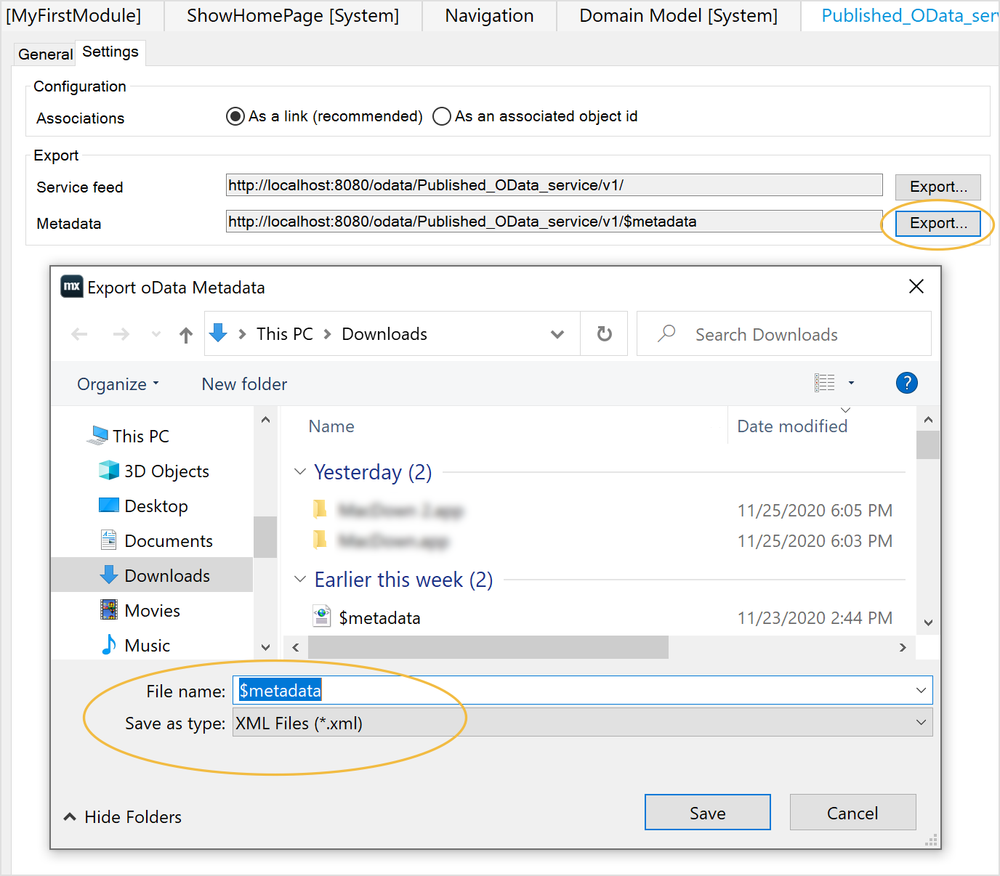
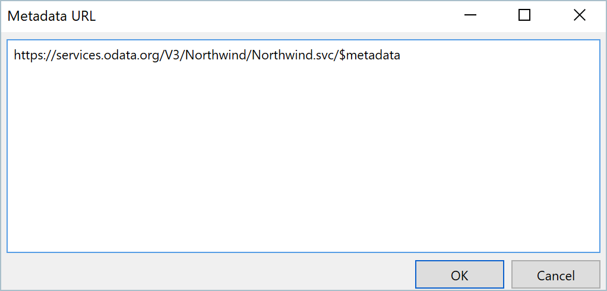
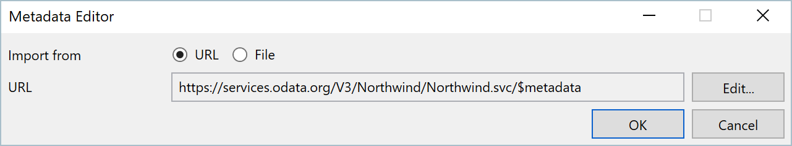
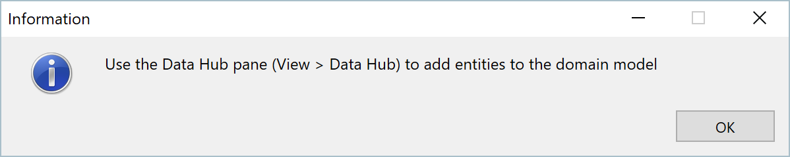
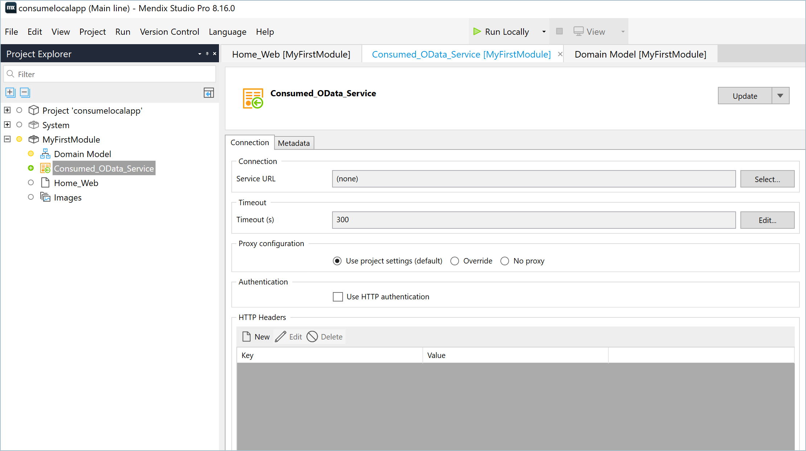
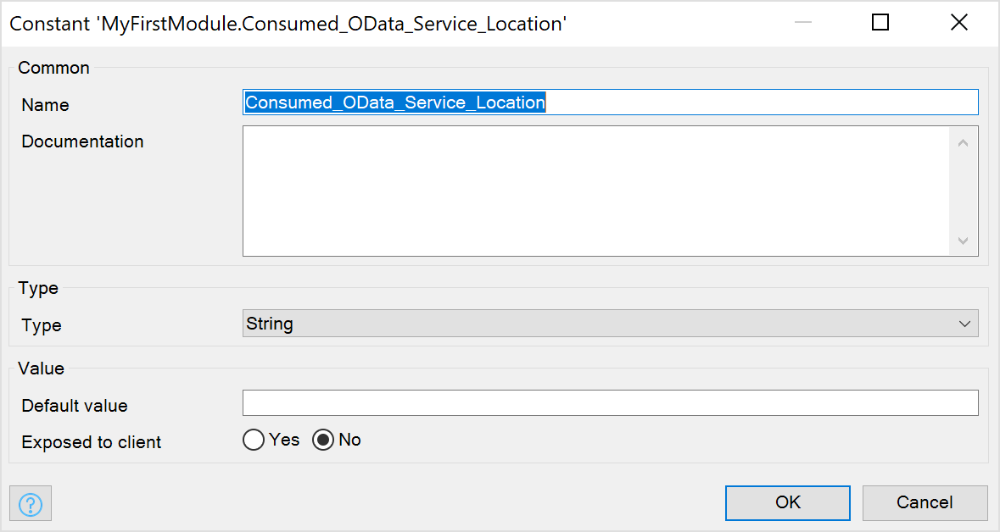
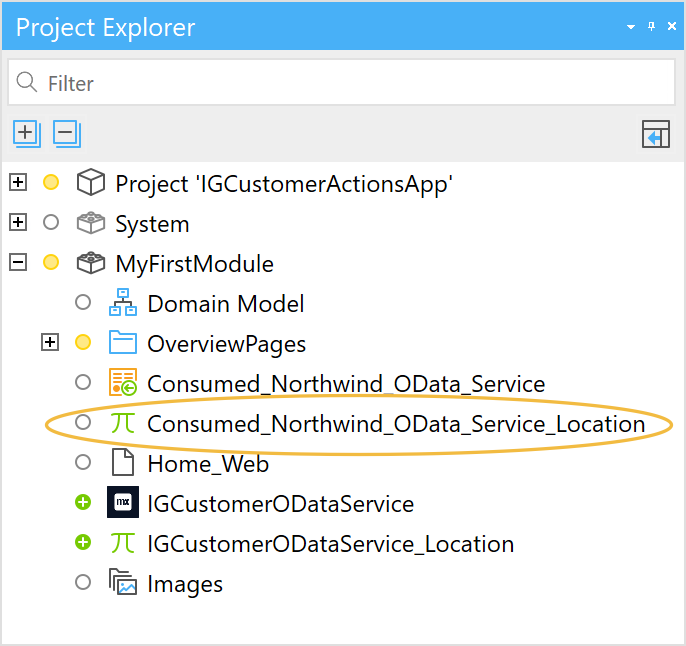
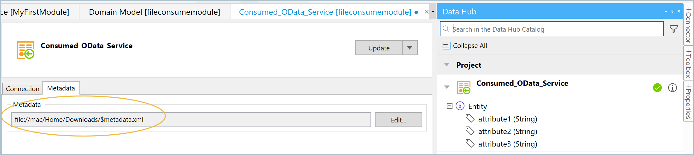

## 1 Introduction

Licensed users of Mendix Data Hub can also consume published OData Services during app development without using the **Data Hub** pane when trying out published OData Services which may not be registered in the **Data Hub Catalog**, or when working with locally deployed services.

Developers can consume published OData services by specifying the service metadata URL or a (local) metadata file in the Consume OData Service document.  The service will be listed in  the **Data Hub Project** pane and  the exposed entities can be dragged into the domain model from this.  

Follow the steps in this how-to to develop your app by directly consuming publised OData Services or those that are not yet registered in the [Data Hub Catalog](/data-hub/data-hub-catalog). 

**This how-to will teach you how to do the following:**

* Add a consumed OData Service document in your project model
* Specify the published OData service using the service metadata contract URL or location of the file
* Use the **Data Hub Project** pane to view and use exposed entities in your app development

{}
To consume OData services, you must have a Data Hub license.
{}

## 2 Prerequisites

Before starting this how-to you will need the following:

* Be familiar with app modeling using [external entities](/refguide/external-entities)

* Have a URL of a valid published OData v3 or v4 metadata contract

	* An example OData service URL which will not be published in your organization's Data Hub is decribed in [Sample file from OData.org](#sampleODataservice) 
	* you can also use a metadata file stored on your computer – an example is given for a simple app, giving the option to use the URL or the metadata file  in [Mendix Published OData Service](#how-to-file).
	
	  

## 3 Using Published OData Services

In this how-to you can use a publically available OData service or the a locally published OData service from a Mendix app for which you can create locally stored datasets.

### 3.1 Sample file from OData.org {#sampleODataservice}

You can find a sample OData V3 metadata file to use in this how-to  from the OData.org website: https://www.odata.org/odata-services/. They have example files for the different versions of OData. You can copy the URL of a file as described in the following steps. You can also download the sample Odata file to your computer to try consuming from a locally stored file.

1. Go to  https://www.odata.org/odata-services/ Under the **OData v3** tab you will use the sample OData v3 example, [Northwind read only](https://services.odata.org/V3/Northwind/Northwind.svc) service. Click the link for this file or any other file that is listed for OData v3 to open the metadata file for this service.
2. The file that you will see displayed is stored under the name `$metadata` at the web URL.
3. So for the example used in step 1, the full URL of the file is `https://services.odata.org/V3/Northwind/Northwind.svc/$metadata`.
4. You can download the file to your computer if you want to try consuming a locally stored file. 

### 3.2 Mendix Published OData Service Deployed Locally {#how-to-file}

You can also create a simple published OData service by following the steps in [Section 3: Creating an App](/data-hub/share-data/index#createapp) and [Section 4: Publishing to the Data Hub Catalog](/data-hub/share-data/index#publishing) of the Data Hub how-to [Share Data Between Apps](/data-hub/share-data/index). However, instead of deploying the app to the Mendix Free app environment when you **Run** you can choose to deploy the app to your computer by selecting **Run Locally**.  

#### 3.2.1 Published OData Service URL {#publishedservice}
For a locally deployed app in Studio Pro the, URL is displayed under the **Settings** tab of the **Published OData Service** document. The OData metadata contract is the file  `$metadata` file and the **Service feed** provides the location of locally stored datasets that you create for the app:

 

#### 3.2.2 Published OData Service file stored locally
If you are working locally and creating published OData services that you want to test, you can **Export** the **Metadata** file locally from the **Settings** tab of the **Published OData Service** document:

 

You can consume the locally stored OData service by specifying the file as described in [Consuming an OData Service from a local file](consumefile). 

You can use locally stored datasets whose location will be specified by the **Service feed** value.

## 4 Consuming an OData Service using the URL {#consumeurl}

When you search for a data source in the [Data Hub](/refguide/data-hub-pane) pane you will be presented with all the registered assets in the [Dat Hub Catalog](/data-hub/data-hub-catalog/search) that satisfy your search criteria. These assets are exposed in, and registered as, published OData services in the **Data Hub Catlog**. When you drag an entity from the **Data Hub** pane into your domain model, the asset metadata contract is accessed at the service endpoint and a **Consumed OData Service** document is added to the app project model with the details of metadata file and this is accessed to display the entities available in the service. Other information and the associated datasets for the service are further specified in the **Location** document that accompanies all **Consumed OData Services**.

If you want to model using an OData service that is not registered in the Data Hub Catalog, or you are developing services that you do not want to register, you can use the procedure given in this how-to. By specifying the URL of your OData service you can consume the service directly into your model and see the exposed entities in the **Data Hub** project panel and easily drag them into your domain model. 

During app development and testing phases this means that you can deploy your app locally and without taking up a cloud slot which can speed up a process that may involve several iterations.

Follow these steps to consume a published Odata service directly using the URL:

1. First you must add a **Consumed OData service** document to your model: in the project explorer, right-click over the model name and select **Add other** > **Consumed OData Service**.
     {}You must have a Data Hub license to see this menu item.
     {}
     
2. In the **Add Consumed OData Service** dialog box, enter a name for the Consumed OData Service document. In this case, accept the default **Consumed_OData_Service**  and click **OK**.

3. A blank consumed OData document is added to the model and the **Metadata Editor** dialog is displayed asking you to specify the metadata file to consume from.

4. By default the **Import from** is set to **URL**; click **Edit**.

5. Copy the full URL of the OData service you want to consume . For the example in described in [Sample file from OData.org](#sampleODataservice) this is: `https://services.odata.org/V3/Northwind/Northwind.svc/$metadata`.
     Alternatively, you can copy the URL of a published OData service created in your Mendix app as described in [Published OData Service URL](#publishedservice).

6.  Paste the URL in the **Metadata URL** and click **OK**:
     
    
7. The **Metadata Editor** will show the **URL** of the file that you have specified. Click **OK**: 

     

8. You will be informed of the following:

     

9. Click **OK**. The **Consumed_OData_Service** document is added to the model in the project explorer and displayed:

   

10. In Studio Pro URL of the service must be provided so that it can use this when locating further information for the service and the datasets. Under the **Connection** tab, specify the **Service URL**. This information is always stored in the **Constant** document that always accompanies a **Consumed OData service**. Click **Select** and for the **Select Constant** click **New** to create a new constant. 

11. Click **OK**  to accept the default **Name**: *Consumed_OData_Service_Location*:

11. For the **Default value** enter the service URL  `https://services.odata.org/V3/Northwind/Northwind.svc/` and click **OK**. You will notice that the "Location" or **Constant** definition document is added to the module: 

    {}{}

12. In the **Data Hub** pane, the new service is listed in the **Project** panel. The green tick indicates that it is being consumed.  For more details about the information displayed in the **Data Hub** pane and the **Project** panel see the [Data Hub Project](/refguide/data-hub-pane#projectpanel) panel.

13. Take a few moments to explore the entities that are available in the service, and the attributes for the entities (click **+** to expand the entity and display the attributes). The **Northwind** example has many entities: 

    {}{}

14. You can now drag and drop entities from the service into your domain model. 

    {}As this is a sample public OData Service, there is no associated dataset available that you will be able to use in your app. You can use the example given in [Mendix Published OData Service Deployed Locally](#how-to-file) for which you can create a dataset.

    {}

## 5 Consuming an OData Service Using a Locally Stored OData Metadata File
If you want to consume from a metadata file stored locally, follow up to step 3 of [Consuming an OData Service using the URL](#consumeurl) and then proceed with the following:

1. In the **Metadata Editor** dialog, select **File** and then click **Browse** to select a locally stored file.

2. Select the saved `$metadata` from your files system and click **Open** in the finder. 

3. You will be informed of the following:

     

4. Click **OK**. The **Consumed_OData_Service** document is added to the model in the project explorer and under the **Metadata** tab you will see the metadata file with the local pathname. 
   
   
5.  The consumed service is added to the **Project**  panel in the **Data Hub** pane and the green tick indicates that it is being consumed.  For further detail see the [Data Hub Project](/refguide/data-hub-pane#projectpanel) panel.
	
6. Continue with Step 10 and 11 of [Consuming an OData Service using the URL](#consumeurl) and for the **Constant** add the local service URL to locate the dataset.

7. Take a few moments to explore the entities that are available in the service, and the attributes for entities (click **+** to expand the entity and display the attributes).

## 7 Consuming from the Data Hub after offline Modeling

If you now want to connect to the same service that is published in the Data Hub Catalog then you can change the service metadata URL in the **Consumed_OData_Service** document under the **Metadata** pane and the default value for the **Service URL** for the **Constant** so that the connections can be made to the datasets for the service.

## 8 Working with Consumed Services without Using the Data Hub Pane

As described in [Updating or Switching a Consumed OData Service](/refguide/consumed-odata-service#updating) if a different metadata contract is detected by Studio Pro at the service URL to the one that is currently being consumed by the project, you will be presented with the option to **Update** to the new contract. 

how is this coupled with the catalog and the **Update** and **Switch** options (although if a different contract is detected at the specified endpoint, you will see the update arrow in the **Project** panel.

- Will there be a coupling with the consumed service,  in the catalog - when the service is registered?
- Modelling with locally stored datasets?
- Have to manually change the URL info to connect with the published URL - this will be another procedure to describe copying the service URL (which is not currently available in Catalog - but is planned for the BI integration developments).
- How do you find out the service URL of a registered asset?

## 4 Read More
* [Consumed OData Service](/refguide/consumed-odata-service) 
* [External Entities](/refguide/external-entities)
* [Data Hub Catalog](/data-hub/data-hub-catalog)

