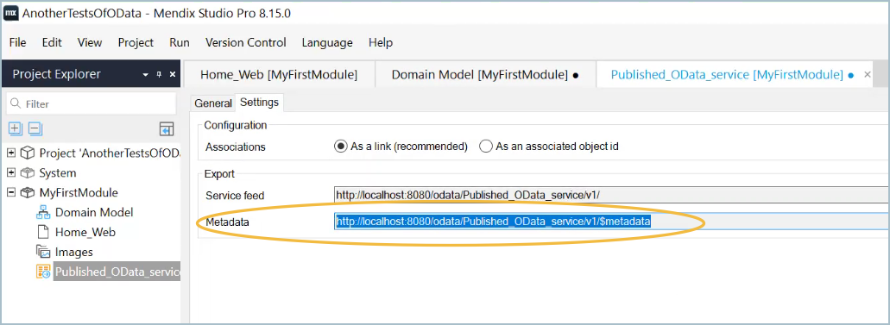

## 1 Introduction

Developers can consume OData services by specifying the service metadata URL in the Consume OData Service document by.  The entities exposed in the service will be listed in  the Data Hub Project pane and can be dragged into the domain model in the same way as when using the Data Hub pane.  

Developers who are publshing OData services can follow the steps in this how-to to test their published OData service locally before deploying them and registering  them in the Data Hub Catlog. 

**This how-to will teach you how to do the following:**

* Specify the published OData service using the service metadata URL.
* Use the **Data Hub Project** pane to view and use exposed entities in your app development

{}
To consume OData services, you must have a Data Hub license.
{}

## 2 Prerequisites

Before starting this how-to you will need the following:

* Be familiar with app modelling using [external entities](/refguide/external-entities)

* URL of a valid published OData v3 or v4?? metadata contract

	{}The OData metadata contract is the `$metadata` file and in Studio Pro the URL is displayed under the **Settings** tab of the **Published OData Service** document:
	

  
  {}

  {}You can create a simple published OData service by following the steps in [Section 3: Creating an App](/data-hub/share-data/index#createapp) and [Section 4: Publishing to the Data Hub Catalog](/data-hub/share-data/index#publishing) of the Data Hub how-to [Share Data Between Apps](/data-hub/share-data/index).
  {}

## 3 Consuming an OData Service using the URL {#consumeurl}

When you search for a data source in the [Data Hub](/refguide/data-hub-pane) pane you will be presented with all the registered assets in the [Dat Hub Catalog](/data-hub/data-hub-catalog/search) that satisfy your search criteria. These assets are exposed in, and registered as, published OData services in the **Data Hub Catlog**. When you drag an entity from the **Data Hub** pane into your domain model, the asset metadata contract is accessed at the service endpoint and a **Consumed OData Servcice** document is added to the app project module showing all the information in the contractat. 

If you have the URL of your OData service, you can use it to consume the service directly into your module and see the exposed entities in the **Data Hub** project pane and drage them into your domain model. During app development and testing phases this means that you can deploy your app locally and without taking up a cloud slot. 

Follow these steps to consume a published Odata service directly using the URL:

1. You are going to add a consumed OData service document to your model: in project explorer, right click over the model name and select **Add other** > **Consumed OData Service**.
2. In the **Add Consumed OData Service** box enter the name of the published OData Service you want to consume.
3. 

## 4 Read More

* 
