## 1 Introduction

In enterprise software, it is not likely that you work in a [greenfield](https://en.wikipedia.org/wiki/Greenfield_project). In almost every situation, you will need to integrate with existing systems. Mendix supports many ways of integration, but this how-to focuses on how you can export XML documents.

**This how-to will teach you how to do the following:**

* Add an XML schema
* Create domain-to-XML mapping and export logic

## 2 Prerequisites

Before you can start exporting XML documents, you need data in your application that is used during the export. You first need to set up the data structure and GUI to maintain the customer data. Then you'll create the actual export logic and the corresponding export mapping. So, you need to know how to do the following:

* Create a domain model (for more information, see [How to Create a Basic Data Layer](../data-models/create-a-basic-data-layer))
* Create a custom file document (for more information, see [How to Work with Images and Files](../data-models/working-with-images-and-files))
* Create overview and detail pages (for more information, see [How to Create Your First Two Overview and Detail Pages](../ux/create-your-first-two-overview-and-detail-pages))
* Create menu items, (for more information, see [How to Set Up the Navigation Structure](../ux/setting-up-the-navigation-structure))

Before starting this how-to, make sure you have completed the following prerequisites:

1. Create the following **Customer** entity in your domain model:

    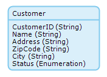

2. Create overview and detail pages to manage the Customer objects.
3. Create a menu item to access the customer overview page.
4. Create the **XMLDocument** entity that inherits all the properties from *System.FileDocument*:

    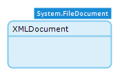

5. Create a reference set (multiplicity **[*-*]**) between XMLDocument and Customer:

    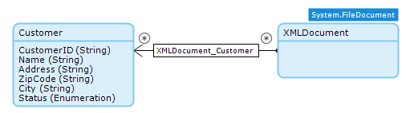

## 3 Adding an XML Schema (XSD)

Whether you plan to import documents or export documents, working with XML means that your application must contain an XML schema (also called XSD). An XSD describes the possible contents of an XML file. Based on this XSD, your application knows how to read or write an XML file. If you don't have an XSD file, there are a couple of online XSD generators that accept an XML document as input. For this how-to, you can use [Customers.xsd](attachments/18448731/18581813.xsd).

1.  Right-click your module in the **Project Explorer** and select **Add** > **Mappings** > **XML schema**:

    

2.  Enter *CustomersXSD* for the **Name** and click **OK**:

    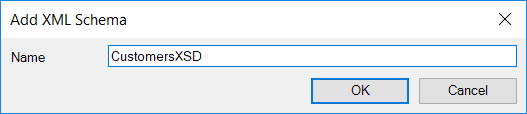

3.  In the **XML Schema** editor, click **Select** for **XML Schema** and select the XSD file that you downloaded earlier:

    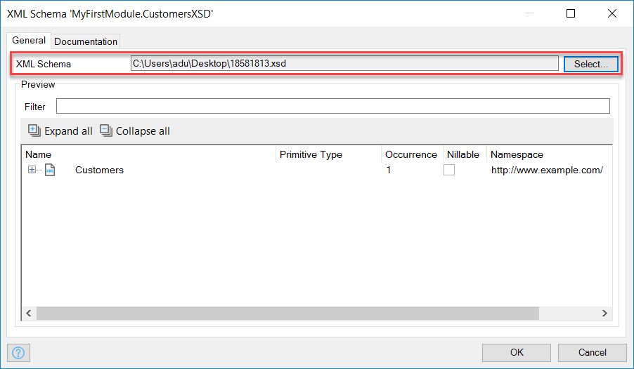

4. Click **OK** to save the XML Schema. We'll be using this schema in the following steps.

## 4 Creating Domain-to-XML mapping

The XML schema describes what the contents of an XML document should be. We need to create domain-to-XML mapping to define how the data in our application is transformed into a XML document.

1.  Right-click your module in the **Project Explorer** and select **Add** > **Mappings** > **Export mapping**:

    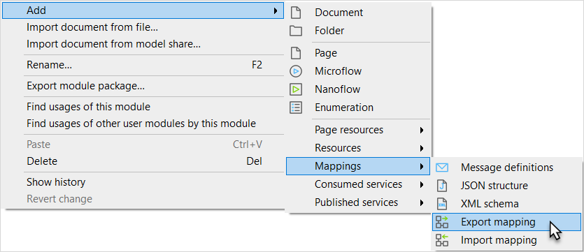

2.  Enter *ExportCustomersMapping* for the **Name**:

    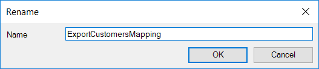

3. Click **OK**, and the **Select schema elements for export mapping** dialog box will automatically open. Now do the following:
    * For **Schema source**, select **XML schema**
    * For the schema, select the previously added **CustomersXSD**
5. In the **Schema elements** section of the **Select XSD Elements** dialog box, you will  now see a tree with elements. Click the **Expand all** and **Check all** buttons – this automatically selects the **Customer** element and its child elements. Your screen should now look like this:

    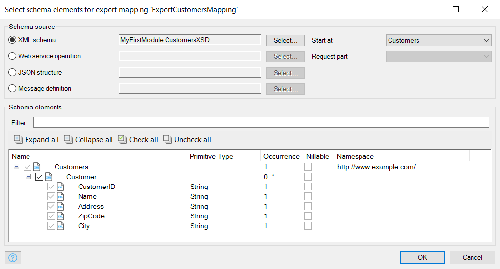

6. Click **OK**. You should now see the first part of the import mappings:

    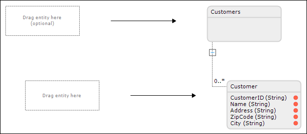

7. Open the **Connector** pane, which should be in the bottom-right corner of the Modeler:

    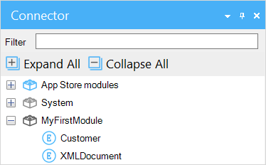

    You can also open the **Connector** from the **View** menu:

    

8. Drag the **XMLDocument** entity from the **Connector** to the placeholder:

    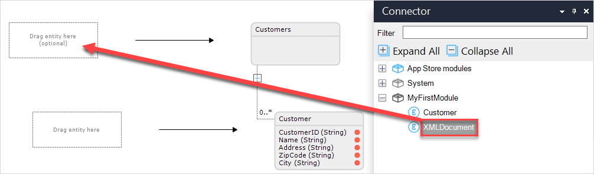

    The mapping editor for this element will pop up, you can close that by clicking **OK**.

9. Drag the **Customer** entity from the **Connector** to the placeholder:

    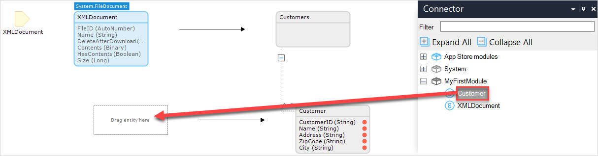

    The mapping editor for this element will open up:

    

10. In the mapping editor, verify that **Association to parent** is set to **XMLDocument_Customer** (this should happen automatically).
11. For **Find method** in the **To obtain an object** section, select **Retrieving associated objects**.
12. Select attributes for all five **Attribute to value element mapping** instances (or click **Map attributes by name** to accomplish this). You should have the following mapping:

    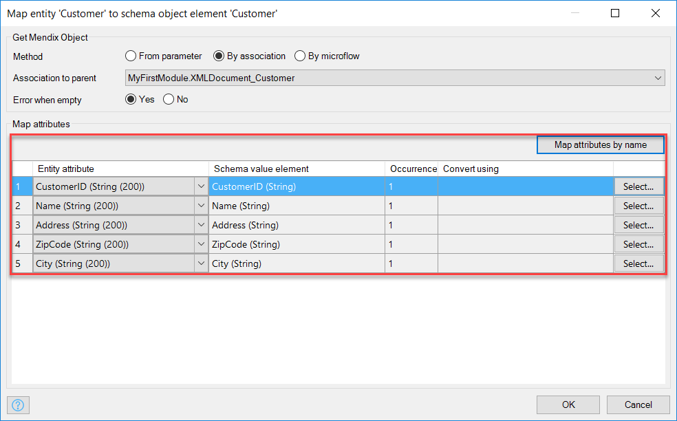

13. Click **OK** to save the mapping.

## 5 Creating the Export Logic

This section explains how you can create logic to export the customers stored in your application to an XML document.

To create the export logic, follow these steps:

1. Open the **Customer** overview page. It should look this when using a default layout:

    

2. Right-click the toolbar of the data grid widget and select **Add button** > **Action** to add a new Action button:

    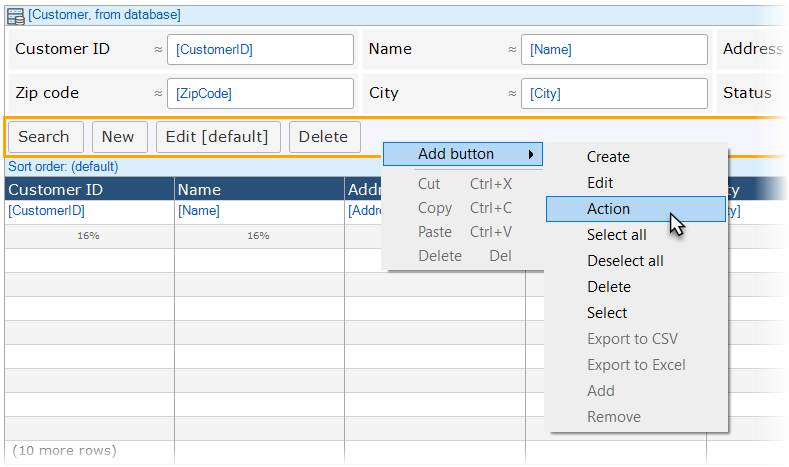

3. Double-click the new button to open the properties editor and do the following:
    * For **Caption**, enter *Export as XML*
    * For **On click**, select **Call a microflow**
    * In the **Microflow** section, click **Select...** and create a new microflow named *Customers_Export*

    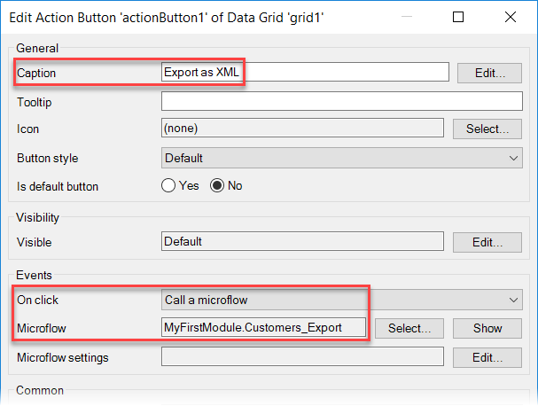

4. Click **OK** to save the button properties.
5. Right-click the new action button and click **Go to microflow** in the context menu. You should see an empty microflow with one input parameter:

    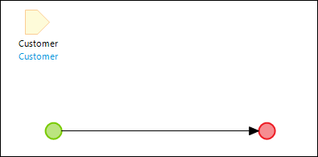

6. Select the input parameter and delete it.
7. Open the **Toolbox**, which should be on the bottom-right of the Modeler (you can also open it from the **View** menu).
8. Drag a **Retrieve** activity from the **Toolbox** to the line between the start event and end event.
9. Double-click the activity to open the **Retrieve Objects** properties editor and do the following:
    * For **Source**, select **From database**
    * For **Entity**, click **Select...** and select the customer entity

    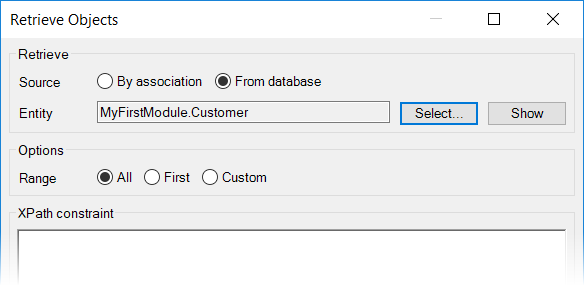

10. Click **OK**. The microflow should now look like this:

    

11. Drag a **Create object** activity from the **Toolbox** to the line between the start event and end event.
12. Double-click the activity to open the **Create Object** editor and do the following:
    * For **Entity**, select **XMLDocument**
    * Click **New** to add a change item

    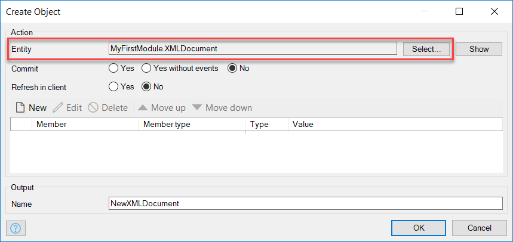

13. In the **Edit Change Item** editor, do the following:
    * For the **Member** for the change item, select the **XMLDocument_Customer** reference:
    * For the **Value**, enter *$CustomerList*

    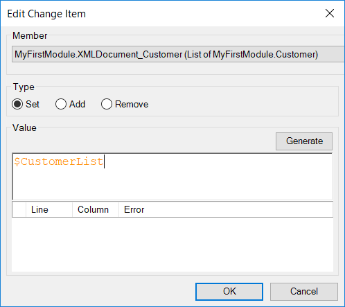

14. Click **OK** to save the change item.
15. Create a change item to set the **Name** attribute to: *'customers.xml'* (including the single quotation marks [']).
16. Click **OK** to save the action properties. The microflow should look like this:

    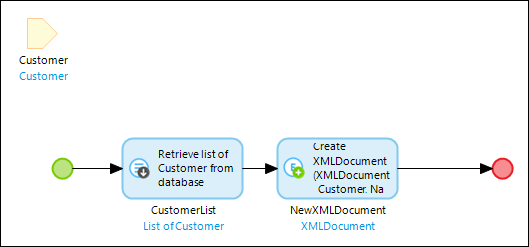

17. Drag an **Export XML** activity from the **Toolbox** to the line between the start event and end event. This inserts a new export XML activity.
18. Double-click the new activity to open the properties editor and do the following:
    * For **Mapping**, select the previously created **ExportCustomersMapping** XML-to-domain mapping
    * For **Parameter type**, verify that the entity **XMLDocument** is automatically selected
    * For the **Parameter**, select the created **NewXMLDocument**
    * For the output **Name**, select the created **NewXMLDocument**

    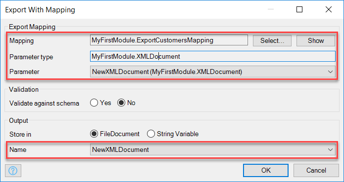

19. Click **OK** to save the properties. The microflow should look like this:

    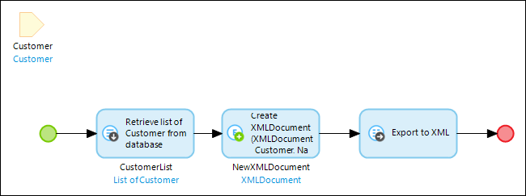

20. Drag a **Download file** activity from the **Toolbox** to the line between the start event and end event.
21. Double-click the actvity to open the **Download File** editor and select **NewXMLDocument** as the **File document**:

    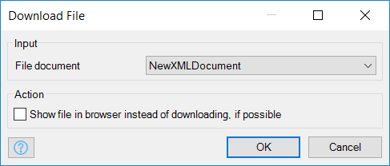

22. Click **OK**. The microflow should now look like this:

    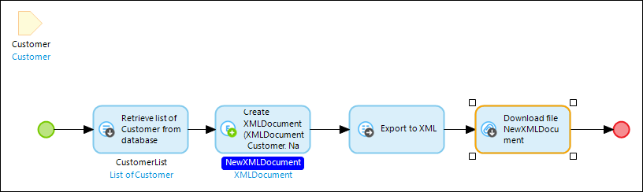

23. Deploy the application and open the customer overview page.
24. Click the **Export as XML** button and download the generated XML document.

## 6 Related Content

* [How to Consume a Complex Web Service](consume-a-complex-web-service)
* [How to Consume a Simple Web Service](consume-a-simple-web-service)
* [How to Import Excel Documents](importing-excel-documents)
* [How to Expose a Web Service](expose-a-web-service)
* [How to Enable Selenium Support](selenium-support)
* [How to Synchronize User Accounts Using the LDAP Module](synchronizing-user-accounts-using-the-ldap-module)
* [How to Import XML Documents](importing-xml-documents)
* [How to Consume a REST Service](consume-a-rest-service)
* [How to Expose Data to BI Tools Using OData](exposing-data-to-bi-tools-using-odata)
