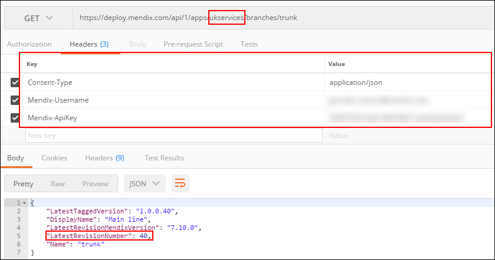
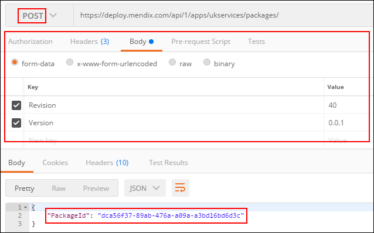
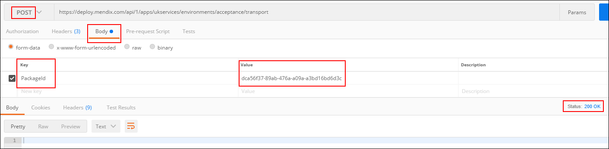
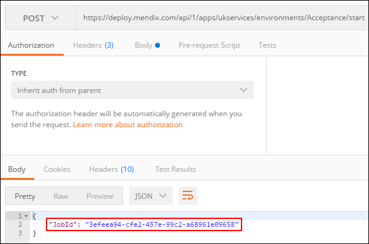
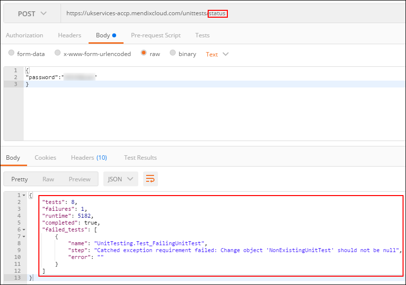

## 1 Introduction

This how-to describes how you can use the available Mendix APIs with any mainline orchestrators (Jenkins, Visual Studio Team Services, etc.) to build a simple CICD pipeline.

This is not meant to be a step-by-step guide. It will simply show you which APIs to use and provide some examples on how to use them. The tool used in the examples is [postman](https://www.getpostman.com/).

## 2 Prerequisites

Before starting this how-to, make sure you are familiar with the following:

* CICD
* Using REST services
* [Mendix Unit Testing module](https://appstore.home.mendix.com/link/app/390/) (only if used in your application)
* [Mendix Application Test Suite](https://docs.mendix.com/ats/) (only if used in your application)

## 3 The Pipeline

### 3.1 API Rights and Keys

#### 3.1.1 User API Key

To get access to the Mendix Cloud environments, an authorized user is needed when executing the APIs. With Mendix APIs, API keys are used to achieve this. To create a Mendix API key, follow the steps in [Authentication](/apidocs-mxsdk/apidocs/authentication).

#### 3.1.2 Mendix API Rights

To be able to use the Mendix APIs to access your environment, you will need to grant API rights to the user that is going to be used to access the APIs. To grant API rights to that user, open your app in the Developer Portal, then go to **Security** > **Node Permissions**, and check the **API RIGHTS** option for the user you created an API key for in the previous step.

### 3.2 Building the Deployment Package

To build the deployment package, use the [Team Server API](https://docs.mendix.com/apidocs-mxsdk/apidocs/team-server-api) and the [Build API](https://docs.mendix.com/apidocs-mxsdk/apidocs/build-api). In this scenario, a package will be built for the latest revision, but you can use whatever version you wish.

#### 3.2.1 Geting the Latest Revision

To get the latest revision, use the [Retrieve Branch API call](/apidocs-mxsdk/apidocs/team-server-api#retrieve-branch) to get the `LatestRevisionNumber` from the output.

An example of how to do this call is below. Be aware that `<AppId>` is not a GUID, but the actual name of the cloud node. In the example below, the `<AppId>` is `ukservices`.

#### 3.2.2 Building the Package

After getting the version you want to build the package for, you need to build the package. To do this, use the [Start Building a Deployment Package API call](/apidocs-mxsdk/apidocs/build-api#a-name-buildapi-startbuildingdeploymentpackage-rel-nofollow-a-start-building-deployment-package).

This is a POST call, so you will need to pass the relevant fields in the body (follow the link above to know what to use).

Before proceeding to the next step, you need to wait for the build of the deployment package to be successful. To do this, use the [Retrieve Package API call](/apidocs-mxsdk/apidocs/build-api#a-name-buildapi-retrievepackage-rel-nofollow-a-retrieve-package). This scenario needs to use the `PackageId` (output from the previous call) and check if the status is `Succeeded` (the other possible statuses are Queued, Building, Uploading, and Failed).

### 3.3 Deploying to the Next Environment

After building the deployment package, you can now deploy the new package to the next (Test, Acceptance, etc.) environment. To do this, use the [Deploy API](/apidocs-mxsdk/apidocs/deploy-api).

#### 3.3.1 Getting the Environment Status

First, you need to check if the environment to which you want to deploy is running. You need to know if you need to stop it before deploying the new deployment package to it. To do this, use the [Retrieve Environment API call](https://docs.mendix.com/apidocs-mxsdk/apidocs/deploy-api#3-5-a-name-deployapi-retrieveenvironment-rel-nofollow-a-retrieve-environment) and check the status.

#### 3.3.2 Stopping the Environment

If the environment is running, you need to stop it. To do this, use the [Stop Environment API call](https://docs.mendix.com/apidocs-mxsdk/apidocs/deploy-api#3-8-a-name-deployapi-stopenvironment-rel-nofollow-a-stop-environment).

#### 3.3.3 Deploying/Transporting the Package

To deploy/transport a package to the environment, use the [Transporting a Deployment Package to an Environment API call](https://docs.mendix.com/apidocs-mxsdk/apidocs/deploy-api#3-11-a-name-deployapi-transportadeploymentpackagetoanenvironment-rel-nofollow-a-transporting-a-deployment-package-to-an-environment). 

For this action, you need the `PackageId` from section [3.2.2 Building the Package](#BuildPackage).

#### 3.3.4 Starting the Environment

After a successful deployment, you must start the environment. To do that, use the [Start Environment API call](https://docs.mendix.com/apidocs-mxsdk/apidocs/deploy-api#3-6-a-name-deployapi-startenvironment-rel-nofollow-a-start-environment).

Before proceeding to the next steps (although you might not have any, if all you want to automate is the transport to another environment), you must make sure the environment has started. To do that, use the [Get Environment Status API call](https://docs.mendix.com/apidocs-mxsdk/apidocs/deploy-api#3-7-a-name-deployapi-getstartenvironmentstatus-rel-nofollow-a-get-start-environment-status) with the `JobId` (output of the previous call). The environment will be ready when the status is **Started**.

### 3.4 Running Tests

After deploying the package to the environment and starting it, you are ready to run tests. This is not a mandatory step in a CICD pipeline, but it is usually part of it. 

The sections below show you how to execute unit and ATS (UI) tests remotely. There can also be other tests (for example, load tests), but these are not covered in this how-to.

#### 3.4.1 Unit Tests

One way of doing unit tests in a Mendix app is by using the [UnitTesting module](https://appstore.home.mendix.com/link/app/390/) available from the Mendix App Store. This module already [exposes an API to execute remote calls](https://appstore.home.mendix.com/link/app/390/#running-unit-tests-through-the-remote-api).

First, you need to start the tests.

When the tests are completed (check the status for when completed is `true`), you can see how many tests ran, how long they took to run, how many failed, which ones failed, and what the reasons were for failing.

{}

You can also (manually) create a web service that exposes the standard junit structure from the data available in the UnitTesting module.

{}

#### 3.4.2 Mendix Application Test Suite (ATS) Tests

ATS has its own [API for CICD](https://docs.mendix.com/ats/refguide/rg-version-2/cicd-api#3-api). To use this, follow the steps in the **ATS and CI/CD** section of [How to Use ATS in Combination with CI/CD](/ats/howtos/ht-version-2/ats-and-ci-cd-2#4-ats-and-ci-cd).

### 3.5 Next Steps

If you need to promote to another environment, repeat the steps in section [3.3 Deploying to the Next Environment](#DeployToNextEnvironment).

## 4 Jenkins/VSTS Examples

The sections below present examples of how to call a Mendix API with Jenkins (using a groovy script) and Visual Studio Team Services (VSTS).

### 4.1 Jenkins

To call a REST service with Jenkins (using a groovy script), install the [HTTP Request Plugin](https://wiki.jenkins.io/display/JENKINS/HTTP+Request+Plugin). If you also want to bind credentials to variables (see `withCredentials` in the code snippet below), install the [Credentials Binding Plugin](https://jenkins.io/doc/pipeline/steps/credentials-binding/). The `Mendix-Username` and `Mendix-ApiKey` will be set in a `customHeaders` array.

This code snippet example gets the latest revision numbere so it can be used when building the deployment package:

### 4.2 VSTS

To call a REST service with VSTS, use the [Invoke REST API task](https://docs.microsoft.com/en-us/vsts/build-release/tasks/utility/http-rest-api). This should be used in an agentless phase, and you will need to set up a **Generic endpoint** first. The `Mendix-Username` and `Mendix-ApiKey` will go in the **Headers** section. You can set **Success criteria** (under the **Advanced** section) to define what makes the task successful.

The example below checks the status of the acceptance environment. The task will be successful if the environment is running.

