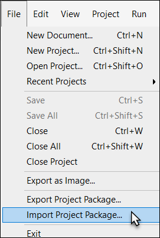
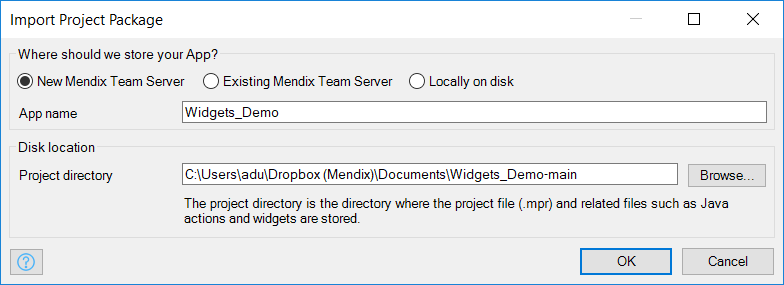
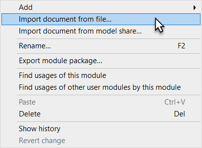
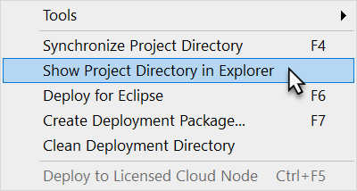
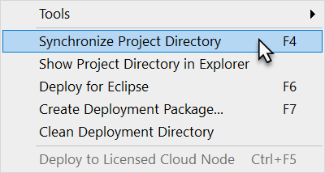
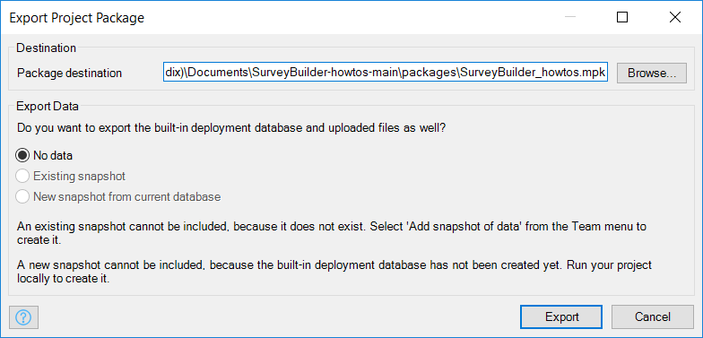
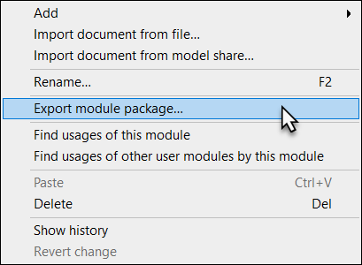

## 1 Introduction

With Mendix, you don't need to reinvent the wheel. You can save time by importing modules others have created and by exporting new modules for others to use. The App Store provides this functionality on a macro level, and you can use the Modeler's built-in import and export functions to share content between your own apps, import unofficial modules, and share entire projects.

Please note throughout this how-to that Mendix project packages are stored as Mendix package (*.mpk*) files.

**This how-to will teach you how to do the following:**

* Import and export Modeler objects: packages, modules, widgets, and module objects (including pages, microflows, image collections, events, document templates, constants, web services, layouts, and menus)

## 2 Importing Objects

{}

Be careful when importing objects, as you can overwrite your existing work. Pay attention to prompts and warnings along the way!

{}

### 2.1 Importing Entire Project Packages

Mendix project packages are stored as Mendix package (*.mpk*) files.

To import entire project packages, follow these steps:

1. Click the **File** menu in the Modeler and select **Import Project Package**:

    

2. Select your Mendix project package file and click **Open**. The **Import Project Package** dialog box will appear:

    

    You have the following options in this dialog box:

    * Decide whether to store your app in a **New Mendix Team Server** (recommended), an **Existing Mendix Team Server**, or **Locally on disk**
    * Provide an **App name** (by default, it will be named as it was in the Mendix package file)
    * Determine the local folder where you would like to store your project in **Project directory**
   
3.  Click **OK**, and your project will be loaded in the Modeler.

### 2.2 Importing Module Packages

Mendix module packages are stored as Mendix package (*.mpk*) files.

To import module packages, follow these steps:

1. Right-click your project in the **Project Explorer** and select **Import Module Package**.

    

2. Select your Mendix module package file and click **Open**. The **Import Module** dialog box will open.
3. In the dialog box, choose a name for your module and select whether to create a new module or replace an existing one:

    

    

    {}

    If you replace the module with a new version, the existing user data will be retained based on the names of entities, attributes, and associations. If you delete a module and then add a newer version of it, all user data will be lost.

    {}

4. Click **Import**. You may see a **Warning** pop-up window that will inform you of any included module dependencies that will be overwritten in your project.
5. Click **OK**. You will see your new or replaced module in the **Project Explorer**.

    You will also see your changes in the **Changes** section of the Modeler. In this example, the existing module has been replaced and deleted in favor of the newly imported module:

    

### 2.3 Importing Module Objects

Mendix module object packages are stored as Mendix package (*.mpk*) files.

An object package can contain a page, microflow, image collection, event, document template, constant, web service, layout, menu, and more.

To import module objects, follow these steps:

1. Right-click a module in the **Project Explorer** and select **Import document from file**:

    

    The **Import Document from File** dialog box will appear.

2.  Select your Mendix package file containing the object you want to import, and click **Open**.

    {}

    If an object with the same name already exists, you will see the **Warning** pop-up window. In that case, you can either select **Rename** to rename the object or **Cancel**.

    {}

3. Click **OK** to import the object into your module:

    {}

    You may need to update the new object's permissions, depending on where it was originally exported from. For consistency, be sure to check the permissions on any objects imported.

    {}

### 2.4 Importing Widgets

Mendix module packages are stored as Mendix package (*.mpk*) files. You need to place the Mendix package file in your project directory to import it.

To import widgets, follow these steps:

1. Click the **Project** menu and select **Show Project Directory in Explorer**:

    

2. Open the **widgets** folder in your project directory and paste your Mendix package file there.
3. Open the **Project** menu and select **Synchronize Project Directory** to synchronize the changes in the project directory:

    

    {}

    You can also press **F4** to synchronize your project directory.

    {}
4. Add your newly imported widget from the **Toolbox** or the **Add Widget** context menu.

### 2.5 Importing Content from the App Store

To learn more about importing content from the App Store, see [Use App Store Content in the Modeler](/community/app-store/use-app-store-content-in-the-modeler).

## 3 Exporting Objects

### 3.1 Exporting Entire Project Packages

To export projects, follow these steps:

1. Click the **File** menu in the Modeler and select **Export Project Package**

    

2. The **Export Project Package** dialog box will appear, which enables you to set the export location and select data to export (if required):

    

    The **Existing snapshot** option will only be available when a data snapshot was created earlier using the **Add snapshot of data** menu option from the **Team** menu. It is also possible to include a new snapshot based on the current state of the local database. This option is only available after the project has been started at least once.
3. Click **Export** to create the package.

### 3.2 Exporting Modules

To export modules, follow these steps:

1. Right-click a module in the **Project Explorer**, and select **Export module package**:

    

    If your module refers to other modules in the project (meaning, it is not self-contained), you will see a pop-up window warning you of this.

    

    Select **Find usages of other user modules** to view the references, or click **Continue exporting** and you will see the **Select Dependencies** dialog box:

    

    Here you can select files you would like to include in your package. This list includes any files in the **userlib** or **resources** folders in your project directory. If you don't want to include these files, you can uncheck the boxes.

    {}

    To quickly uncheck all files, press **Ctrl+A** to select all of the items, then press the spacebar to uncheck all the objects.

    {}

### 3.3 Exporting Widgets

Widgets are already available in the **widgets** folder in your project directory as *.mpk* files.

### 3.4 Exporting Module Objects

Mendix module object packages are stored as Mendix package (*.mpk*) files. An object package can contain a page, microflow, image collection, event, document template, constant, web service, layout, menu, and more.

1. Right-click the document you want to export and select **Export document to file**:

    

    The **Export Page to File** dialog box will open.
2. Enter the **Name** for your package and click **Save**.

## 4 Related Content

* [How to Consume a Complex Web Service](consume-a-complex-web-service)
* [How to Consume a Simple Web Service](consume-a-simple-web-service)
* [How to Export XML Documents](export-xml-documents)
* [How to Import Excel Documents](importing-excel-documents)
* [How to Expose a Web Service](expose-a-web-service)
* [How to Configure Selenium Support](selenium-support)
* [How to Synchronize User Accounts Using the LDAP Module](synchronizing-user-accounts-using-the-ldap-module)
* [How to Import XML Documents](importing-xml-documents)
* [How to Consume a REST Service](consume-a-rest-service)
* [How to Expose Data to BI Tools Using OData](exposing-data-to-bi-tools-using-odata)
* [Modules](/refguide7/modules)
* [Project](/refguide7/project)
* [Common Widgets](/refguide7/common-widgets)
