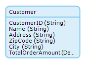
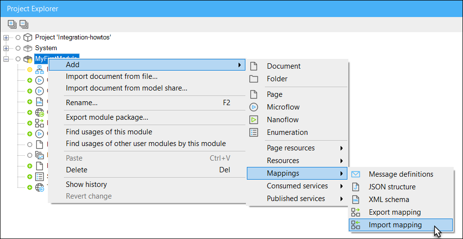
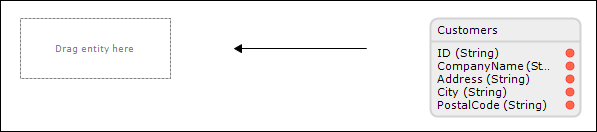
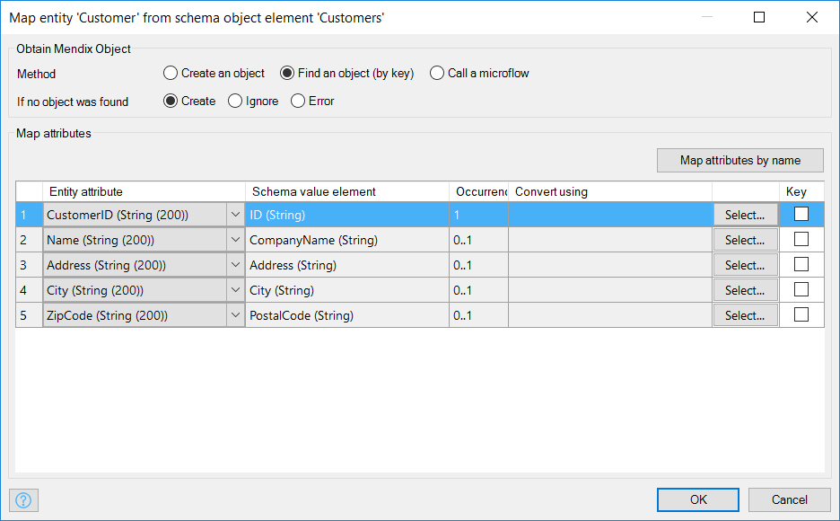
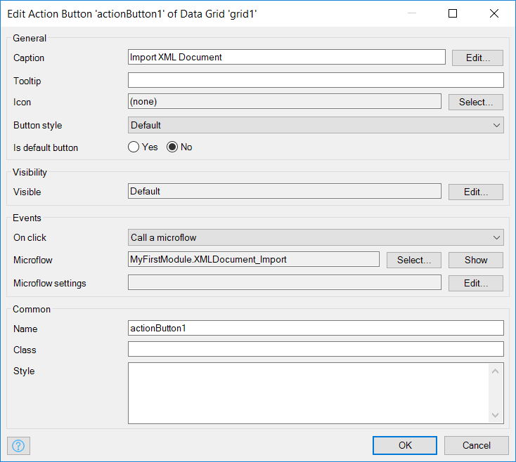

## 1 Introduction

Mendix is "The App Platform for the Enterprise" and in enterprise software it is not likely that you work in a [green field](https://en.wikipedia.org/wiki/Greenfield_project). In almost every situation you will need to integrate with existing systems. Mendix supports many ways of integration but this how-to focuses on how you can import XML documents with Mendix.

**This how-to will teach you how to do the following:**

* Prepare the data structure and GUI
* Add an XML schema
* Create XML-to-domain mapping

## 2 Prerequisites

Before you continue, make sure that you know how to create:

* Domain models (for more information, see [How to Create a Basic Data Layer](../data-models/create-a-basic-data-layer))
* Custom File Document (for more information, see [How to Work with Images and Files](../data-models/working-with-images-and-files))
* Overview and detail pages (for more information, see [How to Create Your First Two Overview and Detail Pages](../ux/create-your-first-two-overview-and-detail-pages))
* Menu items (for more information, see [How to Set Up the Navigation Structure](../ux/setting-up-the-navigation-structure))

## 3 Preparing the Data Structure and GUI

The XML document used during this how-to contains customers. To be able to see the imported data, you first need to set up the data structure and GUI to maintain the customer data. Then you need to facilitate the uploading and downloading of XML documents. Finally, you will create the actual import logic and the corresponding import mapping.

To prepare the data structure and the GUI, follow these steps:

1. Create the following **Customer** entity in your domain model:

    

2. Create the overview and detail pages to manage objects of the **Customer** type.
3. Create a menu item to access the customer overview page.
4. Create an entity called **XMLDocument** that inherits all the properties from **System.FileDocument**:

    

5. Create the overview and detail pages to manage objects of the **XMLDocument** type.
6. Create a menu item to access the XML document overview page (for more information, see [How to Set Up the Navigation Structure](../ux/setting-up-the-navigation-structure).

## 4 Adding an XML Schema (XSD)

Whether you plan to import or export documents, working with XML means that your application must contain an XML schema, which is also called an XSD. An XSD describes the possible contents of an XML file. Based on the XSD, your application knows how to read or write an XML file. If you don't have an XSD file, there are some online XSD generators that accept an XML document as input. For this how-to, you can use [Customers.xsd](attachments/18448727/18581652.xsd).

To add an XML schema (XSD), follow these steps:

1.  Right-click a module in the **Project Explorer** and select **Add** > **Mappings** > **XML schema** from the menu:

    

2.  Enter **CustomersXSD** as the **Name** and click **OK**:

    

3.  In the **XML Schema** editor, click **Select...** and select the XSD file that you downloaded earlier:

    

4. Click **OK** to save the XML schema, which you will be using in the following steps.

## 5 Create XML-to-Domain mapping

The XML schema describes what the possible contents of an XML file are, but we need to create an XML-to-domain mapping to define how the data in the XML document is imported into the application.

To create the XML-to-domain mapping, follow these steps:

1. Right-click a module in the **Project Explorer** and select **Add** > **Mappings** > **Import mapping**:

    

2.  Enter **ImportCustomersMapping** as the **Name** and click **OK.**  The new mapping will open automatically and the elements will be shown.

      

3.  On the **Select XSD Elements** dialog box, do the following
    * Select **XML schema** as the **Schema source**
    * Select **CustomerXSD** as the schema
    * Click **Expand all** to see the tree with elements

    

4. Select the following elements: **Customer**, **ID**, **CompanyName**, **Address**, **City**, and **PostalCode**.
5. Click **OK**. The first part of the import mapping should look like this:

    

6. Open the connector (from the lower-right side of the Modeler or from the **View** menu).
7.  Drag the entity **Customer** from the connector to the place-holder in the mapping editor:

      

    The **Map Object Element** editor for this element will open automatically:

    

8. In the **Map Object Element** editor, do the following:
    * Select **Find an object (by key)** as the **Method** (to be able to search for an object, you need to define one or more keys in the value-to-attribute mappings)
    * Select **Create** for **If no object was found**
    * Select attributes for all five value-to-attribute mappings
    * Select **CustomerID** as the **Key**

      

9. Click **OK** to save the mapping.

## 6 Creating the Import Logic

In this section, you will create the logic to import the customers stored in an [XML document](attachments/18448727/18581651.xml) in your application.

To create the import logic, follow these steps:

1.  Open the **XMLDocument** overview page. It should look this, using a default layout:

    

2.  Right-click the toolbar of the data grid widget and select **Add button** > **Action** to add a new action button:

    

3.  Double-click the new button to open the **Edit Action Button** editor and do the following: 
    a. Change the caption to *Import XML Document* 
    b. For the **On click** event, select **Call a microflow**, then click **Select** for the microflow, create a new microflow, and name it **XMLDocument_Import**. 
    c. Click **OK** to save the properties. 

    

4. Right-click the new **Import XML Document** button and select **Go to microflow** in the context menu. You should see an empty microflow with **XMLDocument** as the input parameter:

    

5. Open the **Toolbox** and drag an **Import with mapping** activity to the line between the start and end event. This inserts a new import XML activity.
6.  Double-click the new activity to open the **Import With Mapping** dialog box and do the following: 
    a. Select the input paramater **XMLDocument** as the **Variable**. 
    b. Select the previously created XML-to-domain mapping **ImportCustomersMapping** as the mapping. 
    c. Click **OK** to save the properties. 

    

    The microflow should look like this:

    

## 7 Importing an XML File

To import the XML file, follow these steps:

1. Deploy the application, upload [Customers.xml](attachments/18448727/18581651.xml), and trigger the import microflow.
2. Open the customer overview page and check if the customer data has been imported into your application.

## 8 Related Content

* [How to Consume a Complex Web Service](consume-a-complex-web-service)
* [How to Consume a Simple Web Service](consume-a-simple-web-service)
* [How to Export XML Documents](export-xml-documents)
* [How to Expose a Web Service](expose-a-web-service)
* [How to Handle Selenium Support](selenium-support)
* [How to Synchronize User Accounts Using the LDAP Module](synchronizing-user-accounts-using-the-ldap-module)
* [How to Consume a REST Service](consume-a-rest-service)
* [How to Expose Data to BI Tools Using OData](exposing-data-to-bi-tools-using-odata)
* [Exporting to a CSV Button](/refguide7/export-to-csv-button)
