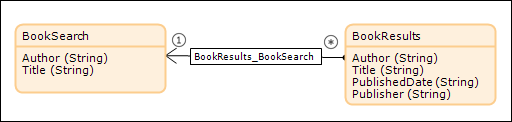
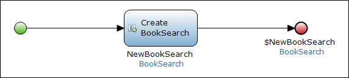
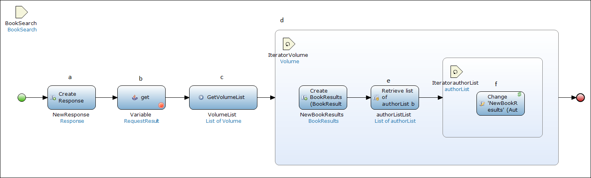
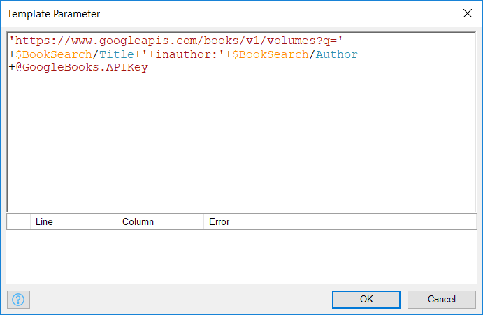
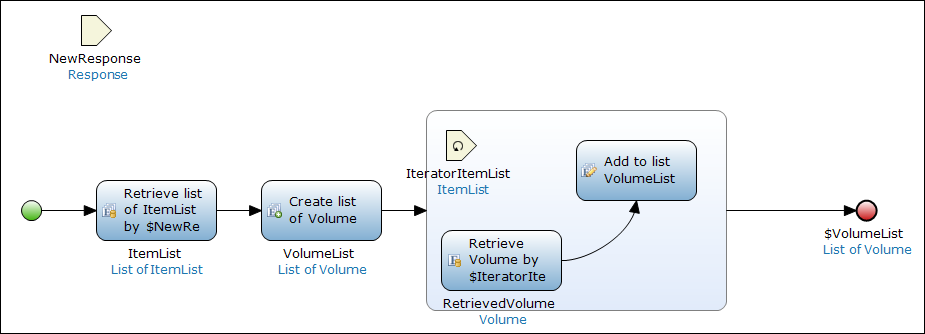
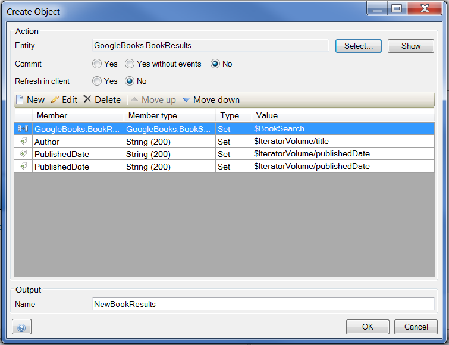
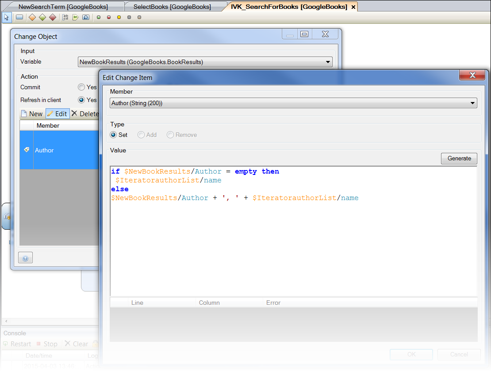

## 1 Introduction

Mendix applications frequently need to communicate with existing systems. Whether replacing an older platform entirely or leveraging an existing database to enhance your app, the ability to integrate with legacy systems is key to your success. This how-to introduces a range of options that exist within the Mendix Platform to integrate with legacy systems.

**This how-to will teach you how to do the following:**

* Assess potential options for integrating an existing system with a Mendix app
* Integrate with a legacy system using REST

## 2 Prerequisites

Before starting this how-to, make sure you have completed the following prerequisites:

* Know how to create domain models (for details, see [How to Create a Basic Data Layer](../data-models/create-a-basic-data-layer))
* Know how to create overview and detail pages (for details, see [How to Create Your First Two Overview and Detail Pages](../ux/create-your-first-two-overview-and-detail-pages))
* Know how to create microflows (for details, see [How to Build Your First Microflow: Hello world!](../logic-business-rules/create-your-first-microflow-hello-world))
* Understand the concepts behind REST and web services (for more information, see [Consuming Your First REST Service](http://www.mendix.com/blog/consuming-first-rest-service/) and [How to Consume a Complex Web Service](consume-a-complex-web-service))
    * Creating an exposed REST service on top of your legacy system is beyond the scope of this tutorial; for instructions on how to accomplish this, refer to the configuration of your non-Mendix Platform

## 3 Interacting with a Legacy System Using REST

If the legacy system has the ability to expose its data to web services, integration can be accomplished using the Mendix REST module. This technique will allow your to preserve a system of record while accessing data only as you need it.

These are some situations in which to consider using this technique:

* SAP architecture with RFC calls exposing JSON
* CRM systems or databases with a web-service layer

In this section, you will learn how to retrieve data from a legacy system using REST and integrate the data into your application.

For this how-to, we will use the publicly available Google Books API (for details, see [Google Books APIs Getting Started](https://developers.google.com/books/docs/v1/getting_started). We will construct our example around this data model. Each legacy system will have a different JSON structure based on internal data models. This example will return a collection of books using a given author search parameter. To use this API, users must collect an API key (as outlined in [Google Books APIs Acquiring and Using an API Key](https://developers.google.com/books/docs/v1/using?csw=1#APIKey)). The response structure of this particular API is as follows:

1. The API we will use has a JSON structure.
2.  Construct the appropriate data model for this JSON.

    {}Every REST service will have a different specific JSON structure. For details on how to build JSON data structures in Mendix, see [JSON Structures](/refguide/json-structures).

    {}
3. Create a non-persistable search entity called **BookSearch** that allows the user to enter an author and title. This should be linked to a second object:

    

4. Create a page that contains a data view that will allow users to enter search terms. The data source for this data view should be a new microflow that generates a new search object and returns it:

    

5. Create a microflow button and a corresponding microflow that will perform your search. This microflow will use the REST GET Java Action included in the App Store REST module:

    

    The microflow activities for this flow are the following:

    a. Creates a new response object. 
    b. Makes the REST call to the API using the following target: 

     

    c. Calls a sub microflow that retrieves all the items associated with the response. Each item then has all the associated volumes retrieved:

     

    d. Iterates through the **VolumeList** and makes a new **BookResult** object to display the search results:

     

    e. Retrieves the author list **Over Association** for each volume.  
    f. Iterates through the list of author names and uses a **Change** activity to add the author name. This is done to accommodate this situation:

    

6. When a user logs into the application and enters a search term, the results are successfully populated via the REST calls.

The above example demonstrates how a Mendix application can quickly integrate data systems using REST. This basic framework can be built upon to incorporate a wide range of activities. Possible ways to extend this framework include the following: 

* Adding additional microflow processing logic to leverage data in Mendix
* Using the REST POST actions to push values from Mendix
* Updating Mendix app data from a different source

For further documentation and to see the GitHub project for REST services, see the [Mendix RestServices GitHub page](https://github.com/mendix/RestServices).

## 4 Related Content

* [How to Consume a Complex Web Service](consume-a-complex-web-service)
* [How to Consume a Simple Web Service](consume-a-simple-web-service)
* [How to Export XML Documents](export-xml-documents)
* [How to Import Excel Documents](importing-excel-documents)
* [How to Expose a Web Service](expose-a-web-service)
* [How to Configure Selenium Support](selenium-support)
* [How to Synchronize User Accounts Using the LDAP Module](synchronizing-user-accounts-using-the-ldap-module)
* [How to Import XML Documents](importing-xml-documents)
* [How to Consume a REST Service](consume-a-rest-service)
* [How to Expose Data to BI Tools Using OData](exposing-data-to-bi-tools-using-odata)
* [Extending Salesforce with Mendix, an Alternative to Force.com](https://www.mendix.com/blog/extending-salesforce-mendix-alternative-force-com/)
